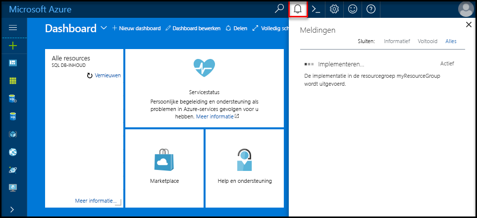
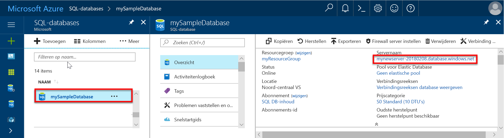
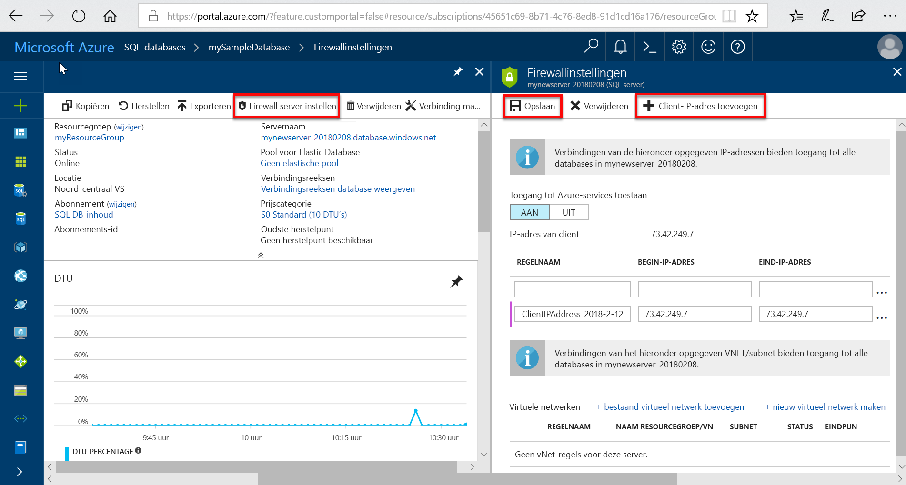
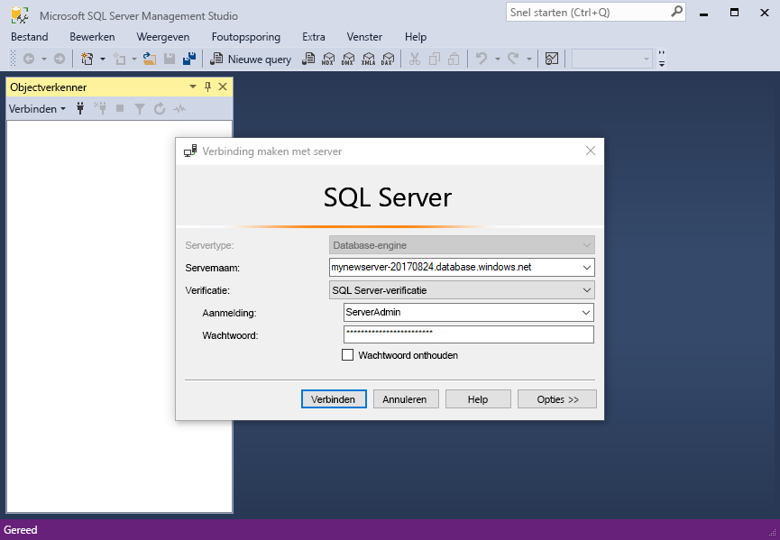
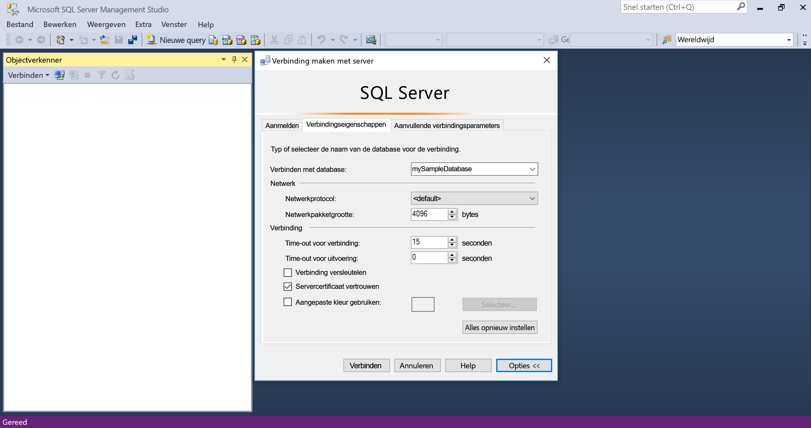
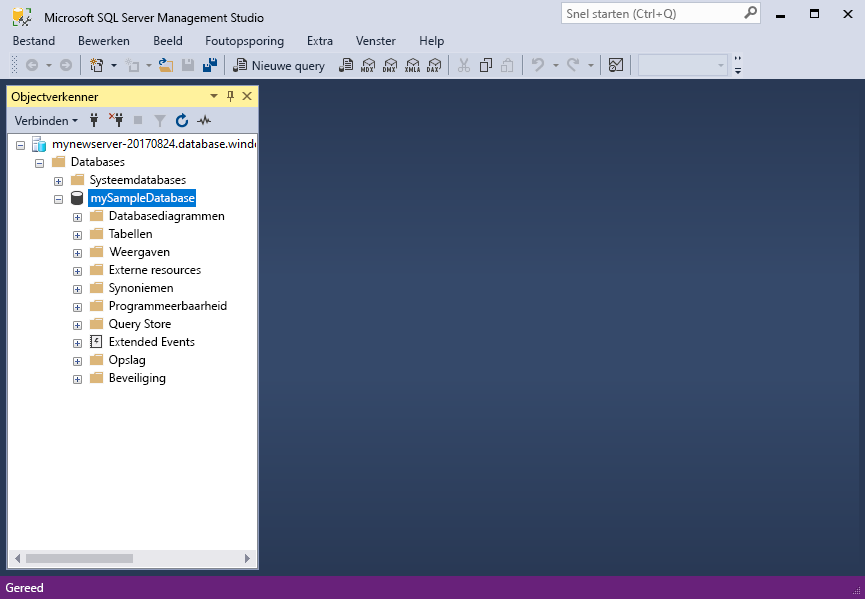

# <a name="design-your-first-azure-sql-database"></a>Ontwerp van uw eerste Azure SQL database

Azure SQL-Database is een relationele database als een service (DBaaS) in de Microsoft-Cloud (Azure). In deze zelfstudie leert u hoe de Azure portal gebruiken en [SQL Server Management Studio](https://msdn.microsoft.com/library/ms174173.aspx) (SSMS) naar: 

> [!div class="checklist"]
> * Maak een database in de Azure-portal
> * Een firewallregel op serverniveau in de Azure portal instellen
> * Verbinding maken met de database met SSMS
> * Tabellen maken met SSMS
> * Gegevens voor bulksgewijs laden met BCP
> * Opvragen van die gegevens met SSMS
> * Herstel de database naar een eerdere [wijst naar een bepaald tijstip](sql-database-recovery-using-backups.md#point-in-time-restore) in de Azure portal

Als u een Azure-abonnement geen [een gratis account maken](https://azure.microsoft.com/free/) voordat u begint.

## <a name="prerequisites"></a>Vereisten

Zorg dat u hebt geïnstalleerd voor het voltooien van deze zelfstudie:
- De nieuwste versie van [SQL Server Management Studio](https://msdn.microsoft.com/library/ms174173.aspx) (SSMS).
- De nieuwste versie van [BCP en SQLCMD](https://www.microsoft.com/download/details.aspx?id=36433).

## <a name="log-in-to-the-azure-portal"></a>Aanmelden bij Azure Portal

Meld u aan bij [Azure Portal](https://portal.azure.com/).

## <a name="create-a-blank-sql-database"></a>Een lege SQL-database maken

Een Azure SQL-database wordt gemaakt met een gedefinieerde set [reken- en opslagresources](sql-database-service-tiers.md). De database is gemaakt in een [Azure-resourcegroep](../azure-resource-manager/resource-group-overview.md) en in een [logische Azure SQL Database-server](sql-database-features.md). 

Volg deze stappen voor het maken van een lege SQL-database. 

1. Klik op de knop **Nieuw** in de linkerbovenhoek van Azure Portal.

2. Selecteer **Databases** op de pagina **Nieuw** en selecteer **Maken** onder **SQL-database** op de pagina **Nieuw**.

   

3. Vul het formulier SQL Database in met de volgende informatie, zoals in de voorgaande afbeelding wordt weergegeven:   

   | Instelling       | Voorgestelde waarde | Beschrijving | 
   | ------------ | ------------------ | ------------------------------------------------- | 
   | **Databasenaam** | mySampleDatabase | Zie [Database-id's](https://docs.microsoft.com/sql/relational-databases/databases/database-identifiers) voor geldige databasenamen. | 
   | **Abonnement** | Uw abonnement  | Zie [Abonnementen](https://account.windowsazure.com/Subscriptions) voor meer informatie over uw abonnementen. |
   | **Resourcegroep** | myResourceGroup | Zie [Naming conventions](https://docs.microsoft.com/azure/architecture/best-practices/naming-conventions) (Naamgevingsconventies) voor geldige resourcegroepnamen. |
   | **Bron selecteren** | Lege database | Hiermee geeft u op dat een lege database moet worden gemaakt. |

4. Klik op **Server** als u een nieuwe server voor de nieuwe database wilt maken en configureren. Vul de **nieuwe serverformulier** met de volgende informatie: 

   | Instelling       | Voorgestelde waarde | Beschrijving | 
   | ------------ | ------------------ | ------------------------------------------------- | 
   | **Servernaam** | Een wereldwijd unieke naam | Zie [Naming conventions](https://docs.microsoft.com/azure/architecture/best-practices/naming-conventions) (Naamgevingsconventies) voor geldige servernamen. | 
   | **Aanmeldgegevens van serverbeheerder** | Een geldige naam | Zie [Database-id's](https://docs.microsoft.com/sql/relational-databases/databases/database-identifiers) voor geldige aanmeldingsnamen.|
   | **Wachtwoord** | Een geldig wachtwoord | Uw wachtwoord moet ten minste acht tekens bestaan en moet tekens bevatten uit drie van de volgende categorieën: hoofdletters, kleine letters, cijfers en niet-alfanumerieke tekens. |
   | **Locatie** | Een geldige locatie | Zie [Azure-regio's](https://azure.microsoft.com/regions/) voor informatie over regio's. |

   

5. Klik op **Selecteren**.

6. Klik op **Prijscategorie** om de servicelaag, het aantal DTU's en de hoeveelheid opslag op te geven. Bekijk de opties voor het aantal dtu's en opslag die u voor elke servicelaag beschikbaar is. 

7. Voor deze zelfstudie selecteert u de **standaard** servicelaag en gebruik vervolgens de schuifregelaar om te selecteren **100 dtu's (S3)** en **400** GB aan opslagruimte.

   

8. Accepteer de gebruiksvoorwaarden voor de preview om de optie **Extra opslag** te gebruiken. 

   > [!IMPORTANT]
   > \* Opslagruimten groter dan de hoeveelheid inbegrepen opslagruimte zijn in preview en hiervoor gelden extra kosten. Zie [de prijsinformatie voor SQL Database](https://azure.microsoft.com/pricing/details/sql-database/) voor meer informatie. 
   >
   >\* In de Premium-laag is op dit moment opslag van meer dan 1 TB beschikbaar in de volgende regio's: VS Oost 2, VS West, VS (overheid) Virginia, West-Europa, Duitsland Centraal, Zuidoost-Azië, Japan - oost, Australië - oost, Canada Centraal en Canada Oost. Zie [P11-P15: huidige beperkingen](sql-database-resource-limits.md#single-database-limitations-of-p11-and-p15-when-the-maximum-size-greater-than-1-tb).  
   > 

9. Als u de servicelaag, het aantal DTU's en de hoeveelheid opslagruimte hebt geselecteerd, klikt u op **Toepassen**.  

10. Selecteer een **sortering** voor de lege database (Gebruik de standaardwaarde voor deze zelfstudie). Zie voor meer informatie over sorteringen [sorteringen](https://docs.microsoft.com/sql/t-sql/statements/collations)

11. Nu u het SQL Database-formulier hebt ingevuld, klikt u op **Maken** om de database in te richten. De inrichting duurt een paar minuten. 

12. Klik op de werkbalk op **Meldingen** om het implementatieproces te bewaken.
    
     

## <a name="create-a-server-level-firewall-rule"></a>Een serverfirewallregel maken

De service SQL Database maakt een firewall op serverniveau die voorkomt dat externe toepassingen en hulpmiddelen verbinding maken met de server of databases op de server, tenzij er een firewallregel is gemaakt om de firewall te openen voor specifieke IP-adressen. Volg deze stappen om een [SQL Database-firewallregel op serverniveau](sql-database-firewall-configure.md) te maken voor het IP-adres van de client en connectiviteit via de SQL Database-firewall alleen voor uw IP-adres toe te staan. 

> [!NOTE]
> SQL Database communiceert via poort 1433. Als u verbinding probeert te maken vanuit een bedrijfsnetwerk, wordt uitgaand verkeer via poort 1433 mogelijk niet toegestaan door de firewall van uw netwerk. In dat geval kunt u geen verbinding maken met uw Azure SQL Database-server, tenzij de IT-afdeling poort 1433 openstelt.
>

1. Wanneer de implementatie is voltooid, klikt u op **SQL Databases** in het menu aan de linkerkant. Klik vervolgens op de pagina **SQL Databases** op **mySampleDatabase**. De overzichtspagina voor uw database wordt geopend, met de volledig gekwalificeerde servernaam (zoals **mynewserver20170824.database.windows.net**) en opties voor verdere configuratie. 

2. Kopieer deze volledig gekwalificeerde servernaam om in volgende Quick Starts verbinding te maken met de server en de bijbehorende databases. 

    

3. Klik op **serverfirewall ingesteld** op de werkbalk. De pagina **Firewallinstellingen** voor de SQL Database-server wordt geopend. 

    

4. Klik op **IP van client toevoegen** op de werkbalk om uw huidige IP-adres aan een nieuwe firewallregel toe te voegen. Een firewallregel kan poort 1433 openen voor een afzonderlijk IP-adres of voor een aantal IP-adressen.

5. Klik op **Opslaan**. Er wordt een firewallregel op serverniveau gemaakt voor uw huidige IP-adres waarbij poort 1433 op de logische server wordt geopend.

6. Klik op **OK** en sluit de pagina **Firewallinstellingen**.

U kunt nu verbinding maken met de SQL Database-server en de bijbehorende databases met behulp van SQL Server Management Studio of een ander hulpprogramma naar keuze. Dit doet u vanaf dit IP-adres via het serverbeheerdersaccount dat eerder is gemaakt.

> [!IMPORTANT]
> Voor alle Azure-services is toegang via de SQL Database-firewall standaard ingeschakeld. Klik op **UIT** op deze pagina om dit voor alle Azure-services uit te schakelen.

## <a name="sql-server-connection-information"></a>SQL Server-verbindingsgegevens

Haal de volledig gekwalificeerde servernaam van uw Azure SQL Database-server op uit Azure Portal. U gebuikt de volledig gekwalificeerde servernaam om verbinding met uw server te maken via SQL Server Management Studio.

1. Meld u aan bij [Azure Portal](https://portal.azure.com/).
2. Selecteer **SQL-databases** in het menu links en klik op uw database op de pagina **SQL-databases**. 
3. In het deelvenster **Essentials** van de Azure Portal-pagina van uw database kopieert u de **servernaam**.

   

## <a name="connect-to-the-database-with-ssms"></a>Verbinding maken met de database met SSMS

Gebruik [SQL Server Management Studio](https://docs.microsoft.com/sql/ssms/sql-server-management-studio-ssms) geen verbinding met uw Azure SQL Database-server.

1. Open SQL Server Management Studio.

2. Voer in het dialoogvenster **Verbinding maken met server** de volgende informatie in:

   | Instelling       | Voorgestelde waarde | Beschrijving | 
   | ------------ | ------------------ | ------------------------------------------------- | 
   | Servertype | Database-engine | Deze waarde is vereist |
   | Servernaam | De volledig gekwalificeerde servernaam | De naam moet er ongeveer als volgt: **mynewserver20170824.database.windows.net**. |
   | Authentication | SQL Server-verificatie | SQL-verificatie is het enige verificatietype dat we in deze zelfstudie hebben geconfigureerd. |
   | Aanmelden | Het beheerdersaccount voor de server | Dit is het account dat u hebt opgegeven tijdens het maken van de server. |
   | Wachtwoord | Het wachtwoord voor het beheerdersaccount voor de server | Dit is het wachtwoord dat u hebt opgegeven tijdens het maken van de server. |

   

3. Klik op **Opties** in het dialoogvenster **Verbinding maken met server**. Voer in de sectie **Verbinding maken met database** **mySampleDatabase** in om verbinding te maken met deze database.

     

4. Klik op **Verbinden**. Het venster Objectverkenner wordt geopend in SSMS. 

5. In Objectverkenner vouwt u **Databases** en daarna **mySampleDatabase** uit om de objecten in de voorbeelddatabase weer te geven.

     

## <a name="create-tables-in-the-database"></a>Tabellen maken in de database 

Het schema van een database maken met vier tabellen die een beheersysteem studenten voor universiteiten met model [Transact-SQL](https://docs.microsoft.com/sql/t-sql/language-reference):

- Persoon
- Cursus
- Student
- Dit model van een beheersysteem studenten voor universiteiten creditcard

Het volgende diagram toont hoe deze tabellen aan elkaar zijn gerelateerd. Sommige van deze tabellen verwijzen naar kolommen in andere tabellen. Bijvoorbeeld, de tabel studenten verwijst naar de **PersonId** kolom van de **persoon** tabel. Het diagram om te begrijpen hoe de tabellen in deze zelfstudie zijn gerelateerd aan elkaar bestuderen. Zie voor een diepgaande blik op het maken van effectief databasetabellen, [effectieve databasetabellen maken](https://msdn.microsoft.com/library/cc505842.aspx). Zie voor meer informatie over het kiezen van gegevenstypen [gegevenstypen](https://docs.microsoft.com/sql/t-sql/data-types/data-types-transact-sql).

> [!NOTE]
> U kunt ook de [tabelontwerp in SQL Server Management Studio](https://msdn.microsoft.com/library/hh272695.aspx) maken en ontwerpen van uw tabellen. 


1. Klik in Objectverkenner met de rechtermuisknop op **mySampleDatabase** en klik vervolgens op **Nieuwe query**. Er wordt een leeg queryvenster geopend dat is verbonden met uw database.

2. Uitvoeren van de volgende query vier om tabellen te maken in uw database in het queryvenster: 

   ```sql 
   -- Create Person table

   CREATE TABLE Person
   (
   PersonId   INT IDENTITY PRIMARY KEY,
   FirstName   NVARCHAR(128) NOT NULL,
   MiddelInitial NVARCHAR(10),
   LastName   NVARCHAR(128) NOT NULL,
   DateOfBirth   DATE NOT NULL
   )
   
   -- Create Student table
 
   CREATE TABLE Student
   (
   StudentId INT IDENTITY PRIMARY KEY,
   PersonId  INT REFERENCES Person (PersonId),
   Email   NVARCHAR(256)
   )
   
   -- Create Course table
 
   CREATE TABLE Course
   (
   CourseId  INT IDENTITY PRIMARY KEY,
   Name   NVARCHAR(50) NOT NULL,
   Teacher   NVARCHAR(256) NOT NULL
   ) 

   -- Create Credit table
 
   CREATE TABLE Credit
   (
   StudentId   INT REFERENCES Student (StudentId),
   CourseId   INT REFERENCES Course (CourseId),
   Grade   DECIMAL(5,2) CHECK (Grade <= 100.00),
   Attempt   TINYINT,
   CONSTRAINT  [UQ_studentgrades] UNIQUE CLUSTERED
   (
   StudentId, CourseId, Grade, Attempt
   )
   )
   ```

   

3. Vouw het knooppunt 'tabellen' in SQL Server Management Studio Object explorer om te zien van de tabellen die u hebt gemaakt.

   

## <a name="load-data-into-the-tables"></a>Gegevens laden in de tabellen

1. Maak een map **SampleTableData** in de map Downloads voor het opslaan van voorbeeldgegevens voor uw database. 

2. Met de rechtermuisknop op de volgende koppelingen en opslaan in de **SampleTableData** map. 

   - [SampleCourseData](https://sqldbtutorial.blob.core.windows.net/tutorials/SampleCourseData)
   - [SamplePersonData](https://sqldbtutorial.blob.core.windows.net/tutorials/SamplePersonData)
   - [SampleStudentData](https://sqldbtutorial.blob.core.windows.net/tutorials/SampleStudentData)
   - [SampleCreditData](https://sqldbtutorial.blob.core.windows.net/tutorials/SampleCreditData)

3. Open een opdrachtpromptvenster en navigeer naar de map SampleTableData.

4. Voer de volgende opdrachten in de tabellen Vervang de waarden voor de voorbeeldgegevens invoegen **ServerName**, **DatabaseName**, **gebruikersnaam**, en **wachtwoord** met de waarden voor uw omgeving.
  
   ```bcp
   bcp Course in SampleCourseData -S <ServerName>.database.windows.net -d <DatabaseName> -U <Username> -P <password> -q -c -t ","
   bcp Person in SamplePersonData -S <ServerName>.database.windows.net -d <DatabaseName> -U <Username> -P <password> -q -c -t ","
   bcp Student in SampleStudentData -S <ServerName>.database.windows.net -d <DatabaseName> -U <Username> -P <password> -q -c -t ","
   bcp Credit in SampleCreditData -S <ServerName>.database.windows.net -d <DatabaseName> -U <Username> -P <password> -q -c -t ","
   ```

U hebt nu voorbeeldgegevens geladen in de tabellen die u eerder hebt gemaakt.

## <a name="query-data"></a>Querygegevens

De volgende query's om informatie te halen uit de databasetabellen worden uitgevoerd. Zie [SQL-query's schrijven](https://technet.microsoft.com/library/bb264565.aspx) voor meer informatie over het schrijven van SQL-query's. De eerste query koppelt alle vier tabellen bij om te zoeken naar alle de studenten geleerd door ' Dominick Pope' die een klasse die hoger is dan 75% in de klasse hebben. De tweede query koppelt alle vier tabellen en vindt alle cursussen waarin 'Noe Coleman' ooit is ingeschreven.

1. In een SQL Server Management Studio query-venster de volgende query wordt uitgevoerd:

   ```sql 
   -- Find the students taught by Dominick Pope who have a grade higher than 75%

   SELECT  person.FirstName,
   person.LastName,
   course.Name,
   credit.Grade
   FROM  Person AS person
   INNER JOIN Student AS student ON person.PersonId = student.PersonId
   INNER JOIN Credit AS credit ON student.StudentId = credit.StudentId
   INNER JOIN Course AS course ON credit.CourseId = course.courseId
   WHERE course.Teacher = 'Dominick Pope' 
   AND Grade > 75
   ```

2. Uitvoeren na de query in een SQL Server Management Studio query-venster:

   ```sql
   -- Find all the courses in which Noe Coleman has ever enrolled

   SELECT  course.Name,
   course.Teacher,
   credit.Grade
   FROM  Course AS course
   INNER JOIN Credit AS credit ON credit.CourseId = course.CourseId
   INNER JOIN Student AS student ON student.StudentId = credit.StudentId
   INNER JOIN Person AS person ON person.PersonId = student.PersonId
   WHERE person.FirstName = 'Noe'
   AND person.LastName = 'Coleman'
   ```

## <a name="restore-a-database-to-a-previous-point-in-time"></a>Een database herstellen naar een eerder tijdstip

Stel dat u een tabel per ongeluk hebt verwijderd. Dit is iets dat die u eenvoudig niet vanuit herstellen. Azure SQL Database kunt u teruggaan naar een willekeurig punt in tijd in het laatste tot 35 dagen en dit punt in tijd om een nieuwe database te herstellen. U kunt u deze database om de verwijderde gegevens te herstellen. Voordat u de tabellen zijn toegevoegd, de volgende stappen uit de voorbeelddatabase herstellen naar een punt.

1. Klik op de pagina SQL-Database voor uw database **herstellen** op de werkbalk. De **herstellen** pagina wordt geopend.

   

2. Vul de **herstellen** formulier met de vereiste informatie:
    * Databasenaam: voer een naam in voor de database 
    * Punt in tijd: Selecteer de **punt in tijd** tabblad van het formulier herstellen 
    * Herstelpunt: Selecteer een tijd die deze gebeurtenis treedt op voordat de database is gewijzigd
    * Doelserver: U kunt deze waarde niet wijzigen wanneer een database herstellen 
    * Pool voor elastische database: Selecteer **None**  
    * Prijscategorie: Selecteer **20 dtu's** en **40 GB** van opslag.

   

3. Klik op **OK** de database te herstellen [herstellen naar een punt in tijd](sql-database-recovery-using-backups.md#point-in-time-restore) voordat de tabellen zijn toegevoegd. Terugzetten van een database naar een ander punt in tijd een dubbele database gemaakt in dezelfde server als de oorspronkelijke database vanaf het punt in tijd die u opgeeft, mits dit binnen de bewaarperiode voor uw [servicelaag](sql-database-service-tiers.md).

## <a name="next-steps"></a>Volgende stappen 
In deze zelfstudie hebt u geleerd basic databasetaken, zoals een database en tabellen maken, laden en een query over gegevens en de database naar een eerder tijdstip herstellen. U hebt geleerd hoe u:
> [!div class="checklist"]
> * Een database maken
> * Een firewallregel instellen
> * Verbinding maken met de database met [SQL Server Management Studio](https://msdn.microsoft.com/library/ms174173.aspx) (SSMS)
> * Tabellen maken
> * Gegevens voor bulksgewijs laden
> * Deze gegevens opvragen
> * De database naar een eerder punt herstellen met behulp van SQL-Database [wijst naar een bepaald tijstip](sql-database-recovery-using-backups.md#point-in-time-restore) mogelijkheden

Ga naar de volgende zelfstudie voor meer informatie over het ontwerpen van een database met Visual Studio en C#.

> [!div class="nextstepaction"]
>[Ontwerp van een Azure SQL database en verbinding maken met C# en ADO.NET](sql-database-design-first-database-csharp.md)
