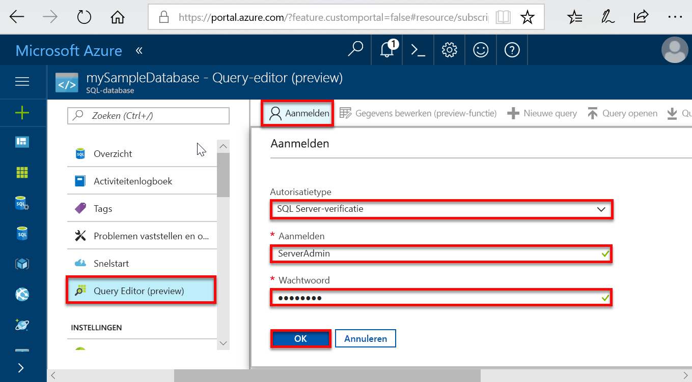

# <a name="create-an-azure-sql-database-in-the-azure-portal"></a>Een Azure SQL-database maken in Azure Portal

In deze snelstartgids leert u hoe u een SQL-database maakt in Azure met het [op DTU gebaseerde aankoopmodel](sql-database-service-tiers-dtu.md). Azure SQL Database is een Database-as-a-Service-oplossing waarmee u maximaal beschikbare SQL Server-databases kunt uitvoeren en schalen in de cloud. In deze snelstartgids ziet u hoe u aan de slag gaat door een SQL-database te maken en er vervolgens query’s op uit te voeren met behulp van de Azure-portal.

Als u nog geen Azure-abonnement hebt, maakt u een [gratis account](https://azure.microsoft.com/free/) voordat u begint.

  >[!NOTE]
  >Deze zelfstudie maakt gebruik van het op DTU gebaseerde aankoopmodel, maar het [model op basis van vCore](sql-database-service-tiers-vcore.md) is ook beschikbaar.

## <a name="log-in-to-the-azure-portal"></a>Aanmelden bij Azure Portal

Meld u aan bij [Azure Portal](https://portal.azure.com/).

## <a name="create-a-sql-database"></a>Een SQL-database maken

Een Azure SQL-database wordt gemaakt met een gedefinieerde set [reken- en opslagresources](sql-database-service-tiers-dtu.md). De database is gemaakt in een [Azure-resourcegroep](../azure-resource-manager/resource-group-overview.md) en in een [logische Azure SQL Database-server](sql-database-features.md).

Volg deze stappen voor het maken van een SQL-database met de voorbeeldgegevens van Adventure Works LT.

1. Klik in de linkerbovenhoek van Azure Portal op **Een resource maken**.

2. Selecteer **Databases** op de pagina **Nieuw** en selecteer **Maken** onder **SQL-database** op de pagina **Nieuw**.

   

3. Vul het formulier SQL Database in met de volgende informatie, zoals in de voorgaande afbeelding wordt weergegeven:   

   | Instelling       | Voorgestelde waarde | Beschrijving |
   | ------------ | ------------------ | ------------------------------------------------- |
   | **Databasenaam** | mySampleDatabase | Zie [Database-id's](https://docs.microsoft.com/sql/relational-databases/databases/database-identifiers) voor geldige databasenamen. |
   | **Abonnement** | Uw abonnement  | Zie [Abonnementen](https://account.windowsazure.com/Subscriptions) voor meer informatie over uw abonnementen. |
   | **Resourcegroep**  | myResourceGroup | Zie [Naming conventions](https://docs.microsoft.com/azure/architecture/best-practices/naming-conventions) (Naamgevingsconventies) voor geldige resourcegroepnamen. |
   | **Bron selecteren** | Sample (AdventureWorksLT) | Hiermee worden het schema en de gegevens van AdventureWorksLT in de nieuwe database geladen. |

   > [!IMPORTANT]
   > U moet de voorbeelddatabase op dit formulier selecteren. Deze wordt namelijk in de rest van deze snelstartgids gebruikt.
   >

4. Klik onder **Server** op **Vereiste instellingen configureren** en vul het formulier SQL-server (logische server) in met de volgende informatie, zoals in de volgende afbeelding wordt weergegeven:   

   | Instelling       | Voorgestelde waarde | Beschrijving |
   | ------------ | ------------------ | ------------------------------------------------- |
   | **Servernaam** | Een wereldwijd unieke naam | Zie [Naming conventions](https://docs.microsoft.com/azure/architecture/best-practices/naming-conventions) (Naamgevingsconventies) voor geldige servernamen. |
   | **Aanmeldgegevens van serverbeheerder** | Een geldige naam | Zie [Database-id's](https://docs.microsoft.com/sql/relational-databases/databases/database-identifiers) voor geldige aanmeldingsnamen. |
   | **Wachtwoord** | Een geldig wachtwoord | Uw wachtwoord moet uit ten minste 8 tekens bestaan en moet tekens bevatten uit drie van de volgende categorieën: hoofdletters, kleine letters, cijfers en niet-alfanumerieke tekens. |
   | **Abonnement** | Uw abonnement | Zie [Abonnementen](https://account.windowsazure.com/Subscriptions) voor meer informatie over uw abonnementen. |
   | **Resourcegroep** | myResourceGroup | Zie [Naming conventions](https://docs.microsoft.com/azure/architecture/best-practices/naming-conventions) (Naamgevingsconventies) voor geldige namen van resourcegroepen. |
   | **Locatie** | Een geldige locatie | Zie [Azure-regio's](https://azure.microsoft.com/regions/) voor informatie over regio's. |

   > [!IMPORTANT]
   > De beheerdersaanmelding bij de server en het wachtwoord die u hier opgeeft, zijn vereist voor aanmelding bij de server en de bijbehorende databases verderop in deze snelstartgids. Onthoud of noteer deze informatie voor later gebruik.
   >  

   

5. Wanneer u het formulier hebt ingevuld, klikt u op **Selecteren**.

6. Klik op **Prijscategorie** om de servicelaag, het aantal DTU's en de hoeveelheid opslag op te geven. Bekijk de opties voor de hoeveelheid DTU's en opslag die voor elke servicelaag beschikbaar zijn.

   > [!IMPORTANT]
   > In de Premium-laag is momenteel meer dan 1 TB aan opslag beschikbaar in alle regio's met uitzondering van UK - noord, US - west-centraal, UK - zuid2, China - oost, US DoD - centraal, Duitsland - centraal, US DoD - oost, US Gov - zuid-centraal, US Gov zuid-centraal, Duitsland - noordoost, China - noord, US Gov - oost. In andere regio’s is de maximale opslagruimte in de Premium-laag beperkt tot 1 TB. Zie [P11-P15: huidige beperkingen]( sql-database-dtu-resource-limits-single-databases.md#single-database-limitations-of-p11-and-p15-when-the-maximum-size-greater-than-1-tb).  

7. Voor deze snelstartgids selecteert u de servicelaag **Standard** en gebruikt u vervolgens de schuifregelaar om **10 DTU's (S0)** en **1** GB aan opslagruimte te selecteren.

   

8. Accepteer de gebruiksvoorwaarden voor de preview om de optie **Extra opslag** te gebruiken.

   > [!IMPORTANT]
   > In de Premium-laag is momenteel meer dan 1 TB aan opslag beschikbaar in alle regio's met uitzondering van US - west-centraal, China - oost, USDoDCentral, USGov Iowa, Duitsland - centraal, USDoDEast, US Gov - zuidoost, Duitsland - noordoost, China - noord. In andere regio’s is de maximale opslagruimte in de Premium-laag beperkt tot 1 TB. Zie [P11-P15: huidige beperkingen]( sql-database-dtu-resource-limits-single-databases.md#single-database-limitations-of-p11-and-p15-when-the-maximum-size-greater-than-1-tb).  

9. Als u de servicelaag, het aantal DTU's en de hoeveelheid opslagruimte hebt geselecteerd, klikt u op **Toepassen**.  

10. Nu u het SQL Database-formulier hebt ingevuld, klikt u op **Maken** om de database in te richten. De inrichting duurt een paar minuten.

11. Klik op de werkbalk op **Meldingen** om het implementatieproces te bewaken.

     

## <a name="query-the-sql-database"></a>Query's uitvoeren op de SQL-database

Nu u een voorbeelddatabase in Azure hebt gemaakt, gebruiken we het ingebouwde hulpprogramma voor query's binnen Azure Portal om te bevestigen dat u verbinding kunt maken met de database en query's kunt uitvoeren voor de gegevens.

1. Klik op de pagina SQL Database voor uw database op **Query-editor (preview)** in het menu links en klik daarna op **Aanmelden**.

   

2. Selecteer de SQL Server-verificatie, geef de vereiste aanmeldingsgegevens op en klik op **OK** om u aan te melden.

3. Wanneer u bent geverifieerd als **ServerAdmin**, typt u de volgende query in het deelvenster van de query-editor.

   ```sql
   SELECT TOP 20 pc.Name as CategoryName, p.name as ProductName
   FROM SalesLT.ProductCategory pc
   JOIN SalesLT.Product p
   ON pc.productcategoryid = p.productcategoryid;
   ```

4. Klik op **Uitvoeren** en bekijk de resultaten van de query in het deelvenster **Resultaten**.

   

5. Sluit de pagina **Query-editor** en klik op **OK** om uw niet-opgeslagen bewerkingen te verwijderen.

## <a name="clean-up-resources"></a>Resources opschonen

Sla deze resources op als u verder wilt gaan met [Volgende stappen](#next-steps) en wilt leren hoe u op verschillende manieren verbinding kunt maken met uw database en deze kunt bevragen. Als u echter de resources wilt verwijderen die u hebt gemaakt in deze snelstartgids, voert u de volgende stappen uit.


1. Klik in het menu links in Azure Portal op **Resourcegroepen** en klik vervolgens op **myResourceGroup**.
2. Klik op de pagina van uw resourcegroep op **Verwijderen**, typ **myResourceGroup** in het tekstvak en klik vervolgens op **Verwijderen**.

## <a name="next-steps"></a>Volgende stappen

- Nu u een database hebt, moet u een firewallregel op serverniveau maken om verbinding te maken met uw on-premises hulpprogramma’s. Zie [Een serverfirewallregel maken](sql-database-get-started-portal-firewall.md)
- Als u een firewallregel op serverniveau maakt, kunt u [verbinding maken en query’s uitvoeren](sql-database-connect-query.md) met behulp van een van favoriete hulpprogramma’s of talen, zoals
  - [Verbinding maken en query's uitvoeren met behulp van SQL Server Management Studio](sql-database-connect-query-ssms.md)
  - [Verbinding maken en query's uitvoeren met behulp van Azure Data Studio](https://docs.microsoft.com/sql/azure-data-studio/quickstart-sql-database?toc=/azure/sql-database/toc.json)
- Zie [Azure CLI-voorbeelden](sql-database-cli-samples.md) voor het maken van databases met behulp van Azure CLI
- Zie [Azure PowerShell-voorbeelden](sql-database-powershell-samples.md) voor het maken van databases met behulp van Azure PowerShell