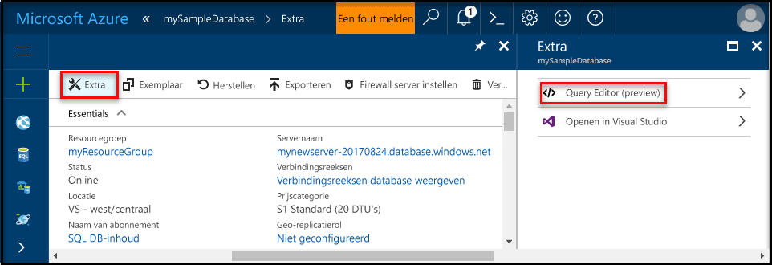
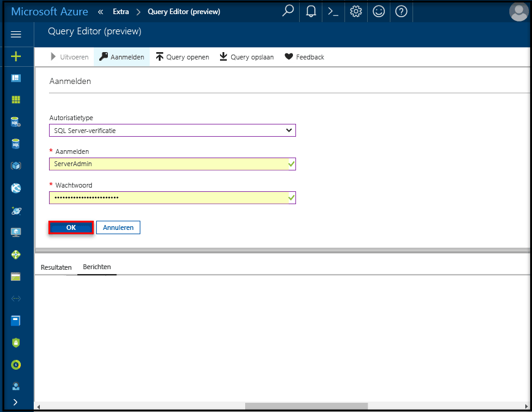

# <a name="create-an-azure-sql-database-in-the-azure-portal"></a>Een Azure SQL-database maken in Azure Portal

In deze Quick Start leert u hoe u een SQL-database maakt in Azure. Azure SQL Database is een Database-as-a-Service-oplossing waarmee u maximaal beschikbare SQL Server-databases kunt uitvoeren en schalen in de cloud. In deze Quick Start ziet u hoe u aan de slag gaat door een SQL-database te maken met behulp van Azure Portal.

Als u nog geen Azure-abonnement hebt, maakt u een [gratis account](https://azure.microsoft.com/free/) voordat u begint.

## <a name="log-in-to-the-azure-portal"></a>Aanmelden bij Azure Portal

Meld u aan bij [Azure Portal](https://portal.azure.com/).

## <a name="create-a-sql-database"></a>Een SQL-database maken

Een Azure SQL-database wordt gemaakt met een gedefinieerde set [reken- en opslagresources](sql-database-service-tiers.md). De database is gemaakt in een [Azure-resourcegroep](../azure-resource-manager/resource-group-overview.md) en in een [logische Azure SQL Database-server](sql-database-features.md). 

Volg deze stappen voor het maken van een SQL-database met de voorbeeldgegevens van Adventure Works LT. 

1. Klik op de knop **Nieuw** in de linkerbovenhoek van Azure Portal.

2. Selecteer **Databases** op de pagina **Nieuw** en selecteer **SQL-database** op de pagina **Databases**.

    

3. Vul het formulier SQL Database in met de volgende informatie, zoals in de voorgaande afbeelding wordt weergegeven:     
   - Databasenaam: **mySampleDatabase**
   - Resourcegroep: **myResourceGroup**
   - Bron: **Voorbeeld (AdventureWorksLT)**

   > [!IMPORTANT]
   > U moet de voorbeelddatabase op dit formulier selecteren. Deze wordt namelijk in de rest van deze Quick Start gebruikt.
   > 

4. Klik op **Server** en vul het **nieuwe serverformulier** in, waarbij u een unieke servernaam opgeeft. Verstrek ook een naam voor de beheerdersaanmelding bij de server en een zelfgekozen wachtwoord. 

   > [!IMPORTANT]
   > De beheerdersaanmelding bij de server en het wachtwoord die u hier opgeeft, zijn vereist voor aanmelding bij de server en de bijbehorende databases verderop in deze Quick Start. Onthoud of noteer deze informatie voor later gebruik. 
   >  

    
5. Wanneer u het formulier hebt ingevuld, klikt u op **Selecteren**.

6. Klik op **Prijscategorie** om de servicelaag en het prestatieniveau voor de nieuwe database op te geven. Gebruik de schuifregelaar om **20 DTU's** en **250** GB aan opslagruimte te selecteren. Zie [Wat is een DTU?](sql-database-what-is-a-dtu.md) voor meer informatie over DTU's.

    

7. Nadat u de hoeveelheid DTU's hebt geselecteerd, klikt u op **Toepassen**.  

8. Nu u het SQL Database-formulier hebt ingevuld, klikt u op **Maken** om de database in te richten. De inrichting duurt een paar minuten. 

9. Klik op de werkbalk op **Meldingen** om het implementatieproces te bewaken.

    


## <a name="create-a-server-level-firewall-rule"></a>Een serverfirewallregel maken

De service SQL Database maakt een firewall op serverniveau die voorkomt dat externe toepassingen en hulpmiddelen verbinding maken met de server of databases op de server, tenzij er een firewallregel is gemaakt om de firewall te openen voor specifieke IP-adressen. Volg deze stappen om een [SQL Database-firewallregel op serverniveau](sql-database-firewall-configure.md) te maken voor het IP-adres van de client en connectiviteit via de SQL Database-firewall alleen voor uw IP-adres toe te staan. 

> [!NOTE]
> SQL Database communiceert via poort 1433. Als u verbinding probeert te maken vanuit een bedrijfsnetwerk, wordt uitgaand verkeer via poort 1433 mogelijk niet toegestaan door de firewall van uw netwerk. In dat geval kunt u alleen verbinding maken met uw Azure SQL Database-server als uw IT-afdeling poort 1433 openstelt.
>

1. Wanneer de implementatie is voltooid, klikt u op **SQL Databases** in het menu aan de linkerkant. Klik vervolgens op de pagina SQL Databases op **mySampleDatabase**. De overzichtspagina voor de database wordt geopend. Hierop worden de volledig gekwalificeerde naam (zoals **mynewserver20170411.database.windows.net**) en opties voor verdere configuratie weergegeven.

   > [!IMPORTANT]
   > U hebt deze volledig gekwalificeerde servernaam nodig om verbinding te maken met de server en de bijbehorende databases in de volgende Quick Starts.
   > 

       

2. Klik op de werkbalk op **Serverfirewall instellen** zoals in de vorige afbeelding is weergegeven. De pagina **Firewallinstellingen** voor de SQL Database-server wordt geopend. 

       


3. Klik op **IP van client toevoegen** op de werkbalk om uw huidige IP-adres aan een nieuwe firewallregel toe te voegen. Een firewallregel kan poort 1433 openen voor een afzonderlijk IP-adres of voor een aantal IP-adressen.

4. Klik op **Opslaan**. Er wordt een firewallregel op serverniveau gemaakt voor uw huidige IP-adres waarbij poort 1433 op de logische server wordt geopend.

       

4. Klik op **OK** en sluit de pagina **Firewallinstellingen**.

U kunt nu verbinding maken met de SQL Database-server en de bijbehorende databases met behulp van SQL Server Management Studio of een ander hulpprogramma naar keuze. Dit doet u vanaf dit IP-adres via het serverbeheerdersaccount dat eerder is gemaakt.

> [!IMPORTANT]
> Voor alle Azure-services is toegang via de SQL Database-firewall standaard ingeschakeld. Klik op **UIT** op deze pagina om dit voor alle Azure-services uit te schakelen.

## <a name="query-the-sql-database"></a>Query's uitvoeren op de SQL-database

Nu u een voorbeelddatabase in Azure hebt gemaakt, gebruiken we het ingebouwde hulpprogramma voor query's binnen Azure Portal om te bevestigen dat u verbinding kunt maken met de database en query's kunt uitvoeren voor de gegevens. 

1. Klik op de pagina SQL Database voor uw database op **Extra** op de werkbalk. De pagina **Extra** wordt geopend.

      

2. Klik achtereenvolgens op **Query-editor (preview)**, op het selectievakje **Preview-voorwaarden** en op **OK**. De pagina Query-editor wordt geopend.

3. Klik op **Aanmelden** en selecteer wanneer hierom wordt gevraagd **SQL serververificatie**. Geef vervolgens de gebruikersnaam en het wachtwoord van de serverbeheerder op die u eerder hebt gemaakt.

     

4. Klik op **OK** om u aan te melden.

5. Wanneer u bent geverifieerd, typt u de volgende query in het deelvenster van de query-editor:

   ```
   SELECT TOP 20 pc.Name as CategoryName, p.name as ProductName
   FROM SalesLT.ProductCategory pc
   JOIN SalesLT.Product p
   ON pc.productcategoryid = p.productcategoryid;
   ```

6. Klik op **Uitvoeren** en bekijk de resultaten van de query in het deelvenster **Resultaten**.

    

7. Sluit de pagina **Query-editor** en de pagina **Extra**.

## <a name="clean-up-resources"></a>Resources opschonen

Andere Quick Starts in deze verzameling zijn op deze Quick Start gebaseerd. Als u van plan bent om door te gaan met andere Quick Starts, verwijdert u de resources die u in deze Quick Start hebt gemaakt niet. Als u niet wilt doorgaan, gebruikt u de volgende stappen om alle resources te verwijderen die door deze Quick Start in Azure Portal zijn gemaakt.

1. Klik in het menu links in Azure Portal op **Resourcegroepen** en klik vervolgens op **myResourceGroup**. 
2. Klik op de pagina van uw resourcegroep op **Verwijderen**, typ **myResourceGroup** in het tekstvak en klik vervolgens op **Verwijderen**.

## <a name="next-steps"></a>Volgende stappen

- Als u verbinding wilt maken en query's wilt uitvoeren met behulp van SQL Server Management Studio, raadpleegt u [Verbinding maken en query's uitvoeren met SSMS](sql-database-connect-query-ssms.md)
- Zie [Verbinding maken en query's uitvoeren met Visual Studio Code](sql-database-connect-query-vscode.md) als u verbinding wilt maken en query’s wilt uitvoeren met Visual Studio Code.
- Zie [Verbinding maken en query’s uitvoeren met .NET](sql-database-connect-query-dotnet.md) als u verbinding wilt maken en query’s wilt uitvoeren met .NET.
- Zie [Verbinding maken en query's uitvoeren met PHP](sql-database-connect-query-php.md) als u verbinding wilt maken en query's wilt uitvoeren met PHP.
- Zie [Verbinding maken en query's uitvoeren met Node.js](sql-database-connect-query-nodejs.md) als u verbinding wilt maken en query's wilt uitvoeren met Node.js.
- Zie [Verbinding maken en query's uitvoeren met Java](sql-database-connect-query-java.md) als u verbinding wilt maken en query's wilt uitvoeren met Java.
- Zie [Verbinding maken en query's uitvoeren met Python](sql-database-connect-query-python.md) als u verbinding wilt maken en query's wilt uitvoeren met Python.
- Zie [Verbinding maken en query's uitvoeren met Ruby](sql-database-connect-query-ruby.md) als u verbinding wilt maken en query's wilt uitvoeren met Ruby.

