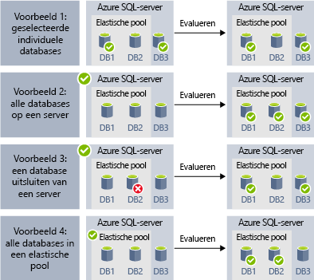
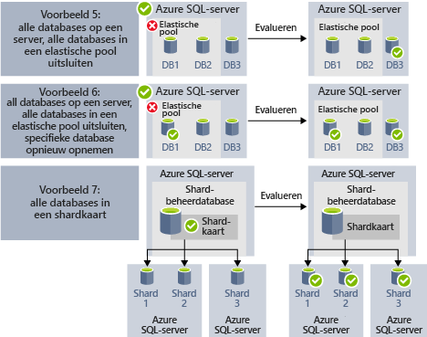

# <a name="automate-management-tasks-using-database-jobs"></a>Beheertaken automatiseren met behulp van databasetaken

Met behulp van Azure SQL Database kunt u taken die regelmatig kunnen worden uitgevoerd op een of meer databases maken en plannen om T-SQL-query's en onderhoudstaken uit te voeren. Door elke taak wordt de uitvoeringsstatus in een logboek vastgelegd en wordt ook geprobeerd de bewerkingen opnieuw uit te voeren als er een fout optreedt.
U kunt een doeldatabase of groepen Azure SQL-databases definiëren waarin de taak wordt uitgevoerd, en ook schema's voor het uitvoeren van een taak definiëren.
Een taak handelt het aanmelden bij de doeldatabase af. Ook definieert, onderhoudt en handhaaft u Transact-SQL-scripts die in een groep van Azure SQL-databases moeten worden uitgevoerd.

Er zijn verschillende scenario's waarin u taakautomatisering kunt gebruiken:

- Beheertaken automatiseren en deze vervolgens plannen voor uitvoering op elke weekdag, na kantooruren, enzovoort.
  - Implementeer schemawijzigingen, referentiebeheer, het verzamelen van prestatiegegevens of telemetrie van tenant (klant).
  - Referentiegegevens (algemene informatie voor alle databases) bijwerken, gegevens laden uit Azure-blobopslag.
  - Bouw indexen opnieuw om queryprestaties te verbeteren. Configureer taken die op terugkerende basis, bijvoorbeeld tijdens daluren, moeten worden uitgevoerd.
  - Verzamel op continue basis queryresultaten uit een reeks databases in een centrale tabel. Prestatiequery's kunnen voortdurend worden uitgevoerd en geconfigureerd om de uitvoering van aanvullende taken te activeren.
- Gegevens verzamelen voor rapportage
  - Verzamel gegevens uit een verzameling Azure SQL-databases in één doeltabel.
  - Voer langer durende gegevensverwerkingsquery's uit voor een groot aantal databases, zoals het verzamelen van klanttelemetrie. Resultaten worden in één doeltabel verzameld voor verdere analyse.
- Gegevensverplaatsingen
 - Taken maken waarmee wijzigingen die zijn aangebracht in uw databases naar andere databases worden gerepliceerd of updates verzamelen die zijn uitgevoerd in externe databases en wijzigingen doorvoeren in de database.
 - Taken maken waarmee gegevens vanuit of naar uw databases worden geladen met behulp van SQL Server Integration Services (SSIS).

De volgende technologieën voor het plannen van taken zijn beschikbaar in Azure SQL Database:

- **SQL Agent-taken** zijn een klassiek en bewezen SQL Server-onderdeel voor taakplanning dat beschikbaar is in het beheerde exemplaar. SQL Agent-taken zijn niet beschikbaar in individuele databases.
- **Elastic Database-taken** zijn een taakplanningsservice die aangepaste taken uitvoert op een of meer Azure SQL Databases.

Hier volgen enkele noemenswaardige verschillen tussen SQL Agent (on-premises beschikbaar en als onderdeel van SQL Database Managed Instance) en de taakagent van Elastic Database (beschikbaar voor individuele databases in Azure SQL-database en databases in SQL Data Warehouse).

|  |Elastische taken  |SQL Agent |
|---------|---------|---------|
|Bereik     |  Elk gewenst aantal Azure SQL Databases en/of datawarehouses in dezelfde Azure-cloud als de taakagent. Doelen kunnen zich op verschillende SQL Database-servers en in verschillende abonnementen en/of regio's bevinden. <br><br>Doelgroepen kunnen bestaan uit afzonderlijke databases of datawarehouses of alle databases in een server, pool of shardkaart (dynamisch opgesomd tijdens het uitvoeren van een taak). | Een afzonderlijke database in hetzelfde SQL Server-exemplaar als de SQL agent. |
|Ondersteunde API's en hulpprogramma's     |  Portal, PowerShell, T-SQL, Azure Resource Manager      |   T-SQL, SQL Server Management Studio (SSMS)     |

## <a name="sql-agent-jobs"></a>SQL Agent-taken

SQL Agent-taken zijn een reeks T-SQL-scripts die voor uw database zijn opgegeven. Gebruik taken om een administratieve taak te definiëren die een keer of vaker kan worden uitgevoerd en kan worden gecontroleerd op slagen of mislukken.
Een taak kan op één lokale server of op meerdere externe servers worden uitgevoerd. Een SQL Agent-taak is een intern Database-Engine-onderdeel dat wordt uitgevoerd in de service voor het beheerde exemplaar.
Er zijn enkele belangrijke concepten in SQL Agent-taken:

- **Taakstappen** zijn een of meer stappen die in de taak moet worden uitgevoerd. U kunt voor elke stap een strategie voor opnieuw proberen definiëren en de actie die moet plaatsvinden moet als de taakstap is geslaagd of mislukt.
- **Schema's** definiëren wanneer de taak moet worden uitgevoerd.
- Met **meldingen** kunt u regels definiëren die worden gebruikt om operators een melding te verzenden via een e-mailbericht wanneer de taak is voltooid.

### <a name="job-steps"></a>Taakstappen

SQL Agent-taakstappen zijn reeksen met acties die door SQL Agent moeten worden uitgevoerd. Elke stap bevat de volgende stap die moet worden uitgevoerd als de stap is geslaagd of mislukt en in het laatste geval het aantal nieuwe pogingen in geval van een fout.
Met SQL Agent kunt u verschillende soorten taakstappen, zoals de Transact-SQL-taakstap waarmee één Transact-SQL-batch op de database wordt uitgevoerd of OS-opdracht-/PowerShell stappen die een aangepast OS-script kunnen uitvoeren. Met SSIS-taakstappen kunt u gegevens laden met behulp van SSIS-runtime of [replicatie](sql-database-managed-instance-transactional-replication.md)stappen uitvoeren die wijzigingen uit uw database naar andere databases kunnen publiceren.

[Transactionele replicatie](sql-database-managed-instance-transactional-replication.md) is een Database-Engine-functie waarmee u de wijzigingen die zijn aangebracht in een of meer tabellen in de ene database kunt publiceren en naar een set abonneedatabases kunt publiceren/distribueren. Publicatie van de wijzigingen wordt geïmplementeerd met behulp van de volgende staptypen voor de SQL Agent-taak:

- Transactielogboeklezer.
- Momentopname.
- Distributor.

Andere typen taakstappen worden momenteel niet ondersteund, waaronder:

- Het samenvoegen van replicatietaakstappen wordt niet ondersteund.
- De wachtrijlezer wordt niet ondersteund.
- Analysis Services worden niet ondersteund

### <a name="job-schedules"></a>Jobplanningen

Een schema geeft aan wanneer een taak wordt uitgevoerd. Er kan meer dan één taak worden uitgevoerd in hetzelfde schema en er kan meer dan één schema worden toegepast op dezelfde taak.
Een schema kan de volgende voorwaarden definiëren voor het moment waarop een taak wordt uitgevoerd:

- Wanneer het exemplaar opnieuw wordt opgestart (of wanneer SQL Server Agent wordt gestart). De taak wordt geactiveerd na elke failover.
- Eén keer op een specifieke datum en tijd, wat handig is voor uitgestelde uitvoering van een taak.
- Met een terugkerend schema.

> [!Note]
> Met een beheerd exemplaar is het op dit moment niet mogelijk om een taak te starten wanneer het exemplaar 'inactief' is.

### <a name="job-notifications"></a>Taakmeldingen

Met SQL Agent-taken kunt u meldingen ontvangen wanneer de taak is voltooid of mislukt. U kunt een melding via e-mail ontvangen.

Eerst moet u het e-mailaccount instellen dat wordt gebruikt voor het verzenden van de e-mailmeldingen en het account toewijzen aan het e-mailprofiel met de naam `AzureManagedInstance_dbmail_profile`, zoals wordt weergegeven in het volgende voorbeeld:

```sql
-- Create a Database Mail account
EXECUTE msdb.dbo.sysmail_add_account_sp
    @account_name = 'SQL Agent Account',
    @description = 'Mail account for Azure SQL Managed Instance SQL Agent system.',
    @email_address = '$(loginEmail)',
    @display_name = 'SQL Agent Account',
    @mailserver_name = '$(mailserver)' ,
    @username = '$(loginEmail)' ,  
    @password = '$(password)' 

-- Create a Database Mail profile
EXECUTE msdb.dbo.sysmail_add_profile_sp
    @profile_name = 'AzureManagedInstance_dbmail_profile',
    @description = 'E-mail profile used for messages sent by Managed Instance SQL Agent.' ;

-- Add the account to the profile
EXECUTE msdb.dbo.sysmail_add_profileaccount_sp
    @profile_name = 'AzureManagedInstance_dbmail_profile',
    @account_name = 'SQL Agent Account',
    @sequence_number = 1;
```

U moet ook Database Mail inschakelen in het beheerde exemplaar:

```sql
GO
EXEC sp_configure 'show advanced options', 1;  
GO  
RECONFIGURE;  
GO  
EXEC sp_configure 'Database Mail XPs', 1;  
GO  
RECONFIGURE 
```

U kunt operators waarschuwen dat er iets is gebeurd met uw SQL Agent-taken. Een operator definieert contactgegevens voor een persoon die verantwoordelijk is voor het onderhoud van een of meer beheerde exemplaren. Soms zijn operatorverantwoordelijkheden toegewezen aan één persoon.
In systemen met meerdere beheerde exemplaren of SQL-servers, kunnen veel personen operatorverantwoordelijkheden delen. Een operator bevat geen informatie over beveiliging, en definieert geen beveiligingsprincipal.

U kunt operators maken met behulp van SQL Server Management Studio of Transact SQL-script, zoals in het volgende voorbeeld wordt weergegeven:

```sql
EXEC msdb.dbo.sp_add_operator 
    @name=N'Mihajlo Pupun', 
        @enabled=1, 
        @email_address=N'mihajlo.pupin@contoso.com'
```

U kunt een taak wijzigen en een operator toewijzen die via e-mail wordt gewaarschuwd als de taak is voltooid, mislukt of geslaagd met behulp van SQL Server Management Studio of het volgende Transact-SQL-script:

```sql
EXEC msdb.dbo.sp_update_job @job_name=N'Load data using SSIS', 
        @notify_level_email=3,                        -- Options are: 1 on succeed, 2 on failure, 3 on complete
        @notify_email_operator_name=N'Mihajlo Pupun'
```

### <a name="sql-agent-job-limitations"></a>Beperkingen van SQL Agent-taken

Enkele van de SQL Agent-functies die beschikbaar zijn in SQL Server worden niet ondersteund in het beheerde exemplaar:
- SQL Agent-instellingen zijn alleen-lezen. Procedure `sp_set_agent_properties` wordt niet ondersteund in het beheerde exemplaar.
- Het in-/uitschakelen van de Agent wordt momenteel niet ondersteund in het beheerde exemplaar. SQL Agent wordt altijd uitgevoerd.
- Meldingen worden gedeeltelijk ondersteund
 - Pager wordt niet ondersteund.
 - NetSend wordt niet ondersteund.
 - Waarschuwingen worden nog niet ondersteund.
- Proxy's worden niet ondersteund.
- Gebeurtenislogboek wordt niet ondersteund.

Zie [SQL Server Agent](https://docs.microsoft.com/sql/ssms/agent/sql-server-agent) voor meer informatie over SQL Server Agent.

## <a name="elastic-database-jobs"></a>Taken voor Elastic Database

**Taak voor Elastic Database** biedt de mogelijkheid om een of meer T-SQL-scripts parallel in een groot aantal databases uit te voeren volgens een schema of op aanvraag.

**Taken uitvoeren voor een willekeurige combinatie van databases**: een of meer afzonderlijke databases, alle databases op een server, alle databases in een elastische pool of shardkaart, met de extra flexibiliteit om een specifieke database al dan niet op te nemen. **Taken kunnen worden uitgevoerd op meerdere servers en meerdere pools, en kunnen zelfs worden uitgevoerd voor databases in verschillende abonnementen.** Servers en pools worden dynamisch opgesomd tijdens runtime, zodat taken worden uitgevoerd voor alle databases die op het moment van de uitvoering in de doelgroep aanwezig zijn.

De volgende afbeelding toont hoe een taakagent taken uitvoert op verschillende soorten doelgroepen:


### <a name="elastic-job-components"></a>Onderdelen van een elastische taak

|Onderdeel  | Beschrijving (aanvullende gegevens onder de tabel) |
|---------|---------|
|[**Elastische-taakagent**](#elastic-job-agent) |  De Azure-resource die u maakt om taken uit te voeren en te beheren.   |
|[**Taakdatabase**](#job-database)    |    Een Azure SQL-database die de taakagent gebruikt om taakgerelateerde gegevens, taakdefinities, enzovoort op te slaan.      |
|[**Doelgroep**](#target-group)      |  De verzameling servers, pools, databases en shardkaarten waarvoor een taak moet worden uitgevoerd.       |
|[**Taak**](#job)  |  Een taak is een werkeenheid die uit een of meer [taakstappen](#job-step) bestaat. Taakstappen bepalen welk T-SQL-script moet worden uitgevoerd en andere details die nodig zijn voor het uitvoeren van het script.  |


#### <a name="elastic-job-agent"></a>Elastische-taakagent

Een elastische-taakagent is de Azure-resource voor het maken, uitvoeren en beheren van taken. De elastische-taakagent is een Azure-resource die u maakt in de portal ([PowerShell](elastic-jobs-powershell.md) en REST worden ook ondersteund). 

Voor het maken van een **elastische-taakagent** hebt u een bestaande SQL-database nodig. De agent configureert deze bestaande database als de [*taakdatabase*](#job-database).

De elastische-taakagent is gratis. De taakdatabase wordt tegen hetzelfde tarief gefactureerd als een SQL-database.

#### <a name="job-database"></a>Taakdatabase

De *taakdatabase* wordt gebruikt voor het definiëren van taken en het bijhouden van de status en geschiedenis van taakuitvoeringen. De *taakdatabase* wordt ook gebruikt voor het opslaan van metagegevens van de agent, logboeken, resultaten en taakdefinities. De database bevat ook veel nuttige opgeslagen procedures en andere databaseobjecten voor het maken, uitvoeren en beheren van taken met T-SQL.

Voor de huidige preview is een bestaande Azure SQL-database (S0 of hoger) vereist om een elastische-taakagent te kunnen maken.

De *taakdatabase* hoeft niet letterlijk nieuw te zijn, maar het moet een schone, lege database op servicelaag S0 of hoger zijn. De aanbevolen servicelaag van de *taakdatabase* is S1 of hoger. Dit hangt echter af van de prestatiebehoeften van uw taken: het aantal taakstappen, het aantal keer en met welke frequentie de taken worden uitgevoerd. Zo is een S0-database misschien voldoende voor een taakagent die enkele taken per uur uitvoert, maar als een taak elke minuut moet worden uitgevoerd, presteert deze database misschien onvoldoende en is een hogere servicelaag misschien beter.


##### <a name="job-database-permissions"></a>Machtigingen voor taakdatabase

Tijdens het maken van een taakagent worden er een schema, tabellen en een rol met de naam *jobs_reader* gemaakt in de *taakdatabase*. De rol is gemaakt met de volgende machtigingen en is ontworpen om beheerders gedetailleerder toegangsbeheer te geven voor het bewaken van de taak:


|Rolnaam  |Machtigingen voor schema 'jobs'  |Machtigingen voor schema 'jobs_internal'  |
|---------|---------|---------|
|**jobs_reader**     |    SELECT     |    Geen     |

> [!IMPORTANT]
> Houd rekening met de beveiligingsaspecten voordat u iemand als een databasebeheerder toegang verleent tot de *taakdatabase*. Een kwaadwillende gebruiker met machtigingen voor het maken of bewerken van taken kan een taak die gebruikmaakt van een opgeslagen referentie, maken of bewerken om verbinding te maken met een database onder het beheer van de kwaadwillende gebruiker. Op die manier kan de kwaadwillende gebruiker het wachtwoord van de referenties achterhalen.


#### <a name="target-group"></a>Doelgroep

Een *doelgroep* definieert de verzameling databases waarvoor een taakstap wordt uitgevoerd. Een doelgroep kan een willekeurig aantal en een willekeurige combinatie van de volgende elementen bevatten:

- **SQL Database-server**: als een server is opgegeven, maken alle databases die op het moment waarop de taak wordt uitgevoerd aanwezig zijn in de server, deel uit van de groep. De referenties van de hoofddatabase moeten worden opgegeven zodat de groep kan worden opgesomd en worden bijgewerkt voordat de taak wordt uitgevoerd.
- **Elastische pool**: als een elastische pool is opgegeven, maken alle databases die zich in de elastische pool bevinden op het moment dat de taak wordt uitgevoerd, deel uit van de groep. Wat de server betreft, moeten de referenties van de hoofddatabase worden opgegeven zodat de groep kan worden bijgewerkt voordat de taak wordt uitgevoerd.
- **Individuele database**: geef een of meer afzonderlijke databases op als onderdeel van de groep.
- **Shardkaart**: databases van een shardkaart.

> [!TIP]
> Op het moment dat de taak wordt uitgevoerd, wordt de reeks databases in de doelgroepen die servers of pools bevatten, opnieuw geëvalueerd met behulp van *dynamische opsomming*. Dynamische opsomming zorgt ervoor dat **taken worden uitgevoerd voor alle databases die in de server of de pool bestaan op het moment dat de taak wordt uitgevoerd**. Een herevaluatie van de lijst met databases tijdens runtime is met name nuttig als het lidmaatschap van de pool of server regelmatig verandert.

Pools en individuele databases kunnen worden opgegeven als ingesloten in of uitgesloten van de groep. Zo kunt u een doelgroep maken met een willekeurige combinatie van databases. Zo kunt u bijvoorbeeld een server toevoegen aan een doelgroep, maar specifieke databases in een elastische pool (of een hele pool) uitsluiten.

Een doelgroep kan databases in meerdere abonnementen en uit meerdere regio's bevatten. Regio-overschrijdende uitvoeringen hebben echter wel een hogere latentie dan uitvoeringen binnen dezelfde regio.

In de volgende voorbeelden ziet u hoe verschillende doelgroepdefinities tijdens de uitvoering van de taak dynamisch worden geïnventariseerd om te bepalen in welke databases de taak wordt uitgevoerd:



In **Voorbeeld 1** ziet u een doelgroep dat bestaat uit een lijst met afzonderlijke databases. Wanneer een taakstap wordt uitgevoerd met behulp van deze doelgroep, wordt de actie van de taakstap uitgevoerd in elk van deze databases.<br>
In **Voorbeeld 2** ziet u een doelgroep die een Azure SQL-server als doel heeft. Wanneer een taakstap wordt uitgevoerd met behulp van deze doelgroep, wordt de server dynamisch geïnventariseerd om de actuele lijst met databases op de server te bepalen. De actie van de taakstap wordt uitgevoerd in elk van deze databases.<br>
In **Voorbeeld 3** ziet u een vergelijkbare doelgroep als in *Voorbeeld 2*, maar een afzonderlijke database wordt uitdrukkelijk uitgesloten. De actie van de taakstap wordt *niet* uitgevoerd in de uitgesloten database.<br>
In **Voorbeeld 4** ziet u een doelgroep die een elastische pool als doel heeft. De pool wordt, vergelijkbaar met in *Voorbeeld 2*, dynamisch geïnventariseerd tijdens het uitvoeren van de taak om de lijst met databases in de pool te bepalen.
<br><br>




In **Voorbeeld 5** en **Voorbeeld 6** ziet u geavanceerde scenario’s waarin Azure SQL-servers, elastische pools en databases kunnen worden gecombineerd met behulp van regels voor opnemen en uitsluiten.<br>
In **Voorbeeld 7** ziet u dat de shards in een shardkaart ook kunnen worden geëvalueerd tijden het uitvoeren van de taak.

#### <a name="job"></a>Taak

Een *taak* is een werkeenheid die wordt uitgevoerd volgens een schema of als een eenmalige taak. Een taak bestaat uit een of meer *taakstappen*.

##### <a name="job-step"></a>Taakstap

Elke taakstap bevat een uit te voeren T-SQL-script, een of meer doelgroepen waarvoor het T-SQL-script moet worden uitgevoerd en de referenties die de agent nodig heeft om verbinding te maken met de doeldatabase. Elke taakstap heeft een instelbaar beleid voor time-out en nieuwe pogingen, en kan optioneel uitvoerparameters bevatten.

#### <a name="job-output"></a>Taakuitvoer

Het resultaat van de stappen van een taak op elke doeldatabase wordt gedetailleerd geregistreerd en scriptuitvoer kan worden vastgelegd in een opgegeven tabel. U kunt een database opgeven om de resultaatgegevens van een taak vast te leggen.

#### <a name="job-history"></a>Jobgeschiedenis

De taakgeschiedenis wordt opgeslagen in de *taakdatabase*. Met een systeemopschoontaak wordt uitvoergeschiedenis verwijderd die ouder is dan 45 dagen. Als u geschiedenis wilt verwijderen die nog geen 45 dagen oud is, roept u de procedure **sp_purge_history** in de *taakdatabase* aan.

### <a name="agent-performance-capacity-and-limitations"></a>Agentprestaties, - capaciteit en -beperkingen

Elastische taken gebruiken minimale rekenresources tijdens het wachten tot langlopende taken zijn voltooid.

Afhankelijk van de grootte van de doelgroep van databases en de gewenste uitvoeringstijd voor een taak (aantal gelijktijdige werkrollen), vraagt de agent meer of minder rekenkracht en prestaties van de *taakdatabase* (hoe meer doelen en taken, hoe hoger de vereiste hoeveelheid rekenkracht).

Op dit moment is de preview beperkt tot 100 gelijktijdige taken.

#### <a name="prevent-jobs-from-reducing-target-database-performance"></a>Voorkomen dat taken de prestaties van de doeldatabase doen afnemen

Om ervoor te zorgen dat resources niet worden overbelast tijdens het uitvoeren van taken voor databases in een elastische SQL-pool, kunnen taken zo worden geconfigureerd dat het aantal databases waarvoor een taak tegelijkertijd wordt uitgevoerd, wordt beperkt.

## <a name="next-steps"></a>Volgende stappen

- [Wat is SQL Server Agent](https://docs.microsoft.com/sql/ssms/agent/sql-server-agent) 
- [Elastische taken maken en beheren](elastic-jobs-overview.md) 
- [Elastische taken maken en beheren met PowerShell](elastic-jobs-powershell.md) 
- [Elastische taken maken en beheren met Transact-SQL (T-SQL)](elastic-jobs-tsql.md) 
