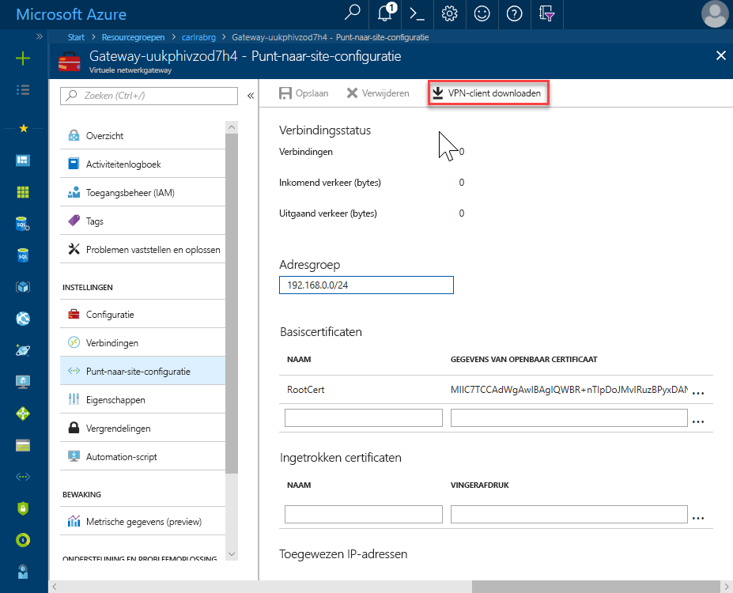
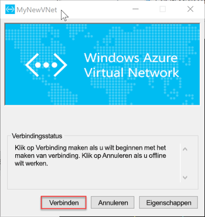

# <a name="quickstart-configure-a-point-to-site-connection-to-an-azure-sql-database-managed-instance-from-on-premises"></a>Snelstart: Een punt-naar-site-verbinding naar een Azure SQL Database Managed Instance van on-premises configureren

In deze Quick Start ziet u hoe u verbinding maken met een Azure SQL Database Managed Instance via [SQL Server Management Studio](https://docs.microsoft.com/sql/ssms/sql-server-management-studio-ssms) (SSMS) vanuit een on-premises clientcomputer via een punt-naar-site-verbinding. Zie voor meer informatie over punt-naar-site-verbindingen [over punt-naar-Site-VPN](../vpn-gateway/point-to-site-about.md)

## <a name="prerequisites"></a>Vereisten

Voor deze snelstartgids geldt het volgende:

- Maakt gebruik van de resources die zijn gemaakt [maken van een beheerd exemplaar](sql-database-managed-instance-get-started.md) als uitgangspunt.
- PowerShell 5.1 en Azure PowerShell 5.4.2 vereist of hoger op uw on-premises client-computer. Indien nodig, raadpleegt u de instructies voor [installeren van de Azure PowerShell-module](https://docs.microsoft.com/powershell/azure/install-az-ps?view=azurermps-6.13.0#install-the-azure-powershell-module).
- Vereist de nieuwste versie van [SQL Server Management Studio](https://docs.microsoft.com/sql/ssms/sql-server-management-studio-ssms) (SSMS) op uw on-premises clientcomputer.

## <a name="attach-a-vpn-gateway-to-your-managed-instance-virtual-network"></a>Een VPN-gateway met uw beheerde exemplaar van virtueel netwerk koppelen

1. Open Powershell op uw on-premises clientcomputer.
2. Kopieer dit PowerShell-script. Met dit script koppelt u een VPN-Gateway met het virtuele netwerk van Managed Instance die u hebt gemaakt in de [maken van een beheerd exemplaar](sql-database-managed-instance-get-started.md) Quick Start. Dit script doet het volgende:

   - Maakt en installeert u certificaten op client-computer
   - Berekent de toekomstige VPN-Gateway-subnet IP-adresbereik
   - Hiermee maakt u het GatewaySubnet
   - De Azure Resource Manager-sjabloon die wordt gekoppeld de VPN-Gateway voor VPN-subnet implementeert

     ```powershell
     $scriptUrlBase = 'https://raw.githubusercontent.com/Microsoft/sql-server-samples/master/samples/manage/azure-sql-db-managed-instance/attach-vpn-gateway'

     $parameters = @{
       subscriptionId = '<subscriptionId>'
       resourceGroupName = '<resourceGroupName>'
       virtualNetworkName = '<virtualNetworkName>'
       certificateNamePrefix  = '<certificateNamePrefix>'
       }

     Invoke-Command -ScriptBlock ([Scriptblock]::Create((iwr ($scriptUrlBase+'/attachVPNGateway.ps1?t='+ [DateTime]::Now.Ticks)).Content)) -ArgumentList $parameters, $scriptUrlBase
     ```

3. Plak het script in uw PowerShell-venster en geef de vereiste parameters. De waarden voor `<subscriptionId>`, `<resourceGroup>`, en `<virtualNetworkName>` moet overeenkomen met de velden die u hebt gebruikt voor de [beheerd exemplaar maken](sql-database-managed-instance-get-started.md) Quick Start. De waarde voor `<certificateNamePrefix>` kan bestaan uit een tekenreeks van uw keuze.

4. Voer het PowerShell-script.

## <a name="create-a-vpn-connection-to-your-managed-instance"></a>Een VPN-verbinding met uw beheerde exemplaar maken

1. Meld u aan bij [Azure Portal](https://portal.azure.com/).
2. Open de resourcegroep waarin u de gateway van virtueel netwerk hebt gemaakt en open vervolgens een resource van de virtuele netwerkgateway.
3. Selecteer **punt-naar-site-configuratie** en selecteer vervolgens **VPN-client downloaden**.

      
4. Pak de bestanden in het zip-bestand op uw on-premises client-computer en open vervolgens de uitgepakte map.
5. Open de map WindowsAmd64 en open de **VpnClientSetupAmd64.exe** bestand.
6. Als u ontvangt een **Windows beveiligd uw PC** bericht, selecteer **meer info** en kies vervolgens **toch uitvoeren**.

    \
7. Selecteer **Ja** in het dialoogvenster User Account Control om door te gaan.
8. Selecteer in het dialoogvenster die verwijst naar uw virtuele netwerk, **Ja** om de VPN-Client te installeren.

## <a name="connect-to-the-vpn-connection"></a>Verbinding maken met de VPN-verbinding

1. Ga naar de VPN-verbindingen op uw on-premises client-computer en selecteer het virtuele netwerk van de beheerd exemplaar voor een verbinding met dit VNet. In de volgende afbeelding ziet u het VNet heet **MyNewVNet**.

      
2. Selecteer **Verbinden**.
3. Selecteer in het dialoogvenster **Connect**.

      
4. Wanneer u wordt gevraagd dat Connection Manager nodig met verhoogde bevoegdheden heeft aan uw routetabel bijwerken, kiest u **doorgaan**.
5. Selecteer **Ja** in het dialoogvenster User Account Control om door te gaan.

   U hebt een VPN-verbinding tot stand gebracht met uw VNet beheerd exemplaar.

      


## <a name="use-ssms-to-connect-to-the-managed-instance"></a>SSMS gebruiken voor verbinding met het beheerde exemplaar

1. Open op de clientcomputer on-premises SQL Server Management Studio (SSMS).
2. In de **verbinding maken met Server** dialoogvenster vak, voer de volledig gekwalificeerde **hostnaam** voor uw beheerde exemplaar in de **servernaam** vak. 
1. Selecteer **SQL Server-verificatie**, Geef uw gebruikersnaam en wachtwoord en selecteer vervolgens **Connect**.

      

Nadat u verbinding maakt, kunt u uw systeem en gebruikersdatabases bekijken in het knooppunt Databases uit. U kunt ook verschillende objecten weergeven in de knooppunten beveiliging, Server-objecten, replicatie, beheer, SQL Server Agent en XEvent Profiler.

## <a name="next-steps"></a>Volgende stappen

- Zie voor een snelstart van het verbinding maken vanaf een virtuele machine van Azure [een punt-naar-site-verbinding configureren](sql-database-managed-instance-configure-p2s.md).
- Zie [Verbinding maken tussen uw toepassing en het beheerde exemplaar van Azure SQL Database](sql-database-managed-instance-connect-app.md) voor een overzicht van de verbindingsopties voor toepassingen.
- Als u wilt een bestaande SQL Server-database herstellen van on-premises naar een beheerd exemplaar, kunt u de [Azure Database Migration Service (DMS) voor de migratie](../dms/tutorial-sql-server-to-managed-instance.md) of de [T-SQL terugzetten opdracht](sql-database-managed-instance-get-started-restore.md) om terug te zetten vanuit een back-upbestand database.
