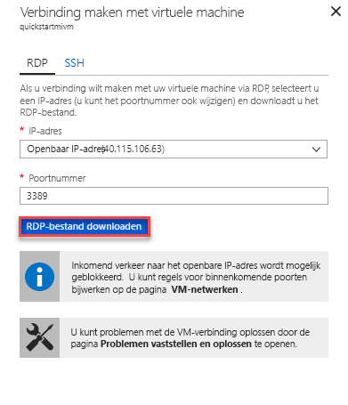

# Snelstartgids: Azure-VM verbinding maken met een Azure SQL Database Managed Instance configureren

Deze QuickStart laat zien hoe het configureren van een virtuele Azure-machine verbinding maken met een Azure SQL Database Managed Instance met behulp van SQL Server Management Studio (SSMS). Zie voor een snelstart van hoe u verbinding maakt vanaf een on-premises clientcomputer met behulp van een punt-naar-site-verbinding [een punt-naar-site-verbinding configureren](sql-database-managed-instance-configure-p2s.md) 

## Vereisten

In deze Quick Start wordt gebruikt als uitgangspunt de resources die in deze snelstartgids zijn gemaakt: [maken van een beheerd exemplaar](sql-database-managed-instance-get-started.md).

## Aanmelden bij Azure Portal

Meld u aan bij [Azure Portal](https://portal.azure.com/).

## Een nieuw subnet in het VNet beheerd exemplaar maken

De volgende stappen maakt u een nieuw subnet in het beheerd exemplaar VNet voor een Azure-machine verbinding maken met het beheerde exemplaar. De Managed Instance-subnet is toegewezen aan beheerde instanties en u kunt geen andere bronnen (bijvoorbeeld Azure virtuele Machines) in dat subnet maken. 

1. Open de resourcegroep voor het beheerde exemplaar dat u hebt gemaakt in de [maken van een beheerd exemplaar](sql-database-managed-instance-get-started.md) quickstart en klik op het virtuele netwerk voor uw beheerde exemplaar en klik vervolgens op **subnetten**.

   

2. Klik op de **+** Meld u aan bij **Subnet** om een nieuw subnet te maken.

   

3. Vul het formulier in met de aangevraagde informatie, met behulp van de gegevens in de volgende tabel:

   | Instelling| Voorgestelde waarde | Beschrijving |
   | ---------------- | ----------------- | ----------- | 
   | **Naam** | Een geldige naam|Zie [Naming conventions](https://docs.microsoft.com/azure/architecture/best-practices/naming-conventions) (Naamgevingsconventies) voor geldige namen.|
   | **Adresbereik (CIDR-blok)** | Een geldig bereik | De standaardwaarde is handig voor deze Quick Start.|
   | **Netwerkbeveiligingsgroep** | Geen | De standaardwaarde is handig voor deze Quick Start.|
   | **Routetabel** | Geen | De standaardwaarde is handig voor deze Quick Start.|
   | ** Service-eindpunten ** | 0 geselecteerd | De standaardwaarde is handig voor deze Quick Start.|
   | **Delegatie van subnet** | Geen | De standaardwaarde is handig voor deze Quick Start.|
 
   

4. Klik op **OK** dit aanvullende subnet maken in het beheerde exemplaar VNet.

## Een virtuele machine maken in het nieuwe subnet in het VNet

De volgende stappen laten zien hoe u een virtuele machine maken in het nieuwe subnet verbinding maken met het beheerde exemplaar. 

## De Azure-machine voorbereiden

Omdat SQL Managed Instance wordt geplaatst in uw persoonlijke virtuele netwerk, moet u een Azure-VM maken met een geïnstalleerde SQL-clienthulpprogramma, zoals SQL Server Management Studio of Azure Data Studio verbinding met het beheerde exemplaar maken en uitvoeren van query's. In deze snelstartgids maakt gebruik van SQL Server Management Studio.

De eenvoudigste manier om een client virtuele machine maken met alle benodigde hulpprogramma's is met de Azure Resource Manager-sjablonen.

1. Klik op de volgende knop om te maken van een client virtuele machine en installeren van SQL Server Management Studio (Zorg ervoor dat u bent aangemeld bij Azure portal in een nieuw browsertabblad):

    

2. Vul het formulier in met de aangevraagde informatie, met behulp van de gegevens in de volgende tabel:

   | Instelling| Voorgestelde waarde | Beschrijving |
   | ---------------- | ----------------- | ----------- |
   | **Abonnement** | Een geldig abonnement | Moet een abonnement waarmee u machtiging voor het maken van nieuwe resources hebt |
   | **Resourcegroep** |De resourcegroep die u hebt opgegeven in de [beheerd exemplaar maken](sql-database-managed-instance-get-started.md) Quick Start.|Dit moet de resourcegroep waarin het VNet bestaat.|
   | **Locatie** | De locatie voor de resourcegroep | Deze waarde is ingevuld op basis van de geselecteerde resourcegroep | 
   | **Naam van virtuele machine**  | Een geldige naam | Zie [Naming conventions](https://docs.microsoft.com/azure/architecture/best-practices/naming-conventions) (Naamgevingsconventies) voor geldige namen.|
   |**Gebruikersnaam van beheerder**|Een geldige gebruikersnaam|Zie [Naming conventions](https://docs.microsoft.com/azure/architecture/best-practices/naming-conventions) (Naamgevingsconventies) voor geldige namen. Maak geen gebruik van 'serverbeheerder' aangezien dit een rol is die op serverniveau is gereserveerd.| 
   |**Wachtwoord**|Een geldig wachtwoord|Het wachtwoord moet minstens 12 tekens lang zijn en moet voldoen aan de [gedefinieerde complexiteitsvereisten](../virtual-machines/windows/faq.md#what-are-the-password-requirements-when-creating-a-vm).|
   | **Grootte van virtuele Machine** | Een geldige grootte | De standaardwaarde in deze sjabloon van ** Standard_B2s is voldoende voor deze Quick Start. |
   | **Locatie**|[resourceGroup () .location].| Deze waarde niet wijzigen |
   | **Virtuele-netwerknaam**|De locatie die u eerder hebt geselecteerd|Zie [Azure-regio's](https://azure.microsoft.com/regions/) voor informatie over regio's.|
   | **Subnetnaam**|De naam van het subnet dat u in de vorige procedure hebt gemaakt| Kies niet het subnet waarin u het beheerde exemplaar gemaakt|
   | **artefacten locatie** | [.properties.templateLink.uri implementatie ()]  Deze waarde niet wijzigen |
   | **artefacten locatie Sas-token** | Leeg laten | Deze waarde niet wijzigen |

   

   Als u de naam van de voorgestelde VNet en subnet voor de standaard in gebruikt [het maken van uw beheerde exemplaar](sql-database-managed-instance-get-started.md), u hoeft te wijzigen van de laatste twee parameters. Anders moet u deze waarden wijzigen op de waarden die u hebt ingevoerd bij het instellen van de netwerkomgeving.

3. Selecteer de **ik ga akkoord met de voorwaarden en bepalingen bovenstaande** selectievakje.
4. Klik op **aankoop** de Azure-VM in uw netwerk te implementeren.
5. Klik op het pictogram voor **Meldingen** om de status van de implementatie te bekijken.
   
   Ga niet verder voordat de virtuele machine van Azure is gemaakt. 

## Verbinding maken met de virtuele machine

In de volgende stappen wordt uitgelegd hoe u verbinding maakt met uw nieuwe virtuele machine via verbinding met een extern bureaublad.

1. Nadat de implementatie is voltooid, gaat u naar de virtuele machine-resource.

      

2. Klik op **Verbinden**. 
   
   Er wordt een Remote Desktop Protocol (RDP-bestand)-formulier weergegeven met het openbare IP-adres en poort nummer voor de virtuele machine. 

     

3. Klik op **RDP-bestand downloaden**.
 
   > [!NOTE]
   > U kunt ook SSH verbinding maken met uw virtuele machine.

4. Sluit de **verbinding maken met virtuele machine** formulier.
5. Open het gedownloade RDP-bestand om verbinding met de VM te maken. 
6. Wanneer u hierom wordt gevraagd, klikt u op **Verbinden**. Op een Mac hebt u een RDP-client nodig, zoals deze [Extern-bureaubladclient](https://itunes.apple.com/us/app/microsoft-remote-desktop/id715768417?mt=12) uit de Mac App Store.

6. Voer de gebruikersnaam en het wachtwoord in die u hebt opgegeven bij het maken van de virtuele machine en klik vervolgens op **OK**.

7. Er wordt mogelijk een certificaatwaarschuwing weergegeven tijdens het aanmelden. Klik op **Ja** of **Doorgaan** om door te gaan met de verbinding.

U bent verbonden met de virtuele machine in het dashboard Serverbeheer.

## SSMS gebruiken voor verbinding met het beheerde exemplaar

1. Open in de virtuele machine, SQL Server Management Studio (SSMS).
 
   Het duurt enkele minuten om te openen als nodig voor het voltooien van de configuratie, zoals dit is de eerste keer SSMS is gestart.
2. In de **verbinding maken met Server** dialoogvenster vak, voer de volledig gekwalificeerde **hostnaam** voor uw beheerde exemplaar in de **servernaam** Schakel **SQL Server Verificatie**, uw gebruikersnaam en wachtwoord en klik vervolgens op **Connect**.

      

Nadat u verbinding hebt gemaakt, kunt u uw systeem en gebruikersdatabases bekijken in het knooppunt Databases. Daarnaast kunt u diverse objecten bekijken in de knooppunten Beveiliging, Server-objecten, Replicatie, Beheer, SQL Server Agent en XEvent Profiler.

## Volgende stappen

- Zie voor een snelstart van hoe u verbinding maakt vanaf een on-premises clientcomputer met behulp van een punt-naar-site-verbinding [een punt-naar-site-verbinding configureren](sql-database-managed-instance-configure-p2s.md).
- Zie [Verbinding maken tussen uw toepassing en het beheerde exemplaar van Azure SQL Database](sql-database-managed-instance-connect-app.md) voor een overzicht van de verbindingsopties voor toepassingen.
- Als u een bestaande SQL Server-database van on-premises wilt herstellen naar een beheerd exemplaar, kunt u de [Azure Database Migration Service (DMS) voor migratie](../dms/tutorial-sql-server-to-managed-instance.md) gebruiken om de database terug te zetten vanuit een back-upbestand van de database. U gebruikt de opdracht [T-SQL RESTORE](sql-database-managed-instance-get-started-restore.md) als u de database wilt terugzetten vanuit een back-upbestand van de database.
