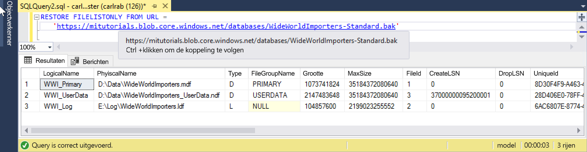

# <a name="quickstart-restore-a-database-to-a-managed-instance"></a>Quickstart: Een database herstellen naar een beheerd exemplaar 

In deze snelstart gebruikt u SQL Server Management Studio (SSMS) om een database (het standaardback-upbestand van Wide World Importers) te herstellen van Azure Blob Storage naar een [beheerd exemplaar](https://docs.microsoft.com/azure/sql-database/sql-database-managed-instance) voor Azure SQL Database. 

> [!VIDEO https://www.youtube.com/embed/RxWYojo_Y3Q]

> [!NOTE]
> * Zie [Managed Instance migration using DMS](../dms/tutorial-sql-server-to-managed-instance.md) (Migratie van een beheerd exemplaar via DMS) voor meer informatie over migratie met behulp van de Azure Database Migration Service (DMS). 
> * Zie [Migratie van SQL Server-exemplaar naar beheerd exemplaar voor Azure SQL Database](sql-database-managed-instance-migrate.md) voor meer informatie over de diverse migratiemethoden.

## <a name="prerequisites"></a>Vereisten

Voor deze snelstartgids geldt het volgende:
- Maakt gebruik van resources uit de snelstart [Een beheerd exemplaar maken](sql-database-managed-instance-get-started.md).
- De meest recente versie van [SQL Server Management Studio](https://docs.microsoft.com/sql/ssms/sql-server-management-studio-ssms) moet op uw computer zijn geïnstalleerd.
- Er moet gebruik worden gemaakt van SSMS voor verbinding met uw beheerde exemplaar. Raadpleeg de volgende snelstart voor het maken van verbinding:
  * [Verbinding maken met een Azure SQL Database Managed Instance vanaf een Azure-VM](sql-database-managed-instance-configure-vm.md)
  * [Een punt-naar-site-verbinding configureren naar een beheerd exemplaar voor Azure SQL Database van on-premises ](sql-database-managed-instance-configure-p2s.md).


> [!NOTE]
> Zie [Back-up van SQL Server naar URL](sql-database-managed-instance-get-started-restore.md) voor meer informatie over het maken van een back-up van een SQL Server-database met behulp van Azure Blob Storage en een [SAS-sleutel (Shared Access Signature)](https://docs.microsoft.com/azure/storage/common/storage-dotnet-shared-access-signature-part-1) en het herstellen van de back-up.

## <a name="restore-the-database-from-a-backup-file"></a>De database herstellen met een back-upbestand

Volg in SSMS deze stappen om de Wide World Importers-database te herstellen naar uw beheerde exemplaar. Het databaseback-upbestand wordt opgeslagen in een vooraf geconfigureerd Azure Blob Storage-account.

1. Open SMSS en maak verbinding met uw beheerde exemplaar.

2. Klik in het menu links met de rechtermuisknop op uw beheerde exemplaar en selecteer **Nieuwe query** om een nieuw queryvenster te openen.

3. Voer het volgende SQL-script uit. Dit maakt gebruik van een vooraf geconfigureerd opslagaccount en SAS-sleutel om [een referentie te maken](https://docs.microsoft.com/sql/t-sql/statements/create-credential-transact-sql?view=sql-server-2017) in uw beheerde exemplaar.

   ```sql
   CREATE CREDENTIAL [https://mitutorials.blob.core.windows.net/databases] 
   WITH IDENTITY = 'SHARED ACCESS SIGNATURE'
   , SECRET = 'sv=2017-11-09&ss=bfqt&srt=sco&sp=rwdlacup&se=2028-09-06T02:52:55Z&st=2018-09-04T18:52:55Z&spr=https&sig=WOTiM%2FS4GVF%2FEEs9DGQR9Im0W%2BwndxW2CQ7%2B5fHd7Is%3D' 
   ```

    

  
3. Voer het volgende script uit om uw referentie te controleren. Dit maakt gebruik van een [container](https://azure.microsoft.com/services/container-instances/)-URL voor het ophalen van een lijst met back-upbestanden.

   ```sql
   RESTORE FILELISTONLY FROM URL = 
      'https://mitutorials.blob.core.windows.net/databases/WideWorldImporters-Standard.bak'
   ```

    

4. Voer het volgende script uit om de Wide World Importers-database te herstellen.

   ```sql
   RESTORE DATABASE [Wide World Importers] FROM URL =
     'https://mitutorials.blob.core.windows.net/databases/WideWorldImporters-Standard.bak'
   ```

    

5. Voer het volgende script om de status van het herstellen te volgen.

   ```sql
   SELECT session_id as SPID, command, a.text AS Query, start_time, percent_complete
      , dateadd(second,estimated_completion_time/1000, getdate()) as estimated_completion_time 
   FROM sys.dm_exec_requests r 
   CROSS APPLY sys.dm_exec_sql_text(r.sql_handle) a 
   WHERE r.command in ('BACKUP DATABASE','RESTORE DATABASE')
   ```

6. Wanneer het herstellen is voltooid, bekijkt u het herstel in Objectverkenner. 

## <a name="next-steps"></a>Volgende stappen

- Zie [SQL Server Backup to URL Best Practices and Troubleshooting](https://docs.microsoft.com/sql/relational-databases/backup-restore/sql-server-backup-to-url-best-practices-and-troubleshooting) (Aanbevolen procedures en probleemoplossing voor back-up van SQL Server naar URL) voor het oplossen van problemen met een back-up naar een URL.
- Zie [Uw toepassingen verbinding laten maken met Managed Instance](sql-database-managed-instance-connect-app.md) voor een overzicht van de verbindingsopties voor toepassingen.
- Voor informatie over het uitvoeren van een query met een van uw favoriete hulpprogramma's of talen, raadpleegt u [Snelstarts: verbinding maken met Azure SQL-database en hierop query's uitvoeren](sql-database-connect-query.md).
