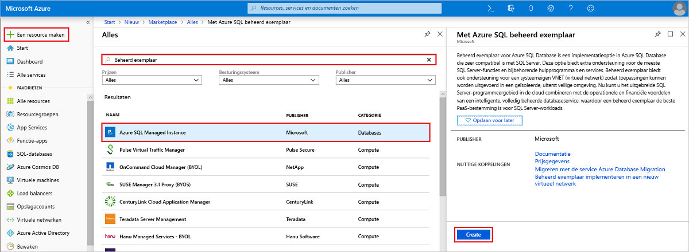
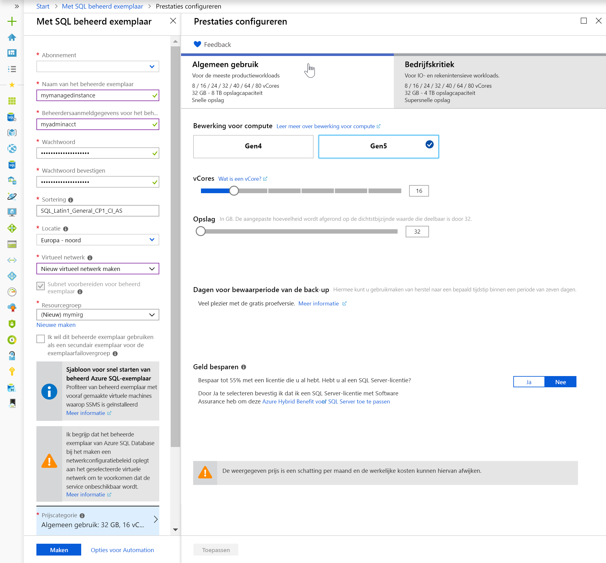
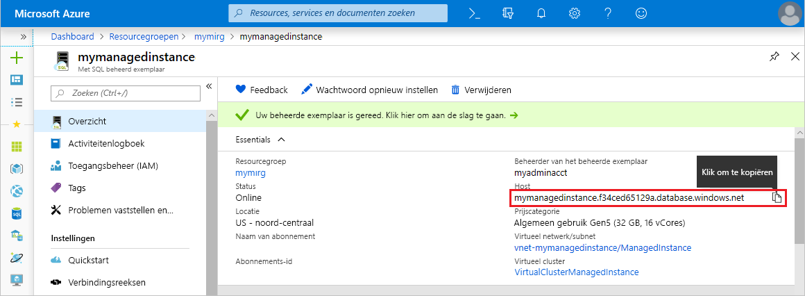

# Snelstart: Een beheerd exemplaar van een Azure SQL-database maken

In deze snelstartgids leert u hoe u een [beheerd exemplaar](sql-database-managed-instance.md) van een Azure SQL-database maakt in de Azure-portal.

Als u geen abonnement op Azure hebt, maakt u een [gratis account](https://azure.microsoft.com/free/) voordat u begint.

## Aanmelden bij Azure Portal

Meld u aan bij [Azure Portal](https://portal.azure.com/).

## Een beheerd exemplaar maken

In de volgende stappen wordt uitgelegd hoe u een beheerd exemplaar maakt.

1. Kies in de linkerbovenhoek van Azure Portal **Een resource maken**.
2. Zoek naar **Managed Instance** en selecteer vervolgens **Azure SQL Managed Instance**.
3. Selecteer **Maken**.

   

4. Vul het formulier voor het **beheerde exemplaar** in met behulp van de gegevens in onderstaande tabel:

   | Instelling| Voorgestelde waarde | Beschrijving |
   | ------ | --------------- | ----------- |
   | **Abonnement** | Uw abonnement | Een abonnement met toestemming voor het maken van nieuwe resources. |
   |**Naam van het beheerde exemplaar**|Een geldige naam|Zie [Naming conventions](https://docs.microsoft.com/azure/architecture/best-practices/naming-conventions) (Naamgevingsconventies) voor geldige namen.|
   |**Beheerdersaanmeldgegevens voor het beheerde exemplaar**|Een geldige gebruikersnaam|Zie [Naming conventions](https://docs.microsoft.com/azure/architecture/best-practices/naming-conventions) (Naamgevingsconventies) voor geldige namen. Maak geen gebruik van 'serverbeheerder' aangezien dit een rol is die op serverniveau is gereserveerd.|
   |**Wachtwoord**|Een geldig wachtwoord|Het wachtwoord moet minstens 16 tekens lang zijn en moet voldoen aan de [gedefinieerde complexiteitsvereisten](../virtual-machines/windows/faq.md#what-are-the-password-requirements-when-creating-a-vm).|
   |**Locatie**|De locatie waarop u het beheerde exemplaar wilt maken|Zie [Azure-regio's](https://azure.microsoft.com/regions/) voor informatie over regio's.|
   |**Virtueel netwerk**|Selecteer **Nieuw virtueel netwerk maken** of een virtueel netwerk dat u eerder hebt gemaakt in de resourcegroep die u eerder hebt opgegeven op dit formulier.| Als u een virtueel netwerk voor een beheerd exemplaar wilt configureren met aangepaste instellingen, leest u [SQL Managed Instance Virtual Network Environment](https://github.com/Azure/azure-quickstart-templates/tree/master/101-sql-managed-instance-azure-environment) in Github. Zie [Een VNet configureren voor een beheerd exemplaar van Azure SQL Database](sql-database-managed-instance-vnet-configuration.md) voor informatie over de vereisten voor het configureren van de netwerkomgeving voor een beheerd exemplaar. |
   |**Resourcegroep**|Een nieuwe of bestaande resourcegroep|Zie [Naming conventions](https://docs.microsoft.com/azure/architecture/best-practices/naming-conventions) (Naamgevingsconventies) voor geldige resourcegroepnamen.|

   

5. Voor gebruik van het beheerde exemplaar als secundaire Exemplaarfailovergroep selecteert u het uitchecken en geeft u het beheerde exemplaar DnsAzurePartner op. Deze functie is beschikbaar als preview en wordt niet weergegeven in de bijbehorende schermafbeelding.
6. Selecteer **Prijscategorie** om reken- en opslagresources toe te wijzen en de opties voor prijscategorieën te bekijken. De prijscategorie voor algemeen gebruik met 32 GB geheugen en 16 vCores is de standaardwaarde.
7. Gebruik de schuifregelaars of tekstvakken om de hoeveelheid opslagruimte en het aantal virtuele kernen op te geven.
8. Wanneer u klaar bent, kiest u **Toepassen** om uw selectie op te slaan.  
9. Selecteer **Maken** om het beheerde exemplaar te implementeren.
10. Selecteer het pictogram voor **Meldingen** om de status van de implementatie te bekijken.

    

11. Selecteer **Implementatie wordt uitgevoerd** om het venster Beheerd exemplaar te openen. Hier kunt u details van de voortgang van de implementatie controleren.

> [!IMPORTANT]
> Het eerste exemplaar in een subnet kent doorgaans een veel langere implementatietijd dan volgende exemplaren. Annuleer de implementatiebewerking niet omdat deze langer duurt dan verwacht. Het maken van het tweede beheerde exemplaar in het subnet duurt maar een paar minuten.

## Resources controleren en de volledig gekwalificeerde servernaam ophalen

Als de implementatie is voltooid, controleert u de resources die zijn gemaakt en haalt u de volledig gekwalificeerde servernaam op voor gebruik in latere snelstartgidsen.

1. Open de resourcegroep voor uw beheerde exemplaar opent en bekijk de resources die voor u zijn gemaakt in de snelstartgids [Een Azure SQL Managed Instance maken](#create-a-managed-instance).

2. Selecteer uw beheerd exemplaar.

   

3. Zoek op het tabblad **Overzicht** de eigenschap **Host** en kopieer het volledig gekwalificeerde hostadres voor het beheerde exemplaar.

   

   De naam ziet er als volgt uit: **naam_van_uw_machine.a1b2c3d4e5f6.database.windows.net**.

## Volgende stappen

- Zie de volgende onderwerpen voor meer informatie over het maken van verbinding met een beheerd exemplaar:
  - Zie [Verbinding maken tussen uw toepassing en het beheerde exemplaar van Azure SQL Database](sql-database-managed-instance-connect-app.md) voor een overzicht van de verbindingsopties voor toepassingen.
  - Zie [Een verbinding vanaf een virtuele Azure-machine configureren](sql-database-managed-instance-configure-vm.md) voor een snelstartgids over het verbinding maken met een beheerd exemplaar vanaf een virtuele Azure-machine.
  - Zie [Een punt-naar-site-verbinding naar een Azure SQL Database Managed Instance van on-premises configureren](sql-database-managed-instance-configure-p2s.md) voor een snelstartgids over het verbinding maken met een beheerd exemplaar vanaf een on-premises clientcomputer met behulp van een punt-naar-site-verbinding.
- Als u een bestaande SQL Server-database van on-premises wilt herstellen naar een beheerd exemplaar, kunt u de [Azure Database Migration Service (DMS) voor migratie](../dms/tutorial-sql-server-to-managed-instance.md) gebruiken om de database terug te zetten vanuit een back-upbestand van de database. U gebruikt de opdracht [T-SQL RESTORE](sql-database-managed-instance-get-started-restore.md) als u de database wilt terugzetten vanuit een back-upbestand van de database.
- Zie [Azure SQL Database controleren met Azure SQL Analytics](../azure-monitor/insights/azure-sql.md) voor geavanceerde controle van de databaseprestaties van het beheerde exemplaar met ingebouwde intelligentie voor het oplossen van problemen
