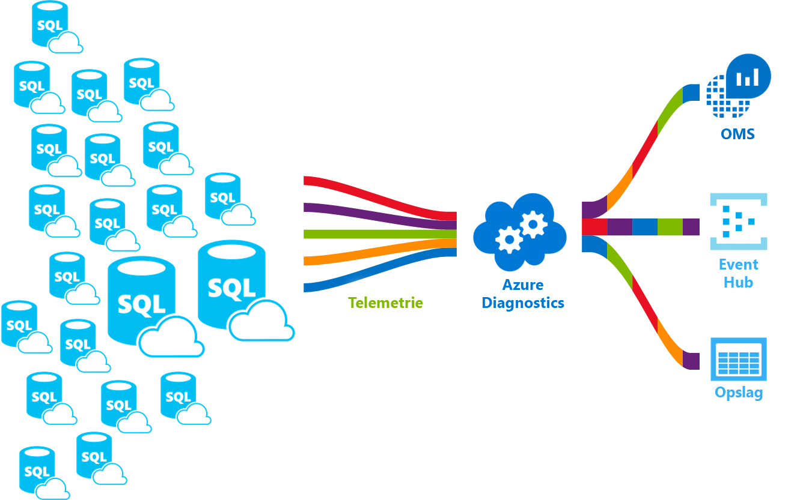

# <a name="azure-sql-database-metrics-and-diagnostics-logging"></a>Azure SQL Database metrische gegevens en logboekregistratie van diagnostische gegevens 
Azure SQL Database kunt verzenden metrische gegevens en diagnostische logboeken voor het bewaken van eenvoudiger. U kunt SQL Database configureren voor het opslaan van resourcegebruik, werkrollen en sessies, en connectiviteit in een van deze Azure-resources:

* **Azure Storage**: gebruikt voor het archiveren van de enorme hoeveelheden telemetrie voor een kleine prijs.
* **Azure Event Hubs**: gebruikt voor de SQL-Database telemetrie integratie met uw aangepaste bewakingsoplossing of hot pijplijnen.
* **Azure Log Analytics**: gebruikt voor een out-of-the-box-bewakingsoplossing met rapportage, waarschuwingen en beperkende mogelijkheden.

    

## <a name="enable-logging"></a>Logboekregistratie inschakelen

Metrische gegevens en diagnostische logboekregistratie is standaard niet ingeschakeld. U kunt inschakelen en beheren van metrische gegevens en diagnostische logboekregistratie met behulp van een van de volgende methoden:

- Azure Portal
- PowerShell
- Azure CLI
- Monitor voor Azure REST-API 
- Azure Resource Manager-sjabloon

Wanneer u metrische gegevens en logboekregistratie van diagnostische gegevens inschakelen, moet u het opgeven van de Azure-resource waar de geselecteerde gegevens worden verzameld. Beschikbare opties zijn:

- Log Analytics
- Event Hubs
- Storage 

U kunt inrichten van een nieuwe Azure resource of Selecteer een bestaande resource. Na het selecteren van de opslagbronnen, moet u opgeven welke gegevens worden verzameld. Beschikbare opties zijn:

- [Alle metrische gegevens](sql-database-metrics-diag-logging.md#all-metrics): bevat DTU-percentage, DTU limiet, CPU-percentage fysieke gegevens gelezen percentage, logboek schrijven percentage, mislukt-geslaagd/geblokkeerd door de firewall-verbindingen, sessies percentage, werknemers percentage, opslag, opslagpercentage , en het percentage voor XTP-opslag.
- [QueryStoreRuntimeStatistics](sql-database-metrics-diag-logging.md#query-store-runtime-statistics): bevat informatie over de query-runtime-statistieken, zoals de duur van de CPU-gebruik en de query.
- [QueryStoreWaitStatistics](sql-database-metrics-diag-logging.md#query-store-wait-statistics): bevat informatie over de statistieken van de wachttijd query, dit geeft aan wat uw query's gewacht op, zoals CPU, het logboek en VERGRENDELEN.
- [Fouten](sql-database-metrics-diag-logging.md#errors-dataset): bevat informatie over SQL-fouten die hebben plaatsgevonden om op deze database.
- [DatabaseWaitStatistics](sql-database-metrics-diag-logging.md#database-waits-dataset): bevat informatie over hoeveel tijd een database die is doorgebracht wachten op een andere wacht typen.
- [Time-outs](sql-database-metrics-diag-logging.md#timeouts-dataset): bevat informatie over time-outs die hebben plaatsgevonden voor een database.
- [Blockings](sql-database-metrics-diag-logging.md#blockings-dataset): bevat informatie over het blokkeren van gebeurtenissen die hebben plaatsgevonden voor een database.
- [SQLInsights](sql-database-metrics-diag-logging.md#intelligent-insights-dataset): Intelligent Insights bevat. [Meer informatie over Intelligent Insights](sql-database-intelligent-insights.md).

Als u Event Hubs of een opslagaccount selecteert, kunt u een bewaarbeleid opgeven. Dit beleid verwijdert de gegevens die ouder is dan een geselecteerde periode. Als u Log Analytics opgeeft, is het bewaarbeleid voor afhankelijk van de geselecteerde prijscategorie. Zie voor meer informatie [logboekanalyse prijzen](https://azure.microsoft.com/pricing/details/log-analytics/). 

Voor informatie over het inschakelen van logboekregistratie en begrijpen van de metrische gegevens en logboekbestanden categorieën die worden ondersteund door de verschillende Azure-services, raden we aan dat u leest: 

* [Overzicht van metrische gegevens in Microsoft Azure](../monitoring-and-diagnostics/monitoring-overview-metrics.md)
* [Overzicht van Azure diagnostics-Logboeken](../monitoring-and-diagnostics/monitoring-overview-of-diagnostic-logs.md) 

### <a name="azure-portal"></a>Azure Portal

1. Om metrische gegevens en diagnostische logboeken-verzameling in de portal, gaat u naar de SQL-Database of de elastische groep pagina en selecteer vervolgens **diagnostische instellingen**.

   

2. Maken van nieuwe of bestaande diagnostische instellingen bewerken door het doel en de telemetrie te selecteren.

   

### <a name="powershell"></a>PowerShell

Gebruik de volgende opdrachten zodat metrische gegevens en diagnostische logboekregistratie met behulp van PowerShell:

- Om opslag van diagnostische logboeken in een opslagaccount, gebruikt u deze opdracht:

   ```powershell
   Set-AzureRmDiagnosticSetting -ResourceId [your resource id] -StorageAccountId [your storage account id] -Enabled $true
   ```

   De storage-account-ID is de resource-ID voor het opslagaccount waar u de logboeken verzenden.

- Om streaming van diagnostische logboeken naar een event hub, gebruikt u deze opdracht:

   ```powershell
   Set-AzureRmDiagnosticSetting -ResourceId [your resource id] -ServiceBusRuleId [your service bus rule id] -Enabled $true
   ```

   De regel-ID van Azure Service Bus is een tekenreeks met deze indeling:

   ```powershell
   {service bus resource ID}/authorizationrules/{key name}
   ``` 

- Als u wilt verzenden diagnostische logboeken naar een werkruimte voor logboekanalyse inschakelen, gebruikt u deze opdracht:

   ```powershell
   Set-AzureRmDiagnosticSetting -ResourceId [your resource id] -WorkspaceId [resource id of the log analytics workspace] -Enabled $true
   ```

- U kunt de bron-ID van de werkruimte voor logboekanalyse verkrijgen via de volgende opdracht:

   ```powershell
   (Get-AzureRmOperationalInsightsWorkspace).ResourceId
   ```

U kunt deze parameters zodat meerdere uitvoeropties combineren.

### <a name="to-configure-multiple-azure-resources"></a>Meerdere Azure-resources configureren

Gebruik de PowerShell-script uit ter ondersteuning van meerdere abonnementen [inschakelen Azure resource metrische gegevens logboekregistratie met behulp van PowerShell](https://blogs.technet.microsoft.com/msoms/2017/01/17/enable-azure-resource-metrics-logging-using-powershell/).

Geef de werkruimte resource-ID &lt;$WSID&gt; als parameter bij het uitvoeren van het script (Enable-AzureRMDiagnostics.ps1) voor het verzenden van diagnostische gegevens van meerdere resources in de werkruimte. De werkruimte-ID ophalen &lt;$WSID&gt; als u wilt dat u diagnostische gegevens verzenden wilt, vervangt &lt;subID&gt; vervangen met de abonnements-ID &lt;RG_NAME&gt; met de naam van de resourcegroep, en vervang &lt;WS_NAME&gt; met de naam van de werkruimte in het volgende script.

- Gebruik de volgende opdrachten voor het configureren van meerdere Azure-resources:

    ```powershell
    PS C:\> $WSID = "/subscriptions/<subID>/resourcegroups/<RG_NAME>/providers/microsoft.operationalinsights/workspaces/<WS_NAME>"
    PS C:\> .\Enable-AzureRMDiagnostics.ps1 -WSID $WSID
    ```

### <a name="azure-cli"></a>Azure CLI

Om in te schakelen metrische gegevens en diagnostische logboekregistratie met behulp van de Azure CLI, gebruik de volgende opdrachten:

- Om opslag van diagnostische logboeken in een opslagaccount, gebruikt u deze opdracht:

   ```azurecli-interactive
   azure insights diagnostic set --resourceId <resourceId> --storageId <storageAccountId> --enabled true
   ```

   De storage-account-ID is de resource-ID voor het opslagaccount waar u de logboeken verzenden.

- Om streaming van diagnostische logboeken naar een event hub, gebruikt u deze opdracht:

   ```azurecli-interactive
   azure insights diagnostic set --resourceId <resourceId> --serviceBusRuleId <serviceBusRuleId> --enabled true
   ```

   De regel-ID van Service Bus is een tekenreeks met deze indeling:

   ```azurecli-interactive
   {service bus resource ID}/authorizationrules/{key name}
   ```

- Als u wilt verzenden diagnostische logboeken naar een werkruimte voor logboekanalyse inschakelen, gebruikt u deze opdracht:

   ```azurecli-interactive
   azure insights diagnostic set --resourceId <resourceId> --workspaceId <resource id of the log analytics workspace> --enabled true
   ```

U kunt deze parameters zodat meerdere uitvoeropties combineren.

### <a name="rest-api"></a>REST API

Meer informatie over het [diagnostische instellingen wijzigen met behulp van de REST-API van Azure Monitor](https://msdn.microsoft.com/library/azure/dn931931.aspx). 

### <a name="resource-manager-template"></a>Resource Manager-sjabloon

Meer informatie over het [diagnostische instellingen bij het maken van de resource inschakelen met behulp van een Resource Manager-sjabloon](../monitoring-and-diagnostics/monitoring-enable-diagnostic-logs-using-template.md). 

## <a name="stream-into-log-analytics"></a>Stream in Log Analytics 
De logboeken van de metrische gegevens en diagnostische gegevens van de SQL-Database kunnen worden gestreamd naar logboekanalyse met behulp van de ingebouwde **verzenden met logboekanalyse** optie in de portal. U kunt Log Analytics inschakelen met behulp van een instelling diagnostische gegevens via PowerShell-cmdlets, de Azure CLI of de Monitor REST-API van Azure.

### <a name="installation-overview"></a>Installatie-overzicht

Bewaking van een wagenpark SQL-Database is heel eenvoudig met logboekanalyse. Er zijn drie stappen vereist:

1. Maak een Log Analytics-resource.

2. Configureer de databases in de record metrische gegevens en diagnostische logboeken in de Log Analytics-bron die u hebt gemaakt.

3. Installeer de **Azure SQL Analytics** oplossing uit de galerie in logboekanalyse.

### <a name="create-a-log-analytics-resource"></a>Een Log Analytics-resource maken

1. Selecteer **nieuw** in het menu aan de linkerkant.

2. Selecteer **bewaking + Management**.

3. Selecteer **Log Analytics**.

4. Vul het formulier logboekanalyse met de aanvullende informatie die is vereist: werkruimtenaam, abonnement, resourcegroep, locatie en prijscategorie.

   

### <a name="configure-databases-to-record-metrics-and-diagnostics-logs"></a>In de record metrische gegevens en diagnostische logboeken-databases configureren

De eenvoudigste manier om te configureren waarin de hun metrische gegevens voor het registreren van databases is via de Azure portal. Ga naar de bron van de SQL-Database in de portal en selecteer **diagnostische instellingen**. 

### <a name="install-the-sql-analytics-solution-from-the-gallery"></a>Installeer de SQL-Analytics-oplossing uit de galerie

1. Nadat u de bron Log Analytics maakt en uw gegevens die in deze binnenkomen is, installeert u de SQL-Analytics-oplossing. Selecteer op de pagina van de Operations Management Suite thuis in het menu aan clientzijde **galerie met oplossingen**. Selecteer in de galerie, de **Azure SQL Analytics** oplossing en selecteer **toevoegen**.

   

2. Op de startpagina van de Operations Management Suite de **Azure SQL Analytics** tegel wordt weergegeven. Selecteer deze tegel om de SQL-Analytics dashboard te openen.

### <a name="use-the-sql-analytics-solution"></a>Gebruik de SQL-Analytics-oplossing

SQL-Analytics is een hiërarchische dashboard waarmee u de hiërarchie van SQL Database-resources te doorlopen. Zie voor meer informatie over het gebruik van de SQL-Analytics-oplossing, [Monitor SQL-Database met behulp van de SQL-Analytics-oplossing](../log-analytics/log-analytics-azure-sql.md).

## <a name="stream-into-event-hubs"></a>Stream in Event Hubs

De logboeken van de metrische gegevens en diagnostische gegevens van de SQL-Database kunnen worden gestreamd naar Event Hubs met behulp van de ingebouwde **Stream naar een event hub** optie in de portal. U kunt de regel-ID van Service Bus ook inschakelen met behulp van een instelling diagnostische gegevens via PowerShell-cmdlets, de Azure CLI of de Monitor REST-API van Azure. 

### <a name="what-to-do-with-metrics-and-diagnostics-logs-in-event-hubs"></a>Wat te doen met metrische gegevens en diagnostische gegevens geregistreerd in Event Hubs
Wanneer de geselecteerde gegevens gestreamd in Event Hubs, bent u een stap dichter in geavanceerde bewakingsscenario's inschakelen. Event Hubs fungeert als de deur van een gebeurtenispijplijn. Nadat de gegevens worden verzameld in een event hub, kan deze worden omgezet en opgeslagen met behulp van een realtime-analyseprovider of batchverwerking/opslagadapters. Event Hubs worden losgekoppeld van de productie van een stream van gebeurtenissen van het gebruik van deze gebeurtenissen. Op deze manier gebeurtenisconsumers toegang tot de gebeurtenissen op basis van hun eigen planning. Zie voor meer informatie over Event Hubs:

- [Wat is Azure Event Hubs?](../event-hubs/event-hubs-what-is-event-hubs.md)
- [Aan de slag met Event Hubs](../event-hubs/event-hubs-csharp-ephcs-getstarted.md)


Hier volgen enkele manieren waarop u de mogelijkheid streaming mogelijk gebruiken:

* **Servicestatus weergeven door het streamen van gegevens met Power BI hot pad**. U kunt eenvoudig uw metrische gegevens en diagnostische gegevens in bijna realtime-inzichten aan uw Azure-services met behulp van Event Hubs, Stream Analytics en Power BI, transformeren. Zie voor een overzicht van het instellen van een event hub, gegevens over het installatieproces met Stream Analytics en gebruik Power BI als uitvoer gebruikt, [Stream Analytics en Power BI](../stream-analytics/stream-analytics-power-bi-dashboard.md).

* **Logboeken naar derden logboekregistratie en telemetrie stromen stream**. Met behulp van streaming van Event Hubs, kunt u uw metrische gegevens en diagnostische logboeken in andere oplossingen van derden bewaking en log analytics ophalen. 

* **Maken van een aangepaste Telemetrie en logboekregistratie platform**. Als u al hebt een op maat gemaakte telemetrie-platform of overweegt een bouwen, zeer schaalbare voor publiceren / abonneren aard van Event Hubs kunt u logboeken met diagnostische gegevens flexibel opnemen. Zie [Dan Rosanova van handleiding voor het gebruik van Event Hubs in een platform wereldwijde schaal telemetrie](https://azure.microsoft.com/documentation/videos/build-2015-designing-and-sizing-a-global-scale-telemetry-platform-on-azure-event-Hubs/).

## <a name="stream-into-storage"></a>Gegevensstroom naar de opslag

De logboeken van de metrische gegevens en diagnostische gegevens van de SQL-Database kunnen worden opgeslagen in de opslag met behulp van de ingebouwde **archiveren naar een opslagaccount** optie in de portal. U kunt ook de opslag via een instelling diagnostische gegevens via PowerShell-cmdlets, de Azure CLI of de Monitor REST-API van Azure inschakelen.

### <a name="schema-of-metrics-and-diagnostics-logs-in-the-storage-account"></a>Schema van de metrische gegevens en diagnostische gegevens geregistreerd in het opslagaccount

Na het instellen van de metrische gegevens en diagnostische gegevens verzamelen van Logboeken, wordt een storage-container gemaakt in het opslagaccount dat u hebt geselecteerd tijdens de eerste rijen van de gegevens beschikbaar zijn. De structuur van deze BLOB's is:

```powershell
insights-{metrics|logs}-{category name}/resourceId=/SUBSCRIPTIONS/{subscription ID}/ RESOURCEGROUPS/{resource group name}/PROVIDERS/Microsoft.SQL/servers/{resource_server}/ databases/{database_name}/y={four-digit numeric year}/m={two-digit numeric month}/d={two-digit numeric day}/h={two-digit 24-hour clock hour}/m=00/PT1H.json
```
    
Of gewoon meer:

```powershell
insights-{metrics|logs}-{category name}/resourceId=/{resource Id}/y={four-digit numeric year}/m={two-digit numeric month}/d={two-digit numeric day}/h={two-digit 24-hour clock hour}/m=00/PT1H.json
```

Bijvoorbeeld, een blobnaam voor alle metrische gegevens mogelijk:

```powershell
insights-metrics-minute/resourceId=/SUBSCRIPTIONS/s1id1234-5679-0123-4567-890123456789/RESOURCEGROUPS/TESTRESOURCEGROUP/PROVIDERS/MICROSOFT.SQL/ servers/Server1/databases/database1/y=2016/m=08/d=22/h=18/m=00/PT1H.json
```

Als u vastleggen van de gegevens uit de elastische groep wilt, is de blobnaam van de iets anders:

```powershell
insights-{metrics|logs}-{category name}/resourceId=/SUBSCRIPTIONS/{subscription ID}/ RESOURCEGROUPS/{resource group name}/PROVIDERS/Microsoft.SQL/servers/{resource_server}/ elasticPools/{elastic_pool_name}/y={four-digit numeric year}/m={two-digit numeric month}/d={two-digit numeric day}/h={two-digit 24-hour clock hour}/m=00/PT1H.json
```

### <a name="download-metrics-and-logs-from-storage"></a>Metrische gegevens en logboeken downloaden uit Storage

Meer informatie over hoe [metrische gegevens en diagnostische logboeken downloaden uit Storage](../storage/blobs/storage-dotnet-how-to-use-blobs.md#download-blobs).

## <a name="metrics-and-logs-available"></a>Metrische gegevens en logboeken beschikbaar

### <a name="all-metrics"></a>Alle metrische gegevens

|**Resource**|**Metrische gegevens**|
|---|---|
|Database|DTU-percentage DTU gebruikt, DTU limiet, CPU-percentage, fysieke gegevens gelezen percentage, logboek schrijven percentage, mislukt-geslaagd/geblokkeerd door de firewall-verbindingen, sessies percentage, werknemers percentage, opslag, opslagpercentage, XTP-opslagpercentage, en impassen |
|Elastische pool|percentage van de eDTU, eDTU gebruikt, eDTU limiet, CPU-percentage, fysieke gegevens gelezen percentage, logboek schrijven percentage, sessies percentage, werknemers percentage, opslag, opslagpercentage, opslaglimiet bereikt, XTP-opslagpercentage |
|||

### <a name="query-store-runtime-statistics"></a>Query Store runtime-statistieken

|Eigenschap|Beschrijving|
|---|---|
|TenantId|Uw tenant-ID.|
|SourceSystem|Altijd: Azure|
|TimeGenerated [UTC]|Tijdstempel wanneer het logboek is opgenomen.|
|Type|Altijd: AzureDiagnostics|
|ResourceProvider|Naam van de resourceprovider. Altijd: MICROSOFT. SQL|
|Category|De naam van de categorie. Altijd: QueryStoreRuntimeStatistics|
|OperationName|De naam van de bewerking. Altijd: QueryStoreRuntimeStatisticsEvent|
|Resource|De naam van de resource.|
|ResourceType|Naam van het brontype. Altijd: SERVERS/DATABASES|
|SubscriptionId|Abonnement-GUID die de database behoort.|
|ResourceGroup|Naam van de resourcegroep die de database behoort.|
|LogicalServerName_s|De naam van de server die de database behoort.|
|ElasticPoolName_s|Naam van de elastische groep waartoe de database behoort, indien van toepassing.|
|DatabaseName_s|De naam van de database.|
|ResourceId|Resource-URI.|
|query_hash_s|Query uitvoeren op hash.|
|query_plan_hash_s|Query-hash, plan.|
|statement_sql_handle_s|Instructie sql-ingang.|
|interval_start_time_d|Start datetimeoffset van het interval in aantal ticks van 1900-1-1.|
|interval_end_time_d|Beëindigen datetimeoffset van het aantal maatstreepjes van 1900-1-1-interval.|
|logical_io_writes_d|Totaal aantal logische i/o-schrijfbewerkingen.|
|max_logical_io_writes_d|Maximumaantal logische IO schrijft per uitvoering.|
|physical_io_reads_d|Totaal aantal fysieke i/o-leesbewerkingen.|
|max_physical_io_reads_d|Maximumaantal logische IO gelezen per uitvoering.|
|logical_io_reads_d|Totaal aantal logische i/o-leesbewerkingen.|
|max_logical_io_reads_d|Maximumaantal logische IO gelezen per uitvoering.|
|execution_type_d|Type van de uitvoering.|
|count_executions_d|Het aantal uitvoeringen van de query.|
|cpu_time_d|Totale CPU-tijd gebruikt door de query in microseconden.|
|max_cpu_time_d|Max CPU tijd consument door één uitvoering in microseconden.|
|dop_d|De som van de mate van parallelle uitvoering.|
|max_dop_d|Maximale mate van parallelle uitvoering gebruikt voor één uitvoering.|
|rowcount_d|Totaal aantal rijen dat wordt geretourneerd.|
|max_rowcount_d|Maximumaantal rijen dat wordt geretourneerd in één uitvoering.|
|query_max_used_memory_d|Totale hoeveelheid geheugen die wordt gebruikt in KB.|
|max_query_max_used_memory_d|Maximale hoeveelheid geheugen die wordt gebruikt door één uitvoering in KB.|
|duration_d|Totale uitvoeringstijd in microseconden.|
|max_duration_d|Maximale uitvoeringstijd van één uitvoering.|
|num_physical_io_reads_d|Totaal aantal fysieke leesbewerkingen.|
|max_num_physical_io_reads_d|Max.aantal fysieke leesbewerkingen per uitvoering.|
|log_bytes_used_d|Totale hoeveelheid logboek bytes dat wordt gebruikt.|
|max_log_bytes_used_d|Maximale hoeveelheid logboek bytes per uitvoering gebruikt.|
|query_id_d|ID van de query in Query Store.|
|plan_id_d|ID van het plan in Query Store.|

Meer informatie over [gegevens Query Store runtime-statistieken](https://docs.microsoft.com/sql/relational-databases/system-catalog-views/sys-query-store-runtime-stats-transact-sql).

### <a name="query-store-wait-statistics"></a>Query Store wacht statistieken

|Eigenschap|Beschrijving|
|---|---|
|TenantId|Uw tenant-ID.|
|SourceSystem|Altijd: Azure|
|TimeGenerated [UTC]|Tijdstempel wanneer het logboek is opgenomen.|
|Type|Altijd: AzureDiagnostics|
|ResourceProvider|Naam van de resourceprovider. Altijd: MICROSOFT. SQL|
|Category|De naam van de categorie. Altijd: QueryStoreWaitStatistics|
|OperationName|De naam van de bewerking. Altijd: QueryStoreWaitStatisticsEvent|
|Resource|De naam van de resource|
|ResourceType|Naam van het brontype. Altijd: SERVERS/DATABASES|
|SubscriptionId|Abonnement-GUID die de database behoort.|
|ResourceGroup|Naam van de resourcegroep die de database behoort.|
|LogicalServerName_s|De naam van de server die de database behoort.|
|ElasticPoolName_s|Naam van de elastische groep waartoe de database behoort, indien van toepassing.|
|DatabaseName_s|De naam van de database.|
|ResourceId|Resource-URI.|
|wait_category_s|De categorie van de wachttijd.|
|is_parameterizable_s|Is de query worden gebruikt als parameter.|
|statement_type_s|Type van de instructie.|
|statement_key_hash_s|Hash van de sleutel van de instructie.|
|exec_type_d|Type van de uitvoering.|
|total_query_wait_time_ms_d|Totale wachttijd van de query op de specifieke wait-categorie.|
|max_query_wait_time_ms_d|Maximale wachttijd van de query in afzonderlijke uitvoering in de categorie specifieke wacht.|
|query_param_type_d|0|
|query_hash_s|Query uitvoeren op de hash in Query Store.|
|query_plan_hash_s|Query plan hash in Query Store.|
|statement_sql_handle_s|Instructie-ingang in Query Store.|
|interval_start_time_d|Start datetimeoffset van het interval in aantal ticks van 1900-1-1.|
|interval_end_time_d|Beëindigen datetimeoffset van het aantal maatstreepjes van 1900-1-1-interval.|
|count_executions_d|Het aantal uitvoeringen van de query.|
|query_id_d|ID van de query in Query Store.|
|plan_id_d|ID van het plan in Query Store.|

Meer informatie over [Query Store wacht statistiekgegevens](https://docs.microsoft.com/sql/relational-databases/system-catalog-views/sys-query-store-wait-stats-transact-sql).

### <a name="errors-dataset"></a>De dataset fouten

|Eigenschap|Beschrijving|
|---|---|
|TenantId|Uw tenant-ID.|
|SourceSystem|Altijd: Azure|
|TimeGenerated [UTC]|Tijdstempel wanneer het logboek is opgenomen.|
|Type|Altijd: AzureDiagnostics|
|ResourceProvider|Naam van de resourceprovider. Altijd: MICROSOFT. SQL|
|Category|De naam van de categorie. Altijd: fouten|
|OperationName|De naam van de bewerking. Altijd: ErrorEvent|
|Resource|De naam van de resource|
|ResourceType|Naam van het brontype. Altijd: SERVERS/DATABASES|
|SubscriptionId|Abonnement-GUID die de database behoort.|
|ResourceGroup|Naam van de resourcegroep die de database behoort.|
|LogicalServerName_s|De naam van de server die de database behoort.|
|ElasticPoolName_s|Naam van de elastische groep waartoe de database behoort, indien van toepassing.|
|DatabaseName_s|De naam van de database.|
|ResourceId|Resource-URI.|
|Bericht|Foutbericht als tekst zonder opmaak.|
|user_defined_b|De gebruiker gedefinieerde fout bit is.|
|error_number_d|Foutcode.|
|Ernst|Ernst van de fout.|
|state_d|Status van de fout.|
|query_hash_s|Query-hash van de mislukte query, indien beschikbaar.|
|query_plan_hash_s|Query plan hash van de mislukte query, indien beschikbaar.|

Meer informatie over [SQL Server-foutberichten](https://msdn.microsoft.com/en-us/library/cc645603.aspx).

### <a name="database-wait-statistics-dataset"></a>Database wacht statistieken gegevensset

|Eigenschap|Beschrijving|
|---|---|
|TenantId|Uw tenant-ID.|
|SourceSystem|Altijd: Azure|
|TimeGenerated [UTC]|Tijdstempel wanneer het logboek is opgenomen.|
|Type|Altijd: AzureDiagnostics|
|ResourceProvider|Naam van de resourceprovider. Altijd: MICROSOFT. SQL|
|Category|De naam van de categorie. Altijd: DatabaseWaitStatistics|
|OperationName|De naam van de bewerking. Altijd: DatabaseWaitStatisticsEvent|
|Resource|De naam van de resource|
|ResourceType|Naam van het brontype. Altijd: SERVERS/DATABASES|
|SubscriptionId|Abonnement-GUID die de database behoort.|
|ResourceGroup|Naam van de resourcegroep die de database behoort.|
|LogicalServerName_s|De naam van de server die de database behoort.|
|ElasticPoolName_s|Naam van de elastische groep waartoe de database behoort, indien van toepassing.|
|DatabaseName_s|De naam van de database.|
|ResourceId|Resource-URI.|
|wait_type_s|De naam van het type wacht.|
|start_utc_date_t [UTC]|Begintijd van de periode wordt gemeten.|
|end_utc_date_t [UTC]|Einde van de periode tijd wordt gemeten.|
|delta_max_wait_time_ms_d|Maximale tijd per uitvoering gewacht|
|delta_signal_wait_time_ms_d|Totaal aantal signaal wachttijd.|
|delta_wait_time_ms_d|Totale wachttijd in de periode.|
|delta_waiting_tasks_count_d|Het aantal taken dat wachten.|

Meer informatie over [wacht statistieken van de database](https://docs.microsoft.com/sql/relational-databases/system-dynamic-management-views/sys-dm-os-wait-stats-transact-sql).

### <a name="time-outs-dataset"></a>Time-outs gegevensset

|Eigenschap|Beschrijving|
|---|---|
|TenantId|Uw tenant-ID.|
|SourceSystem|Altijd: Azure|
|TimeGenerated [UTC]|Tijdstempel wanneer het logboek is opgenomen.|
|Type|Altijd: AzureDiagnostics|
|ResourceProvider|Naam van de resourceprovider. Altijd: MICROSOFT. SQL|
|Category|De naam van de categorie. Altijd: time-outs|
|OperationName|De naam van de bewerking. Altijd: TimeoutEvent|
|Resource|De naam van de resource|
|ResourceType|Naam van het brontype. Altijd: SERVERS/DATABASES|
|SubscriptionId|Abonnement-GUID die de database behoort.|
|ResourceGroup|Naam van de resourcegroep die de database behoort.|
|LogicalServerName_s|De naam van de server die de database behoort.|
|ElasticPoolName_s|Naam van de elastische groep waartoe de database behoort, indien van toepassing.|
|DatabaseName_s|De naam van de database.|
|ResourceId|Resource-URI.|
|error_state_d|Status van foutcode.|
|query_hash_s|Query-hash, indien beschikbaar.|
|query_plan_hash_s|Query-hash plan, indien beschikbaar.|

### <a name="blockings-dataset"></a>Blockings gegevensset

|Eigenschap|Beschrijving|
|---|---|
|TenantId|Uw tenant-ID.|
|SourceSystem|Altijd: Azure|
|TimeGenerated [UTC]|Tijdstempel wanneer het logboek is opgenomen.|
|Type|Altijd: AzureDiagnostics|
|ResourceProvider|Naam van de resourceprovider. Altijd: MICROSOFT. SQL|
|Category|De naam van de categorie. Altijd: blokken|
|OperationName|De naam van de bewerking. Altijd: BlockEvent|
|Resource|De naam van de resource|
|ResourceType|Naam van het brontype. Altijd: SERVERS/DATABASES|
|SubscriptionId|Abonnement-GUID die de database behoort.|
|ResourceGroup|Naam van de resourcegroep die de database behoort.|
|LogicalServerName_s|De naam van de server die de database behoort.|
|ElasticPoolName_s|Naam van de elastische groep waartoe de database behoort, indien van toepassing.|
|DatabaseName_s|De naam van de database.|
|ResourceId|Resource-URI.|
|lock_mode_s|Vergrendelingsmodus wordt gebruikt door de query.|
|resource_owner_type_s|Eigenaar van de vergrendeling.|
|blocked_process_filtered_s|Proces rapport XML geblokkeerd.|
|duration_d|Duur van de vergrendeling in microseconden.|

### <a name="intelligent-insights-dataset"></a>Intelligent Insights gegevensset
Meer informatie over de [Intelligent Insights logboekindeling](sql-database-intelligent-insights-use-diagnostics-log.md).

## <a name="next-steps"></a>Volgende stappen

Voor informatie over het inschakelen van logboekregistratie en begrijpen van de metrische gegevens en logboekbestanden categorieën ondersteund door de verschillende Azure-services, lezen:

 * [Overzicht van metrische gegevens in Microsoft Azure](../monitoring-and-diagnostics/monitoring-overview-metrics.md)
 * [Overzicht van Azure diagnostics-Logboeken](../monitoring-and-diagnostics/monitoring-overview-of-diagnostic-logs.md)

Voor meer informatie over Event Hubs, lezen:

* [Wat is Azure Event Hubs?](../event-hubs/event-hubs-what-is-event-hubs.md)
* [Aan de slag met Event Hubs](../event-hubs/event-hubs-csharp-ephcs-getstarted.md)

Zie voor meer informatie over opslag, hoe [metrische gegevens en diagnostische logboeken downloaden uit Storage](../storage/blobs/storage-dotnet-how-to-use-blobs.md#download-blobs).
