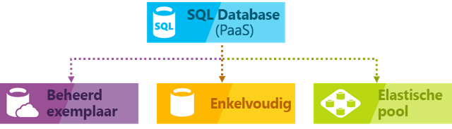

# Wat is Azure SQL Database-service?

SQL Database is een algemene, beheerde relationele databaseservice in Microsoft Azure die ondersteuning biedt voor structuren zoals relationele gegevens, JSON, ruimtelijke gegevens en XML. SQL Database biedt dynamisch schaalbare prestaties in twee verschillende aankopen modellen: een op vCore gebaseerde aankoopmodel en een op DTU gebaseerde aankoopmodel. SQL Database biedt ook opties zoals [columnstore-indexen](https://docs.microsoft.com/sql/relational-databases/indexes/columnstore-indexes-overview) voor krachtige analyses en rapportages, en [in-memory OLTP](sql-database-in-memory.md) voor veeleisende transactieverwerking. Microsoft verzorgt op naadloze wijze alle patching en updating van de SQL-codebasis en heeft het beheer van de onderliggende infrastructuur volledig weggewerkt.

> [!NOTE]
> Zie voor een verklarende woordenlijst van termen in Azure SQL Database, [SQL-Database verklarende woordenlijst](sql-database-glossary-terms.md)

Azure SQL Database biedt de volgende implementatieopties voor een Azure SQL-database:

- Als een [individuele database](sql-database-single-database.md) beheerd met een eigen set resources via een SQL Database-server. Een individuele database is vergelijkbaar met een [ingesloten databases](https://docs.microsoft.com/sql/relational-databases/databases/contained-databases) in SQL Server.
- Een [elastische pool](sql-database-elastic-pool.md), dit is een verzameling van databases met een gemeenschappelijke set bronnen die worden beheerd via een SQL Database-server. Individuele databases kunnen worden verplaatst naar en van een elastische pool.
- [Beheerd exemplaar](sql-database-managed-instance.md), dit is een verzameling van systeem en gebruikersdatabases met een gemeenschappelijke set bronnen. Een beheerd exemplaar is vergelijkbaar met een exemplaar van de [Microsoft SQL Server-database-engine](https://docs.microsoft.com/sql/sql-server/sql-server-technical-documentation).

In de volgende afbeelding worden deze implementatieopties weergegeven:

SQL Database deelt de codebasis met de [database-engine van Microsoft SQL Server](https://docs.microsoft.com/sql/sql-server/sql-server-technical-documentation). In het kader van de cloudstrategie van Microsoft worden nieuwe mogelijkheden van SQL Server eerst uitgebracht in SQL Database en vervolgens in SQL Server zelf. Dankzij deze aanpak kunt u beschikken over de nieuwste mogelijkheden van SQL Server zonder overhead voor patching en upgrading, en zijn de nieuwe functies getest op miljoenen databases. Ga voor informatie over aangekondigde nieuwe mogelijkheden naar:

- **[Azure-Roadmap voor SQL-Database](https://azure.microsoft.com/roadmap/?category=databases)**:

  Een plaats om te ontdekken wat is er nieuw is en wat binnenkort verschijnt.

- **[Azure SQL Database-blog](https://azure.microsoft.com/blog/topics/database)**:

  Een plaats waar SQL Server-productteam leden blog over SQL Database-nieuws en -functies.

> [!IMPORTANT]
> Zie voor meer informatie over de Functieverschillen tussen SQL Database en SQL Server, evenals de verschillen tussen de verschillende implementatieopties voor Azure SQL Database, [SQL-functies](sql-database-features.md).

SQL Database biedt voorspelbare prestaties met meerdere resourcetypen, service-lagen en compute-grootten die dynamische schaalbaarheid geen uitvaltijd, ingebouwde intelligente optimalisatie, wereldwijde schaalbaarheid en beschikbaarheid en geavanceerde beveiliging biedt opties, allemaal met praktisch zonder beheer. Dankzij deze mogelijkheden kunt u zich richten op het sneller ontwikkelen en op de markt brengen van apps, in plaats van kostbare tijd en middelen in te zetten voor het beheer van virtuele machines en infrastructuur. De SQL Database-service is momenteel beschikbaar in 38 datacenters over de hele wereld, en er komen er regelmatig meer bij. Dat betekent dat u uw database kunt uitvoeren in een datacenter bij u in de buurt.

## Schaalbare prestaties en pools

- Elke database is geïsoleerd van elkaar en draagbaar, elk met een eigen gegarandeerde hoeveelheid rekenkracht, geheugen en opslag met individuele databases. SQL Database biedt verschillende Reken-, geheugen- en storage-resources voor verschillende behoeften- en de mogelijkheid tot dynamisch [schalen van één database-resources](sql-database-single-database-scale.md) omhoog en omlaag. De [grootschalige servicelaag](sql-database-service-tier-hyperscale.md) (preview) voor individuele database kunt u schalen tot 100 TB, met snelle back-up en herstellen van de mogelijkheden.
- Met elastische pools kunt u nieuwe databases maken of verplaatsen van individuele databases in een resourcegroep voor het gebruik van resources maximaliseren en geld besparen- en de mogelijkheid om dynamisch [resources voor elastische pool schalen](sql-database-elastic-pool-scale.md) omhoog en omlaag.
- Met beheerde exemplaren is elk beheerde exemplaar geïsoleerd van andere exemplaren om zo gegarandeerde resources. Binnen een beheerd exemplaar, delen de exemplaar-databases een set resources- en de mogelijkheid om dynamisch [resources beheerd exemplaar schalen](sql-database-managed-instance-resource-limits.md) omhoog en omlaag.

U kunt uw eerste app ontwikkelen op een kleine, één database tegen lage kosten per maand in de categorie Algemeen gebruik-service en wijzig vervolgens de servicelaag handmatig of via een programma op elk gewenst moment in de servicelaag van zakelijke essentieel om te voldoen aan de behoeften van uw oplossing. U kunt het prestatieniveau aanpassen zonder uitvaltijd voor uw app of voor uw klanten. Dankzij dynamische schaalbaarheid kan uw database op een transparante manier snel reageren op veranderende resourcevereisten en betaalt u alleen voor de resources die u nodig hebt wanneer u ze nodig.

Dynamische schaalbaarheid is iets anders dan automatisch schalen. Automatisch schalen vindt plaats wanneer een service automatisch wordt geschaald op basis van criteria, terwijl u met dynamische schaalbaarheid handmatig kunt schalen zonder uitvaltijd. Een individuele database biedt ondersteuning voor handmatige dynamische schaalbaarheid, maar niet voor automatisch schalen. Voor een meer *automatische* ervaring zou u elastische pools kunnen gebruiken. Hiermee kunnen databases resources in een pool delen op basis van afzonderlijke databasebehoeften. Er zijn echter scripts die kunnen worden geautomatiseerd schaalbaarheid voor één database. Zie voor een voorbeeld [PowerShell gebruiken om te controleren en schalen van één database](scripts/sql-database-monitor-and-scale-database-powershell.md).

### Modellen, service-lagen, compute-grootten en hoeveelheden opslagruimte kopen

SQL Database biedt twee modellen met aanschaffen:

- De [DTU gebaseerde aankoopmodel](sql-database-service-tiers-dtu.md) biedt een combinatie van rekenkracht, geheugen, i/o-resources in drie Servicelagen voor lichte tot zware workloads van databases. COMPUTE-grootten in elke laag bieden een andere combinatie van deze resources, waaraan u extra opslagbronnen kunt toevoegen.
- De [vCore gebaseerde aankoopmodel](sql-database-service-tiers-vcore.md) kunt u het aantal vCores, het bedrag of geheugen, en de hoeveelheid en de snelheid van de opslag kiezen. Het op vCore gebaseerde aankoopmodel kunt u gebruiken [Azure Hybrid Benefit voor SQL Server](https://azure.microsoft.com/pricing/hybrid-benefit/) te krijgen van de kosten te besparen. Zie voor meer informatie over Azure Hybrid Benefit, [Veelgestelde vragen over](#sql-database-frequently-asked-questions-faq).

  > [!IMPORTANT]
  > De [grootschalige servicelaag](sql-database-service-tier-hyperscale.md) voor individuele databases is momenteel in openbare preview. Wordt niet aanbevolen om nog een productieworkload uitvoert in grootschalige databases. U kunt een grootschalige-database niet bijwerken naar een andere service-laag. Voor test-doeleinden, wordt aangeraden een kopie van de huidige database maken en bijwerken van de kopie naar grootschalige servicelaag.

### Elastische pools voor optimaal resourcegebruik

Voor veel bedrijven en toepassingen is het kunnen maken van enkele databases en het naar wens omhoog of omlaag schalen van de prestaties al voldoende, vooral als de gebruikspatronen redelijk voorspelbaar zijn. Bij onvoorspelbare gebruikspatronen kan het echter lastig zijn uw kosten en bedrijfsmodel effectief te beheren. [Elastische pools](sql-database-elastic-pool.md) zijn ontworpen om dit probleem te verhelpen. Het concept is eenvoudig. U wijst prestatieresources toe aan een pool in plaats van een individuele database en betaalt voor de collectieve prestatieresources van de pool in plaats van afzonderlijke databaseprestaties.

   

Met elastische pools hoeft u zich niet bezig te houden met het verhogen en verlagen van de databaseprestaties als de vraag naar resources fluctueert. De gepoolde databases maken naar behoefte gebruik van de prestatieresources van de elastische pool. Gepoolde databases tellen mee voor het verbruik tot het maximum voor de pool is bereikt. Zo blijven uw kosten voorspelbaar, ook al is uw gebruik van de individuele database dat niet. Bovendien kunt u [databases aan de groep toevoegen of eruit verwijderen](sql-database-elastic-pool-manage-portal.md). Zo kan uw app kan worden opgeschaald van een handjevol databases naar duizenden databases, allemaal binnen het budget dat u zelf bepaalt. U kunt ook de minimale en maximale beschikbare resources die voor databases beschikbaar zijn in de pool beheren om ervoor te zorgen dat er geen database in de pool is die alle poolresources gebruikt en dat elke gepoolde database een gegarandeerd minimum aan resources heeft. Zie [Design Patterns for Multi-tenant SaaS Applications with SQL Database](sql-database-design-patterns-multi-tenancy-saas-applications.md) (Ontwerppatronen voor multitenant SaaS-toepassingen met behulp van SQL Database) voor meer informatie over ontwerppatronen voor SaaS-toepassingen met elastische groepen.

Scripts kunnen helpen bij het bewaken en schalen van elastische pools. Zie [PowerShell gebruiken voor het controleren en schalen van een elastische SQL-pool in Azure SQL Database](scripts/sql-database-monitor-and-scale-pool-powershell.md) voor een voorbeeld

> [!IMPORTANT]
> Een beheerd exemplaar biedt geen ondersteuning voor elastische pools. In plaats daarvan wordt een beheerd exemplaar van een verzameling van exemplaar-databases met beheerd exemplaar resources delen.

### Individuele databases combineren met gepoolde databases

U kunt individuele databases combineren met elastische pools en de Servicelagen van individuele databases en elastische pools snel en eenvoudig aanpassen aan uw situatie. Dankzij de kracht en het bereik van Azure kunt u andere Azure-services combineren en integreren met SQL Database om te voldoen aan de behoeften voor uw unieke app-ontwerp, kosten te besparen en resources efficiënt te beheren. Daarnaast kunt u nieuwe zakelijke verkoopkansen creëren.

### Uitgebreide mogelijkheden voor bewaking en waarschuwingen

U maakt gebruik van de [ingebouwde hulpprogramma's voor prestatiebewaking](sql-database-performance.md) en [waarschuwingen](sql-database-insights-alerts-portal.md) in combinatie met de prestatiebeoordelingen. Met behulp van deze tools kunt u snel beoordelen wat de impact is van het aanpassen van de schaal op basis van uw huidige prestatiebehoeften of de prestatiebehoeften van uw project. Daarnaast kan SQL Database [metrische gegevens en diagnostische logboeken verzenden](sql-database-metrics-diag-logging.md) die de bewaking vergemakkelijken. U kunt SQL Database configureren voor het opslaan van resourcegebruik, werkrollen en sessies, en connectiviteit in een van deze Azure-resources:

- **Azure Storage**: Voor het archiveren van grote hoeveelheden telemetriegegevens voor een lage prijs
- **Azure Event Hub**: Voor het integreren van SQL Database-telemetrie in uw eigen bewakingsoplossing of actieve pijplijnen
- **Azure Log Analytics**: Voor een ingebouwde bewakingsoplossing met rapportages, waarschuwingen en risicobeperking mogelijkheden.

    

## Beschikbaarheid

In een traditionele SQL Server-omgeving, zijn er in het algemeen (minimaal) 2 machines lokaal ingesteld exacte (synchroon gehouden) kopieën van de gegevens (met functies zoals AlwaysOn-beschikbaarheidsgroepen of Failover Cluster Instances) om te beveiligen tegen een Fout van een enkele machine/component.  Dit zorgt voor hoge beschikbaarheid, maar biedt geen bescherming tegen een natuurramp vernietigen van uw datacenter.
 
Herstel na noodgevallen wordt ervan uitgegaan dat een catastrofale gebeurtenis geografisch worden gelokaliseerd voldoende om het te ver hebben van een andere computer/set van computers met een kopie van uw gegevens.  U kunt in SQL Server Always On Availability Groups in asynchrone modus gebruiken om op te halen van deze mogelijkheid.  De snelheid van lichte problemen betekent meestal dat mensen niet wilt wachten op replicatie om te voorkomen dat ver weg voordat het doorvoeren van een transactie, zodat er kans op gegevensverlies als u niet-geplande failovers uitvoeren.

Databases in de premium- en business kritieke service al lagen [iets vergelijkbaar doen](sql-database-high-availability.md#premium-and-business-critical-service-tier-availability) tot de synchronisatie van een beschikbaarheidsgroep. Redundantie voor databases in een lagere service-lagen via opslag met behulp van een [verschillend maar vergelijkbaar mechanisme](sql-database-high-availability.md#basic-standard-and-general-purpose-service-tier-availability). Er is een logica die tegen fouten in een enkele computer beschermt.  De functie van actieve geo-replicatie biedt u de mogelijkheid om te beveiligen tegen rampen waar een hele regio wordt vernietigd.

Azure Availability Zones is een afspelen op het probleem met hoge beschikbaarheid.  Probeert te beveiligen tegen de uitval van één datacentrum bouwen binnen één regio.  Ja, het bedrijf wil beveiligen tegen het verlies van kracht of het netwerk naar een gebouw. In SQL Azure, dit werkt door de verschillende replica's in verschillende beschikbaarheidszones (verschillende gebouwen, effectief) en anders werken als voorheen. 

In feite van Azure voor de bedrijfstak toonaangevende 99,99% beschikbaarheid serviceovereenkomst [(SLA)](https://azure.microsoft.com/support/legal/sla/), dankzij een wereldwijd netwerk van door Microsoft beheerde datacenters, helpt bij het beveiligen van uw app 24/7 wordt uitgevoerd. Het Azure-platform volledig elke database wordt beheerd en zonder verlies van gegevens en een hoog percentage van de beschikbaarheid van gegevens wordt gegarandeerd. Patches, back-ups, replicatie, foutdetectie, onderliggende potentiële hardware-, software- of netwerkfouten, de implementatie van bugfixes, failovers, database-upgrades en andere onderhoudstaken worden in Azure automatisch afgehandeld. Standaard-beschikbaarheid wordt bereikt door de lagen voor berekeningen en opslag te scheiden. Premium-beschikbaarheid wordt bereikt door de integratie van compute en opslag op een enkel knooppunt voor de prestaties en vervolgens implementeren technologie die vergelijkbaar is met Always On Availability Groups op de achtergrond. Zie voor een volledige beschrijving van de mogelijkheden voor hoge beschikbaarheid van Azure SQL Database, [beschikbaarheid van de SQL-Database](sql-database-high-availability.md). Daarnaast biedt SQL Database ingebouwde functies voor [bedrijfscontinuïteit en wereldwijde schaalbaarheid](sql-database-business-continuity.md), zoals:

- **[Automatische back-ups](sql-database-automated-backups.md)**:

  SQL-Database wordt automatisch uitgevoerd volledige, differentiële en transactielogboekback-ups van Azure SQL-databases waarmee u kunt herstellen naar een bepaald tijdstip. U kunt SQL-Database voor het opslaan van volledige databaseback-ups op Azure storage voor langetermijnretentie van back-up configureren voor individuele databases en gepoolde databases. Voor beheerde exemplaren, kunt u ook kopie-alleen back-ups voor langetermijnretentie van back-up uitvoeren.

- **[Point-in-time-herstelbewerkingen](sql-database-recovery-using-backups.md)**:

  Implementatieopties voor alle SQL-Database ondersteunt herstel naar ieder bepaald tijdstip dankzij de automatische back-up bewaarperiode voor een Azure SQL-database.
- **[Actieve geo-replicatie](sql-database-active-geo-replication.md)**:

  Individuele databases en gepoolde databases kunnen u maximaal vier leesbare secundaire databases configureren in ofwel de dezelfde of een wereldwijd gedistribueerde Azure-datacenters.  Als u bijvoorbeeld een SaaS-toepassing hebt met een catalogusdatabase met een groot volume aan gelijktijdige alleen-lezen transacties, kunt u actieve geo-replicatie gebruiken om het lezen wereldwijd te schalen en knelpunten weg te nemen die ontstaan door de lees-workloads op de primaire database. Voor beheerde exemplaren, automatische failover-groepen te gebruiken.
- **[Automatische failovergroepen](sql-database-auto-failover-group.md)**:

  Implementatieopties voor alle SQL-Database kunnen u failover-groepen gebruiken voor het inschakelen van hoge beschikbaarheid en taakverdeling op wereldwijde schaal, inclusief transparante geo-replicatie en failover van omvangrijke sets databases, elastische pools en beheerde exemplaren. Failover-groepen kunnen worden gemaakt van wereldwijd gedistribueerde SaaS-toepassingen met minimaal beheer overhead verlaten alle complexe bewaking, routering, en failover-indeling overlaat aan SQL-Database.
- **[Zone-redundante databases](sql-database-high-availability.md)**:

  SQL Database kunt inrichten premium of business-kritische databases of elastische pools in meerdere beschikbaarheidszones. Omdat deze databases en elastische pools meerdere redundante replica's hebben om een hoge beschikbaarheid te garanderen, biedt het plaatsen van deze replica's in meerdere beschikbaarheidszones betere weerbaarheid, inclusief de mogelijkheid om zonder verlies van gegevens automatisch te herstellen van schalingsfouten in het datacenter.

## Ingebouwde intelligentie

Met SQL Database beschikt u over ingebouwde intelligentie waarmee u de kosten van het uitvoeren en beheren van databases drastisch verlaagt en de prestaties en beveiliging van uw toepassing optimaliseert. SQL Database verwerkt 24 uur per dag miljoenen workloads van klanten en verzamelt en verwerkt daarbij enorme hoeveelheden telemetriegegevens, waarbij de privacy van klanten te allen tijde volledig wordt gerespecteerd. Er worden verschillen de algoritmen gebruikt om de telemetriegegevens continu te evalueren zodat de service zich kan aanpassen aan uw toepassing. Op basis van deze analyses stelt de service aanbevelingen op voor het verbeteren van de prestaties, afgestemd op uw specifieke workloads.

### Automatisch bewaking en afstemming van prestaties

SQL Database biedt gedetailleerde informatie over de query’s die u wilt bewaken. SQL Database leert uw databasepatronen zodat u uw databaseschema kunt aanpassen aan uw workload. SQL Database geeft [aanbevelingen voor het afstemmen van de prestaties](sql-database-advisor.md), waarmee u de aanbevolen acties kunt weergeven en uitvoeren.

Maar doorlopende databasebewaking is een moeilijke, tijdrovende taak, zeker wanneer het om vele databases gaat. Met [Intelligent Insights](sql-database-intelligent-insights.md) wordt deze taak automatisch voor u uitgevoerd door de prestaties van SQL Database op schaal automatisch te bewaken en u te informeren over problemen met prestatievermindering. Hierbij wordt de hoofdoorzaak van het probleem aangegeven. Indien mogelijk worden er ook aanbevelingen voor prestatieverbetering geboden.

Het is vrijwel onmogelijk om het beheer van enorme hoeveelheden databases op een efficiënte manier uit te voeren, zelfs met de hulpprogramma’s en rapporten van SQL Database en de Azure-portal. In plaats van het handmatig bewaken en afstemmen van uw database, kunt u overwegen sommige van deze taken over te laten aan SQL Database, met de functie voor [automatisch afstemmen](sql-database-automatic-tuning.md). Aanbevolen acties worden automatisch door SQL Database uitgevoerd, getest en geverifieerd om te garanderen dat de prestaties optimaal blijven. Op die manier past SQL Database zich automatisch op een gecontroleerde en veilige manier aan uw workloads aan. Automatische afstemming betekent dat de prestaties van uw database zorgvuldig worden bewaakt en vergeleken voor en na elke afstemactie. Als de prestaties niet zijn verbeterd, wordt de betreffende actie teruggedraaid.

Veel van onze partners die [multitenant SaaS-apps](sql-database-design-patterns-multi-tenancy-saas-applications.md) uitvoeren op SQL Database, vertrouwen al op deze automatische afstemming, zodat de prestaties van hun toepassingen altijd stabiel en voorspelbaar zijn. Dankzij deze functie wordt de kans op prestatieproblemen (op welk moment dan ook) aanzienlijk kleiner. En omdat een deel van hun klanten ook werkt met SQL Server, maken ze gebruik van dezelfde indexeringsaanbevelingen van SQL Database om hun klanten met SQL Server te helpen.

Er zijn twee automatisch afstemmingsmethoden [in SQL Database](sql-database-automatic-tuning.md):

- **Automatisch indexbeheer**: Hiermee worden indexen geïdentificeerd die moeten worden toegevoegd in uw database indexen die moeten worden verwijderd.
- **Automatische abonnementcorrectie**: Identificeert worden abonnementen met problemen geïdentificeerd en prestatieproblemen SQL-abonnementen opgelost (binnenkort beschikbaar, al beschikbaar in SQL Server 2017).

### Verwerking van adaptieve query’s

Er is ook een reeks functies voor de [verwerking van adaptieve query’s](/sql/relational-databases/performance/adaptive-query-processing) toegevoegd aan SQL Database, waaronder interleave-uitvoering van tabelfuncties met meerdere instructies, feedback over geheugentoekenning in batchmodus en adaptieve samenvoegingen in batchmodus. Elk van deze verwerkingsfuncties voor adaptieve query’s werkt met vergelijkbare technieken voor ‘leren en aanpassen’, voor het oplossen van prestatieproblemen die het gevolg zijn hardnekkige problemen met query-optimalisatie.

## Geavanceerde beveiliging en naleving van voorschriften

SQL Database biedt een reeks [ingebouwde functies voor beveiliging en naleving](sql-database-security-overview.md) zodat uw toepassing voldoet aan diverse vereisten op het gebied van beveiliging en de naleving van voorschriften.

### Advanced Threat Protection

Geavanceerde beveiliging is een geïntegreerde-pakket voor geavanceerde mogelijkheden voor de beveiliging van SQL. Het bevat functionaliteit voor het detecteren en classificeren van gevoelige gegevens, het beheren van beveiligingsproblemen in uw database, en het detecteren van afwijkende activiteiten die kunnen duiden op een bedreiging van de database. Het is tevens een centraal punt voor het inschakelen en beheren van deze mogelijkheden.

- [Gegevensdetectie en classificatie](sql-database-data-discovery-and-classification.md):

  Deze functie (momenteel in preview) biedt mogelijkheden van ingebouwd in Azure SQL Database voor het detecteren, classificeren, labelen en beveiligen van de gevoelige gegevens in uw databases. Het kan worden gebruikt voor het zichtbaar maken van de classificatiestatus van gegevens in uw database, en het traceren van de toegang tot gevoelige gegevens binnen en buiten de database.
- [Evaluatie van beveiligingsproblemen](sql-vulnerability-assessment.md):

  Deze service kunt detecteren, bijhouden, en kunt u potentiële databaseproblemen oplossen. Deze service biedt u inzicht in de status van de beveiliging en bruikbare stappen om beveiligingsproblemen op te lossen en de beveiliging van uw database te verbeteren.
- [Detectie van bedreigingen](sql-database-threat-detection.md):

  Deze functie detecteert afwijkende activiteiten die ongebruikelijke en potentieel schadelijke pogingen om toegang tot of misbruik te maken van uw database aangeeft. Hiermee wordt uw database continu gecontroleerd op verdachte activiteiten en wordt u onmiddellijk gewaarschuwd bij mogelijke beveiligingsproblemen, SQL-injectieaanvallen en afwijkende databasetoegangspatronen. Meldingen voor geconstateerde bedreigingen Geef details op van de verdachte activiteit en geven aanbevelingen voor het onderzoeken en tegenhouden.

### Controles voor naleving en beveiliging

[Controle](sql-database-auditing.md) databasegebeurtenissen bijgehouden en geschreven naar een auditlogboek in uw Azure storage-account. Dankzij controles kunt u zorgen voor naleving van wet- en regelgeving, krijgt u inzicht in de activiteit in uw database en in de afwijkingen en discrepanties die kunnen wijzen op problemen voor het bedrijf of vermoedelijke schendingen van de beveiliging.

### Gegevensversleuteling

SQL-Database beveiligt uw gegevens door te geven van versleuteling voor gegevens in beweging met [transport layer security](https://support.microsoft.com/kb/3135244), voor data-at-rest met [transparante gegevensversleuteling](https://docs.microsoft.com/sql/relational-databases/security/encryption/transparent-data-encryption-azure-sql), en voor gegevens die in gebruik met [ altijd versleuteld](https://docs.microsoft.com/sql/relational-databases/security/encryption/always-encrypted-database-engine).

### Azure Active Directory-integratie en meervoudige verificatie

Dankzij [Azure Active Directory-integratie](sql-database-aad-authentication.md) kunt u in SQL Database de identiteit van databasegebruikers en andere Microsoft-services centraal beheren. Deze mogelijkheid vereenvoudigt het beheer van machtigingen en verbetert de beveiliging. Azure Active Directory ondersteunt [Multi-Factor Authentication](sql-database-ssms-mfa-authentication.md) (MFA) voor betere beveiliging van gegevens en toepassingen, en ondersteunt ook een proces voor eenmalige aanmelding.

### Nalevingscertificering

SQL Database wordt regelmatig gecontroleerd en is gecertificeerd volgens diverse nalevingsstandaarden. Zie het [Vertrouwenscentrum van Microsoft Azure](https://azure.microsoft.com/support/trust-center/), waar u de meest recente lijst met [SQL Database-nalevingscertificeringen](https://azure.microsoft.com/support/trust-center/services/) vindt, voor meer informatie.

## Gebruiksvriendelijke hulpprogramma’s

SQL Database maakt het bouwen en onderhouden van toepassingen makkelijker en productiever. Met SQL Database kunt u zich concentreren op dat waar u het beste in bent: fantastische apps bouwen. In SQL Database kunt u beheren en ontwikkelen met de hulpprogramma’s en vaardigheden die u al hebt.

- **[De Azure-portal](https://portal.azure.com/)**:

  Een webgebaseerde toepassing voor het beheren van alle Azure-services
- **[SQL Server Management Studio](https://docs.microsoft.com/sql/ssms/download-sql-server-management-studio-ssms)**:

  Een gratis, downloadbare client-toepassing voor het beheren van een SQL-infrastructuur, van SQL Server tot SQL-Database
- **[SQL Server Data Tools in Visual Studio](https://docs.microsoft.com/sql/ssdt/download-sql-server-data-tools-ssdt)**:

  Een gratis, downloadbare client-toepassing voor het ontwikkelen van relationele SQL Server-databases, Azure SQL-databases, Integration Services-pakketten, Analysis Services-gegevensmodellen en Reporting Services-rapporten.
- **[Visual Studio Code](https://code.visualstudio.com/docs)**:

  Een gratis, downloadbare, open-source code-editor voor Windows, macOS en Linux die ondersteuning biedt voor extensies, waaronder de [mssql-extensie](https://aka.ms/mssql-marketplace) voor query's in Microsoft SQL Server, Azure SQL Database en SQL Data Warehouse.

SQL Database ondersteunt het maken van toepassingen met Python, Java, Node.js, PHP, Ruby en .NET op macOS, Linux en Windows. SQL Database ondersteunt dezelfde [verbindingsbibliotheken](sql-database-libraries.md) als SQL Server.

## Veelgestelde vragen (FAQ) SQL-Database

### Wat is de huidige versie van SQL Database

De huidige versie van SQL Database is V12. Versie V11 buiten gebruik gesteld.

### Ik kan bepalen wanneer patches downtime plaatsvindt

Nee. De gevolgen van het toepassen van patches is doorgaans niet merkbare als u [maken gebruik van logica voor opnieuw proberen](sql-database-develop-overview.md#resiliency) in uw app. Zie voor meer informatie over het voorbereiden voor gelijktijdige onderhoudsgebeurtenissen op uw Azure SQL database [plannen voor Azure-onderhoud-gebeurtenissen in Azure SQL Database](sql-database-planned-maintenance.md).

### Vragen over Azure Hybrid Benefit

#### Zijn er twee gebruiksrechten met Azure Hybrid Benefit voor SQL Server

U hebt 180 dagen van dual de gebruiksrechten van de licentie om te controleren of de migraties naadloos worden uitgevoerd. Na die periode van 180 dagen, de SQL Server-licentie kan alleen worden gebruikt in de cloud in SQL-Database, en heeft geen dubbele rechten on-premises gebruiken en in de cloud.

#### Hoe verschilt Azure Hybrid Benefit voor SQL Server van mobiliteit van licenties

Vandaag, bieden we van mobiliteit van licenties voor SQL Server-klanten met Software Assurance waarmee hernieuwde toewijzing van licenties aan gedeelde servers van derden. Dit voordeel kan worden gebruikt op Azure IaaS- en AWS EC2.
Azure Hybrid Benefit voor SQL Server verschilt van mobiliteit van licenties in twee belangrijke gebieden:

- Het biedt economische voordelen voor maximaal gevirtualiseerde werkbelastingen naar Azure verplaatst. SQL EE klanten krijgen 4 kernen in Azure in de SKU voor algemeen gebruik voor elke kern ze on-premises voor maximaal gevirtualiseerde toepassingen eigenaar. Mobiliteit van licenties staat niet toe dat geen voor speciale kostenvoordelen voor het verplaatsen van gevirtualiseerde werkbelastingen naar de cloud.
- Het biedt voor een PaaS-bestemming op Azure (SQL Database Managed Instance) dat zeer compatibel is met on-premises SQL Server

#### Wat zijn de specifieke rechten van de Azure Hybrid Benefit voor SQL Server

SQL Database-klanten hebben de volgende rechten voor in verband met Azure Hybrid Benefit voor SQL Server:

|Licentie-Footprint|Wat doet Azure Hybrid Benefit voor SQL Server ophalen?|
|---|---|
|SQL Server Enterprise Edition core customers with SA|<li>Kan Base-tarief voor algemeen gebruik of bedrijfskritieke SKU betalen</li> <li>1 core on-premises = 4 kernen in SKU voor algemeen gebruik</li> <li>1 core on-premises = 1 kern in bedrijfskritieke SKU</li>|
|SQL Server Standard Edition core klanten met Software Assurance|<li>Kan Base tarief voor betalen op SKU voor algemeen gebruik alleen</li> <li>1 core on-premises = 1 kern in SKU voor algemeen gebruik</li>|
|||

## Contact met het technische team van SQL Server

- [DBA Stack Exchange](https://dba.stackexchange.com/questions/tagged/sql-server): Stel vragen over databasebeheer
- [Stack Overflow](http://stackoverflow.com/questions/tagged/sql-server): Stel vragen over ontwikkeling
- [MSDN-Forums](https://social.msdn.microsoft.com/Forums/home?category=sqlserver): Technische vragen
- [Feedback](https://aka.ms/sqlfeedback): Rapporteer bugs en functies aanvragen
- [Reddit](https://www.reddit.com/r/SQLServer/): SQL Server bespreken

## Volgende stappen

- Zie de [pagina met prijzen](https://azure.microsoft.com/pricing/details/sql-database/) voor hulpprogramma's voor het berekenen en vergelijken van de kosten voor individuele databases en elastische pools.
- Zie deze Quick Starts om snel aan de slag te gaan:

  - [Een SQL-database maken in Azure Portal](sql-database-single-database-get-started.md)  
  - [Een SQL-database maken met de Azure CLI](sql-database-get-started-cli.md)
  - [Een SQL-database maken met PowerShell](sql-database-get-started-powershell.md)

- Zie de volgende artikelen voor een reeks Azure CLI- en PowerShell-voorbeelden:
  - [Azure CLI-voorbeelden voor SQL Database](sql-database-cli-samples.md)
  - [Azure PowerShell-voorbeelden voor SQL Database](sql-database-powershell-samples.md)
