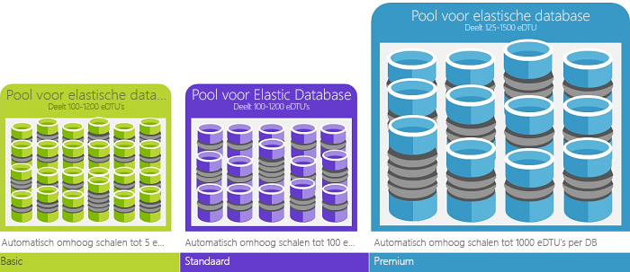

# Database Transaction Units (dtu's) en elastische Database Transaction Units (edtu's)
In dit artikel wordt uitgelegd wat DTU's (Database Transaction Units) en eDTU's (elastische Database Transaction Units) zijn en wat er gebeurt als u het maximale aantal DTU's of eDTU's hebt bereikt.  

## Wat zijn's (Database Transaction Units)?
Voor één Azure SQL database op een specifiek prestatieniveau binnen een [servicelaag](sql-database-single-database-resources.md), garandeert een bepaalde mate van resources voor die database (onafhankelijk van een andere database in de Azure-cloud) en het geven van een voorspelbare niveau van de prestaties van Microsoft. Deze hoeveelheid resources wordt berekend als een aantal Database Transaction Units of dtu's en is een gecombineerde meting van CPU, geheugen, i/o (gegevens en transactie logboekregistratie i/o). De verhouding tussen deze resources oorspronkelijk is bepaald door een [benchmark-OLTP-werkbelasting](sql-database-benchmark-overview.md) ontworpen om typische van echte OLTP-werkbelastingen. Wanneer uw werkbelasting het bedrag van elk van deze resources overschrijdt, is uw doorvoer beperkte - resulterende in tragere prestaties en time-outs. De beschikbare bronnen voor andere SQL-databases in de Azure-cloud hebben geen invloed op de bronnen die worden gebruikt door de werkbelasting en de resource die wordt gebruikt door andere werkbelastingen hebben geen invloed op de beschikbare bronnen voor de SQL-database.

Dtu's zijn vooral handig zijn om de relatieve hoeveelheid resources tussen Azure SQL-Databases op verschillende prestatieniveaus en Servicelagen te begrijpen. Bijvoorbeeld, verdubbeling van het aantal dtu's door het verhogen van het prestatieniveau van een database is gelijk aan de set van de resource beschikbaar is voor die database verdubbeld. Zo biedt een Premium P11-database met 1750 DTU's 350 keer meer DTU aan rekenvermogen dan een Basic-database met 5 DTU's.  

Gebruik voor het verkrijgen van meer inzicht in het brongebruik (DTU) van uw werkbelasting [Azure SQL Database Query Performance Insight](sql-database-query-performance.md) naar:

- De top-query's op het aantal CPU/duur/uitvoering die mogelijk kan worden afgestemd voor verbeterde prestaties identificeren. Bijvoorbeeld, een i/o-intensieve query kan profiteren van het gebruik van [in het geheugen optimalisatietechnieken](sql-database-in-memory.md) beter gebruikmaken van het beschikbare geheugen op een bepaalde prijscategorie en prestatieniveau serviceniveau.
- Inzoomen op de details van een query, geven de tekst en de geschiedenis van bronnen beter worden benut.
- Access-prestaties afstemmen van de aanbevelingen die acties uitgevoerd door weergeven [SQL Database Advisor](sql-database-advisor.md).

U kunt steeds de [servicelagen wijzigen](sql-database-service-tiers.md) met een minimale downtime voor uw toepassing (doorgaans minder dan vier seconden). Voor veel bedrijven en apps is het kunnen maken van databases en het naar wens omhoog of omlaag schalen van de prestaties al voldoende, vooral als de gebruikspatronen redelijk voorspelbaar zijn. Bij onvoorspelbare gebruikspatronen kan het echter lastig zijn uw kosten en bedrijfsmodel effectief te beheren. In dit scenario gebruikt u een elastische pool met een bepaald aantal edtu's die worden gedeeld door meerdere database in de groep.

## Wat zijn de elastische Database Transaction Units (edtu's)?
In plaats daarvan dan bieden een specifieke set resources (dtu's) met een SQL-Database die altijd beschikbaar ongeacht of die niet nodig zijn, u kunt plaatsen databases in een [elastische pool](sql-database-elastic-pool.md) op een SQL-Database-server die een pool van resources tussen deze database deelt. De gedeelde bronnen in een elastische pool gemeten door elastische Database Transaction Units of edtu's. Elastische pools zijn een eenvoudige en voordelige oplossing om prestatiedoelen te beheren voor databases met breed uiteenlopende en onvoorspelbare gebruikspatronen. U kunt in een elastische pool garanderen dat er geen één database gebruikmaakt van alle resources in de groep en ook of de minimale hoeveelheid resources is altijd beschikbaar zijn voor een database in een elastische pool. 

Een pool krijgt een bepaald aantal eDTU's voor een vaste prijs. Binnen de elastische pool hebben afzonderlijke databases de flexibiliteit om de schaal automatisch aan te passen binnen de geconfigureerde grenzen. Bij een zware belasting kan een database meer eDTU's verbruiken om te voldoen aan de vraag terwijl databases met een lichte belasting minder verbruiken, tot het punt waar databases zonder enige belasting geen eDTU's verbruiken. Door resources in te richten voor de gehele pool en niet per database, worden beheertaken eenvoudiger en beschikt u over een voorspelbaar budget voor de pool.

Er kunnen extra eDTU's aan een bestaande pool worden toegevoegd zonder uitvaltijd van de database en zonder gevolgen voor de databases in de pool. En als de extra eDTU's niet meer nodig zijn, kunnen ze op elk moment uit een bestaande pool worden verwijderd. U kunt toevoegen aan of verwijderen uit de pool of de hoeveelheid eDTU's beperken die door een database met zware belasting mag worden gebruikt om zo eDTU's te reserveren voor andere databases. Als een database zoals verwacht minder gebruikmaakt van resources, kunt u deze uit de pool verplaatsen en als een individuele database configureren met de voorspelbare hoeveelheid resources die deze database nodig heeft.

## Hoe bepaal ik hoeveel DTU's ik met mijn workload nodig heb?
Als u een bestaande workload voor virtuele on-premises of SQL Server-machines wilt migreren naar Azure SQL Database, kunt u de [DTU-rekenmachine](http://dtucalculator.azurewebsites.net/) gebruiken om een schatting te maken van het aantal benodigde DTU's. Voor een bestaande Azure SQL Database-workload raadpleegt u [SQL Database Query Performance Insight](sql-database-query-performance.md) voor meer informatie over het verbruik van databaseresources (DTU's) om inzicht te krijgen in hoe u uw workload kunt optimaliseren. U kunt ook de DMV [sys.dm_db_ resource_stats](https://msdn.microsoft.com/library/dn800981.aspx) gebruiken om de gegevens over het resourceverbruik van het afgelopen uur te verkrijgen. En in de catalogusweergave [sys.resource_stats](http://msdn.microsoft.com/library/dn269979.aspx) kunt u dezelfde gegevens opvragen voor de afgelopen veertien dagen, al hebben deze een iets lagere betrouwbaarheid van gemiddeld vijf minuten.

## Hoe weet ik of een elastische pool met resources voor mij voordeliger is?
Pools zijn geschikt voor een groot aantal databases met specifieke gebruikspatronen. Voor een bepaalde database wordt dit patroon gekenmerkt door een laag gemiddeld gebruik met relatief incidentele gebruikspieken. SQL Database evalueert automatisch het historisch resourcegebruik van databases in een bestaande SQL Database-server en op basis daarvan wordt de juiste poolconfiguratie in de Azure-portal aanbevolen. Zie [Wanneer moet een elastische pool worden gebruikt?](sql-database-elastic-pool.md) voor meer informatie.

## Wat gebeurt er wanneer ik mijn maximale aantal dtu's bereikt?
Prestatieniveaus worden gekalibreerd en worden bestuurd om de resources te verstrekken die nodig zijn om de databaseworkload uit te voeren tot de maximumlimiet die is toegestaan voor uw geselecteerde servicelaag of het geselecteerde prestatieniveau. Als uw workload de limiet bereikt op het gebied van CPU/gegevens-I/O/logboekI/O, blijft u resources ontvangen op het maximaal toegestane niveau, maar u zult dan waarschijnlijk merken dat uw query's langer duren. Deze limieten resulteren niet in fouten, maar wel in een vertraging van de workload, tenzij de vertraging zo ernstig wordt dat query's een time-out geven. Als u de limiet hebt bereikt van het maximaal toegestane aantal gelijktijdige sessies/gebruikersaanvragen (werkthreads), treden expliciete fouten op. Zie [Azure SQL Database resource limits]( sql-database-resource-limits.md#what-happens-when-database-and-elastic-pool-resource-limits-are-reached) (Resourcelimieten voor Azure SQL Database) voor informatie over andere resources dan CPU, geheugen, gegevens-I/O en transactielogboek-I/O.

## Volgende stappen
* Zie [servicelaag](sql-database-service-tiers.md) Meld i/o voor informatie over het dtu's en beschikbaar voor individuele databases en elastische groepen met edtu's, evenals beperkingen met betrekking tot bronnen dan CPU, geheugen, i/o-gegevens en de transactie.
* Zie [SQL Database Query Performance Insight](sql-database-query-performance.md) als u meer wilt weten over uw verbruik (DTU's).
* Zie [SQL Database benchmark overview](sql-database-benchmark-overview.md) (Overzicht van SQL Database-benchmarks) voor meer informatie over de methodologie achter de OLTP-benchmarkworkload waarmee de DTU-combinatie wordt bepaald.
