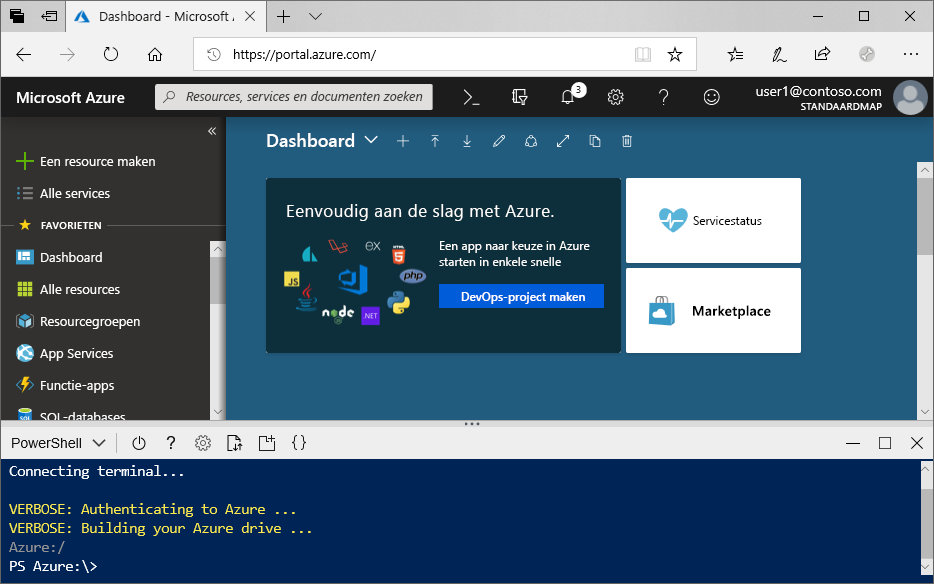
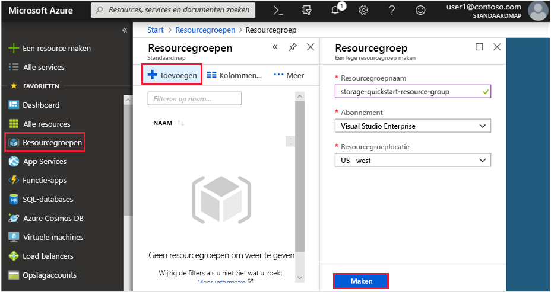
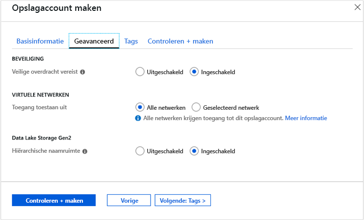

# <a name="quickstart-create-an-azure-data-lake-storage-gen2-storage-account"></a>Snelstart: Een Azure Data Lake Storage Gen2-opslagaccount maken

Azure Data Lake Storage Gen2 biedt [ondersteuning voor een hiërarchische naamruimteservice](data-lake-storage-introduction.md) met een systeemeigen, op mappen gebaseerd bestandssysteem dat is toegesneden op Hadoop Distributed File System (HDFS). Toegang tot Data Lake Storage Gen2-gegevens uit HDFS is beschikbaar via het [ABFS-stuurprogramma](data-lake-storage-abfs-driver.md).

In deze snelstart wordt gedemonstreerd hoe u een account maakt met [Azure Portal](https://portal.azure.com/), [Azure PowerShell](https://docs.microsoft.com/powershell/azure/overview) of [Azure CLI](https://docs.microsoft.com/cli/azure?view=azure-cli-latest).

## <a name="prerequisites"></a>Vereisten

Als u nog geen abonnement op Azure hebt, maak dan een [gratis account](https://azure.microsoft.com/free/) aan voordat u begint. 

|           | Vereiste |
|-----------|--------------|
|Portal     | Geen         |
|PowerShell | Voor deze snelstart is Az.Storage-versie **0.7** of later van de PowerShell-module vereist. Voer de opdracht `Get-Module -ListAvailable Az.Storage` uit om uw huidige versie te vinden. Als er geen resultaten worden weergegeven wanneer u deze opdracht uitvoert, of als een andere versie dan **0.7** wordt weergegeven, dan moet u een upgrade van uw powershell-module uitvoeren. Zie de sectie [Upgrade uitvoeren van uw powershell-module](#upgrade-your-powershell-module) van deze handleiding.
|CLI        | U kunt u aanmelden bij Azure en Azure CLI-opdrachten uitvoeren. Dit kan op twee manieren: <ul><li>U kunt CLI-opdrachten uitvoeren vanuit Azure Portal, in Azure Cloud Shell </li><li>U kunt de CLI installeren en CLI-opdrachten lokaal uitvoeren</li></ul>|

Wanneer u werkt met de opdrachtregel, hebt u de mogelijkheid om de Azure Cloud-shell of de CLI lokaal te installeren.

### <a name="use-azure-cloud-shell"></a>Azure Cloud Shell gebruiken

Azure Cloud Shell is een gratis Bash-shell die u rechtstreeks in Azure Portal kunt uitvoeren. In deze shell is de Azure CLI vooraf geïnstalleerd en geconfigureerd voor gebruik met uw account. Klik op de knop **Cloud Shell** in het menu rechtsboven in Azure Portal:

[](https://portal.azure.com)

Met de knop start u een interactieve shell waarmee u alle stappen in deze snelstartgids kunt uitvoeren:

[](https://portal.azure.com)

### <a name="install-the-cli-locally"></a>De CLI lokaal installeren

U kunt Azure CLI ook lokaal installeren en gebruiken. Voor deze snelstart moet u versie 2.0.38 of later van Azure CLI uitvoeren. Voer `az --version` uit om de versie te bekijken. Als u uw CLI wilt installeren of upgraden, raadpleegt u [De Azure CLI installeren](/cli/azure/install-azure-cli).

## <a name="create-a-storage-account-with-azure-data-lake-storage-gen2-enabled"></a>Een opslagaccount maken waarvoor Azure Data Lake Storage Gen2 is ingeschakeld

Voordat u een account maakt, maakt u eerst een resourcegroep die fungeert als een logische container voor opslagaccounts of andere Azure resources die u maakt. Als u de resources die in deze snelstartgids zijn gemaakt, wilt opschonen, verwijdert u gewoon de resourcegroep. Als u de resourcegroep verwijdert, worden ook het bijbehorende opslagaccount en eventuele andere resources die zijn gekoppeld aan de resourcegroep, verwijderd. Zie [Overzicht van Azure Resource Manager](../../azure-resource-manager/resource-group-overview.md) voor meer informatie over resourcegroepen.

> [!NOTE]
> U moet nieuwe opslagaccounts maken van het type **StorageV2 (algemeen gebruik v2)** om te profiteren van de functies van Data Lake Storage Gen2.  

Zie [Overzicht van Azure-opslagaccount](../common/storage-account-overview.md) voor meer informatie over opslagaccounts.

Neem de volgende regels in acht als u het opslagaccount een naam geeft:

- Namen van opslagaccounts moeten tussen 3 en 24 tekens lang zijn en mogen alleen cijfers en kleine letters bevatten.
- De naam van uw opslagaccount moet uniek zijn binnen Azure. Een opslagaccount kan niet dezelfde naam hebben als een ander opslagaccount.

## <a name="create-an-account-using-the-azure-portal"></a>Een account maken in Azure Portal

Meld u aan bij [Azure Portal](https://portal.azure.com).

### <a name="create-a-resource-group"></a>Een resourcegroep maken

Als u een resourcegroep wilt maken in Azure Portal, volgt u deze stappen:

1. Vouw het menu aan de linkerkant in Azure Portal uit om het menu met services te openen en kies **Resourcegroepen**.
2. Klik op de knop **Toevoegen** om een nieuwe resourcegroep toe te voegen.
3. Voer een naam in voor de nieuwe resourcegroep.
4. Selecteer het abonnement waarin u de nieuwe resourcegroep wilt maken.
5. Kies de locatie voor de resourcegroep.
6. Klik op de knop **Maken**.  

   

### <a name="create-a-general-purpose-v2-storage-account"></a>Een v2-opslagaccount voor algemeen gebruik maken

Als u een v2-opslagaccount voor algemeen gebruik wilt maken in de Azure Portal, volgt u deze stappen:

> [!NOTE]
> De hiërarchische naamruimte is momenteel beschikbaar in alle openbare regio's.

1. Vouw in Azure Portal het menu links open om het menu met services te openen en kies **Alle services**. Schuif vervolgens omlaag naar **Opslag** en kies **Opslagaccounts**. Kies in het venster **Opslagaccounts** dat wordt weergegeven de optie **Toevoegen**.
2. Selecteer uw **abonnement** en de **resourcegroep** die u eerder hebt gemaakt.
3. Voer een naam in voor het opslagaccount.
4. Stel **Locatie** in op **US - west 2**
5. Laat deze velden ingesteld staan op de standaardwaarden: **Prestaties**, **Accounttype**, **Replicatie**, **Toegangslaag**.
6. Kies het abonnement waarin u het opslagaccount wilt maken.
7. Selecteer **Volgende: Geavanceerd >**
8. Laat u de waarden onder de velden **SECURITY** en **VIRTUAL NETWORKS** ingesteld op hun standaardwaarden.
9. In de sectie **Data Lake Storage Gen2** stelt u **Hiërarchische naamruimte** in op **Ingeschakeld**.
10. Klik op **Beoordelen en maken** om het opslagaccount te maken.

    

Uw opslagaccount is nu gemaakt via de portal.

### <a name="clean-up-resources"></a>Resources opschonen

Ga als volgt te werk om een resourcegroep te verwijderen in Azure Portal:

1. Vouw het menu aan de linkerkant in Azure Portal uit om het menu met services te openen en kies **Resourcegroepen** om de lijst met resourcegroepen weer te geven.
2. Zoek de resourcegroep die u wilt verwijderen, en klik met de rechtermuisknop op de knop **Meer** (**...** ) aan de rechterkant van de lijst.
3. Selecteer **Resourcegroep verwijderen** en bevestig dit.

## <a name="create-an-account-using-powershell"></a>Een account maken met PowerShell

Installeer eerst de meest recente versie van de [ PowerShellGet](https://docs.microsoft.com/powershell/gallery/installing-psget)-module.

Voer vervolgens een upgrade uit van uw powershell-module, meld u aan bij uw Azure-abonnement, maak een resourcegroep en vervolgens een opslagaccount.

### <a name="upgrade-your-powershell-module"></a>De PowerShell-module upgraden

[!INCLUDE [updated-for-az](../../../includes/updated-for-az.md)]

Voor de interactie met Data Lake Storage Gen2 met behulp van PowerShell moet u moduleversie Az.Storage **0,7** of hoger installeren.

Begin door een PowerShell-sessie met verhoogde bevoegdheden te openen.

De module Az.Storage installeren

```powershell
Install-Module Az.Storage -Repository PSGallery -AllowPrerelease -AllowClobber -Force
```

### <a name="log-in-to-your-azure-subscription"></a>Aanmelden bij uw Azure-abonnement

Gebruik de opdracht `Login-AzAccount` en volg de instructies op het scherm om te verifiëren.

```powershell
Login-AzAccount
```

### <a name="create-a-resource-group"></a>Een resourcegroep maken

Gebruik de opdracht [New-AzResourceGroup](/powershell/module/az.resources/new-azresourcegroup) om een nieuwe resourcegroep met PowerShell te maken: 

> [!NOTE]
> De hiërarchische naamruimte is momenteel beschikbaar in alle openbare regio's.

```powershell
# put resource group in a variable so you can use the same group name going forward,
# without hardcoding it repeatedly
$resourceGroup = "storage-quickstart-resource-group"
$location = "westus2"
New-AzResourceGroup -Name $resourceGroup -Location $location
```

### <a name="create-a-general-purpose-v2-storage-account"></a>Een v2-opslagaccount voor algemeen gebruik maken

Gebruik de opdracht [New-AzStorageAccount](/powershell/module/az.storage/New-azStorageAccount) om een v2-opslagaccount voor algemeen gebruik met lokaal redundante opslag (LRS) te maken vanuit PowerShell:

```powershell
$location = "westus2"

New-AzStorageAccount -ResourceGroupName $resourceGroup `
  -Name "storagequickstart" `
  -Location $location `
  -SkuName Standard_LRS `
  -Kind StorageV2 `
  -EnableHierarchicalNamespace $True
```

### <a name="clean-up-resources"></a>Resources opschonen

Gebruik de opdracht [Remove-AzResourceGroup](/powershell/module/az.resources/remove-azresourcegroup) om de resourcegroep en alle bijbehorende resources te verwijderen, inclusief het nieuwe opslagaccount: 

```powershell
Remove-AzResourceGroup -Name $resourceGroup
```

## <a name="create-an-account-using-azure-cli"></a>Een account maken met Azure CLI

Meld u aan bij [Azure Portal](https://portal.azure.com) om Azure Cloud Shell te starten.

Als u zich wilt aanmelden bij de lokale installatie van de CLI, voert u de opdracht voor aanmelden uit:

```cli
az login
```

### <a name="add-the-cli-extension-for-azure-data-lake-gen-2"></a>De CLI-extensie voor Azure Data Lake Gen 2 toevoegen

Als u via CLI wilt communiceren met Data Lake Storage Gen2, moet u een extensie toevoegen aan de shell.

Dit doet u als volgt: voer met behulp van Cloud Shell of een lokale shell de volgende opdracht in: `az extension add --name storage-preview`

### <a name="create-a-resource-group"></a>Een resourcegroep maken

Gebruik de opdracht [az group create](/cli/azure/group) om een nieuwe resourcegroep te maken met Azure CLI.

```azurecli-interactive
az group create `
    --name storage-quickstart-resource-group `
    --location westus2
```

> [!NOTE]
> > De hiërarchische naamruimte is momenteel beschikbaar in alle openbare regio's.

### <a name="create-a-general-purpose-v2-storage-account"></a>Een v2-opslagaccount voor algemeen gebruik maken

Gebruik de opdracht [az storage account create](/cli/azure/storage/account) om een v2-opslagaccount voor algemeen gebruik met lokaal redundante opslag te maken vanuit de Azure CLI.

```azurecli-interactive
az storage account create `
    --name storagequickstart `
    --resource-group storage-quickstart-resource-group `
    --location westus2 `
    --sku Standard_LRS `
    --kind StorageV2 `
    --hierarchical-namespace true
```

### <a name="clean-up-resources"></a>Resources opschonen

Gebruik de opdracht [az group delete](/cli/azure/group) om de resourcegroep en alle bijbehorende resources te verwijderen, inclusief het nieuwe opslagaccount.

```azurecli-interactive
az group delete --name myResourceGroup
```

## <a name="next-steps"></a>Volgende stappen

In deze snelstart hebt u een opslagaccount gemaakt met Data Lake Storage Gen2-mogelijkheden. Zie het volgende onderwerp voor informatie over het uploaden en downloaden van blobs naar en uit uw opslagaccount.

* [AzCopy V10](https://docs.microsoft.com/azure/storage/common/storage-use-azcopy-v10?toc=%2fazure%2fstorage%2fblobs%2ftoc.json)
