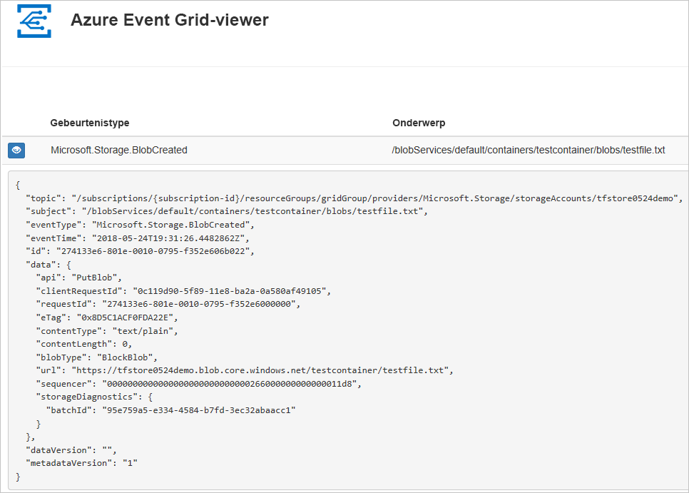
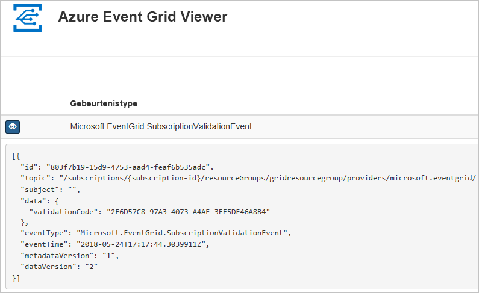

# <a name="route-blob-storage-events-to-a-custom-web-endpoint-with-azure-cli"></a>Gebeurtenissen van Blob Storage routeren naar een aangepast eindpunt op het web met Azure CLI

Azure Event Grid is een gebeurtenisservice voor de cloud. In dit artikel gebruikt u de Azure CLI om u te abonneren op gebeurtenissen van Blob Storage, waarna u vervolgens een gebeurtenis activeert om het resultaat weer te geven.

Normaal gesproken verzendt u gebeurtenissen naar een eindpunt dat de gebeurtenisgegevens verwerkt en vervolgens in actie komt. Ter vereenvoudiging van dit artikel stuurt u hier de gebeurtenissen echter naar een web-app die de berichten verzamelt en weergeeft.

Als u de stappen in dit artikel hebt voltooid, ziet u dat de gebeurtenisgegevens zijn verzonden naar de web-app.




[!INCLUDE [quickstarts-free-trial-note.md](../../../includes/quickstarts-free-trial-note.md)]

[!INCLUDE [cloud-shell-try-it.md](../../../includes/cloud-shell-try-it.md)]

Als u ervoor kiest om de CLI lokaal te installeren en te gebruiken, moet u voor dit artikel de nieuwste versie van Azure CLI (2.0.24 of hoger) uitvoeren. Voer `az --version` uit om de versie te bekijken. Zie [Azure CLI installeren](/cli/azure/install-azure-cli) als u de CLI wilt installeren of een upgrade wilt uitvoeren.

Als u Cloud Shell niet gebruikt, moet u eerst zich aanmelden met `az login`.

## <a name="create-a-resource-group"></a>Een resourcegroep maken

Event Grid-onderwerpen zijn Azure-resources en moeten in een Azure-resourcegroep worden geplaatst. De resourcegroep is een logische verzameling waarin Azure-resources worden geïmplementeerd en beheerd.

Een resourcegroep maken met de opdracht [az group create](/cli/azure/group#az_group_create). 

In het volgende voorbeeld wordt een resourcegroep met de naam `<resource_group_name>` gemaakt op de locatie *westcentralus*.  Vervang `<resource_group_name>` door een unieke naam voor uw resourcegroep.

```azurecli-interactive
az group create --name <resource_group_name> --location westcentralus
```

## <a name="create-a-storage-account"></a>Create a storage account

Om Blob-opslaggebeurtenissen te kunnen gebruiken, hebt u een [Blob-opslagaccount](../common/storage-create-storage-account.md?toc=%2fazure%2fstorage%2fblobs%2ftoc.json#blob-storage-accounts) of een [algemeen v2-opslagaccount](../common/storage-account-options.md#general-purpose-v2) nodig. **GPv2-accounts (v2 voor algemeen gebruik)** zijn opslagaccounts die alle functies voor alle opslagservices ondersteunen, waaronder Blobs, Files, Queues en Tables. Een **Blob-opslagaccount** is een opslagaccount dat speciaal is bedoeld om ongestructureerde gegevens als blobs (objecten) op te slaan in Azure Storage. Blob-opslagaccounts zijn vergelijkbaar met de opslagaccounts voor algemeen gebruik en bieden dezelfde hoogwaardige kenmerken op het gebied van duurzaamheid, beschikbaarheid, schaalbaarheid en prestaties waarover u nu al beschikt, inclusief 100 procent API-consistentie voor blok-blobs en toevoeg-blobs. Voor toepassingen die alleen blok- of toevoeg-blob-opslag nodig hebben, wordt het gebruik van Blob-opslagaccounts aangeraden. 

> [!NOTE]
> [Beschikbaarheid](../../event-grid/overview.md) voor opslaggebeurtenissen is gekoppeld aan de beschikbaarheid van Event Grid en komt beschikbaar in andere regio’s wanneer dit ook voor Event Grid geldt.

Vervang `<storage_account_name>` door een unieke naam voor uw opslagaccount en `<resource_group_name>` door de resourcegroep die u eerder hebt gemaakt.

```azurecli-interactive
az storage account create \
  --name <storage_account_name> \
  --location westcentralus \
  --resource-group <resource_group_name> \
  --sku Standard_LRS \
  --kind BlobStorage \
  --access-tier Hot
```

## <a name="create-a-message-endpoint"></a>Het eindpunt van een bericht maken

Voordat u zich abonneert op het onderwerp, gaan we het eindpunt voor het gebeurtenisbericht maken. Het eindpunt onderneemt normaal gesproken actie op basis van de gebeurtenisgegevens. Ter vereenvoudiging van deze snelstart gaat u een [vooraf gebouwde web-app](https://github.com/dbarkol/azure-event-grid-viewer) implementeren waarmee de gebeurtenisberichten worden weergegeven. De geïmplementeerde oplossing omvat een App Service-plan, een App Service-web-app en broncode van GitHub.

Vervang `<your-site-name>` door een unieke naam voor de web-app. De naam van de web-app moet uniek zijn omdat deze deel uitmaakt van de DNS-vermelding.

```azurecli-interactive
sitename=<your-site-name>

az group deployment create \
  --resource-group <resource_group_name> \
  --template-uri "https://raw.githubusercontent.com/dbarkol/azure-event-grid-viewer/master/azuredeploy.json" \
  --parameters siteName=$sitename hostingPlanName=viewerhost
```

De implementatie kan enkele minuten duren. Controleer of uw web-app wordt uitgevoerd nadat de implementatie is voltooid. Navigeer in een webbrowser naar: `https://<your-site-name>.azurewebsites.net`

Op de site zouden momenteel geen berichten moeten wijn weergeven.

[!INCLUDE [event-grid-register-provider-cli.md](../../../includes/event-grid-register-provider-cli.md)]

## <a name="subscribe-to-your-storage-account"></a>Abonneren op uw opslagaccount

U abonneert u op een onderwerp om Event Grid te laten weten welke gebeurtenissen u wilt traceren en waar deze gebeurtenissen naartoe moeten worden gestuurd. In het volgende voorbeeld ziet u hoe u zich abonneert op het opslagaccount dat u hebt gemaakt, en hoe de URL van de web-app wordt doorgegeven als het eindpunt voor de gebeurtenismelding. Vervang `<event_subscription_name>` door een naam voor het gebeurtenisabonnement. Gebruik voor `<resource_group_name>` en `<storage_account_name>` de waarden die u eerder hebt gemaakt.

Het eindpunt voor uw web-app moet het achtervoegsel `/api/updates/` bevatten.

```azurecli-interactive
storageid=$(az storage account show --name <storage_account_name> --resource-group <resource_group_name> --query id --output tsv)
endpoint=https://$sitename.azurewebsites.net/api/updates

az eventgrid event-subscription create \
  --resource-id $storageid \
  --name <event_subscription_name> \
  --endpoint $endpoint
```

Bekijk opnieuw uw web-app en u zult zien dat er een validatiegebeurtenis voor een abonnement naartoe is verzonden. Selecteer het oogpictogram om de gebeurtenisgegevens uit te breiden. Via Event Grid wordt de validatiegebeurtenis verzonden zodat het eindpunt kan controleren of de gebeurtenisgegevens in aanmerking komen om ontvangen te worden. De web-app bevat code waarmee het abonnement kan worden gevalideerd.



## <a name="trigger-an-event-from-blob-storage"></a>Een gebeurtenis van Blob Storage activeren

Nu gaan we een gebeurtenis activeren om te zien hoe het bericht via Event Grid naar het eindpunt wordt gedistribueerd. Eerst configureren we de naam en sleutel voor het opslagaccount, daarna maken we een container en vervolgens gaan we een bestand maken en uploaden. Gebruik voor `<storage_account_name>` en `<resource_group_name>` weer de waarden die u eerder hebt gemaakt.

```azurecli-interactive
export AZURE_STORAGE_ACCOUNT=<storage_account_name>
export AZURE_STORAGE_ACCESS_KEY="$(az storage account keys list --account-name <storage_account_name> --resource-group <resource_group_name> --query "[0].value" --output tsv)"

az storage container create --name testcontainer

touch testfile.txt
az storage blob upload --file testfile.txt --container-name testcontainer --name testfile.txt
```

U hebt de gebeurtenis geactiveerd, en de gebeurtenis is via Event Grid verzonden naar het eindpunt dat u hebt geconfigureerd toen u zich abonneerde. Bekijk uw web-app om de gebeurtenis te zien die u zojuist hebt verzonden.


```json
[{
  "topic": "/subscriptions/xxxxxxxx-xxxx-xxxx-xxxx-xxxxxxxxxxxx/resourceGroups/myrg/providers/Microsoft.Storage/storageAccounts/myblobstorageaccount",
  "subject": "/blobServices/default/containers/testcontainer/blobs/testfile.txt",
  "eventType": "Microsoft.Storage.BlobCreated",
  "eventTime": "2017-08-16T20:33:51.0595757Z",
  "id": "4d96b1d4-0001-00b3-58ce-16568c064fab",
  "data": {
    "api": "PutBlockList",
    "clientRequestId": "d65ca2e2-a168-4155-b7a4-2c925c18902f",
    "requestId": "4d96b1d4-0001-00b3-58ce-16568c000000",
    "eTag": "0x8D4E4E61AE038AD",
    "contentType": "text/plain",
    "contentLength": 0,
    "blobType": "BlockBlob",
    "url": "https://myblobstorageaccount.blob.core.windows.net/testcontainer/testblob1.txt",
    "sequencer": "00000000000000EB0000000000046199",
    "storageDiagnostics": {
      "batchId": "dffea416-b46e-4613-ac19-0371c0c5e352"
    }
  },
  "dataVersion": "",
  "metadataVersion": "1"
}]

```

## <a name="clean-up-resources"></a>Resources opschonen
Als u verder wilt werken met dit opslagaccount en dit gebeurtenisabonnement, moet u de resources die u hebt gemaakt in dit artikel niet opschonen. Als u niet verder wilt werken, gebruikt u de volgende opdracht om de resources te verwijderen die u in dit artikel hebt gemaakt.

Vervang `<resource_group_name>` door de resourcegroep die u eerder hebt gemaakt.

```azurecli-interactive
az group delete --name <resource_group_name>
```

## <a name="next-steps"></a>Volgende stappen

U weet nu hoe u onderwerpen en gebeurtenisabonnementen maakt. Raadpleeg deze onderwerpen voor meer informatie over gebeurtenissen van Blob Storage en waar Event Grid u nog meer bij kan helpen:

- [Reageren op gebeurtenissen van Blob Storage](storage-blob-event-overview.md)
- [Over Event Grid](../../event-grid/overview.md)
