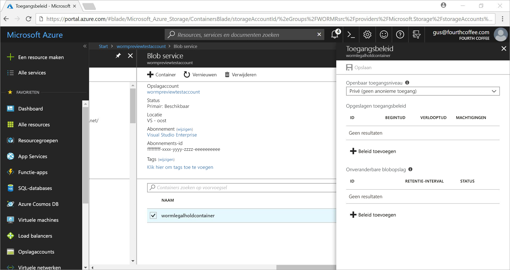
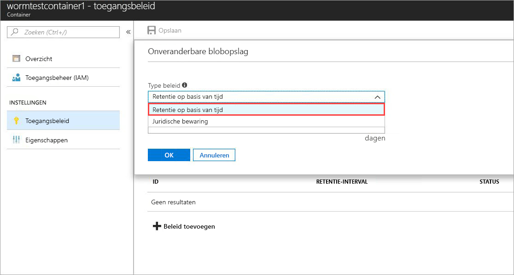
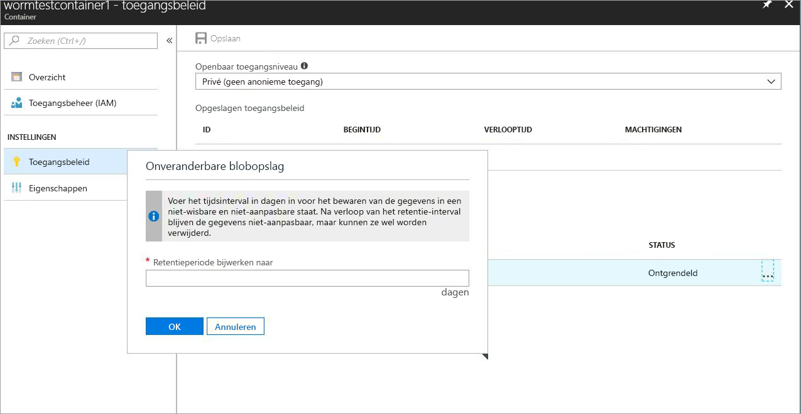
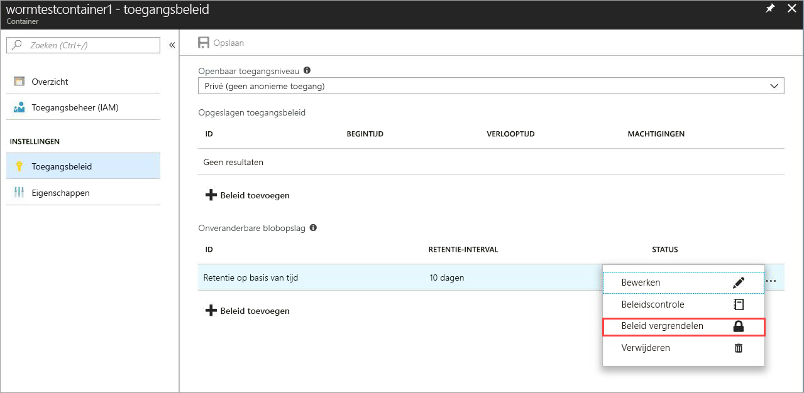
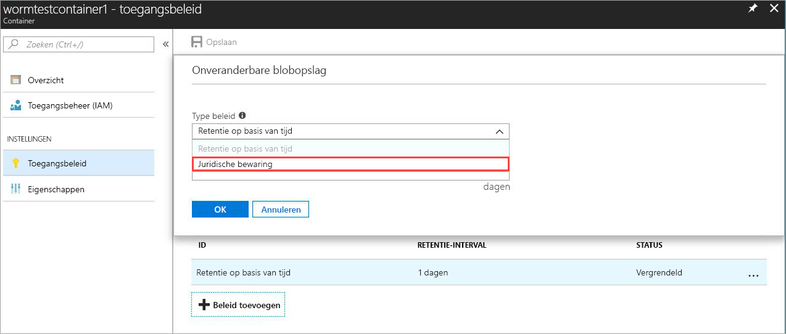
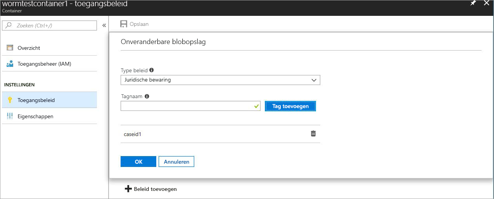

# <a name="immutable-storage-feature-of-azure-blob-storage-preview"></a>Onveranderbare opslagfunctie van Azure Blob Storage (preview)

Met de onveranderbare opslagfunctie voor Azure Blobs kunnen gebruikers bedrijfskritieke gegevens in een WORM-status (Write Once Read Many) opslaan in Azure Blob-opslag. Gegevens met deze status kunnen gedurende een door de gebruiker opgegeven periode niet worden gewist of gewijzigd. Blobs kunnen gedurende het retentie-interval worden gemaakt en gelezen, maar niet worden gewijzigd of verwijderd.

## <a name="overview"></a>Overzicht

Met de onveranderbare opslagfunctie kunnen organisaties in vele gereglementeerde branches, met name organisaties die makelaars- en handelaarsdiensten leveren, gegevens opslaan op een manier die compatibel is met SEC 17a-4(f) en andere regelgeving.

Typische toepassingen zijn onder andere:

- **Naleving van regelgeving**: de onveranderbare opslagfunctie voor Azure Blobs is ontworpen om financiële instellingen en verwante branches te helpen te voldoen aan SEC 17a-4(f), CFTC 1.31©-(d), FINRA enzovoort.

- **Veilige documentretentie**: gebruikers krijgen maximale gegevensbeveiliging, want de Blob Storage-service zorgt ervoor dat gegevens door niemand kunnen worden gewijzigd of verwijderd, ook niet door een gebruiker met beheerdersbevoegdheden.

- **Juridische bewaring**: met de onveranderbare opslagfunctie voor Azure-blobs kunnen gebruikers gevoelige informatie die essentieel is voor bijvoorbeeld een geschil of juridisch onderzoek voor een gewenste duur opslaan in een fraudebestendige status.

De onveranderbare opslagfunctie biedt het volgende:

- **Ondersteuning voor een retentiebeleid op basis van tijd:** gebruikers stellen beleidsregels in voor het opslaan van gegevens voor een opgegeven periode.

- **Ondersteuning voor juridisch bewaringsbeleid:** als de retentieperiode niet bekend is, kunnen gebruikers juridische bewaring instellen om gegevens onveranderbaar op te slaan tot de juridische bewaring is opgeheven.  Als een juridische bewaring is ingesteld, kunnen blobs worden gemaakt en gelezen, maar niet worden gewijzigd of verwijderd. Elke juridische bewaring wordt gekoppeld aan een door de gebruiker gedefinieerd alfanumeriek label dat wordt gebruikt als een tekenreeks-id (bijvoorbeeld een casus-id).

- **Ondersteuning voor alle blob-lagen:** WORM-beleidsregels zijn onafhankelijk van de Azure Bob Storage-laag en worden toegepast op alle lagen, dynamische toegang, statische toegang en archieftoegang. Op die manier kunnen klanten de gegevens opslaan in de laag die het meest rendabel is voor hun workloads, met behoud van de onveranderbaarheid van gegevens.

- **Configuratie op containerniveau:** met de onveranderbare opslagfunctie kunnen gebruikers een retentiebeleid op basis van tijd, en labels voor juridische bewaring op containerniveau configureren.  Gebruikers kunnen met eenvoudige instellingen op containerniveau een retentiebeleid op basis van tijd maken en vergrendelen, retentieperioden verlengen, juridische bewaring instellen en opheffen enzovoort.  Deze beleidsregels zijn van toepassing op alle blobs in de container, zowel op bestaande als nieuwe blobs.

- **Ondersteuning voor auditlogboekregistratie:** elke container heeft een auditlogboek dat wordt weergegeven voor maximaal vijf retentieopdrachten op basis van tijd voor beleidsregels voor vergrendelde retentie op basis van tijd, met maximaal drie logboeken voor retentieperiodeverlengingen.  Voor retentie op basis van tijd bevat het logboek de gebruikers-id, het opdrachttype, tijdstempels en de retentieperiode. Voor juridische bewaring bevat het logboek de gebruikers-id, het opdrachttype, tijdstempels en de labels voor juridische bewaring. Dit logboek blijft volgens de richtlijnen van de SEC 17a-4(f)-regelgeving bewaard gedurende de levensduur van de container. Een uitgebreider logboek van activiteiten op besturingsvlak vindt u in het [Azure-activiteitenlogboek](https://docs.microsoft.com/azure/monitoring-and-diagnostics/monitoring-overview-activity-logs). Het is de verantwoordelijkheid van de gebruiker om deze logboeken permanent op te slaan wat mogelijk vereist is voor andere doeleinden.

 De functie is ingeschakeld in alle openbare Azure-regio's.

## <a name="how-it-works"></a>Hoe werkt het?

De onveranderbare opslag voor Azure Blobs ondersteunt twee soorten WORM-beleidsregels of beleidsregels voor onveranderbare opslag: retentie op basis van tijd en juridische bewaring. Zie de sectie [Aan de slag](#Getting-started) voor meer informatie over het maken van deze beleidsregels voor onveranderbare opslag.
Wanneer een retentiebeleid op basis van tijd of een juridische bewaring wordt toegepast op een container, krijgen alle bestaande blobs de status Onveranderbaar (beveiligd tegen schrijven en verwijderen). Alle nieuwe blobs die worden geüpload naar de container krijgen ook de status Onveranderbaar.

> [!IMPORTANT]
> Een retentiebeleid op basis van tijd moet zijn *vergrendeld* om de blob de status Onveranderbaar (beveiligd tegen schrijven en verwijderen) te kunnen geven volgens SEC 17a-4(f) en andere regelgeving. Het wordt aanbevolen om het beleid binnen een redelijk tijdsbestek te vergrendelen, gewoonlijk binnen 24 uur. Het wordt aangeraden om de status *Ontgrendeld* alleen te gebruiken voor korte functie-evaluaties.

 Als een bewaarbeleid op basis van tijd op een container is toegepast, blijven alle blobs in de container onveranderbaar gedurende de *effectieve* retentieperiode. De effectieve retentieperiode voor bestaande blobs is gelijk aan het verschil tussen het tijdstip waarop de blob is gemaakt en de door de gebruiker opgegeven retentieperiode. Voor nieuwe blobs is de effectieve retentieperiode gelijk aan de door de gebruiker opgegeven retentieperiode. Omdat gebruikers de retentieperiode kunnen wijzigen, wordt de effectieve retentieperiode berekend op basis van de meest recente waarde van de opgegeven retentieperiode.

> [!TIP]
> Voorbeeld: Gebruiker maakt een retentiebeleid op basis van tijd met een retentieperiode van vijf jaar.
> De container bevat een blob, testblob1, die een jaar geleden is gemaakt. De effectieve retentieperiode voor testblob1 is dan vier jaar.
> Nu wordt een nieuwe blob, testblob2, geüpload naar de container. De effectieve retentieperiode voor testblob2 is vijf jaar.

### <a name="legal-holds"></a>Juridische bewaring

In het geval van een juridische bewaring blijven alle bestaande en nieuwe blobs onveranderbaar totdat de wettelijke bewaring wordt opgeheven.
Voor meer informatie over het instellen en opheffen van een juridische bewaring raadpleegt u de sectie [Aan de slag](#Getting-started) voor meer informatie.

Op een container kan tegelijkertijd een juridische bewaring en een retentiebeleid op basis van tijd zijn toegepast. Alle blobs in die container blijven onveranderbaar totdat alle juridische bewaringen zijn opgeheven, zelfs als hun effectieve retentieperiode is verlopen. Een blob blijft daarentegen onveranderbaar totdat de effectieve retentieperiode is verlopen, zelfs als alle juridische blokkeringen zijn gewist.
De volgende tabel toont de typen blob-bewerkingen die zijn uitgeschakeld voor de verschillende scenario's voor onveranderbare opslag.
Raadpleeg de documentatie van [Azure Blob Service-API](https://docs.microsoft.com/rest/api/storageservices/blob-service-rest-api) voor de details van Blob REST API.

|Scenario  |Blob-status  |Blob-bewerkingen niet toegestaan  |
|---------|---------|---------|
|Effectieve retentieperiode voor de blob is nog niet verlopen en/of wettelijke bewaring is ingesteld     |Onveranderbaar: beveiligd tegen verwijderen en schrijven         |Delete Container, Delete Blob, Put Blob1, Put Block, Put Block List, Set Blob Metadata, Put Page, Set Blob Properties, Snapshot Blob, Incremental Copy Blob, Append Block         |
|Effectieve retentieperiode voor blob is verlopen     |Alleen beveiligd tegen schrijven (verwijderen is toegestaan)         |Put Blob, Put Block, Put Block List, Set Blob Metadata, Put Page, Set Blob Properties, Snapshot Blob, Incremental Copy Blob, Append Block         |
|Alle juridische bewaringen zijn uitgeschakeld en er is geen retentiebeleid op basis van tijd ingesteld op de container     |Veranderlijk         |Geen         |
|Er is geen WORM-beleid gemaakt (retentie op basis van tijd of juridische bewaring)     |Veranderlijk         |Geen         |

> [!NOTE]
> In de eerste twee scenario's van bovenstaande tabel zijn de eerste Put Blob-bewerking en de Put Block List- en Put Block-bewerkingen die nodig zijn om een blob te maken, toegestaan. Alle volgende bewerkingen zijn niet toegestaan.
> De onveranderbare opslagfunctie is alleen beschikbaar in GPv2- en blob-opslagaccounts en moet worden gemaakt via de [Azure Resource Manager](https://docs.microsoft.com/azure/azure-resource-manager/resource-group-overview).

## <a name="pricing"></a>Prijzen

Er worden geen extra kosten in rekening gebracht voor het gebruik van deze functie en onveranderbare gegevens worden op dezelfde manier in rekening gebracht als gewone veranderlijke gegevens. Raadpleeg de pagina [Prijzen voor Azure Storage](https://azure.microsoft.com/pricing/details/storage/blobs/) voor de gerelateerde prijsinformatie.

### <a name="restrictions"></a>Beperkingen

Tijdens de openbare preview gelden de volgende beperkingen:

- **Sla geen productie- of bedrijfskritieke gegevens op**
- Alle preview-/geheimhoudingsbeperkingen zijn van toepassing

## <a name="getting-started"></a>Aan de slag

Onveranderbare opslag voor Azure Blobs wordt ondersteund op de meest recente versies van [Azure Portal](http://portal.azure.com), Azure [CLI 2.0](https://docs.microsoft.com/cli/azure/install-azure-cli?view=azure-cli-latest) en Azure [PowerShell](https://github.com/Azure/azure-powershell/releases/tag/Azure.Storage.v4.4.0-preview-May2018)

### <a name="azure-portal"></a>Azure Portal

1. Maak een nieuwe container of selecteer een bestaande container om de blobs op te slaan die u in onveranderbare toestand wilt bewaren.
 De container moet zich in een GPv2-opslagaccount bevinden.
2. Klik op Toegangsbeleid in de containerinstellingen en klik vervolgens op **+ Beleid toevoegen** onder het beleid **Onveranderbare blob-opslag** zoals hieronder is weergegeven.

    

3. Als u een retentiebeleid op basis van tijd wilt inschakelen, kiest u Retentie op basis van tijd in de vervolgkeuzelijst.

    

4. Geef de gewenste retentieperiode op in dagen (minimaal één dag)

    

    Zoals u hierboven ziet, is het beleid in eerste instantie ontgrendeld. Op die manier kunt u de functie eerst testen met een kortere retentieperiode en het beleid wijzigen voordat u het vergrendelt. Vergrendeling is essentieel voor naleving van regelgeving SEC 17a-4 enzovoort.

5. Vergrendel het beleid door met de rechtermuisknop te klikken op de ..., waarna het volgende menu wordt geopend:

    

    Klik op Beleid vergrendelen. De beleidsstatus wordt nu weergegeven als vergrendeld. Wanneer een beleid is vergrendeld, kan het niet meer worden verwijderd en zijn alleen extensies van de retentieperiode toegestaan.

6. Als u juridische bewaring wilt inschakelen, klikt u op + Beleid toevoegen en kiest u Juridische bewaring in de vervolgkeuzelijst

    

7. Een juridische bewaring maken met een of meer labels

    

### <a name="cli-20"></a>CLI 2.0

De [CLI-extensie](http://docs.microsoft.com/cli/azure/install-azure-cli?view=azure-cli-latest) installeren met `az extension add -n storage-preview`

Als u de extensie al hebt geïnstalleerd, gebruikt u de volgende opdracht om de onveranderbare opslagfunctie in te schakelen: `az extension update -n storage-preview`

De functie is opgenomen in de volgende opdrachtgroepen (voer '-h' voor deze opdrachtgroepen uit om de opdrachten te zien): `az storage container immutability-policy` en `az storage container legal-hold`.

### <a name="powershell"></a>PowerShell

De onveranderbare opslagfunctie wordt ondersteund in [PowerShell versie 4.4.0 (preview)](https://github.com/Azure/azure-powershell/releases/tag/Azure.Storage.v4.4.0-preview-May20180).
Voer de volgende stappen uit als u de functie wilt inschakelen:

1. Controleren of u de nieuwste versie van PowerShellGet hebt geïnstalleerd met `Install-Module PowerShellGet –Repository PSGallery –Force`
2. Een eventuele eerdere installatie van Azure PowerShell verwijderen
3. AzureRM installeren (Azure op dezelfde manier vanuit deze opslagplaats kan worden geïnstalleerd) `Install-Module AzureRM –Repository PSGallery –AllowClobber`
4. De preview-versie van de cmdlets voor het opslagbeheervlak installeren`Install-Module -Name AzureRM.Storage -AllowPrerelease -Repository PSGallery -AllowClobber`

Hieronder vindt u een voorbeeld van PowerShell-code ter illustratie van het gebruik van de functie.

## <a name="client-libraries"></a>Clientbibliotheken

De onveranderbare opslagfunctie voor Azure-blobs wordt ondersteund in de volgende versies van de clientbibliotheek

- [.NET-clientbibliotheek (versie 7.2.0-preview en hoger](https://www.nuget.org/packages/Microsoft.Azure.Management.Storage/7.2.0-preview)
- [node.js-clientbibliotheek (versie 4.0.0 en hoger)](https://www.npmjs.com/package/azure-arm-storage)
- [Python-clientbibliotheek (versie 2.0.0 RC 2 en hoger)](https://pypi.org/project/azure-mgmt-storage/2.0.0rc1/)

## <a name="supported-values"></a>Ondersteunde waarden

- De minimale retentieperiode is één dag, de maximale periode is 400 jaar
- Voor één opslagaccount is 1000 het maximum aantal containers per opslagaccount met een beleid voor vergrendelde en onveranderbare opslag
- Voor één opslagaccount is 1000 het maximum aantal containers waarvoor juridische bewaring is ingesteld
- Voor één container is 10 het maximum aantal labels voor juridische bewaring
- De maximumlengte van een label voor juridische bewaring is 23 alfanumerieke tekens; de minimumlengte is drie tekens
- Voor één container kan de retentieperiode voor een beleid voor vergrendelde en onveranderbare opslag maximum drie keer worden verlengd
- Voor één container met een beleid voor vergrendelde en onveranderbare opslag worden er voor de duur van de container maximaal vijf logboeken voor een retentiebeleid op basis van tijd en maximaal tien logboeken voor een beleid voor juridische bewaring bewaard.

## <a name="faq"></a>Veelgestelde vragen

**Is de functie alleen van toepassing op blok-blobs of ook op pagina- en toevoeg-blobs?**

De onveranderbare opslagfunctie voor blobs kan worden gebruikt met elk blob-type.  De functie wordt echter voornamelijk aanbevolen voor gebruik met blok-blobs. In tegenstelling tot blok-blobs moeten pagina-blobs en toevoeg-blobs worden gemaakt buiten een WORM-container en daarna naar de container worden gekopieerd.  Wanneer deze blobs naar een WORM-container zijn gekopieerd, zijn verdere *toevoegingen* aan een toevoeg-blob of wijzigingen in een pagina-blob niet meer toegestaan.

**Moet ik altijd een nieuw opslagaccount maken om deze functie te gebruiken?**

U kunt de onveranderbare opslagfunctie gebruiken met een bestaand GPv2-account of met een nieuw opslagaccount als het accounttype GPv2 is. Deze functie is alleen beschikbaar met blob-opslag.

**Wat gebeurt er als ik een container probeer te verwijderen die een *vergrendeld* retentiebeleid op basis van tijd of een juridische bewaring heeft?**

De bewerking Container verwijderen mislukt als deze minimaal één blob met een vergrendeld retentiebeleid op basis van tijd of een juridische bewaring bevat. De bewerking Container verwijderen slaagt als deze geen blob bevat die een actieve retentieperiode of een juridische bewaring heeft. Voordat u de container kunt verwijderen, moet u eerst de blobs verwijderen.

**Wat gebeurt er als ik een opslagaccount probeer te verwijderen met een WORM-container die een *vergrendeld* retentiebeleid op basis van tijd of een juridische bewaring heeft?**

De verwijdering van het opslagaccount mislukt als er minimaal één WORM-container is die een juridische bewaring of een blob met een actieve retentieperiode bevat.  Alle WORM-containers moeten worden verwijderd voordat het opslagaccount kan worden verwijderd.  Zie vraag 2 voor informatie over het verwijderen van een container.

**Kan ik de gegevens verplaatsen tussen verschillende blob-lagen (dynamische toegang, statische toegang, archieftoegang) als de blob de status onveranderbaar heeft?**

Ja, met de opdracht Set Blob Tier kunt u gegevens tussen de blob-lagen verplaatsen met behoud met de onveranderbare status van de gegevens. De onveranderbare opslagfunctie wordt ondersteund op de blob-lagen voor dynamische-, statische- en archieftoegang.

**Wat gebeurt er als ik niet meer betaal en mijn retentieperiode niet is verlopen?**

Wanneer u niet betaalt, geldt het gewone gegevensretentiebeleid, zoals is beschreven in de voorwaarden en bepalingen van uw contract met Microsoft.

**Biedt u ook een evaluatie- of respijtperiode voor de zojuist beschreven functie?**

Ja, wanneer een eerste keer een bewaarbeleid op basis van tijd wordt gemaakt, krijgt deze de status *ontgrendeld*. In deze status kunt u elke gewenste wijziging aanbrengen in de retentieperiode. U kunt het beleid uitbreiden of verkorten en zelfs verwijderen. Wanneer het beleid is vergrendeld, blijft het voor altijd vergrendeld om te voorkomen dat het wordt verwijderd. Als het beleid is vergrendeld, kan de retentieperiode ook niet meer worden verkort. We adviseren u ten zeerste om de *ontgrendelde* status slechts voor evaluatiedoeleinden te gebruiken en niet langer dan 24 uur, zodat u niet het risico loopt dat u in overtreding bent met SEC 17a-4(f) of andere regelgeving.

**Is de functie beschikbaar in landelijke en overheidsclouds?**

De onveranderbare opslagfunctie is momenteel alleen beschikbaar in openbare Azure-regio's. Stuur een e-mail naar azurestoragefeedback@microsoft.com als u belangstelling hebt voor een specifieke landelijke cloud.

## <a name="sample-code"></a>Voorbeeldcode

Hieronder ziet u een voorbeeld van een PowerShell-script ter referentie.
Dit script maakt een nieuw opslagaccount en een nieuwe container. Daarna ziet u hoe u juridische bewaring instelt en opheft, een retentiebeleid op basis van tijd (oftewel een ImmutabilityPolicy) maakt en vergrendelt, de retentieperiode uitbreidt enzovoort.

```powershell
\$ResourceGroup = "\<Enter your resource group\>”

\$StorageAccount = "\<Enter your storage account name\>"

\$container = "\<Enter your container name\>"

\$container2 = "\<Enter another container name\>”

\$location = "\<Enter the storage account location\>"

\# Login to the Azure Resource Manager Account

Login-AzureRMAccount

Register-AzureRmResourceProvider -ProviderNamespace "Microsoft.Storage"

\# Create your Azure Resource Group

New-AzureRmResourceGroup -Name \$ResourceGroup -Location \$location

\# Create your Azure storage account

New-AzureRmStorageAccount -ResourceGroupName \$ResourceGroup -StorageAccountName
\$StorageAccount -SkuName Standard_LRS -Location \$location -Kind Storage

\# Create a new container

New-AzureRmStorageContainer -ResourceGroupName \$ResourceGroup
-StorageAccountName \$StorageAccount -Name \$container

\# Create Container 2 with Storage Account object

\$accountObject = Get-AzureRmStorageAccount -ResourceGroupName \$ResourceGroup
-StorageAccountName \$StorageAccount

New-AzureRmStorageContainer -StorageAccount \$accountObject -Name \$container2

\# Get container

Get-AzureRmStorageContainer -ResourceGroupName \$ResourceGroup
-StorageAccountName \$StorageAccount -Name \$container

\# Get Container with Account object

\$containerObject = Get-AzureRmStorageContainer -StorageAccount \$accountObject
-Name \$container

\#list container

Get-AzureRmStorageContainer -ResourceGroupName \$ResourceGroup
-StorageAccountName \$StorageAccount

\#remove container (Add -Force to dismiss prompt)

Remove-AzureRmStorageContainer -ResourceGroupName \$ResourceGroup
-StorageAccountName \$StorageAccount -Name \$container2

\#with Account object

Remove-AzureRmStorageContainer -StorageAccount \$accountObject -Name
\$container2

\#with Container object

\$containerObject2 = Get-AzureRmStorageContainer -StorageAccount \$accountObject
-Name \$container2

Remove-AzureRmStorageContainer -InputObject \$containerObject2

\#Set LegalHold

Add-AzureRmStorageContainerLegalHold -ResourceGroupName \$ResourceGroup
-StorageAccountName \$StorageAccount -Name \$container -Tag tag1,tag2

\#with Account object

Add-AzureRmStorageContainerLegalHold -StorageAccount \$accountObject -Name
\$container -Tag tag3

\#with Container object

Add-AzureRmStorageContainerLegalHold -Container \$containerObject -Tag tag4,tag5

\#Clear LegalHold

Remove-AzureRmStorageContainerLegalHold -ResourceGroupName \$ResourceGroup
-StorageAccountName \$StorageAccount -Name \$container -Tag tag2

\#with Account object

Remove-AzureRmStorageContainerLegalHold -StorageAccount \$accountObject -Name
\$container -Tag tag3,tag5

\#with Container object

Remove-AzureRmStorageContainerLegalHold -Container \$containerObject -Tag tag4

\# create/update ImmutabilityPolicy

\#\# with account/container name

Set-AzureRmStorageContainerImmutabilityPolicy -ResourceGroupName \$ResourceGroup
-StorageAccountName \$StorageAccount -ContainerName \$container
-ImmutabilityPeriod 10

\#with Account object

Set-AzureRmStorageContainerImmutabilityPolicy -StorageAccount \$accountObject
-ContainerName \$container -ImmutabilityPeriod 1 -Etag \$policy.Etag

\#with Container object

\$policy = Set-AzureRmStorageContainerImmutabilityPolicy -Container
\$containerObject -ImmutabilityPeriod 7

\#\# with ImmutabilityPolicy object

Set-AzureRmStorageContainerImmutabilityPolicy -ImmutabilityPolicy \$policy
-ImmutabilityPeriod 5

\#get ImmutabilityPolicy

Get-AzureRmStorageContainerImmutabilityPolicy -ResourceGroupName \$ResourceGroup
-StorageAccountName \$StorageAccount -ContainerName \$container

\#with Account object

Get-AzureRmStorageContainerImmutabilityPolicy -StorageAccount \$accountObject
-ContainerName \$container

\#with Container object

Get-AzureRmStorageContainerImmutabilityPolicy -Container \$containerObject

\#Lock ImmutabilityPolicy (Add -Force to dismiss prompt)

\#\# with ImmutabilityPolicy object

\$policy = Get-AzureRmStorageContainerImmutabilityPolicy -ResourceGroupName
\$ResourceGroup -StorageAccountName \$StorageAccount -ContainerName \$container

\$policy = Lock-AzureRmStorageContainerImmutabilityPolicy -ImmutabilityPolicy
\$policy -force

\#\# with account/container name

\$policy = Lock-AzureRmStorageContainerImmutabilityPolicy -ResourceGroupName
\$ResourceGroup -StorageAccountName \$StorageAccount -ContainerName \$container
-Etag \$policy.Etag

\#with Account object

\$policy = Lock-AzureRmStorageContainerImmutabilityPolicy -StorageAccount
\$accountObject -ContainerName \$container -Etag \$policy.Etag

\#with Container object

\$policy = Lock-AzureRmStorageContainerImmutabilityPolicy -Container
\$containerObject -Etag \$policy.Etag -force

\#Extend ImmutabilityPolicy

\#\# with ImmutabilityPolicy object

\$policy = Get-AzureRmStorageContainerImmutabilityPolicy -ResourceGroupName
\$ResourceGroup -StorageAccountName \$StorageAccount -ContainerName \$container

\$policy = Set-AzureRmStorageContainerImmutabilityPolicy -ImmutabilityPolicy
\$policy -ImmutabilityPeriod 11 -ExtendPolicy

\#\# with account/container name

\$policy = Set-AzureRmStorageContainerImmutabilityPolicy -ResourceGroupName
\$ResourceGroup -StorageAccountName \$StorageAccount -ContainerName \$container
-ImmutabilityPeriod 11 -Etag \$policy.Etag -ExtendPolicy

\#with Account object

\$policy = Set-AzureRmStorageContainerImmutabilityPolicy -StorageAccount
\$accountObject -ContainerName \$container -ImmutabilityPeriod 12 -Etag
\$policy.Etag -ExtendPolicy

\#with Container object

\$policy = Set-AzureRmStorageContainerImmutabilityPolicy -Container
\$containerObject -ImmutabilityPeriod 13 -Etag \$policy.Etag -ExtendPolicy

\#Remove ImmutabilityPolicy (Add -Force to dismiss prompt)

\#\# with ImmutabilityPolicy object

\$policy = Get-AzureRmStorageContainerImmutabilityPolicy -ResourceGroupName
\$ResourceGroup -StorageAccountName \$StorageAccount -ContainerName \$container

Remove-AzureRmStorageContainerImmutabilityPolicy -ImmutabilityPolicy \$policy

\#\# with account/container name

Remove-AzureRmStorageContainerImmutabilityPolicy -ResourceGroupName
\$ResourceGroup -StorageAccountName \$StorageAccount -ContainerName \$container
-Etag \$policy.Etag

\#with Account object

Remove-AzureRmStorageContainerImmutabilityPolicy -StorageAccount \$accountObject
-ContainerName \$container -Etag \$policy.Etag

\#with Container object

Remove-AzureRmStorageContainerImmutabilityPolicy -Container \$containerObject
-Etag \$policy.Etag
```