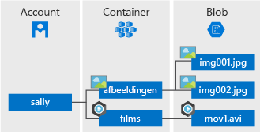

# <a name="introduction-to-azure-blob-storage"></a>Inleiding tot Azure Blob-opslag

[!INCLUDE [storage-blob-concepts-include](../../../includes/storage-blob-concepts-include.md)]

## <a name="blob-storage-resources"></a>Resources voor blobopslag

Er zijn drie typen resources voor blobopslag:

- Het **opslagaccount**. 
- Een **container** in het opslagaccount
- Een **blob** in een container 

Het volgende diagram geeft de relatie tussen deze resources weer.



### <a name="storage-accounts"></a>Opslagaccounts

Een opslagaccount biedt een unieke naamruimte in Azure voor uw gegevens. Elk object dat u in Azure Storage opslaat, heeft een adres dat uw unieke accountnaam bevat. De combinatie van de accountnaam en het service-eindpunt voor Azure Storage vormen de eindpunten voor uw opslagaccount.

Als de naam van uw opslagaccount bijvoorbeeld *mystorageaccount* is, is het standaardeindpunt voor de blobopslag:

```
http://mystorageaccount.blob.core.windows.net 
```

Raadpleeg [Een opslagaccount maken](../common/storage-quickstart-create-account.md) als u een opslagaccount wilt maken. Zie [Overzicht voor Azure-opslagaccounts](../common/storage-account-overview.md?toc=%2fazure%2fstorage%2fblobs%2ftoc.json) voor meer informatie over opslagaccounts.

### <a name="containers"></a>Containers

Een container kan een of meer blobs bevatten, net zoals een map een of meer bestanden kan bevatten in een bestandssysteem. Een opslagaccount kan een onbeperkt aantal containers bevatten en een container kan een onbeperkt aantal blobs bevatten. 

  > [!NOTE]
  > De naam van een container mag alleen kleine letters bevatten. Zie [Naamgeving voor en verwijzingen naar containers, blobs en metagegevens](https://docs.microsoft.com/rest/api/storageservices/Naming-and-Referencing-Containers--Blobs--and-Metadata) voor meer informatie over de naamgeving voor containers.

### <a name="blobs"></a>Blobs
 
Azure Storage ondersteunt drie soorten blobs:

* **Blok-blobs** worden gebruikt voor het opslaan van tekst en binaire gegevens, tot ongeveer 4,7 TB. Blok-blobs bestaan uit blokken met gegevens die afzonderlijk kunnen worden beheerd.
* **Toevoeg-blobs** bestaan uit blokken zoals blok-blobs, maar zijn geoptimaliseerd voor toevoegbewerkingen. Toevoeg-blobs zijn ideaal voor scenario's zoals het registreren van logboekgegevens van virtuele machines.
* **Pagina-blobs** worden gebruikt voor het opslaan van bestanden voor willekeurige toegang tot maximaal 8 TB in grootte. Met pagina-blobs worden de bestanden voor de virtuele harde schijf (VHD) opgeslagen als schijven voor Azure-VM's. Zie (../articles/storage/blobs/storage-blob-pageblob-overview.md) voor meer informatie over pagina-blobs

Zie [Blok-blobs, toevoeg-blobs en pagina-blobs](https://docs.microsoft.com/rest/api/storageservices/understanding-block-blobs--append-blobs--and-page-blobs) voor meer informatie over de verschillende soorten blobs.

## <a name="move-data-to-blob-storage"></a>Gegevens verplaatsen naar de blobopslag

Er zijn een aantal oplossingen waarmee u bestaande gegevens naar de blobopslag kunt migreren:

- **AzCopy** is een gebruiksvriendelijk opdrachtregelprogramma voor Windows en Linux waarmee u in containers of opslagaccounts gegevens kunt kopiëren naar en vanuit de blobopslag. Zie [Gegevensoverdracht met AzCopy v10 (preview-versie)](../common/storage-use-azcopy-v10.md) voor meer informatie over AzCopy. 
- De **bibliotheek voor gegevensverplaatsing van Azure Storage** is een .NET-bibliotheek voor het verplaatsen van gegevens tussen Azure Storage-services. Het hulpprogramma AzCopy is samengesteld uit de bibliotheek voor gegevensverplaatsing. Zie de [naslagdocumentatie](https://docs.microsoft.com/dotnet/api/microsoft.windowsazure.storage.datamovement) voor de bibliotheek voor gegevensverplaatsing voor meer informatie. 
- **Azure Data Factory** ondersteunt het kopiëren van gegevens naar en van de blobopslag met behulp van de accountsleutel, Shared Access Signature, de service-principal of beheerde identiteiten voor de verificatie van Azure-resources. Zie [Gegevens naar en van Azure Blob Storage kopiëren met Azure Data Factory](https://docs.microsoft.com/azure/data-factory/connector-azure-blob-storage?toc=%2fazure%2fstorage%2fblobs%2ftoc.json) voor meer informatie. 
- **Blobfuse** is een stuurprogramma voor het virtuele bestandssysteem voor Azure Blob Storage. U kunt Blobfuse gebruiken om via het Linux-bestandssysteem toegang te krijgen tot uw bestaande blok-blobgegevens in uw Azure Storage-account. Zie [Blob-opslag koppelen als een bestandssysteem met Blobfuse](storage-how-to-mount-container-linux.md) voor meer informatie.
- **Azure Data Box Disk** is een service voor het overzetten van on-premises gegevens naar de blobopslag, wanneer vanwege grote gegevenssets of netwerkbeperkingen de kabel geen realistische optie is voor het uploaden van gegevens. U kunt dan [Azure Data Box Disk](../../databox/data-box-disk-overview.md) gebruiken om SSD's (solid-state drives) aan te vragen bij Microsoft. U kunt vervolgens uw gegevens naar deze schijven kopiëren en ze terugsturen naar Microsoft, waarna ze worden geüpload naar Blob Storage.
- De **Azure Import/Export-service** biedt een manier om grote hoeveelheden gegevens te exporteren van uw opslagaccount naar harde schijven die u levert en die vervolgens door Microsoft met uw gegevens naar u worden teruggestuurd. Zie [De Microsoft Azure Import/Export-service gebruiken om gegevens over te zetten naar de blobopslag](../common/storage-import-export-service.md) voor meer informatie.

## <a name="next-steps"></a>Volgende stappen

* [Een opslagaccount maken](../common/storage-create-storage-account.md?toc=%2fazure%2fstorage%2fblobs%2ftoc.json)
* [Schaalbaarheids- en prestatiedoelen voor Azure Storage](../common/storage-scalability-targets.md)
