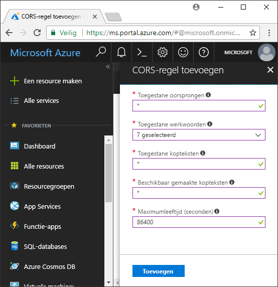

<!-- Customer intent: As a web application developer I want to interface with Azure Blob storage entirely on the client so that I can build a SPA application that is able to upload and delete files on blob storage. -->

# <a name="quickstart-upload-list-and-delete-blobs-using-javascripthtml-in-the-browser"></a>Snelstart: Blobs uploaden, vermelden en verwijderen met behulp van JavaScript/HTML in de browser
In deze snelstart wordt gedemonstreerd hoe u blobs kunt beheren door middel van code die volledig in de browser wordt uitgevoerd. De hier gebruikte aanpak toont hoe u de vereiste beveiligingsmaatregelen dient te gebruiken om verzekerd te zijn van beveiligde toegang tot uw blobopslagaccount. U hebt een [Azure-abonnement](https://azure.microsoft.com/free/?WT.mc_id=A261C142F) nodig om deze quickstart te voltooien.

[!INCLUDE [storage-create-account-portal-include](../../../includes/storage-create-account-portal-include.md)]

## <a name="setting-up-storage-account-cors-rules"></a>CORS-regels voor het opslagaccount instellen 
Voordat uw webtoepassing vanuit de client toegang kan krijgen tot een blob-opslag, moet het account worden geconfigureerd om [cross-origin-resource delen](https://docs.microsoft.com/rest/api/storageservices/cross-origin-resource-sharing--cors--support-for-the-azure-storage-services) in te schakelen. 

Ga terug naar Azure Portal en selecteer uw opslagaccount. Als u een nieuwe CORS-regel wilt definiëren, gaat u terug naar de sectie **Instellingen** en klikt u op de koppeling **CORS**. Klik vervolgens op de knop **Toevoegen** om het venster **CORS-regel toevoegen** te openen. Voor deze snelstart maakt u een open CORS-regel:



In de volgende tabel worden alle CORS-instellingen beschreven en de waarden voor het definiëren van de regel uitgelegd.

|Instelling  |Waarde  | Beschrijving |
|---------|---------|---------|
| Toegestane oorsprongen | * | Accepteert een door komma's gescheiden lijst met domeinen die als acceptabele oorsprongen zijn ingesteld. Als de waarde wordt ingesteld op `*`, hebben alle domeinen toegang tot het opslagaccount. |
| Toegestane bewerkingen     | delete, get, head, merge, post, options en put | Vermeldt de HTTP-bewerkingen die zijn toegestaan om voor het opslagaccount te worden uitgevoerd. Voor deze snelstart selecteert u alle beschikbare opties. |
| Toegestane headers | * | Definieert een lijst met aanvraagheaders (inclusief headers met een voorvoegsel) die door het opslagaccount zijn toegestaan. Als de waarde wordt ingesteld op `*`, hebben alle headers toegang. |
| Weergegeven headers | * | Vermeldt de door het account toegestane antwoordheaders. Als de waarde wordt ingesteld op `*`, kan het account elke header verzenden.  |
| Maximumleeftijd (seconden) | 86400 | De maximale periode dat de browser de voorbereidende aanvraag OPTIONS in de cache opslaat. De waarde *86400* betekent dat de cache een hele dag in stand blijft. |

> [!IMPORTANT]
> Zorg ervoor dat instellingen die u in productie gebruikt, de minimum mate van toegang tot het opslagaccount weergeven zodat beveiligde toegang gehandhaafd blijft. De hier beschreven CORS-instellingen zijn geschikt voor een snelstart, omdat ze een minder streng beveiligingsbeleid definiëren. Deze instellingen worden echter niet aangeraden in reële situaties.

Vervolgens gebruikt u Azure Cloud Shell om een beveiligingstoken te maken.

[!INCLUDE [Open the Azure cloud shell](../../../includes/cloud-shell-try-it.md)]

## <a name="create-a-shared-access-signature"></a>Shared Access Signature maken
Shared Access Signature (handtekening voor gedeelde toegang, SAS) wordt gebruikt door de code die wordt uitgevoerd in de browser om aanvragen bij de blob-opslag te verifiëren. Als u een SAS gebruikt, kan de client toegang tot de opslagresources autoriseren zonder de toegangssleutel of verbindingsreeks van het account. Zie [Handtekeningen voor gedeelde toegang gebruiken](../common/storage-dotnet-shared-access-signature-part-1.md) voor meer informatie over SAS.

U kunt een SAS maken met behulp van de CLI via de Azure-cloudshell of met Azure Storage Explorer. In de volgende tabel worden de parameters beschreven waar u waarden voor moet opgeven om een SAS te maken met de CLI.

| Parameter      |Beschrijving  | Tijdelijke aanduiding |
|----------------|-------------|-------------|
| *expiry*       | De vervaldatum van het toegangstoken in de notatie JJJJ-MM-DD. Voer voor deze snelstart de datum van morgen in. | *FUTURE_DATE* |
| *account-name* | De naam van het opslagaccount. Gebruik de naam die in een vorige stap is bewaard. | *YOUR_STORAGE_ACCOUNT_NAME* |
| *account-key*  | De opslagaccountsleutel. Gebruik de sleutel die in een vorige stap is bewaard. | *YOUR_STORAGE_ACCOUNT_KEY* |

In het volgende script is de Azure CLI gebruikt om een SAS te maken die u kunt doorgeven aan een JavaScript-blob-service.

> [!NOTE]
> Voor het beste resultaat verwijdert u de extra spaties tussen de parameters voordat u de opdracht in Azure Cloud Shell plakt.

```bash
az storage account generate-sas
                    --permissions racwdl
                    --resource-types sco
                    --services b
                    --expiry FUTURE_DATE
                    --account-name YOUR_STORAGE_ACCOUNT_NAME
                    --account-key YOUR_STORAGE_ACCOUNT_KEY
```
Mogelijk vindt u de reeks waarden na elke parameter wat cryptisch. Deze parameterwaarden zijn afkomstig van de eerste letter van hun respectieve machtiging. In de volgende tabel wordt uitgelegd waar de waarden vandaan komen: 

| Parameter        | Waarde   | Beschrijving  |
|------------------|---------|---------|
| *permissions*    | racwdl  | Deze SAS staat de mogelijkheden *read*, *append*, *create*, *write*, *delete* en *list* toe. |
| *resource-types* | sco     | De resources die waar de SAS invloed op heeft, zijn *service*, *container* en *object*. |
| *services*       | b       | De service waar de SAS invloed op heeft is de *blob*-service. |

Als de SAS is gegenereerd, kopieert u de waarde die in de console is geretourneerd in de teksteditor. Gebruik deze waarde in een volgende stap.

> [!IMPORTANT]
> Geef in productie SAS-tokens altijd door met behulp van SSL. SAS-tokens moeten op de server worden gegenereerd en naar de HTML-pagina verzonden om ze opnieuw door te geven aan Azure Blob Storage. U kunt eventueel een serverloze functie gebruiken om SAS-tokens te genereren. Azure Portal bevat functiesjablonen waarmee een SAS kan worden gemaakt met behulp van een JavaScript-functie.

## <a name="implement-the-html-page"></a>HTML-pagina implementeren

### <a name="set-up-the-web-application"></a>Webtoepassing instellen
De JavaScript-clientbibliotheken van Azure Storage werken niet rechtstreeks vanuit het bestandssysteem en moeten vanaf een webserver worden geleverd. In de volgende stappen wordt uiteengezet hoe u een eenvoudige, lokale webserver met Node.js kunt gebruiken.

> [!NOTE]
> In deze sectie wordt getoond hoe u een lokale webserver kunt maken waarvoor Node.js op uw computer moet worden geïnstalleerd. Als u Node.js niet wilt installeren, kunt u een andere manier gebruiken om een lokale webserver uit te voeren.

Maak eerst een nieuwe map voor het project en geef deze de naam *azure-blobs-javascript*. Open vervolgens een opdrachtprompt in de map *azure-blobs-javascript* en bereid de toepassing voor op de installatie van de webservermodule door de volgende opdracht in te voeren:

```bash
npm init -y
```
Door *init* uit te voeren, worden bestanden toegevoegd waarmee een webservermodule kan worden geïnstalleerd. Voer de volgende opdracht uit om de module te installeren:

```bash
npm i http-server
```
Bewerk vervolgens het bestand *package.json* en vervang de bestaande definitie *scripts* door het volgende codefragment:

```javascript
"scripts": {
    "start": "http-server"
}
```
Voer ten slotte `npm start` in de opdrachtprompt in om de webserver te starten:

```bash
npm start
```

### <a name="get-the-blob-storage-client-library"></a>Clientbibliotheek voor blob-opslag ophalen
[Download de JavaScript-clientbibliotheken](https://aka.ms/downloadazurestoragejs), extraheer de inhoud van het zip-bestand en plaats de scriptbestanden vanuit de map *bundle* in de map *scripts*.

### <a name="add-the-client-script-reference-to-the-page"></a>De verwijzing naar het clientscript aan de pagina toevoegen
Maak een HTML-pagina in de hoofdmap van de map *azure-blobs-javascript* en geef deze de naam *index.html*. Als de pagina is gemaakt, voegt u er de volgende markeringen aan toe.

```html
<!DOCTYPE html>
<html>
    <body>
        <button id="create-button">Create Container</button>

        <input type="file" id="fileinput" />
        <button id="upload-button">Upload</button>

        <button id="list-button">List</button>
        
        <button id="delete-button">Delete</button>
    </body>
    <script src="scripts/azure-storage.blob.min.js"></script>
    <script>
        // Blob-related code goes here
    </script>
</html>
```
Deze markeringen bevatten:

- een verwijzing naar *scripts/azure-storage.blob.js*
- knoppen voor het maken van een container en het uploaden, vermelden en verwijderen van blobs
- een element *INPUT* om bestanden te uploaden
- een tijdelijke aanduiding voor opslagspecifieke code

### <a name="create-an-instance-of-blobservice"></a>Een exemplaar van BlobService maken 
[BlobService](https://azure.github.io/azure-storage-node/BlobService.html) biedt een interface voor Azure Blob Storage. Als u een exemplaar van de service wilt maken, dient u de naam van het opslagaccount op te geven en tevens de SAS die in de vorige stap is gemaakt.

```javascript
const account = {
    name: YOUR_STORAGE_ACCOUNT_NAME,
    sas:  YOUR_SAS
};

const blobUri = 'https://' + account.name + '.blob.core.windows.net';
const blobService = AzureStorage.Blob.createBlobServiceWithSas(blobUri, account.sas);
```

### <a name="create-a-blob-container"></a>Een blob-container maken
Als de blob-service is gemaakt, kunt u een nieuwe container maken om een geüploade blob te bewaren. Met de methode [createContainerIfNotExists](https://azure.github.io/azure-storage-node/BlobService.html#createContainerIfNotExists__anchor) wordt een nieuwe container gemaakt. Er wordt geen fout geretourneerd als de container al bestaat.

```javascript
document.getElementById('create-button').addEventListener('click', () => {

    blobService.createContainerIfNotExists('mycontainer',  (error, container) => {
        if (error) {
            // Handle create container error
        } else {
            console.log(container.name);
        }
    });

});
```

### <a name="upload-a-blob"></a>Een blob uploaden
Als u een blob wilt uploaden vanuit een HTML-formulier, krijgt u een verwijzing naar het geselecteerde bestand vanaf een *INPUT*-element. Het geselecteerde bestand is beschikbaar via de `files`-matrix wanneer *type* van het element is ingesteld op *file*.

Met het script kunt u verwijzen naar het HTML-element en het geselecteerde bestand doorgeven aan de blob-service.

```javascript
document.getElementById('upload-button').addEventListener('click', () => {

    const file = document.getElementById('fileinput').files[0];

    blobService.createBlockBlobFromBrowserFile('mycontainer', 
                                                file.name, 
                                                file, 
                                                (error, result) => {
                                                    if(error) {
                                                        // Handle blob error
                                                    } else {
                                                        console.log('Upload is successful');
                                                    }
                                                });

});
```

De methode [createBlockBlobFromBrowserFile](https://azure.github.io/azure-storage-node/BlobService.html#createBlockBlobFromBrowserFile__anchor) maakt rechtstreeks gebruik van het browserbestand om naar een blobcontainer te uploaden.

### <a name="list-blobs"></a>Blobs vermelden
Als u een bestand hebt geüpload in de blobcontainer, kunt u met de methode [listBlobsSegmented](https://azure.github.io/azure-storage-node/BlobService.html#listBlobsSegmented__anchor) een lijst met blobs in de container openen.

```javascript
document.getElementById('list-button').addEventListener('click', () => {

    blobService.listBlobsSegmented('mycontainer', null, (error, results) => {
        if (error) {
            // Handle list blobs error
        } else {
            results.entries.forEach(blob => {
                console.log(blob.name);
            });
        }
    });
    
});
```

De methode *listBlobsSegmented* retourneert een verzameling blobs. Standaard bestaat de verzameling uit 5000 blobs, maar u kunt deze hoeveelheid naar behoefte aanpassen. Het [continueringsvoorbeeld](https://github.com/Azure/azure-storage-node/blob/master/examples/samples/continuationsample.js#L132) toont hoe u dient om te gaan met een groot aantal blobs en hoe de clientbibliotheek paginering ondersteunt. 


### <a name="delete-blobs"></a>Blobs verwijderen
U kunt de geüploade blob verwijderen door [deleteBlobIfExists](https://azure.github.io/azure-storage-node/BlobService.html#deleteBlobIfExists__anchor) aan te roepen.

```javascript
document.getElementById('delete-button').addEventListener('click', () => {

    var blobName = YOUR_BLOB_NAME;
    blobService.deleteBlobIfExists('mycontainer', blobName, (error, result) => {
        if (error) {
            // Handle delete blob error
        } else {
            console.log('Blob deleted successfully');
        }
    });
    
});
```
> [!WARNING]
> Om dit codevoorbeeld goed te laten werken, dient u een tekenreekswaarde voor *blobName* op te geven.

## <a name="clean-up-resources"></a>Resources opschonen
Als u de resources die in deze snelstart zijn gemaakt, wilt opschonen, gaat u terug naar [Azure Portal](https://portal.azure.com) en selecteert u uw opslagaccount. Vervolgens verwijdert u het opslagaccount via **Overzicht > Opslagaccount verwijderen**.

## <a name="next-steps"></a>Volgende stappen
Bekijk de voorbeelden om te leren hoe u tijdens het uploaden van bestanden blobs kunt downloaden en de voortgang rapporteren.

> [!div class="nextstepaction"]
> [Clientbibliotheken voor blob-opslag](https://github.com/Azure/azure-storage-node/tree/master/browser)
