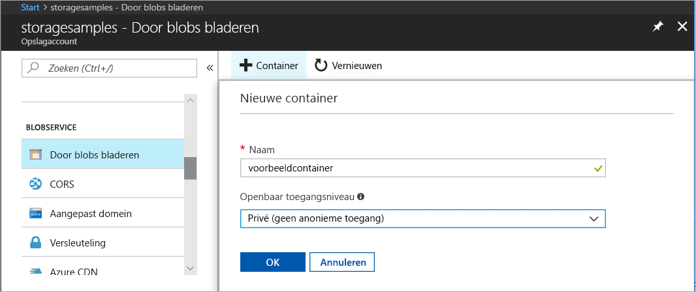
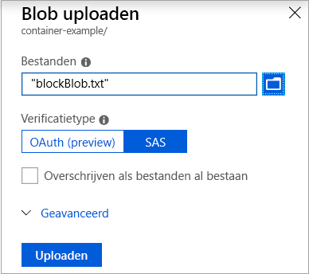
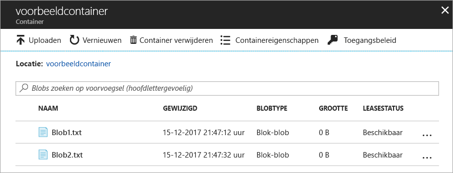
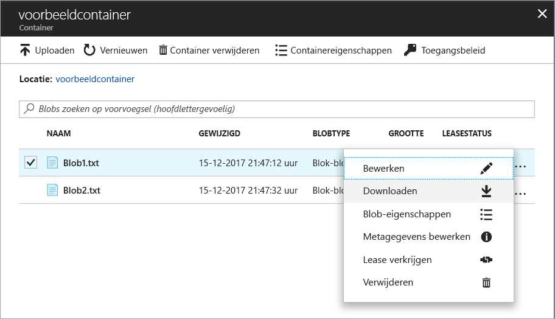

# Objecten overdragen naar/van Azure Blob-opslag met Azure Portal

In deze snelstartgids leert u hoe u [Azure Portal](https://portal.azure.com/) gebruikt om een container te maken in Azure Storage, en om blok-blobs in deze container te uploaden en te downloaden.

## Vereisten

Als u nog geen abonnement op Azure hebt, maak dan een [gratis account](https://azure.microsoft.com/free/?WT.mc_id=A261C142F) aan voordat u begint.

[!INCLUDE [storage-quickstart-tutorial-create-account-portal](../../../includes/storage-quickstart-tutorial-create-account-portal.md)]

## Een container maken

Als u een container wilt maken in Azure Portal, volgt u deze stappen:

1. Navigeer naar het nieuwe opslagaccount in Azure Portal.
2. Schuif in het linkermenu voor het opslagaccount naar de sectie **Blob service**. Selecteer vervolgens **Door blobs bladeren**.
3. Klik op de knop **Container toevoegen**.
4. Voer een naam in voor de nieuwe container. De containernaam mag alleen kleine letters bevatten, moet beginnen met een letter of cijfer, en mag alleen letters, cijfers en het streepje (-) bevatten. Zie [Naming and Referencing Containers, Blobs, and Metadata](https://docs.microsoft.com/rest/api/storageservices/naming-and-referencing-containers--blobs--and-metadata) (Containers, blobs en metagegevens een naam geven en hiernaar verwijzen) voor meer informatie over de namen van containers en blobs.
5. Stel het niveau van openbare toegang tot de container in. Het standaardniveau is **Persoonlijk (geen anonieme toegang)**.
6. Klik op **OK** om de container te maken.

    

## Een blok-blob uploaden

Blok-blobs bestaan uit blokken met gegevens die worden samengevoegd tot een blob. In de meeste gebruiksscenario's voor Blob-opslag worden blok-blobs gebruikt. Blok-blobs zijn zeer geschikt om tekst en binaire gegevens op te slaan in de cloud, zoals bestanden, afbeeldingen en video's. Deze snelstartgids laat zien hoe u kunt werken met blok-blobs. 

Als u een blok-blob wilt uploaden naar de nieuwe container in Azure Portal, volgt u deze stappen:

1. Navigeer in Azure Portal naar de container die u in de vorige sectie hebt gemaakt.
2. Selecteer de container om een lijst weer te geven met de blobs die deze bevat. In dit geval hebt u een nieuwe container gemaakt die nog geen blobs bevat.
3. Klik op de knop **Uploaden** om een blob te uploaden naar de container.
4. Blader in het lokale bestandssysteem om te zoeken naar een bestand dat u kunt uploaden als een blok-blob, en klik op **Uploaden**.
     
    

5. U kunt op deze manier zoveel blobs uploaden als u wilt. De nieuwe blobs worden nu weergegeven in de container.

    

## Een blok-blob downloaden

U kunt een blok-blob downloaden om deze weer te geven in de browser of op te slaan op het lokale bestandssysteem. Als u een blok-blob wilt downloaden, volgt u deze stappen:

1. Navigeer naar de lijst met blobs die u in de vorige sectie hebt geüpload. 
2. Selecteer de blob die u wilt downloaden.
3. Klik met de rechtermuisknop op de knop **Meer** (**...** ), en selecteer **Downloaden**. 

## Resources opschonen

Als u de resources wilt verwijderen die u in deze snelstartgids hebt gemaakt, verwijdert u gewoon de container. Alle blobs in de container worden dan ook verwijderd.

Ga als volgt te werk om de container te verwijderen:

1. Navigeer in Azure Portal naar de lijst met containers in uw opslagaccount.
2. Selecteer de container die u wilt verwijderen.
3. Klik met de rechtermuisknop op de knop **Meer** (**...** ), en selecteer **Verwijderen**.
4. Bevestig dat u de container wilt verwijderen.

       

## Volgende stappen

In deze snelstartgids hebt u geleerd hoe u bestanden overbrengt tussen een lokale schijf en Azure Blob-opslag met behulp van .NET. Voor meer informatie over het werken met Blob-opslag, gaat u naar de instructies voor Blob-opslag.

> [!div class="nextstepaction"]
> [Instructies voor bewerkingen in Blob-opslag](storage-dotnet-how-to-use-blobs.md)

