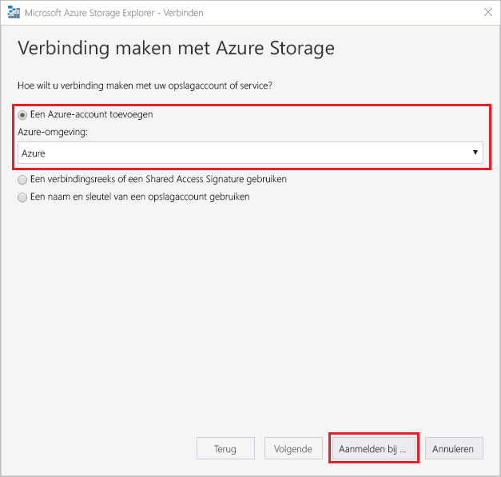
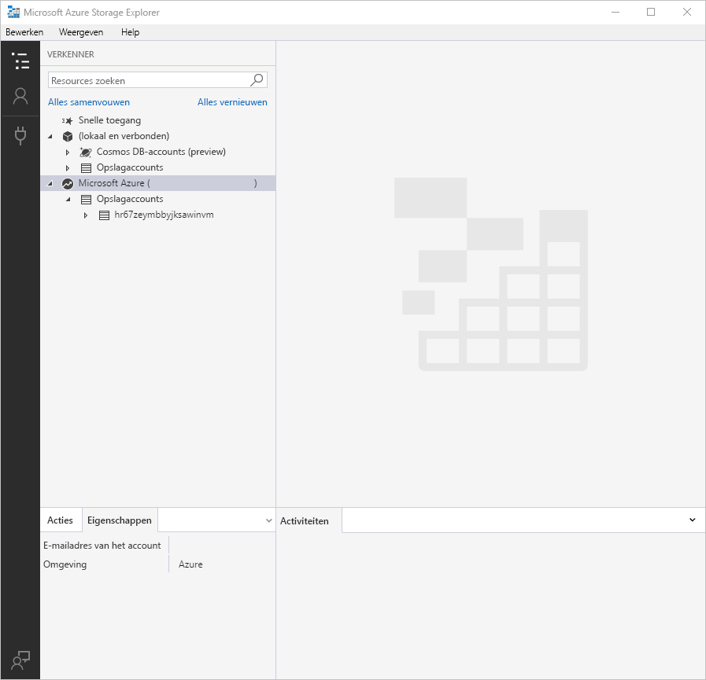
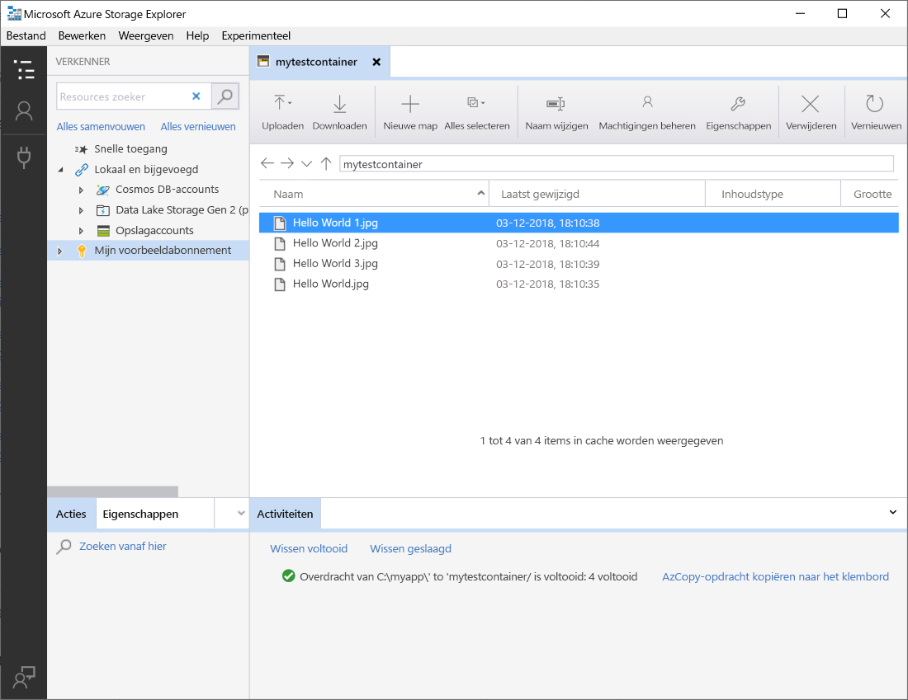
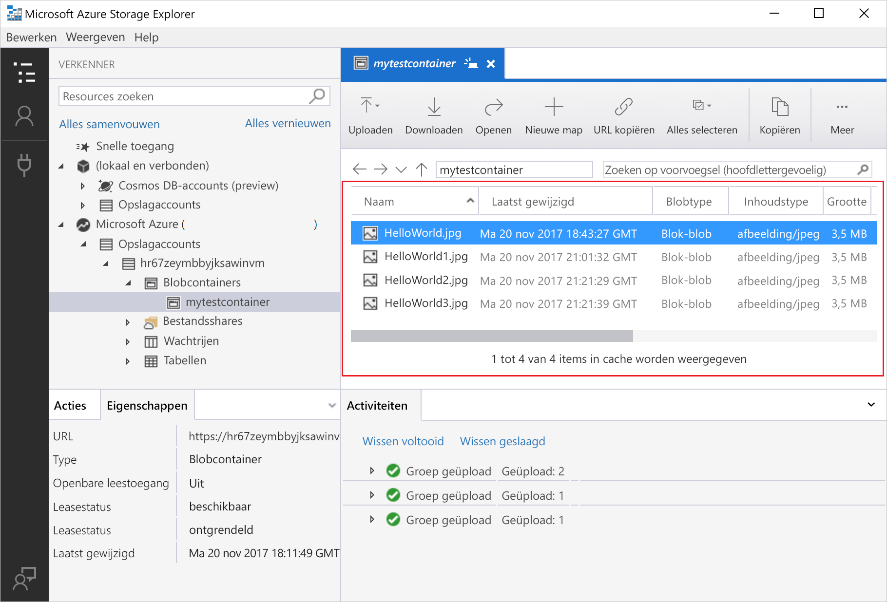
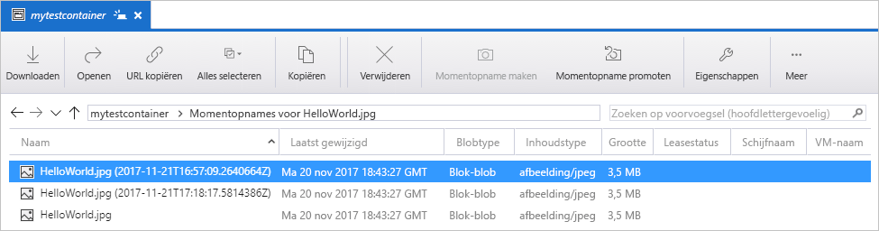
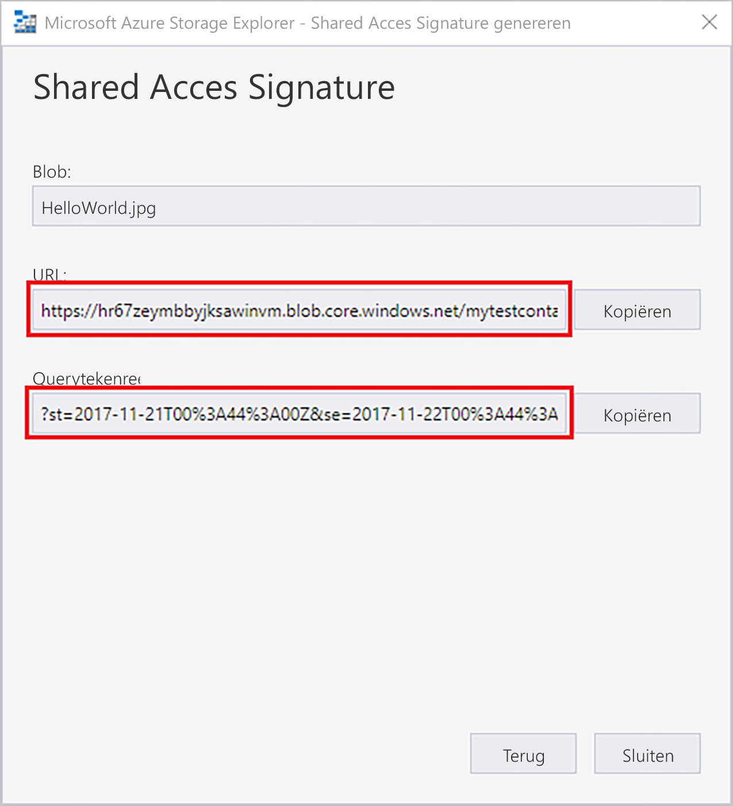

# Objecten overdragen naar/van Azure Blob-opslag met behulp van Azure Storage Explorer

[Azure Storage Explorer](https://azure.microsoft.com/features/storage-explorer/) is een gebruikersinterface met meerdere platforms die wordt gebruikt om de inhoud van opslagaccounts te beheren. In deze handleiding wordt gedetailleerd uitgelegd hoe u Azure Storage Explorer kunt gebruiken om bestanden over te dragen tussen een lokale schijf en Azure Blob-opslag.

Als u nog geen abonnement op Azure hebt, maak dan een [gratis account](https://azure.microsoft.com/free/?WT.mc_id=A261C142F) aan voordat u begint.

Voor deze snelstartgids moet Azure Storage Explorer zijn geïnstalleerd. Als u dit programma wilt installeren, gaat u naar [Azure Storage Explorer](https://azure.microsoft.com/features/storage-explorer/) om het te downloaden voor Windows, Macintosh of Linux.

[!INCLUDE [storage-quickstart-tutorial-create-account-portal](../../../includes/storage-quickstart-tutorial-create-account-portal.md)]

## Aanmelden bij Storage Explorer

Bij de eerste keer opstarten wordt het venster **Microsoft Azure Storage Explorer - Verbinding maken** weergegeven. Storage Explorer biedt verschillende manieren om verbinding te maken met opslagaccounts. In de volgende tabel ziet u de verschillende manieren waarop u verbinding kunt maken:

|Taak|Doel|
|---|---|
|Een Azure-account toevoegen | Leidt u naar de aanmeldingspagina van uw organisatie om u te verifiëren bij Azure. |
|Een verbindingsreeks of een SAS-URI (Shared Access Signature) gebruiken | Kan worden gebruikt voor rechtstreekse toegang tot een container of opslagaccount met behulp van een SAS-token of een gedeelde verbindingsreeks. |
|De naam en sleutel van een opslagaccount gebruiken| Gebruik de naam en sleutel van uw opslagaccount om verbinding te maken met Azure Storage.|

Selecteer **Een Azure-account toevoegen** en klik op **Aanmelden...** . Volg de instructies op het scherm om u aan te melden bij uw Azure-account.

Wanneer de verbinding tot stand is gebracht, wordt Azure Storage Explorer geladen en ziet u het tabblad **Explorer**. Deze weergave biedt u inzicht in al uw Azure Storage-accounts, evenals lokale opslag die is geconfigureerd via de [Azure-opslagemulator](../common/storage-use-emulator.md?toc=%2fazure%2fstorage%2fblobs%2ftoc.json), [Cosmos DB](../../cosmos-db/storage-explorer.md?toc=%2fazure%2fstorage%2fblobs%2ftoc.json)-accounts of [Azure Stack](../../azure-stack/user/azure-stack-storage-connect-se.md?toc=%2fazure%2fstorage%2fblobs%2ftoc.json)-omgevingen.

## Een container maken

Blobs worden altijd naar een container geüpload. Hierdoor kunt u groepen blobs ordenen net zoals u bestanden in mappen op de computer ordent.

Breid het opslagaccount uit dat u hebt gemaakt in de vorige stap, om een container te maken. Selecteer **Blobcontainers**, klik met de rechtermuisknop en selecteer **Blobcontainer maken**. Voer een naam in voor de blobcontainer. Raadpleeg de sectie [Naamgevingsregels voor containers](storage-dotnet-how-to-use-blobs.md#create-a-container) voor een lijst met regels en beperkingen voor namen van blobcontainers. Als u klaar bent, drukt u op **Enter** om de blobcontainer te maken. Als de blobcontainer is gemaakt, wordt deze weergegeven in de map **Blobcontainers** voor het geselecteerde opslagaccount.

## Blobs uploaden naar de container

Blob-opslag ondersteunt blok-blobs, toevoeg-blobs en pagina-blobs. VHD-bestanden die worden gebruikt voor IaaS-VM's zijn pagina-blobs. Toevoeg-blobs worden gebruikt voor logboekregistratie, bijvoorbeeld wanneer u wilt schrijven naar een bestand en vervolgens meer gegevens wilt blijven toevoegen. De meeste bestanden die zijn opgeslagen in Blob-opslag, zijn blok-blobs.

Selecteer op het containerlint de optie **Uploaden**. Met deze bewerking kunt u een map of bestand uploaden.

Kies de bestanden of map die u wilt uploaden. Selecteer het **blobtype**. Acceptabele keuzes zijn **Toevoeg-blob**, **Pagina-blob** of **Blok-blob**.

Als u een VHD- of VHDX-bestand uploadt, kiest u **VHD-/VHDX-bestanden uploaden als pagina-blobs (aanbevolen)**.

Selecteer in het veld **Uploaden naar map (optioneel)** de naam van een map om de bestanden of mappen in op te slaan. Deze map moet in de containermap zitten. Als er geen map is gekozen, worden de bestanden rechtstreeks geüpload naar de containermap.

Wanneer u **OK** selecteert, worden de geselecteerde bestanden in een wachtrij geplaatst om te worden geüpload. Elk bestand wordt geüpload. Wanneer het uploaden is voltooid, worden de resultaten weergegeven in het venster **Activiteiten**.

## Blobs in een container weergeven

Selecteer in de toepassing **Azure Storage Explorer** een container in een opslagaccount. In het hoofdvenster ziet u een lijst met de blobs in de geselecteerde container.

## Blobs downloaden

Als u blobs wilt downloaden met behulp van **Azure Storage Explorer**, selecteert u een blob en selecteert u vervolgens **Downloaden** op het lint. Er wordt een dialoogvenster geopend waarin u een bestandsnaam kunt invoeren. Selecteer **Opslaan** om het downloaden van een blob naar de lokale locatie te starten.

## Momentopnamen beheren

Azure Storage Explorer biedt de mogelijkheid om [momentopnamen](storage-blob-snapshots.md) van blobs te maken en te beheren. Als u een momentopname van een blob wilt maken, klikt u met de rechtermuisknop op de blob en selecteert u **Momentopname maken**. Als u een momentopnamen van een blob wilt bekijken, klikt u met de rechtermuisknop op de blob en selecteert u **Momentopname beheren**. Op het huidige tabblad wordt een lijst weergegeven met de momentopnamen voor de blob.

## Toegangsbeleid beheren

Storage Explorer biedt de mogelijkheid om toegangsbeleid voor containers te beheren in de bijbehorende gebruikersinterface. Er zijn twee typen beleid voor beveiligde toegang (SAS), op serviceniveau en op accountniveau. Een SAS op accountniveau is gericht op het opslagaccount en kan worden toegepast op meerdere services en resources. Een SAS op serviceniveau is gedefinieerd voor een resource onder een bepaalde service. Als u een SAS op serviceniveau wilt genereren, klikt u met de rechtermuisknop op een willekeurige container en selecteert u **Toegangsbeleid beheren...** . Als u een SAS op accountniveau wilt genereren, klikt u met de rechtermuisknop op het opslagaccount.

Selecteer **Toevoegen** om nieuw toegangsbeleid toe te voegen en de machtigingen voor het beleid te definiëren. Wanneer u klaar bent, selecteert u **Opslaan** om het toegangsbeleid op te slaan. Dit beleid is nu beschikbaar voor gebruik bij het configureren van een handtekening voor gedeelde toegang.

## Werken met handtekeningen voor gedeelde toegang

Handtekeningen voor gedeelde toegang (Shared Access Signatures) kunnen worden opgehaald via Storage Explorer. Klik met de rechtermuisknop op een opslagaccount, container of blob, en kies **Shared Access Signature ophalen...** . Kies de begin- en verlooptijd, en de machtigingen voor de SAS-URL en selecteer **Maken**. De volledige URL met de querytekenreeks, alsook de querytekenreeks zelf, worden geleverd en kunnen worden gekopieerd in het volgende scherm.

## Volgende stappen

In deze snelstartgids hebt u geleerd hoe u bestanden overdraagt tussen een lokale schijf en Azure Blob-opslag met behulp van **Azure Storage Explorer**. Voor meer informatie over het werken met Blob-opslag, gaat u naar de instructies voor Blob-opslag.

> [!div class="nextstepaction"]
> [Instructies voor bewerkingen in Blob-opslag](storage-how-to-use-blobs-powershell.md)
