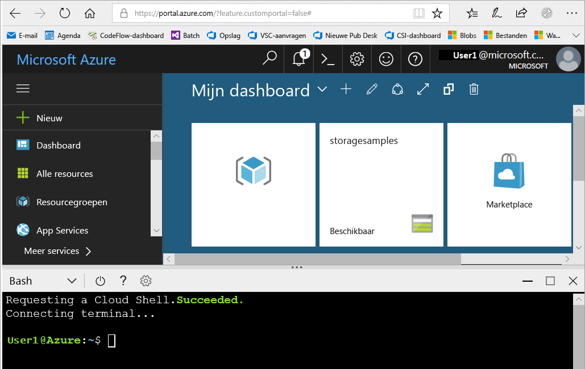
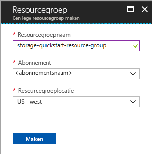
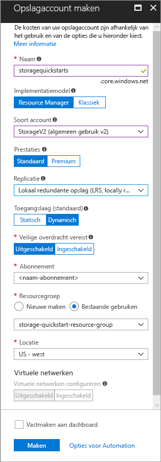

# <a name="create-a-storage-account"></a>Create a storage account

Een Azure-opslagaccount biedt een unieke naamruimte in de cloud voor het opslaan en openen van uw gegevensobjecten in Azure Storage. Een opslagaccount bevat alle blobs, bestanden, wachtrijen, tabellen en schijven die u in dit account maakt. 

Als u aan de slag wilt gaan met Azure Storage, moet u eerst een nieuw opslagaccount maken. U kunt een Azure Storage-account maken met behulp van [Azure Portal](https://portal.azure.com/), [Azure PowerShell](https://docs.microsoft.com/powershell/azure/overview) of [Azure CLI](https://docs.microsoft.com/cli/azure?view=azure-cli-latest). Deze snelstartgids laat zien hoe u elk van deze opties kunt gebruiken om uw nieuwe opslagaccount te maken. 


## <a name="prerequisites"></a>Vereisten

Als u nog geen abonnement op Azure hebt, maak dan een [gratis account](https://azure.microsoft.com/free/) aan voordat u begint.

# <a name="portaltabportal"></a>[Portal](#tab/portal)

Geen.

# <a name="powershelltabpowershell"></a>[PowerShell](#tab/powershell)

Voor deze snelstartgids is moduleversie 3.6 of later van Azure PowerShell vereist. Voer `Get-Module -ListAvailable AzureRM` uit om uw huidige versie te vinden. Als u PowerShell wilt installeren of upgraden, raadpleegt u [De Azure PowerShell-module installeren](/powershell/azure/install-azurerm-ps).

# <a name="azure-clitabazure-cli"></a>[Azure-CLI](#tab/azure-cli)

U kunt u aanmelden bij Azure en Azure CLI-opdrachten uitvoeren. Dit kan op twee manieren:

- U kunt CLI-opdrachten uitvoeren vanuit Azure Portal, in Azure Cloud Shell 
- U kunt de CLI installeren en CLI-opdrachten lokaal uitvoeren  

### <a name="use-azure-cloud-shell"></a>Azure Cloud Shell gebruiken

Azure Cloud Shell is een gratis Bash-shell die u rechtstreeks in Azure Portal kunt uitvoeren. In deze shell is de Azure CLI vooraf geïnstalleerd en geconfigureerd voor gebruik met uw account. Klik op de knop **Cloud Shell** in het menu rechtsboven in Azure Portal:

[](https://portal.azure.com)

Met de knop start u een interactieve shell waarmee u alle stappen in deze snelstartgids kunt uitvoeren:

[](https://portal.azure.com)

### <a name="install-the-cli-locally"></a>De CLI lokaal installeren

U kunt Azure CLI ook lokaal installeren en gebruiken. Voor deze snelstartgids moet u de versie Azure CLI 2.0.4 of hoger uitvoeren. Voer `az --version` uit om de versie te bekijken. Als u Azure CLI 2.0 wilt installeren of upgraden, raadpleegt u [Azure CLI 2.0 installeren](/cli/azure/install-azure-cli). 

---

## <a name="log-in-to-azure"></a>Meld u aan bij Azure.

# <a name="portaltabportal"></a>[Portal](#tab/portal)

Meld u aan bij [Azure Portal](https://portal.azure.com).

# <a name="powershelltabpowershell"></a>[PowerShell](#tab/powershell)

Meld u aan bij uw Azure-abonnement met de opdracht `Connect-AzureRmAccount` en volg de instructies op het scherm.

```powershell
Connect-AzureRmAccount
```

# <a name="azure-clitabazure-cli"></a>[Azure-CLI](#tab/azure-cli)

Meld u aan bij [Azure Portal](https://portal.azure.com) om Azure Cloud Shell te starten.

Als u zich wilt aanmelden bij de lokale installatie van de CLI, voert u de opdracht voor aanmelden uit:

```cli
az login
```

---

## <a name="create-a-resource-group"></a>Een resourcegroep maken

Een Azure-resourcegroep is een logische container waarin Azure-resources worden geïmplementeerd en beheerd. Zie [Azure Resource Manager overview](../../azure-resource-manager/resource-group-overview.md) (Overzicht van Azure Resource Manager) voor meer informatie over resourcegroepen.

# <a name="portaltabportal"></a>[Portal](#tab/portal)

Als u een resourcegroep wilt maken in Azure Portal, volgt u deze stappen:

1. Vouw het menu aan de linkerkant in Azure Portal uit om het menu met services te openen en kies **Resourcegroepen**.
2. Klik op de knop **Toevoegen** om een nieuwe resourcegroep toe te voegen.
3. Voer een naam in voor de nieuwe resourcegroep.
4. Selecteer het abonnement waarin u de nieuwe resourcegroep wilt maken.
5. Kies de locatie voor de resourcegroep.
6. Klik op de knop **Maken**.  



# <a name="powershelltabpowershell"></a>[PowerShell](#tab/powershell)

Gebruik de opdracht [New-AzureRmResourceGroup](/powershell/module/azurerm.resources/new-azurermresourcegroup) om een nieuwe resourcegroep te maken: 

```powershell
# put resource group in a variable so you can use the same group name going forward,
# without hardcoding it repeatedly
$resourceGroup = "storage-quickstart-resource-group"
New-AzureRmResourceGroup -Name $resourceGroup -Location $location 
```

Als u niet zeker weet welke regio u moet opgeven voor de parameter `-Location`, kunt u een lijst met ondersteunde regio's voor uw abonnement ophalen met de opdracht [Get-AzureRmLocation](/powershell/module/azurerm.resources/get-azurermlocation):

```powershell
Get-AzureRmLocation | select Location 
$location = "westus"
```

# <a name="azure-clitabazure-cli"></a>[Azure-CLI](#tab/azure-cli)

Gebruik de opdracht [az group create](/cli/azure/group#az_group_create) om een nieuwe resourcegroep te maken met Azure CLI. 

```azurecli-interactive
az group create \
    --name storage-quickstart-resource-group \
    --location westus
```

Als u niet zeker weet welke regio u moet opgeven voor de parameter `--location`, kunt u een lijst met ondersteunde regio's voor uw abonnement ophalen met de opdracht [az account list-locations](/cli/azure/account#az_account_list).

```azurecli-interactive
az account list-locations \
    --query "[].{Region:name}" \
    --out table
```

---

## <a name="create-a-general-purpose-storage-account"></a>Een opslagaccount voor algemeen gebruik maken

Een opslagaccount voor algemeen gebruik biedt toegang tot alle services van Azure Storage: blobs, bestanden, wachtrijen en tabellen. Een opslagaccount voor algemeen gebruik kan worden gemaakt in een Standard- of Premium-laag. In de voorbeelden in dit artikel ziet u hoe u een opslagaccount voor algemeen gebruik maakt in de Standard-laag (de standaardinstelling).

Azure Storage biedt twee typen opslagaccounts voor algemeen gebruik:

- V2-accounts voor algemeen gebruik 
- V1-accounts voor algemeen gebruik. 

> [!NOTE]
> Het wordt aanbevolen dat u nieuwe opslagaccounts als **v2-accounts voor algemene doeleinden** maakt, om te profiteren van nieuwe functies die beschikbaar zijn voor deze accounts.  

Zie [Opties voor Azure-opslagaccounts](storage-account-options.md) voor meer informatie over opslagaccounts.

Neem de volgende regels in acht als u het opslagaccount een naam geeft:

- Namen van opslagaccounts moeten tussen 3 en 24 tekens lang zijn en mogen alleen cijfers en kleine letters bevatten.
- De naam van uw opslagaccount moet uniek zijn binnen Azure. Een opslagaccount kan niet dezelfde naam hebben als een ander opslagaccount.

# <a name="portaltabportal"></a>[Portal](#tab/portal)

Als u een v2-opslagaccount voor algemeen gebruik wilt maken in de Azure Portal, volgt u deze stappen:

1. Vouw in Azure Portal het menu links open om het menu met services te openen en kies **Alle services**. Schuif vervolgens omlaag naar **Opslag** en kies **Opslagaccounts**. Kies in het venster **Opslagaccounts** dat wordt weergegeven de optie **Toevoegen**.
2. Voer een naam in voor het opslagaccount.
3. Stel het veld **Soort account** in op **StorageV2 (algemeen gebruik v2)**.
4. Laat het veld **Replicatie** ingesteld op **Lokaal redundante opslag (LRS)**. Ook kunt u kiezen voor **Zone-redundante opslag (ZRS)**, **Geografisch redundante opslag (GRS)** of **Geografisch redundante opslag met leestoegang (RA-GRS)**.
5. Laat deze velden ingesteld op hun standaardwaarden: **Implementatiemodel**, **Prestaties**, **Veilige overdracht vereist**.
6. Kies het abonnement waarin u het opslagaccount wilt maken.
7. Selecteer in de sectie **Resourcegroep** de optie **Bestaande gebruiken**. Kies vervolgens de resourcegroep die u in de vorige sectie hebt gemaakt.
8. Kies de locatie voor het nieuwe opslagaccount.
9. Klik op **Maken** om het opslagaccount te maken.      



# <a name="powershelltabpowershell"></a>[PowerShell](#tab/powershell)

Gebruik de opdracht [New-AzureRmStorageAccount](/powershell/module/azurerm.storage/New-AzureRmStorageAccount) om een v2-opslagaccount voor algemeen gebruik te maken vanuit PowerShell met lokaal redundante opslag (LRS): 

```powershell
New-AzureRmStorageAccount -ResourceGroupName $resourceGroup `
  -Name "storagequickstart" `
  -Location $location `
  -SkuName Standard_LRS `
  -Kind StorageV2 
```

Om een v2-opslagaccount voor algemeen gebruik te maken met zone-redundante opslag (ZRS) (preview), geografisch redundante opslag (GRS) of geografisch redundante opslag met leestoegang (RA-GRS), vervangt u de **SkuName**-parameter in de onderstaande tabel met de gewenste waarde. 

|Replicatie-optie  |De parameter SkuName  |
|---------|---------|
|Lokaal redundante opslag (LRS)     |Standard_LRS         |
|Zone-redundante opslag (ZRS)     |Standard_ZRS         |
|Geografisch redundante opslag (GRS)     |Standard_GRS         |
|Geografisch redundante opslag met leestoegang (GRS)     |Standard_RAGRS         |

# <a name="azure-clitabazure-cli"></a>[Azure-CLI](#tab/azure-cli)

Gebruik de opdracht [az storage account create](/cli/azure/storage/account#az_storage_account_create) om een v2-opslagaccount voor algemeen gebruik met lokaal redundante opslag te maken vanuit de Azure CLI.

```azurecli-interactive
az storage account create \
    --name storagequickstart \
    --resource-group storage-quickstart-resource-group \
    --location westus \
    --sku Standard_LRS \
    --kind StorageV2
```

Om een v2-opslagaccount voor algemeen gebruik te maken met zone-redundante opslag (ZRS Preview), geografisch redundante opslag (GRS) of geografisch redundante opslag met leestoegang (RA-GRS), vervangt u de parameter **sku** in de onderstaande tabel met de gewenste waarde. 

|Replicatie-optie  |sku-parameter  |
|---------|---------|
|Lokaal redundante opslag (LRS)     |Standard_LRS         |
|Zone-redundante opslag (ZRS)     |Standard_ZRS         |
|Geografisch redundante opslag (GRS)     |Standard_GRS         |
|Geografisch redundante opslag met leestoegang (GRS)     |Standard_RAGRS         |

---

Zie [Storage-replicatieopties](storage-redundancy.md) voor meer informatie over beschikbare replicatieopties.

## <a name="clean-up-resources"></a>Resources opschonen

Als u de resources die in deze snelstartgids zijn gemaakt, wilt opschonen, verwijdert u gewoon de resourcegroep. Als u de resourcegroep verwijdert, worden ook het bijbehorende opslagaccount en eventuele andere resources die zijn gekoppeld aan de resourcegroep, verwijderd.

# <a name="portaltabportal"></a>[Portal](#tab/portal)

Ga als volgt te werk om een resourcegroep te verwijderen in Azure Portal:

1. Vouw het menu aan de linkerkant in Azure Portal uit om het menu met services te openen en kies **Resourcegroepen** om de lijst met resourcegroepen weer te geven.
2. Zoek de resourcegroep die u wilt verwijderen, en klik met de rechtermuisknop op de knop **Meer** (**...** ) aan de rechterkant van de lijst.
3. Selecteer **Resourcegroep verwijderen** en bevestig dit.

# <a name="powershelltabpowershell"></a>[PowerShell](#tab/powershell)

Gebruik de opdracht [Remove-AzureRmResourceGroup](/powershell/module/azurerm.resources/remove-azurermresourcegroup) om de resourcegroep en alle bijbehorende resources te verwijderen, inclusief het nieuwe opslagaccount: 

```powershell
Remove-AzureRmResourceGroup -Name $resourceGroup
```

# <a name="azure-clitabazure-cli"></a>[Azure-CLI](#tab/azure-cli)

Gebruik de opdracht [az group delete](/cli/azure/group#az_group_delete) om de resourcegroep en alle bijbehorende resources te verwijderen, inclusief het nieuwe opslagaccount.

```azurecli-interactive
az group delete --name myResourceGroup
```

---

## <a name="next-steps"></a>Volgende stappen

In deze Quick Start hebt u een standaardopslagaccount voor algemeen gebruik gemaakt. Voor informatie over het uploaden en downloaden van blobs naar en uit uw opslagaccount gaat u verder met de snelstartgids over blob-opslag.

# <a name="portaltabportal"></a>[Portal](#tab/portal)

> [!div class="nextstepaction"]
> [Objecten overdragen naar/van Azure Blob-opslag met Azure Portal](../blobs/storage-quickstart-blobs-portal.md)

# <a name="powershelltabpowershell"></a>[PowerShell](#tab/powershell)

> [!div class="nextstepaction"]
> [Objecten overdragen naar/van Azure Blob-opslag met PowerShell](../blobs/storage-quickstart-blobs-powershell.md)

# <a name="azure-clitabazure-cli"></a>[Azure-CLI](#tab/azure-cli)

> [!div class="nextstepaction"]
> [Objecten overdragen naar en van Azure Blob-opslag met Azure CLI](../blobs/storage-quickstart-blobs-cli.md)

---
