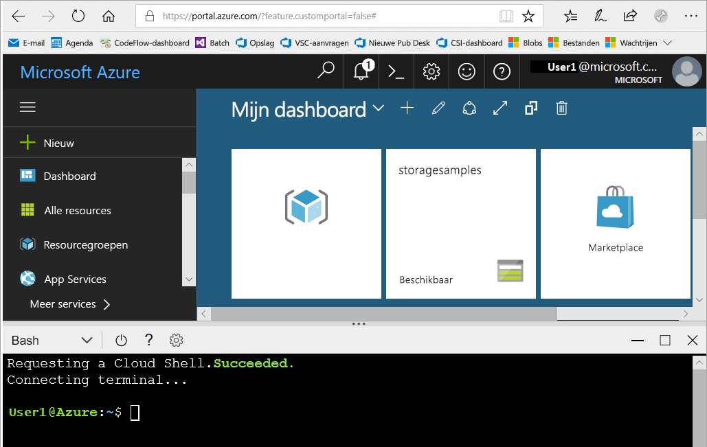
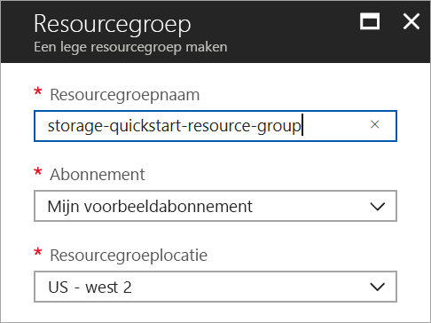
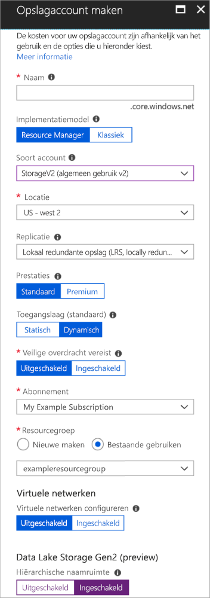

# <a name="quickstart-create-an-azure-data-lake-storage-gen2-preview-storage-account"></a>Snelstart: Een Azure Data Lake Storage Gen2 Preview-opslagaccount maken

Azure Data Lake Storage Gen2 Preview-accounts bieden [ondersteuning voor een hiërarchische naamruimteservice](introduction.md) met een systeemeigen, op mappen gebaseerd bestandssysteem dat is toegesneden op Hadoop Distributed File System (HDFS). Toegang tot Data Lake Storage Gen2-gegevens uit HDFS is beschikbaar via het [ABFS-stuurprogramma](abfs-driver.md).

[Vul de preview-vragenlijst in om toegang te vragen](https://aka.ms/adlsgen2signup) en de mogelijkheden van Data Lake Storage Gen2 in te schakelen voor uw opslagaccount. Na goedkeuring kunt u vervolgens een nieuw Data Lake Storage Gen2-account maken. In deze snelstart wordt gedemonstreerd hoe u een account maakt met [Azure Portal](https://portal.azure.com/), [Azure PowerShell](https://docs.microsoft.com/powershell/azure/overview) of [Azure CLI](https://docs.microsoft.com/cli/azure?view=azure-cli-latest).

> [!NOTE]
> De gebruikersinterface voor het maken van een account in Azure Portal wordt bijgewerkt zodra uw aanvraag voor een Data Lake Storage Gen2-account is goedgekeurd. Op dezelfde manier werken de PowerShell- en CLI-argumenten voor Data Lake Storage Gen2 pas als uw preview-aanvraag is goedgekeurd.

## <a name="prerequisites"></a>Vereisten

Als u nog geen abonnement op Azure hebt, maak dan een [gratis account](https://azure.microsoft.com/free/) aan voordat u begint.

|           | Vereiste |
|-----------|--------------|
|Portal     | Geen         |
|PowerShell | Voor deze snelstart is moduleversie **5.0.4-preview** of hoger van Azure PowerShell vereist. Voer `Get-Module -ListAvailable AzureRM` uit om uw huidige versie te vinden. Als u PowerShell wilt installeren of upgraden, raadpleegt u [De Azure PowerShell-module installeren](/powershell/azure/install-azurerm-ps). |
|CLI        | U kunt u aanmelden bij Azure en Azure CLI-opdrachten uitvoeren. Dit kan op twee manieren: <ul><li>U kunt CLI-opdrachten uitvoeren vanuit Azure Portal, in Azure Cloud Shell </li><li>U kunt de CLI installeren en CLI-opdrachten lokaal uitvoeren</li></ul>|

Wanneer u werkt met de opdrachtregel, hebt u de mogelijkheid om de Azure Cloud-shell of de CLI lokaal te installeren.

### <a name="use-azure-cloud-shell"></a>Azure Cloud Shell gebruiken

Azure Cloud Shell is een gratis Bash-shell die u rechtstreeks in Azure Portal kunt uitvoeren. In deze shell is de Azure CLI vooraf geïnstalleerd en geconfigureerd voor gebruik met uw account. Klik op de knop **Cloud Shell** in het menu rechtsboven in Azure Portal:

[](https://portal.azure.com)

Met de knop start u een interactieve shell waarmee u alle stappen in deze snelstartgids kunt uitvoeren:

[](https://portal.azure.com)

### <a name="install-the-cli-locally"></a>De CLI lokaal installeren

U kunt Azure CLI ook lokaal installeren en gebruiken. Voor deze snelstart moet u versie 2.0.38 of later van Azure CLI uitvoeren. Voer `az --version` uit om de versie te bekijken. Als u Azure CLI 2.0 wilt installeren of upgraden, raadpleegt u [Azure CLI 2.0 installeren](/cli/azure/install-azure-cli).

## <a name="overview-of-creating-an-azure-data-lake-storage-gen2-account"></a>Overzicht van het maken van een Azure Data Lake Storage Gen2-account

Voordat u een account maakt, maakt u eerst een resourcegroep die fungeert als een logische container voor opslagaccounts of andere Azure resources die u maakt. Als u de resources die in deze snelstartgids zijn gemaakt, wilt opschonen, verwijdert u gewoon de resourcegroep. Als u de resourcegroep verwijdert, worden ook het bijbehorende opslagaccount en eventuele andere resources die zijn gekoppeld aan de resourcegroep, verwijderd. Zie [Overzicht van Azure Resource Manager](../../azure-resource-manager/resource-group-overview.md) voor meer informatie over resourcegroepen.

> [!NOTE]
> U moet nieuwe opslagaccounts maken van het type **StorageV2 (algemeen gebruik v2)** om te profiteren van de functies van Data Lake Storage Gen2.  

Zie [Opties voor Azure-opslagaccounts](../common/storage-account-options.md) voor meer informatie over opslagaccounts.

Neem de volgende regels in acht als u het opslagaccount een naam geeft:

- Namen van opslagaccounts moeten tussen 3 en 24 tekens lang zijn en mogen alleen cijfers en kleine letters bevatten.
- De naam van uw opslagaccount moet uniek zijn binnen Azure. Een opslagaccount kan niet dezelfde naam hebben als een ander opslagaccount.

## <a name="create-an-account-using-the-azure-portal"></a>Een account maken in Azure Portal

Meld u aan bij [Azure Portal](https://portal.azure.com).

### <a name="create-a-resource-group"></a>Een resourcegroep maken

Als u een resourcegroep wilt maken in Azure Portal, volgt u deze stappen:

1. Vouw het menu aan de linkerkant in Azure Portal uit om het menu met services te openen en kies **Resourcegroepen**.
2. Klik op de knop **Toevoegen** om een nieuwe resourcegroep toe te voegen.
3. Voer een naam in voor de nieuwe resourcegroep.
4. Selecteer het abonnement waarin u de nieuwe resourcegroep wilt maken.
5. Kies de locatie voor de resourcegroep.
6. Klik op de knop **Maken**.  



### <a name="create-a-general-purpose-v2-storage-account"></a>Een v2-opslagaccount voor algemeen gebruik maken

Als u een v2-opslagaccount voor algemeen gebruik wilt maken in de Azure Portal, volgt u deze stappen:

> [!NOTE]
> De hiërarchische naamruimte is alleen ingeschakeld in US - west 2 en US - west centraal. Zorg ervoor dat u een van deze locaties opgeeft bij het maken van het opslagaccount.

1. Vouw in Azure Portal het menu links open om het menu met services te openen en kies **Alle services**. Schuif vervolgens omlaag naar **Opslag** en kies **Opslagaccounts**. Kies in het venster **Opslagaccounts** dat wordt weergegeven de optie **Toevoegen**.
2. Voer een naam in voor het opslagaccount.
3. Laat **Implementatiemodel** ingesteld op de standaardwaarde.
4. Stel het veld **Soort account** in op **StorageV2 (algemeen gebruik v2)**.
5. Stel **Locatie** in op **US - west 2**
6. Laat het veld **Replicatie** ingesteld op **Lokaal redundante opslag (LRS)**.
7. Laat de volgende velden ingesteld op de standaardwaarden: **Replicatie**. **Prestaties**, **Toegangslaag**.
8. Kies het abonnement waarin u het opslagaccount wilt maken.
9. Selecteer in de sectie **Resourcegroep** de optie **Bestaande gebruiken**. Kies vervolgens de resourcegroep die u in de vorige sectie hebt gemaakt.
10. Laat **Virtuele netwerken** ingesteld op de standaardwaarde
11. In de sectie **Data Lake Storage Gen2 (preview)** stelt u **Hiërarchische naamruimte** in op **Ingeschakeld**.
12. Klik op **Maken** om het opslagaccount te maken.



Uw opslagaccount is nu gemaakt via de portal.

### <a name="clean-up-resources"></a>Resources opschonen

Ga als volgt te werk om een resourcegroep te verwijderen in Azure Portal:

1. Vouw het menu aan de linkerkant in Azure Portal uit om het menu met services te openen en kies **Resourcegroepen** om de lijst met resourcegroepen weer te geven.
2. Zoek de resourcegroep die u wilt verwijderen, en klik met de rechtermuisknop op de knop **Meer** (**...** ) aan de rechterkant van de lijst.
3. Selecteer **Resourcegroep verwijderen** en bevestig dit.

## <a name="create-an-account-using-powershell"></a>Een account maken met PowerShell

Meld u aan bij uw Azure-abonnement met de opdracht `Login-AzureRmAccount` en volg de instructies op het scherm.

```powershell
Login-AzureRmAccount
```

### <a name="upgrade-your-powershell-module"></a>De PowerShell-module upgraden

Als u via PowerShell wilt communiceren met Data Lake Storage Gen2, moet u de module bijwerken naar de preview-versie.

Hiervoor opent u een verhoogde PowerShell en voert u de volgende opdracht in: `Install-Module AzureRM.Storage –Repository PSGallery -RequiredVersion 5.0.4-preview –AllowPrerelease –AllowClobber –Force `

Start vervolgens de shell opnieuw.

### <a name="create-a-resource-group"></a>Een resourcegroep maken

Gebruik de opdracht [New-AzureRmResourceGroup](/powershell/module/azurerm.resources/new-azurermresourcegroup) om een nieuwe resourcegroep te maken: 

> [!NOTE]
> De hiërarchische naamruimte is alleen ingeschakeld in US - west 2 en US - west centraal. Zorg ervoor dat u een van deze locaties opgeeft bij het maken van het opslagaccount.

```powershell
# put resource group in a variable so you can use the same group name going forward,
# without hardcoding it repeatedly
$resourceGroup = "storage-quickstart-resource-group"
$location = "westus2"
New-AzureRmResourceGroup -Name $resourceGroup -Location $location
```

### <a name="create-a-general-purpose-v2-storage-account"></a>Een v2-opslagaccount voor algemeen gebruik maken

Gebruik de opdracht [New-AzureRmStorageAccount](/powershell/module/azurerm.storage/New-AzureRmStorageAccount) om een v2-opslagaccount voor algemeen gebruik te maken vanuit PowerShell met lokaal redundante opslag (LRS):

```powershell
Get-AzureRmLocation | select Location 
$location = "westus2"

New-AzureRmStorageAccount -ResourceGroupName $resourceGroup `
  -Name "storagequickstart" `
  -Location $location `
  -SkuName Standard_LRS `
  -Kind StorageV2 
  -EnableHierarchicalNamespace $True
```

### <a name="clean-up-resources"></a>Resources opschonen

Gebruik de opdracht [Remove-AzureRmResourceGroup](/powershell/module/azurerm.resources/remove-azurermresourcegroup) om de resourcegroep en alle bijbehorende resources te verwijderen, inclusief het nieuwe opslagaccount: 

```powershell
Remove-AzureRmResourceGroup -Name $resourceGroup
```

## <a name="create-an-account-using-azure-cli"></a>Een account maken met Azure CLI

Meld u aan bij [Azure Portal](https://portal.azure.com) om Azure Cloud Shell te starten.

Als u zich wilt aanmelden bij de lokale installatie van de CLI, voert u de opdracht voor aanmelden uit:

```cli
az login
```

### <a name="upgrade-your-cli-module"></a>De CLI-module upgraden

Als u via CLI wilt communiceren met Data Lake Storage Gen2, moet u de extensie toevoegen aan de shell.

Dit doet u als volgt: voer met behulp van Cloud Shell of een lokale shell de volgende opdracht in: `az extension add --name storage-preview`

### <a name="create-a-resource-group"></a>Een resourcegroep maken

Gebruik de opdracht [az group create](/cli/azure/group#az_group_create) om een nieuwe resourcegroep te maken met Azure CLI.

```azurecli-interactive
az group create \
    --name storage-quickstart-resource-group \
    --location westus2
```

> [!NOTE]
> De hiërarchische naamruimte is alleen ingeschakeld in US - west 2 en US - west centraal. Zorg ervoor dat u een van deze locaties opgeeft bij het maken van het opslagaccount.

### <a name="create-a-general-purpose-v2-storage-account"></a>Een v2-opslagaccount voor algemeen gebruik maken

Gebruik de opdracht [az storage account create](/cli/azure/storage/account#az_storage_account_create) om een v2-opslagaccount voor algemeen gebruik met lokaal redundante opslag te maken vanuit de Azure CLI.

```azurecli-interactive
az storage account create \
    --name storagequickstart \
    --resource-group storage-quickstart-resource-group \
    --location westus2 \
    --sku Standard_LRS \
    --kind StorageV2 \
    --hierarchical-namespace true
```

### <a name="clean-up-resources"></a>Resources opschonen

Gebruik de opdracht [az group delete](/cli/azure/group#az_group_delete) om de resourcegroep en alle bijbehorende resources te verwijderen, inclusief het nieuwe opslagaccount.

```azurecli-interactive
az group delete --name myResourceGroup
```

## <a name="next-steps"></a>Volgende stappen

In deze snelstart hebt u een Data Lake Storage Gen2-opslagaccount gemaakt. Voor informatie over het uploaden en downloaden van blobs naar en uit uw opslagaccount gaat u verder met de snelstartgids over blob-opslag.

* [Gegevens met AzCopy verplaatsen van en naar Azure Blob-opslag](https://docs.microsoft.com/en-us/azure/machine-learning/team-data-science-process/move-data-to-azure-blob-using-azcopy)