# Quickstart: Een Azure-bestandsshare maken en beheren met virtuele Windows-machines

Dit artikel bevat de basisstappen voor het maken en gebruiken van een Azure-bestandsshare. In deze quickstart ligt de nadruk op het snel instellen van een Azure-bestandsshare, zodat u kunt ervaren hoe de service werkt. Als u meer gedetailleerde instructies nodig hebt voor het maken en gebruiken van Azure-bestandsshares in uw eigen omgeving, raadpleegt u [Een Azure-bestandsshare gebruiken met Windows](storage-how-to-use-files-windows.md).

Als u nog geen abonnement op Azure hebt, maak dan een [gratis account](https://azure.microsoft.com/free/?WT.mc_id=A261C142F) aan voordat u begint.

## Aanmelden bij Azure

Meld u aan bij [Azure Portal](https://portal.azure.com).

## Uw omgeving voorbereiden

In deze quickstart stelt u de volgende items in:

- Een Azure-opslagaccount
- Een VM met Windows Server 2016 Datacenter

### Create a storage account

Voordat u kunt gaan werken met een Azure-bestandsshare moet u een Azure-opslagaccount maken. Een v2-opslagaccount voor algemeen gebruik biedt toegang tot alle services van Azure Storage: blobs, bestanden, wachtrijen en tabellen. Met deze quickstart maakt u een v2-opslagaccount voor algemeen gebruik, maar de stappen voor het maken van elk type opslagaccount zijn vergelijkbaar. Een opslagaccount kan een onbeperkt aantal shares bevatten. Een share kan een onbeperkt aantal bestanden opslaan, tot de capaciteitslimiet van het opslagaccount.

[!INCLUDE [storage-create-account-portal-include](../../../includes/storage-create-account-portal-include.md)]

### Een Azure-bestandsshare maken

Vervolgens gaat u een bestandsshare maken.

1. Als de implementatie van het Azure-opslagaccount is voltooid, selecteert u **Naar de resource gaan**.
1. Selecteer **Bestanden** in het deelvenster met het opslagaccount.

    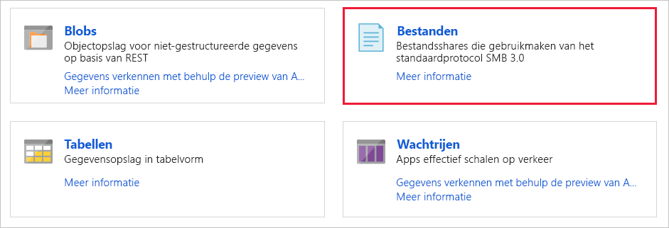

1. Selecteer **+ Bestandsshare**.

    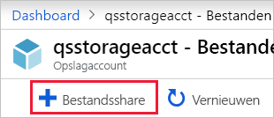

1. Geef de nieuwe bestandsshare de naam *qsfileshare* > voer 1 voor **Quotum** > selecteer **Maken**. Het quotum kan maximaal 5 TiB zijn, maar voor deze quickstart is 1 GB voldoende.
1. Maak een nieuw TXT-bestand met de naam *qsTestFile* op uw lokale computer.
1. Selecteer de nieuwe bestandsshare en klik vervolgens op de locatie van de bestandsshare op **Uploaden**.

    

1. Blader naar de locatie waar u uw TXT-bestand hebt gemaakt > selecteer *qsTestFile.txt* > selecteer **uploaden**.

U hebt nu een Azure-opslagaccount gemaakt en een bestandsshare met één bestand in Azure. U gaat nu de Azure-VM maken met Windows Server 2016 Datacenter, die de on-premises server in deze quickstart vormt.

### Een virtuele machine implementeren

1. Vouw vervolgens het menu aan de linkerkant van de portal uit en kies **Een resource maken** in linkerbovenhoek van de Azure-portal.
1. Zoek via het zoekvak boven de lijst met **Azure Marketplace**-resources naar **Windows Server 2016 Datacenter**, selecteer dit en kies **Maken**.
1. Selecteer op het tabblad **Basis**, onder **Projectdetails**, de resourcegroep die u voor deze quickstart hebt gemaakt.

   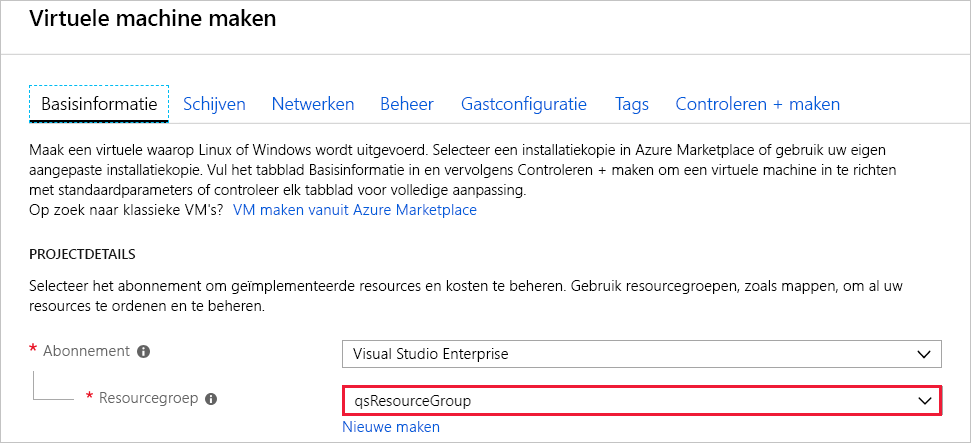

1. Geef onder **exemplaar details** de naam *qsVM* op voor de VM.
1. Behoud de standaardinstellingen voor **Regio**, **Beschikbaarheidsopties**, **Installatiekopie** en **Grootte**.
1. Voeg onder **Administrator-account** *VMadmin* toe als de **gebruikersnaam** en voer een **wachtwoord** in voor de VM.
1. Onder **Regels voor binnenkomende poort** kiest u **​​Geselecteerde poorten toestaan** en selecteert u **RDP (3389)** en **HTTP** in de vervolgkeuzelijst.
1. Selecteer **Controleren + maken**.
1. Selecteer **Maken**. Het duurt enkele minuten voordat de nieuwe VM is voltooid.

1. Als de implementatie van de VM is voltooid, selecteert u **Naar de resource gaan**.

U hebt nu een nieuwe virtuele machine gemaakt en een gegevensschijf gekoppeld. U dient nu verbinding te maken met de VM.

### Verbinding maken met uw VM

1. Selecteer **Verbinding maken** op de pagina met eigenschappen van de virtuele machine.

   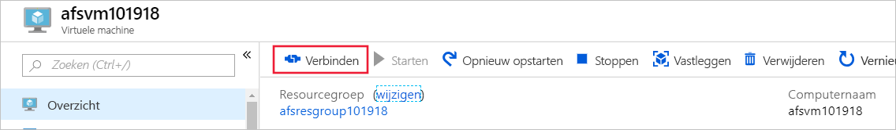

1. Laat op de pagina **Verbinding maken met virtuele machine** de standaardopties staan om via **IP-adres** verbinding te maken via **poortnummer** *3389* en selecteer **RDP-bestand downloaden**.
1. Open het gedownloade RDP-bestand en selecteer **Verbinden** wanneer dit wordt gevraagd.
1. Selecteer in het venster **Windows-beveiliging** **Meer opties** en vervolgens **Een ander account gebruiken**. Typ de gebruikersnaam als *localhost\gebruikersnaam*, waarbij u &lt;gebruikersnaam&gt; vervangt door de gebruikersnaam van de VM-beheerder die u voor de virtuele machine hebt gemaakt. Voer het wachtwoord in dat u hebt gemaakt voor de virtuele machine en selecteer vervolgens **OK**.

   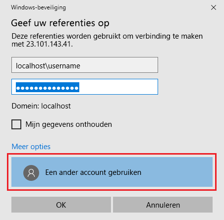

1. Er wordt mogelijk een certificaatwaarschuwing weergegeven tijdens het aanmelden. Selecteer **Ja** of **Doorgaan** om de verbinding te maken.

## De Azure-bestandsshare koppelen aan een Windows-station

1. Ga in de Azure-portal naar de bestandsshare *qsfileshare* en selecteer **Verbinding maken**.
1. Kopieer de inhoud van het tweede vak en plak deze in **Kladblok**.

   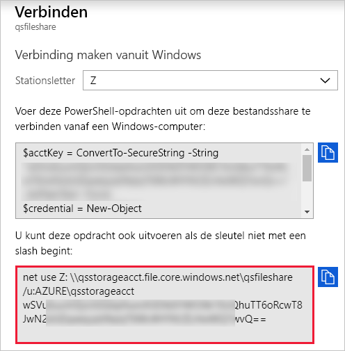

1. Open op de VM **Verkenner** en selecteer **Deze pc** in het venster. Hiermee wijzigt u de menu's die beschikbaar zijn op het lint. Selecteer **Netwerkstation toewijzen** in het menu **Computer**.
1. Selecteer de stationsletter en voer het UNC-pad in. Als u de suggesties voor naamgeving in deze quickstart hebt gevolgd, kopieert u *\\qsstorageacct.file.core.windows.net\qsfileshare* uit **Kladblok**.

   Zorg ervoor dat beide selectievakjes zijn ingeschakeld.

   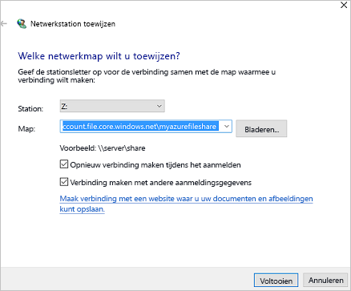

1. Selecteer **Voltooien**.
1. Ga als volgt te werk in het dialoogvenster **Windows-beveiliging**:

   - Kopieer vanuit Kladblok de naam van het opslagaccount voorafgegaan door AZURE\ en plak deze in het dialoogvenster **Windows-beveiliging** als de gebruikersnaam. Als u de suggesties voor naamgeving in deze quickstart hebt gevolgd, kopieert u *AZURE\qsstorageacct*.
   - Kopieer vanuit Kladblok de sleutel van het opslagaccount en plak deze in het dialoogvenster **Windows-beveiliging** als het wachtwoord.

      

## Een momentopname van de share maken

Nu het station is toegewezen, kunt u een momentopname maken.

1. Ga in de portal naar de bestandsshare en selecteer **Momentopname maken**.

   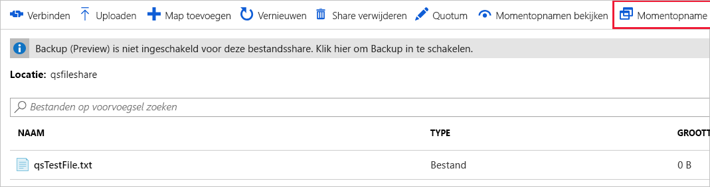

1. Open op de VM het bestand *qstestfile.txt* en typ 'dit bestand is gewijzigd'. Sla het bestand op en sluit het daarna.
1. Maak een nieuwe momentopname.

## Momentopnamen van een share bekijken

1. Selecteer **Momentopnamen weergeven** in de bestandsshare.
1. Selecteer in het deelvenster **Momentopnamen van bestandsshares** de eerste momentopname in de lijst.

   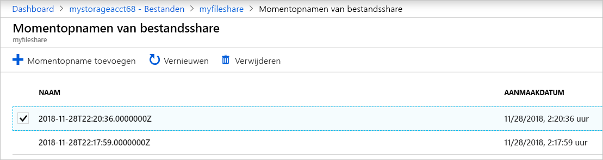

1. Selecteer *qsTestFile.txt* in het deelvenster voor die momentopname.

## Terugzetten vanuit een momentopname

1. Op de blade ‘Momentopnamen van bestandsshares’ klikt u met de rechtermuisknop op *qsTestFile* en selecteert u de knop **Terugzetten**.
1. Selecteer **Oorspronkelijke bestand overschrijven**.

   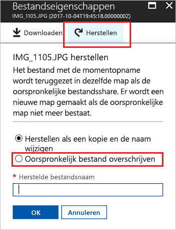

1. Open het bestand op de VM. De ongewijzigde versie is hersteld.

## Een share-momentopname verwijderen

1. Selecteer **Momentopnamen weergeven** in de bestandsshare.
1. Selecteer in het deelvenster **Momentopnamen van bestandsshares** de laatste momentopname in de lijst en klik op **Verwijderen**.

   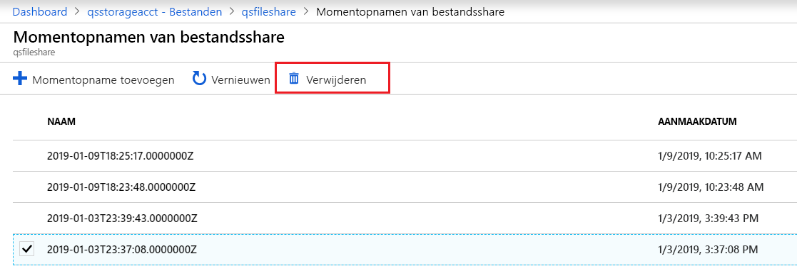

## Een momentopname van een share gebruiken in Windows

Net als met on-premises VSS-momentopnamen kunt u de momentopnamen van de gekoppelde Azure-bestandsshare bekijken met behulp van het tabblad Vorige versies.

1. Ga in Windows Verkenner naar de gekoppelde share.

   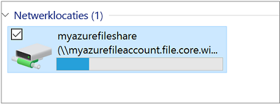

1. Selecteer **qsTestFile.txt**, klik met de rechtermuisknop op het bestand en selecteer *Eigenschappen* in het menu.

   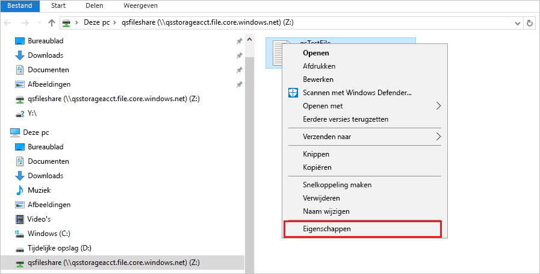

1. Selecteer **Vorige versies** om de lijst met momentopnamen van shares voor deze map weer te geven.

1. Selecteer **Openen** om de momentopname te openen.

   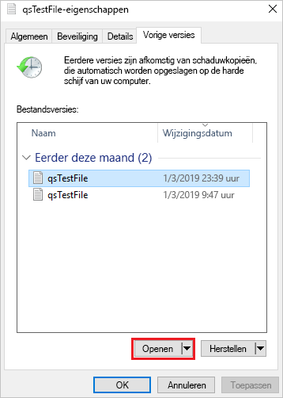

## Terugzetten op basis van een vorige versie

1. Selecteer **Terugzetten**. De inhoud van de gehele map wordt recursief naar de oorspronkelijke locatie gekopieerd, op de aanmaaktijd van de momentopname van de share.

   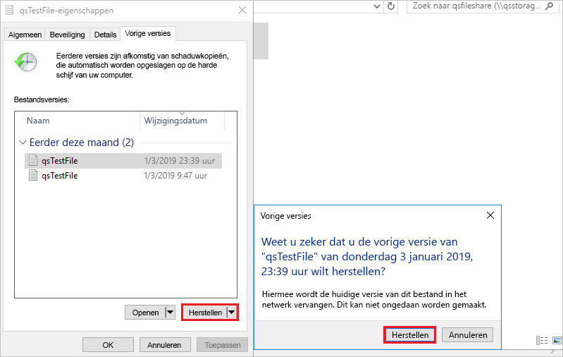

## Resources opschonen

[!INCLUDE [storage-files-clean-up-portal](../../../includes/storage-files-clean-up-portal.md)]

## Volgende stappen

> [!div class="nextstepaction"]
> [Een Azure-bestandsshare gebruiken met Windows](storage-how-to-use-files-windows.md)