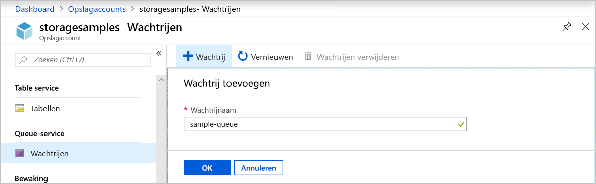
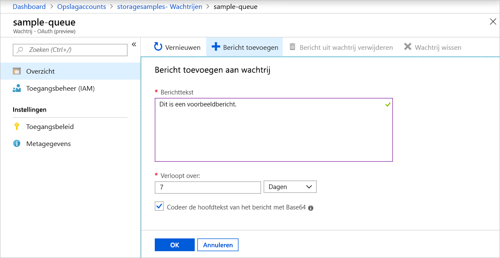
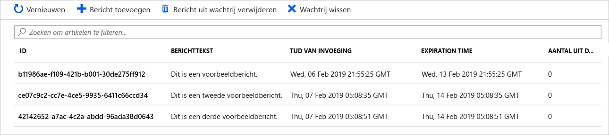
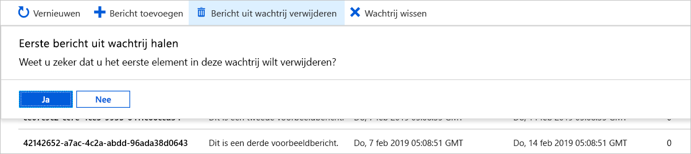

# Quickstart: Een wachtrij maken en een bericht toevoegen met de Azure-portal

In deze quickstart leert u de [Azure-portal](https://portal.azure.com/) te gebruiken om een wachtrij te maken in Azure Storage, en om berichten toe te voegen aan en weer te verwijderen uit de wachtrij.

## Vereisten

[!INCLUDE [storage-quickstart-prereq-include](../../../includes/storage-quickstart-prereq-include.md)]

## Een wachtrij maken

Als u een wachtrij wilt maken in de Azure-portal, volgt u deze stappen:

1. Navigeer naar het nieuwe opslagaccount in Azure Portal.
2. Blader in het linkermenu van het opslagaccount naar het gedeelte **Queue-service** en selecteer **Wachtrijen**.
3. Selecteer de knop **+ Wachtrij**.
4. Typ een naam voor de nieuwe wachtrij. De wachtrijnaam mag alleen uit kleine letters bestaan, moet beginnen met een letter of cijfer en mag alleen letters, cijfers en het streepje (-) bevatten.
6. Selecteer **OK** om de wachtrij te maken.

    

## Een bericht toevoegen

Voeg vervolgens een bericht toe aan de nieuwe wachtrij. Een bericht kan maximaal 64 KB groot zijn.

1. Selecteer de nieuwe wachtrij uit de lijst met wachtrijen in het opslagaccount.
1. Selecteer de knop **+ Bericht toevoegen** om een bericht toe te voegen aan de wachtrij. Voer een bericht in het veld **Berichttekst** in. 
1. Geef aan wanneer het bericht verloopt. Een bericht kan maximaal 7 dagen in de wachtrij blijven staan.
1. Geef aan of het bericht als Base64 moet worden gecodeerd. Codering van binaire gegevens wordt aanbevolen.
1. Selecteer de knop **OK** om het bericht toe te voegen.

    

## Eigenschappen van berichten bekijken

Nadat u een bericht hebt toegevoegd, wordt in de Azure-portal een lijst van alle berichten in de wachtrij weergegeven. U kunt de bericht-ID, de inhoud van het bericht, de tijd waarop het bericht werd ingevoegd en de tijd waarop het bericht verloopt bekijken. U kunt ook zien hoe vaak dit bericht uit de wachtrij is verwijderd.

## Een bericht uit de wachtrij verwijderen

U kunt vanuit de Azure-portal een bericht uit het begin van de wachtrij verwijderen. Wanneer u een bericht uit de wachtrij verwijdert, is de verwijdering definitief. 

Bij het verwijderen van berichten uit de wachtrij wordt altijd het oudste bericht in de wachtrij verwijderd. 

## Volgende stappen

In deze quickstart hebt u geleerd hoe u een wachtrij maakt, een bericht toevoegt, eigenschappen van berichten bekijkt en een bericht uit de wachtrij in de Azure-portal verwijdert.

> [!div class="nextstepaction"]
> [Wat zijn Azure-wachtrijen?](storage-queues-introduction.md)