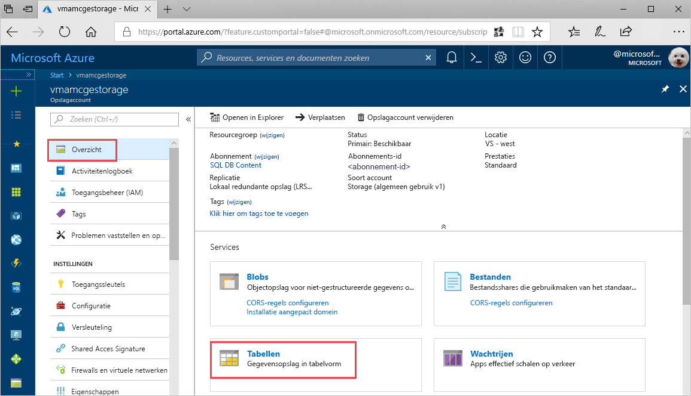
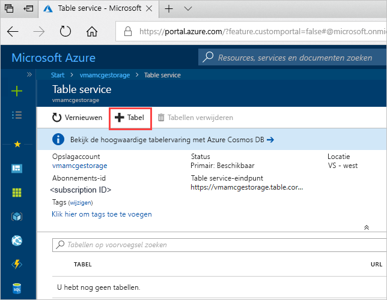
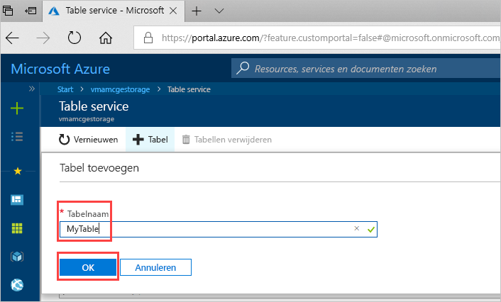

# Snelstartgids: Een Azure Storage-tabel maken in de Azure-portal 

In deze snelstartgids wordt beschreven hoe u tabellen en entiteiten maakt in de Azure-portal op internet. In deze snelstart wordt beschreven hoe u een Azure-opslagaccount maakt.

[!INCLUDE [quickstarts-free-trial-note](../../../includes/quickstarts-free-trial-note.md)]

## Vereisten

Maak om deze snelstart te volgen eerst een Azure opslagaccount in [Azure Portal](https://portal.azure.com/#create/Microsoft.StorageAccount-ARM). Zie voor meer informatie over het maken van het account [Een opslagaccount maken](../common/storage-quickstart-create-account.md).

## Een tabel toevoegen

Nu kunt u Table-service in de Azure-portal gebruiken om een tabel te maken.

1. Klik op Overzicht > Tabellen.

   

2. Klik op **+ Tabel**.

   

3. Typ een naam voor de tabel in het vak **Tabelnaam** en klik op **OK**. 

   

## Volgende stappen

- [Richtlijnen voor tabelontwerp](table-storage-design-guidelines.md)