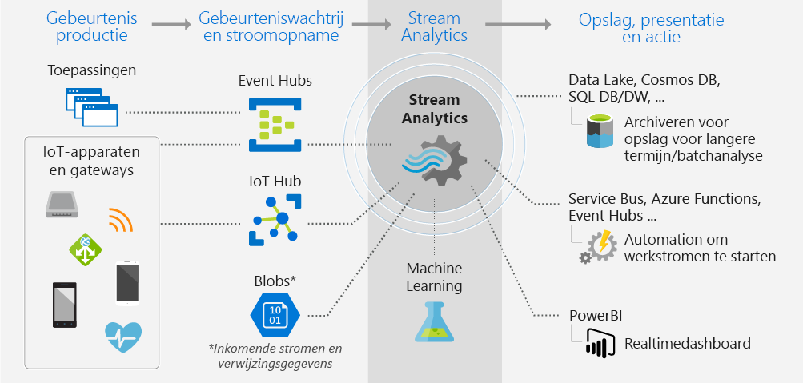
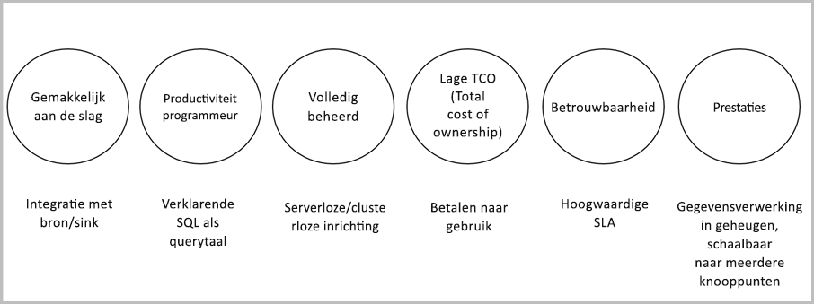

# Wat is Azure Stream Analytics?

Azure Stream Analytics is een realtime analyses en complexe engine voor gebeurtenisverwerking die is ontworpen om te analyseren en verwerken van grote hoeveelheden snel streaming gegevens uit meerdere bronnen tegelijk. Patronen en relaties kunnen worden geïdentificeerd in de gegevens uit een aantal invoerbronnen, met inbegrip van apparaten, sensoren, clickstreams, sociale media-feeds en toepassingen. Deze patronen kunnen worden gebruikt om acties activeren en werkstromen starten dergelijke waarschuwingen maken, deze gegevens naar een rapportageprogramma uit of getransformeerde gegevens opslaan voor later gebruik. Ook, Stream Analytics is beschikbaar op Azure IoT Edge-runtime en biedt ondersteuning voor de exacte taal of syntaxis als de cloud. 

De volgende scenario's zijn voorbeelden van wanneer u Azure Stream Analytics kunt gebruiken:

* Analyseer realtime telemetriestromen van IoT-apparaten
* Weblogboeken/clickstream-analyses op internet
* Georuimtelijke analyses voor fleetmanagement en zelfrijdende auto’s
* Bewaking op afstand en Voorspellend onderhoud van waardevolle activa
* Realtime analyse van Point of Sale-gegevens voor voorraadbeheer en anomaliedetectie

## Hoe werkt Stream Analytics?

Een Azure Stream Analytics-taak bestaat uit een invoer-, query- en uitvoer. Stream Analytics neemt gegevens op uit Azure Event Hubs, Azure IoT Hub of Azure Blob Storage. De query, die is gebaseerd op SQL-query-taal, kan worden gebruikt om eenvoudig filteren, sorteren, statistische functie en gegevensstromen gegevens gedurende een bepaalde periode. U kunt ook uitbreiden met deze SQL-taal met JavaScript en C# gebruiker gedefinieerde functies (UDF's). U kunt eenvoudig de gebeurtenisvolgordes opties en de duur van tijdvensters wanneer preforming aggregatiebewerkingen uit te voeren via eenvoudige taalconstructies en/of configuraties aanpassen.

Elke taak heeft een uitvoer op voor de getransformeerde gegevens en kunt u bepalen wat er gebeurt in reactie op de informatie die u hebt geanalyseerd. U kunt bijvoorbeeld:

* Gegevens verzenden naar services zoals Azure Functions, Service Bus-onderwerpen of wachtrijen voor het activeren van communicatie of downstream aangepaste werkstromen.
* Gegevens verzenden naar een Power BI-dashboard voor realtime dashboarding.
* Store gegevens in andere Azure storage-services te trainen van een machine learning-model op basis van historische gegevens of batch-analyses uitvoeren.

De volgende afbeelding toont hoe gegevens worden verzonden naar de Stream Analytics, geanalyseerd en verzonden voor andere vereiste acties, zoals opslag of presentatie:

## Belangrijkste mogelijkheden en voordelen

Azure Stream Analytics is gebruiksvriendelijk, flexibel, betrouwbaar en schaalbaar tot elke taakgrootte. Het is beschikbaar in meerdere Azure-regio's. De volgende afbeelding ziet u de belangrijkste mogelijkheden van Azure Stream Analytics:

## Eenvoudig aan de slag

Azure Stream Analytics is eenvoudig om te beginnen. Dit duurt slechts enkele klikken verbinding maken met meerdere bronnen en sinks, het maken van een end-to-end-pijplijn. Stream Analytics kan verbinding maken met [Azure Event Hubs](/azure/event-hubs/) en [Azure IoT Hub](/azure/iot-hub/) voor opname van streaming gegevens, evenals [Azure Blob-opslag](/azure/storage/storage-introduction) voor opname van historische gegevens. Taakinvoer kan ook een verwijzing naar statische of langzaam veranderende gegevens uit Azure Blob-opslag of [SQL-Database](stream-analytics-use-reference-data.md#azure-sql-database) dat u toevoegen kunt aan het streamen van gegevens voor het uitvoeren van zoekbewerkingen.

Stream Analytics kan taakuitvoer omleiden naar talloze opslagsystemen, zoals [Azure Blob-opslag](/azure/storage/storage-introduction), [Azure SQL Database](/azure/sql-database/), [Azure Data Lake Store](/azure/data-lake-store/), en [Azure CosmosDB](/azure/cosmos-db/introduction). U kunt batch-analyses uitvoeren op opgeslagen resultaat met Azure HDInsight, of u kunt de uitvoer ook verzenden naar een andere service, zoals Gebeurtenishubs voor verbruik of [Power BI](https://docs.microsoft.com/power-bi/) voor realtime visualisatie.

Zie voor de volledige lijst van Stream Analytics-uitvoer, [inzicht in de uitvoer van Azure Stream Analytics](stream-analytics-define-outputs.md).

## Productiviteit programmeur

Azure Stream Analytics maakt gebruik van een eenvoudige query op basis van SQL-taal die is uitgebreid met krachtige, tijdelijke beperkingen om gegevens in beweging te analyseren. Voor het definiëren van taaktransformaties gebruikt u een eenvoudige, declaratieve [Stream Analytics-querytaal](https://docs.microsoft.com/stream-analytics-query/stream-analytics-query-language-reference) waarmee u complexe, tijdelijke query’s en analyses kunt schrijven met behulp van SQL-constructs. Omdat de querytaal van Stream Analytics is consistent met de SQL-taal, is bekend bent met SQL voldoende om te beginnen met het maken van taken. U kunt ook taken maken met behulp van hulpprogramma's voor ontwikkelaars, zoals Azure PowerShell, [Stream Analytics Visual Studio-hulpprogramma's](stream-analytics-tools-for-visual-studio-install.md), wordt de [Stream Analytics Visual Studio Code-extensie](quick-create-vs-code.md), of Azure Resource Manager-sjablonen . Met ontwikkelaarstalen kunt u offline transformatiequery’s ontwikkelen en de [CI/CD-pijplijn](stream-analytics-tools-for-visual-studio-cicd.md) gebruiken om taken bij Azure in te dienen.

De querytaal van Stream Analytics biedt een breed spectrum aan functies voor het analyseren en verwerken van streaming gegevens. Deze querytaal ondersteunt eenvoudige gegevensmanipulatie, aggregatiefuncties en complexe georuimtelijke functies. U kunt query's in de portal bewerken en ze testen met voorbeeldgegevens die is opgehaald uit een live stream.

U kunt de mogelijkheden van de querytaal uitbreiden door extra functie te definiëren en aan te roepen. U kunt functieaanroepen definiëren in de Azure Machine Learning-service om te profiteren van Azure Machine Learning-oplossingen en JavaScript integreren of C# gebruikersgedefinieerde functies (UDF's) of de gebruiker gedefinieerde aggregaties voor het uitvoeren van complexe berekeningen als onderdeel een Stream Analytics-query.

## Volledig beheerd

Azure Stream Analytics is een volledige beheerde (PaaS) aanbieding in Azure. U hebt geen in te richten geen hardware of -clusters voor het uitvoeren van uw taken beheren. Azure Stream Analytics beheert uw taak volledig door het instellen van complexe rekenclusters in de cloud en zorg ervoor dat u van de prestaties afstemmen die nodig zijn voor het uitvoeren van de taak. Integratie met Azure Event Hubs en Azure IoT Hub kunt de taak naar de opname van miljoenen gebeurtenissen per seconde afkomstig van een aantal bronnen te zijn van verbonden apparaten, clickstreams, logboekbestanden. Met de partitioneringsfunctie van Event Hubs kunt u berekeningen partitioneren in logische stappen, die elk verder kunnen worden gepartitioneerd voor meer schaalbaarheid.

## Uitvoeren in de cloud of op de intelligente edge

Azure Stream Analytics kunt uitvoeren in de cloud, voor grootschalige analyse, of op IoT Edge voor zeer lage latentie analyses uitvoeren. Azure Stream Analytics gebruikt dezelfde querytaal op zowel de cloud als de rand, zodat ontwikkelaars kunnen bouwen werkelijk hybride architecturen voor de verwerking. 

## Lage total cost of ownership

Als cloudservice is Stream Analytics kostenefficiënt. Er zijn geen kosten vooraf die betrokken zijn: u betaalt alleen voor de [streaming-eenheden die u verbruikt](stream-analytics-streaming-unit-consumption.md), en de hoeveelheid gegevens die worden verwerkt. Er is geen toezegging of het inrichten van het cluster is vereist en u kunt de taak omhoog of omlaag schalen op basis van uw bedrijfsbehoeften.

## Essentieel gereed

Azure Stream Analytics is beschikbaar in meerdere regio's over de hele wereld en is ontworpen om uw essentiële workloads uit te voeren doordat de vereisten voor betrouwbaarheid, veiligheid en naleving worden ondersteund.

### Betrouwbaarheid

Azure Stream Analytics garandeert Exactly-once-gebeurtenissenverwerking en At-least-once-levering van gebeurtenissen, zodat gebeurtenissen nooit verloren gaan. Exact-één keer worden verwerkt is gegarandeerd met geselecteerde uitvoer, zoals beschreven in [gebeurtenis levering garanties](/stream-analytics-query/event-delivery-guarantees-azure-stream-analytics).

Azure Stream Analytics bevat ingebouwde herstelfuncties in geval de levering van een gebeurtenis mislukt. Stream Analytics biedt ingebouwde controlepunten voor het onderhouden van de status van uw taak ook en er worden herhaalbare resultaten.

Als een beheerde service garandeert Stream Analytics met een beschikbaarheid van 99,9% op het niveau van een minuut van granulariteit voor verwerking van gebeurtenissen. Zie voor meer informatie de [Stream Analytics SLA](https://azure.microsoft.com/support/legal/sla/stream-analytics/v1_0/) pagina. 

### Beveiliging

Wat betreft beveiliging, versleutelt Azure Stream Analytics alle inkomende en uitgaande communicatie en biedt ondersteuning voor TLS 1.2. Ingebouwde controlepunten zijn eveneens versleuteld. Stream Analytics slaat de binnenkomende gegevens niet op omdat alle verwerking in het geheugen gebeurt.

### Naleving

Azure Stream Analytics volgt meerdere nalevingscertificeringen, zoals beschreven in het [Overzicht van Azure-naleving](https://gallery.technet.microsoft.com/Overview-of-Azure-c1be3942). 

## Prestaties

Stream Analytics verwerkt miljoenen gebeurtenissen per seconde en resultaten met een lage latentie ultra kan leveren. U kunt ermee omhoogschalen of uitschalen, zodat u intensieve toepassingen kunt afhandelen die in realtime complexe gebeurtenissen verwerken. Stream Analytics ondersteunt betere prestaties door te partitioneren, zodat van complexe query's worden geparallelliseerd en uitgevoerd op meerdere streaming-knooppunten. Azure Stream Analytics is gebouwd op [Trill](https://github.com/Microsoft/Trill), een krachtige in-memory engine voor streaminganalyse die is ontwikkeld in samenwerking met Microsoft Research.

## Volgende stappen

U hebt nu een overzicht van Azure Stream Analytics. Hierna kunt u zich verder in de materie verdiepen en uw eerste Stream Analytics-taak maken:

* [Een Stream Analytics-taak maken via Azure Portal](stream-analytics-quick-create-portal.md).
* [Create a Stream Analytics job by using Azure PowerShell](stream-analytics-quick-create-powershell.md) (Een Stream Analytics-taak maken met behulp van Azure PowerShell).
* [Create a Stream Analytics job by using Visual Studio](stream-analytics-quick-create-vs.md) (Een Stream Analytics-taak maken met behulp van Visual Studio).
* [Een Stream Analytics-taak maken met behulp van Visual Studio Code](quick-create-vs-code.md).
