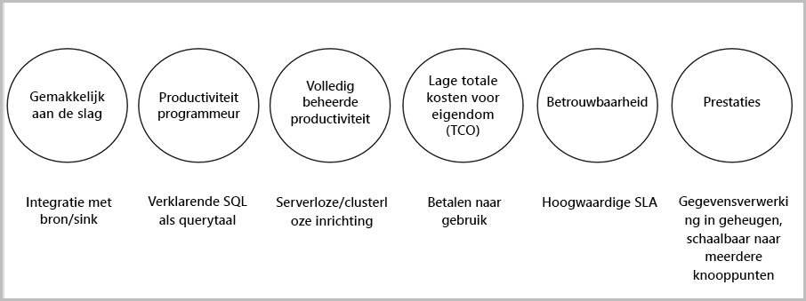

# Wat is een Stream Analytics?

Azure Stream Analytics is een gebeurtenissen verwerkende engine waarmee u grote volumina gegevens kunt bekijken die vanaf apparaten worden gestreamd. De inkomende gegevens kunnen afkomstig zijn van apparaten, sensoren, websites, socialemediafeeds, toepassingen, enzovoort. Het ondersteunt tevens het extraheren van gegevens uit gegevensstromen, het identificeren van patronen en relaties. U kunt deze patronen gebruiken om andere acties, zoals waarschuwingen, downstream te activeren, gegevens in een rapportageprogramma in te voeren of op te slaan voor later gebruik.

Hier volgen enkele voorbeelden waarbij Azure Stream Analytics kan worden gebruikt: 

* Sensorenfusie voor het Internet of Things (IoT) en realtime analytische gegevens voor apparaattelemetrie
* Weblogs/clickstream-analyses op internet
* Georuimtelijke analyses voor fleetmanagement en zelfrijdende auto’s
* Op afstand bewaken en predictief onderhoud van hoogwaardige middelen
* Realtime analyse van Point of Sale-gegevens voor voorraadbeheer en anomaliedetectie

## Hoe werkt Stream Analytics?

Azure Stream Analytics begint met een bron van streaming gegevens die in Azure Event Hub of Azure IoT Hub wordt opgenomen of afkomstig is van een gegevensarchief als Azure Blob Storage. Voor het onderzoeken van de stromen maakt u een Stream Analytics-taak die de invoerbron aangeeft die de gegevens streamt. De taak bevat ook een specificatie van een transformatiequery; hoe er wordt gezocht naar gegevens, patronen of relaties. De transformatiequery maakt gebruik van een SQL-achtige querytaal waarmee streaming gegevens gedurende een bepaalde tijd kunnen worden gefilterd, gesorteerd, gecombineerd en samengevoegd. Als de taak wordt uitgevoerd, kunt u de opties voor het sorteren van de gebeurtenissen en de duur van tijdvensters aanpassen bij het uitvoeren van combinatiebewerkingen.

Nadat de binnenkomende gegevens zijn geanalyseerd, geeft u een uitvoer op voor de getransformeerde gegevens en kunt u bepalen wat u moet doen als reactie op de geanalyseerde gegevens. U kunt bijvoorbeeld de volgende acties uitvoeren:

* Gegevens verzenden naar een bewaakte wachtrij om downstream aangepaste werkstromen te activeren.
* Gegevens verzenden naar Power BI-dashboard voor realtime visualisatie.
* Gegevens archiveren voor andere Azure-opslagapparaten.

In de volgende afbeelding ziet u de Stream Analytics-pijplijn. De Stream Analytics-taak kan gebruikmaken van alle of een bepaald deel van de in- en uitvoer. In deze afbeelding wordt getoond hoe gegevens naar Stream Analytics worden verzonden, geanalyseerd en verder verzonden voor andere acties, zoals opslag of presentatie:

## Belangrijkste mogelijkheden en voordelen

Azure Stream Analytics is gebruiksvriendelijk, flexibel, betrouwbaar en schaalbaar tot elke taakgrootte. Het is beschikbaar voor meerdere datacenters en ook voor onafhankelijke clouds. In de volgende afbeelding worden de belangrijkste mogelijkheden van Azure Stream Analytics getoond:

## Eenvoudig aan de slag

Met Azure Stream Analytics kunt u zo aan de slag. Met slecht een paar klikken maakt u verbinding met meerdere bronnen en sinks, en om een end-to-endpijplijn te maken. Stream Analytics kan verbinding maken met [Azure Event Hubs](https://docs.microsoft.com/azure/event-hubs/) of [Azure IoT Hub](https://docs.microsoft.com/azure/iot-hub/) voor opname van streaming gegevens. Het kan ook verbinding maken met de service [Azure Blob Storage](https://docs.microsoft.com/azure/storage/storage-introduction) voor opname van historische gegevens. Het kan gegevens van gebeurtenishubs combineren met andere gegevensbronnen en verwerkingsengines. Taakinvoer kan ook bestaan uit statische verwijzingsgegevens of gegevens die weinig veranderen, en u kunt streaming gegevens met deze verwijzingsgegevens samenvoegen om opzoekbewerkingen uit te voeren.

Stream Analytics kan taakuitvoer omleiden naar talloze opslagsystemen, bijvoorbeeld [Azure Blob](https://docs.microsoft.com/azure/storage/storage-introduction), [Azure SQL Database](https://docs.microsoft.com/azure/sql-database/), [Azure Data Lake Stores](https://docs.microsoft.com/azure/data-lake-store/) of [Azure Cosmos DB](https://docs.microsoft.com/azure/cosmos-db/introduction). Na opslag kunt u batch-analyses uitvoeren met HDInsight of de uitvoer verzenden naar een andere service, zoals gebeurtenishubs voor verbruik, of naar [Power BI](https://docs.microsoft.com/power-bi/) voor realtime visualisatie door gebruik te maken van een streaming API van Power BI.

## Productiviteit van programmeurs

Azure Stream Analytics maakt gebruik van een eenvoudige, op SQL gebaseerde querytaal die is uitgebreid met krachtige, tijdelijke beperkingen voor het analyseren van gegevens in beweging. Voor het definiëren van taaktransformaties gebruikt u een eenvoudige, declaratieve [Stream Analytics-querytaal](https://msdn.microsoft.com/library/azure/dn834998.aspx) waarmee u complexe, tijdelijke query’s en analyses kunt schrijven met behulp van SQL-constructs. De querytaal van Stream Analytics is consistent met SQL. Als u bekend bent met SQL, is dat voldoende om taken te kunnen maken. U kunt ook taken maken met ontwikkelaarstalen als Azure PowerShell, [Stream Analytics Visual Studio tools](stream-analytics-tools-for-visual-studio-install.md) of Azure Resource Manager-sjablonen. Met ontwikkelaarstalen kunt u offline transformatiequery’s ontwikkelen en de [CI/CD-pijplijn](stream-analytics-tools-for-visual-studio-cicd.md) gebruiken om taken bij Azure in te dienen. 

De querytaal van Stream Analytics biedt een breed spectrum aan functies voor het analyseren en verwerken van streaming gegevens. Deze querytaal ondersteunt eenvoudige gegevensmanipulatie, van aggregatiefuncties tot complexe, georuimtelijke functies. U kunt query’s in de portal bewerken en ze testen met voorbeeldgegevens die uit de live stream worden geëxtraheerd.

U kunt de mogelijkheden van de querytaal uitbreiden door extra functie te definiëren en aan te roepen. In de Azure Machine Learning-service kunt u functieaanroepen definiëren om gebruik te kunnen maken van Azure Machine Learning-oplossingen en door gebruikers gedefinieerde JavaScript-functies (UDF’s) of door gebruikers gedefinieerde aggregaten te integreren voor het uitvoeren van complexe berekeningen als onderdeel van een Stream Analytics-query.

## Volledig beheerd 

Azure Stream Analytics is een volledige beheerde (PaaS) aanbieding in Azure. Dit betekent dat u geen hardware hoeft in te richten of clusters te beheren om uw taken te kunnen uitvoeren. Azure Stream Analytics beheert uw taak volledig door het instellen van complexe rekenclusters in de cloud en het afstemmen van de prestaties om de taak te kunnen uitvoeren. Dankzij integratie met Azure Event Hubs en Azure IoT Hub kunnen taken miljoenen gebeurtenissen per seconde opnemen, afkomstig van verbonden apparaten, clickstreams, logboekbestanden, enzovoort. Met de partitioneringsfunctie van Event Hubs kunt u berekeningen partitioneren in logische stappen, die elk verder kunnen worden gepartitioneerd voor meer schaalbaarheid.

## Lage total cost of ownership

Als cloudservice is Stream Analytics kostenefficiënt. Er is geen sprake van opstartkosten; u betaalt slechts voor de [streaming-eenheden die u verbruikt](stream-analytics-streaming-unit-consumption.md) en de hoeveelheid verwerkte gegevens. Er is geen verplichting en het inrichten van clusters is niet nodig. U kunt de streaming taken omhoog of omlaag schalen, afhankelijk van de bedrijfsbehoeften. 

## Betrouwbaarheid 

Als beheerde service garandeert Stream Analytics een gebeurtenissenverwerking met een beschikbaarheid van 99,9%, wordt gegevensverlies voorkomen en bedrijfscontinuïteit geboden. Zie de pagina [Dienstovereenkomst voor Stream Analytics](https://azure.microsoft.com/support/legal/sla/stream-analytics/v1_0/) voor meer informatie. Stream Analytics verwerkt miljoenen gebeurtenissen per seconde en kan resultaten met een lage latentie leveren.
Stream Analytics garandeert Exactly-once-gebeurtenissenverwerking Least-once-levering van gebeurtenissen. Het bevat ingebouwde herstelfuncties in geval de levering van een gebeurtenis mislukt. Stream Analytics kan de status van een taak intern handhaven - u kunt een taak starten vanaf de laatste uitvoertijd. Er worden herhaalbare resultaten verkregen doordat telkens dezelfde resultaten worden geboden. Dankzij deze functie van Stream Analytics kunt u teruggaan in de tijd en berekeningen onderzoeken terwijl de hoofdoorzaak wordt onderzocht. 

## Prestaties

Azure Stream Analytics is geoptimaliseerd voor hoge prestaties; het kan streaming gegevens verwerken en In-memory-berekeningen uitvoeren. U kunt omhoog of omlaag schalen voor het afhandelen van toepassingen voor realtime en complexe gebeurtenissenverwerking. Stream Analytics ondersteunt prestaties door te partitioneren. Een complexe query kan worden geparallelliseerd en uitgevoerd op meerdere streaming-knooppunten. 

## Volgende stappen

U hebt nu een overzicht van Azure Stream Analytics. Hierna kunt u zich verder in de materie verdiepen en uw eerste Stream Analytics-taak maken:

* [Een Stream Analytics-taak maken via Azure Portal](stream-analytics-quick-create-portal.md).
* [Create a Stream Analytics job by using Azure PowerShell](stream-analytics-quick-create-powershell.md) (Een Stream Analytics-taak maken met behulp van Azure PowerShell).
