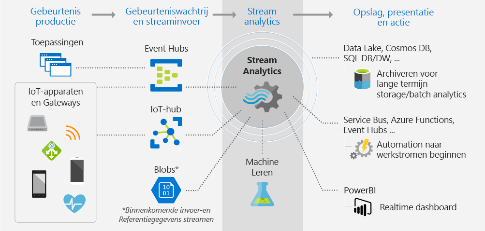

# Wat is een Stream Analytics?

Azure Stream Analytics is een beheerde verwerkingsengine voor gebeurtenissen, waarmee u in realtime analytische berekeningen kunt uitvoeren op gegevensstromen. De gegevens kunnen afkomstig zijn van apparaten, sensoren, websites, socialemediafeeds, toepassingen, infrastructuursystemen, enzovoort. 

Met Stream Analytics kunt u grote volumes aan gegevensstromen van apparaten of processen onderzoeken, informatie onttrekken aan die gegevensstromen en patronen, trends en relaties herkennen. Gebruik deze patronen om andere processen of acties, zoals waarschuwingen of automatiseringswerkstromen, te activeren, gegevens in een rapportagetool in te voeren of op te slaan voor later onderzoek. 

Een aantal voorbeelden:

* Aandeelhandelanalyse en -waarschuwingen.
* Fraudedetectie, -gegevens en beschermingsmaatregelen identificeren. 
* Ingesloten sensor- en bedieningsanalyse.
* Clickstream-analyses op internet.

## Hoe werkt Stream Analytics?

In dit diagram ziet u de pijplijn van Stream Analytics en wordt aangetoond hoe de gegevens worden opgenomen, geanalyseerd en worden verzonden voor presentatie of actie. 

Stream Analytics begint met een gegevensstroom als bron. De gegevens kunnen worden opgenomen in Azure vanaf een apparaat met een Azure Event Hub of Azure IoT Hub. De gegevens kunnen ook worden opgehaald uit een gegevensarchief zoals Azure Blob Storage. 

Voor het onderzoeken van de stroom maakt u een Stream Analytics-*taak* die aangeeft waar de gegevens vandaan komen. De taak bevat ook een specificatie van een *transformatie*; hoe er wordt gezocht naar gegevens, patronen of relaties. Voor deze taak ondersteunt Stream Analytics een SQL-achtige querytaal, waarmee u gegevens kunt filteren, sorteren en combineren, en gegevensstromen kunt samenvoegen gedurende een bepaalde periode.

Als laatste geeft de taak aan waar de getransformeerde gegevens naar worden uitgevoerd. U bepaalt wat er moet gebeuren als reactie op de informatie die u hebt geanalyseerd. Als reactie op een analyse kunt u bijvoorbeeld het volgende doen:

* Een opdracht verzenden om apparaatinstellingen te wijzigen. 
* Gegevens verzenden naar een bewaakte wachtrij voor verdere actie op basis van resultaten. 
* Gegevens verzenden naar een Power BI-dashboard.
* Gegevens verzenden naar een opslaglocatie zoals Data Lake Store, Azure SQL Database of Azure Blob Storage.

U kunt het aantal gebeurtenissen dat per seconde wordt verwerkt, aanpassen terwijl de taak wordt uitgevoerd. U kunt ook diagnostische logboeken genereren voor het oplossen van problemen.

## Belangrijkste mogelijkheden en voordelen

Stream Analytics is gebruiksvriendelijk, flexibel en schaalbaar tot elke taakgrootte.

### Invoer en uitvoer verbinden

Stream Analytics maakt rechtstreeks verbinding met [Azure Event Hubs](https://azure.microsoft.com/services/event-hubs/) en [Azure IoT Hub](https://azure.microsoft.com/services/iot-hub/) voor opname van streams, en met de [Azure Blob Storage-service](https://docs.microsoft.com/azure/storage/storage-introduction#blob-storage-accounts) voor opname van historische gegevens. Combineer gegevens van gebeurtenishubs met Stream Analytics met andere gegevensbronnen en verwerkingsengines. De invoer van taken kan ook referentiegegevens (statische of langzaam veranderende gegevens) omvatten. U kunt gegevensstromen samenvoegen met deze referentiegegevens voor het uitvoeren van zoekbewerkingen, net zoals u dat zou doen met databasequery’s.

U kunt de uitvoer van een Stream Analytics-taak in verschillende richtingen sturen. Schrijf naar opslaglocaties zoals Azure Blob, Azure SQL Database, Azure Data Lake Stores of Azure Cosmos DB. Van daaruit kunt u batchanalyses uitvoeren met Azure HDInsight. Of verzend de uitvoer naar een andere service voor gebruik door een ander proces, zoals gebeurtenishubs, Azure Service Bus, wachtrijen of naar Power BI voor visualisatie.

### Eenvoudig in het gebruik

Voor het definiëren van transformaties gebruikt u een eenvoudige declaratieve [Stream Analytics-querytaal](https://msdn.microsoft.com/library/azure/dn834998.aspx), waarmee u geavanceerde analyses kunt maken zonder te hoeven programmeren. De querytaal gebruikt gegevensstromen als invoer. Vervolgens kunt u de gegevens filteren en sorteren, waarden combineren, berekeningen uitvoeren, gegevens samenvoegen (binnen een stroom of naar referentiegegevens) en georuimtelijke functies gebruiken. U kunt query’s in de portal bewerken met behulp van IntelliSense en syntaxiscontrole, en u kunt query’s testen met voorbeeldgegevens afkomstig uit de live gegevensstroom.

### Uitbreidbare querytaal

U kunt de mogelijkheden van de querytaal uitbreiden door extra functie te definiëren en aan te roepen. U kunt functieaanroepen definiëren in de Azure Machine Learning-service en gebruikmaken van Azure Machine Learning-oplossingen. Daarnaast kunt u door de gebruiker gedefinieerde functies (UDF’s) van JavaScript integreren voor het uitvoeren van complexe berekeningen als deel van de Stream Analytics-query.

### Schaalbaar

Stream Analytics kan maximaal 1 GB aan inkomende gegevens per seconde verwerken. Dankzij integratie met [Azure Event Hubs](https://azure.microsoft.com/services/event-hubs/) en [Azure IoT Hub](https://azure.microsoft.com/services/iot-hub/) kunnen taken miljoenen gebeurtenissen per seconde opnemen, afkomstig van verbonden apparaten, clickstreams, logboekbestanden, enzovoort. Met de partitiefunctie van Event Hubs kunt u berekeningen partitioneren in logische stappen, die elk verder kunnen worden gepartitioneerd voor meer schaalbaarheid.

### Lage kosten

Als cloudservice is Stream Analytics kostenefficiënt. U betaalt op basis van het aantal gebruikte streamingeenheden en de hoeveelheid gegevens die wordt verwerkt. Gebruik wordt berekend op basis van het aantal gebeurtenissen dat wordt verwerkt en de hoeveelheid computercapaciteit binnen het takencluster.

### Betrouwbaar

Als beheerde service draagt Stream Analytics bij aan het voorkomen van gegevensverlies en zorgt de service voor bedrijfscontinuïteit. De service beschikt over ingebouwde herstelmogelijkheden voor het geval dat er fouten optreden. Dankzij het vermogen om de interne toestand te handhaven, biedt de service herhaalbare resultaten zodat gebeurtenissen kunnen worden gearchiveerd en verwerking later opnieuw kan worden toegepast, en altijd dezelfde resultaten worden verkregen. Hierdoor kunt u teruggaan in de tijd en berekeningen onderzoeken terwijl de hoofdoorzaak wordt onderzocht, wat-als-analyses worden uitgevoerd, enzovoort.

## Volgende stappen

* Aan de slag met het [experimenteren met invoer en query’s van IoT-apparaten](stream-analytics-get-started-with-azure-stream-analytics-to-process-data-from-iot-devices.md).
* Bouw een [end-to-end Stream Analytics-oplossing](stream-analytics-real-time-fraud-detection.md) voor het onderzoeken van telefoonmetagegevens op frauduleuze oproepen.
* Antwoorden op vragen over Stream Analytics vindt u op het [Azure Stream Analytics-forum](https://social.msdn.microsoft.com/Forums/en-US/home?forum=AzureStreamAnalytics).

