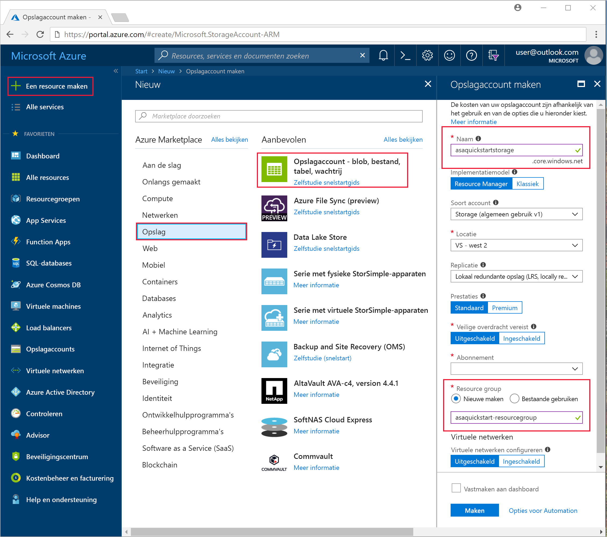
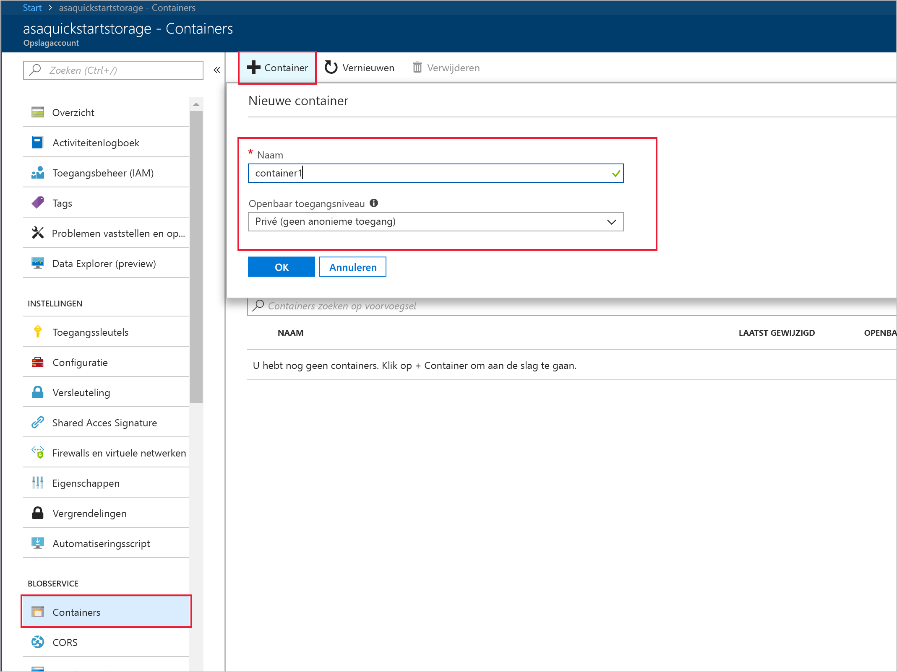
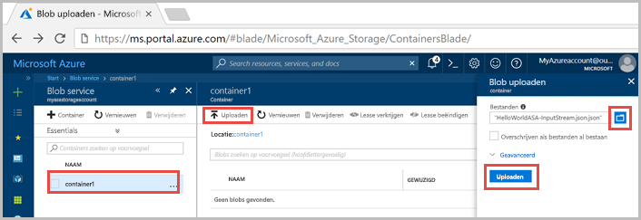
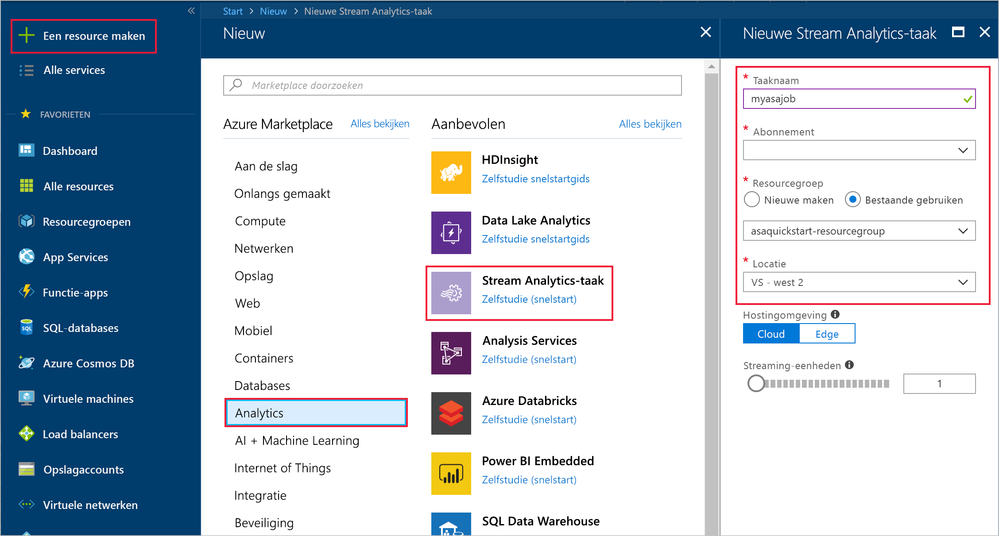
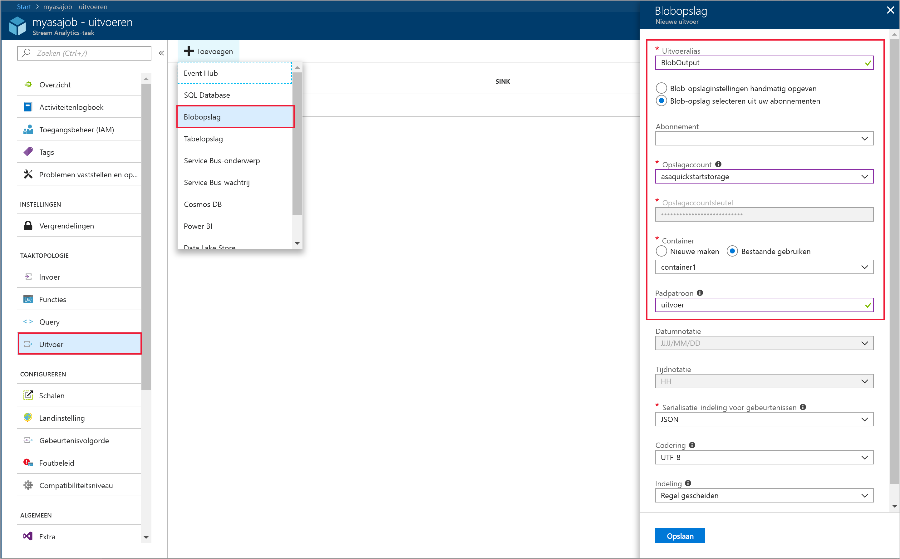
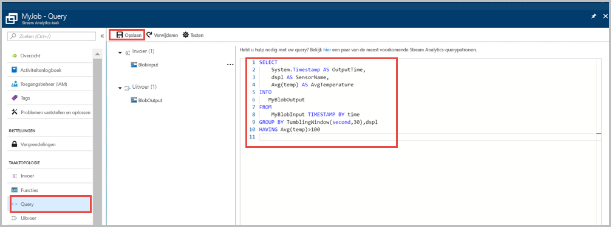
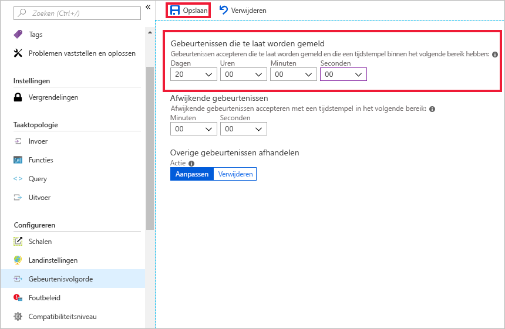
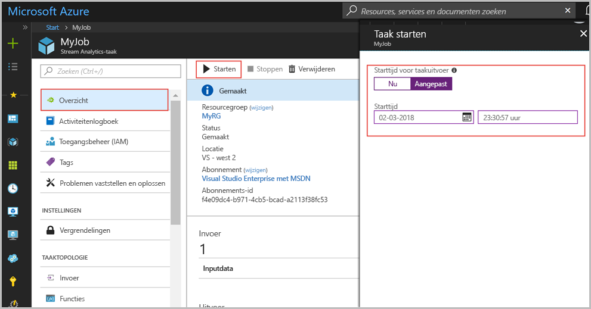
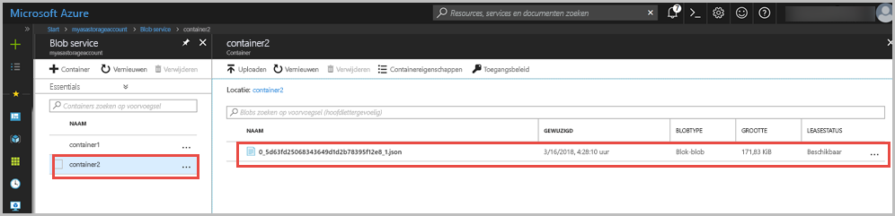

# <a name="quickstart-create-a-stream-analytics-job-by-using-the-azure-portal"></a>Snelstart: Een Stream Analytics-taak maken via Azure Portal

In deze snelstart wordt getoond hoe u aan de slag kunt door een Stream Analytics-taak te maken. In deze snelstart definieert u een Stream Analytics-taak die elke 30 seconden voorbeeldsensorgegevens en filterrijen leest met een gemiddelde temperatuur van meer dan 100. In dit artikel leest u gegevens uit blobopslag, transformeert u de gegevens en schrijft u de gegevens terug naar een andere container in dezelfde blobopslag. Het bestand met invoergegevens dat wordt gebruikt in deze snelstart, bevat statische gegevens die alleen zijn bedoeld ter illustratie. In een werkelijk scenario gebruikt u streaming-invoergegevens voor een Stream Analytics-taak.

## <a name="before-you-begin"></a>Voordat u begint

* Als u nog geen abonnement op Azure hebt, maakt u een [gratis account](https://azure.microsoft.com/free/) aan.

* Meld u aan bij [Azure Portal](https://portal.azure.com/).

## <a name="prepare-the-input-data"></a>De invoergegevens voorbereiden

Voordat u de Stream Analytics-taak definieert, moet u de gegevens voorbereiden die als invoer voor de taak worden geconfigureerd. Voer de volgende stappen uit om de invoergegevens voor te bereiden die zijn vereist voor de taak:

1. Download de [voorbeeldsensorgegevens](https://raw.githubusercontent.com/Azure/azure-stream-analytics/master/Samples/GettingStarted/HelloWorldASA-InputStream.json) in GitHub. De voorbeeldgegevens bevatten sensorinformatie in de volgende JSON-indeling:  

   ```json
   {
     "time": "2018-08-19T21:18:52.0000000",
     "dspl": "sensorC",
     "temp": 87,
     "hmdt": 44
   }
   ```
2. Meld u aan bij [Azure Portal](https://portal.azure.com/).  

3. Selecteer in de linkerbovenhoek in Azure Portal **Een resource maken** > **Storage** > **Storage-account**. Vul de pagina voor de Storage-accounttaak in, waarbij **Naam** is ingesteld op 'asaquickstartstorage', **Locatie** op 'US - west 2', **Resourcegroep** op 'asaquickstart-resourcegroup' (host het opslagaccount in dezelfde resourcegroep als de streaming-taak voor betere prestaties). De overige instellingen kunnen op de standaardwaarden blijven staan.  

   

4. Ga op de pagina **Alle resources** naar het opslagaccount dat u in de vorige stap hebt gemaakt. Open de pagina **Overzicht** en open vervolgens de tegel **Blobs**.  

5. Selecteer op de pagina **Blob Service** de optie **Container**, geef de container een **Naam**, bijvoorbeeld *container1*, en wijzig **Niveau openbare toegang** in Privé (geen anonieme leestoegang) > selecteer **OK**.  

   

6. Ga naar de container die u hebt gemaakt in de vorige stap. Selecteer **Uploaden** en upload de sensorgegevens die u hebt gekregen in de eerste stap.  

   

## <a name="create-a-stream-analytics-job"></a>Een Stream Analytics-taak maken

1. Meld u aan bij Azure Portal.

2. Selecteer in de linkerbovenhoek van Azure Portal **Een resource maken**.  

3. Selecteer **Data+Analytics** > **Stream Analytics job** in de lijst met resultaten.  

4. Vul de pagina voor de Storage-accounttaak in met de volgende gegevens:

   |**Instelling**  |**Voorgestelde waarde**  |**Beschrijving**  |
   |---------|---------|---------|
   |Taaknaam   |  myasajob   |   Voer een unieke naam in voor uw Stream Analytics-taak. De naam van een Stream Analytics-taak mag alleen alfanumerieke tekens, afbreekstreepjes en onderstrepingstekens bevatten en moet tussen de 3 en 63 tekens lang zijn. |
   |Abonnement  | \<Uw abonnement\> |  Selecteer het Azure-abonnement dat u wilt gebruiken voor deze taak. |
   |Resourcegroep   |   asaquickstart-resourcegroup  |   Selecteer **Nieuwe maken** en voer een naam voor de nieuwe resourcegroep voor uw account in. |
   |Locatie  |  \<Selecteer de regio die het dichtst bij uw gebruikers is gelegen\> | Selecteer de geografische locatie waar u de Stream Analytics-taak kunt hosten. Gebruik de locatie die het dichtst bij uw gebruikers is gelegen voor betere prestaties en om de kosten van gegevensoverdracht te verminderen. |
   |Streaming-eenheden  | 1  |   Streaming-eenheden vertegenwoordigen de computerresources die nodig zijn om een taak uit te voeren. Deze waarde is standaard ingesteld op 1. Zie het artikel [Streaming-eenheden begrijpen en aanpassen](stream-analytics-streaming-unit-consumption.md) voor meer informatie over het schalen van streaming-eenheden.   |
   |Hostingomgeving  |  Cloud  |   Stream Analytics-taken kunnen worden geïmplementeerd in Cloud of in Edge. Met Cloud kunt u taken implementeren naar Azure Cloud en met Edge kunt u taken implementeren naar een IoT-randapparaat. |

   

5. Schakel het selectievakje **Aan dashboard vastmaken** in om de taak op het dashboard te plaatsen en selecteer **Maken**.  

6. In de rechterbovenhoek van het browservenster moet een bericht staan dat de implementatie wordt uitgevoerd. 

## <a name="configure-input-to-the-job"></a>Invoer voor de taak configureren

In deze sectie gaat u blobopslag configureren als invoer voor de Stream Analytics-taak. Voordat u de invoer gaat configureren, maakt u een blobopslagaccount.  

### <a name="add-the-input"></a>Invoer toevoegen 

1. Ga naar de Stream Analytics-taak.  

2. Selecteer **Inputs** > **Add Stream input** > **Blob storage**.  

3. Vul de pagina **Blobopslag** in met de volgende waarden:

   |**Instelling**  |**Voorgestelde waarde**  |**Beschrijving**  |
   |---------|---------|---------|
   |Invoeralias  |  BlobInput   |  Voer een unieke naam in voor de invoer van de taak.   |
   |Abonnement   |  \<Uw abonnement\> |  Selecteer het Azure-abonnement met het opslagaccount dat u hebt gemaakt. Het opslagaccount kan voor hetzelfde of een ander abonnement gelden. Voor dit voorbeeld wordt aangenomen dat u een opslagaccount voor hetzelfde abonnement hebt gemaakt. |
   |Storage-account  |  myasastorageaccount |  Kies of typ de naam van het opslagaccount. Namen van opslagaccounts worden automatisch gedetecteerd als ze worden gemaakt in hetzelfde abonnement. |
   |Container  | container1 | Kies de naam van de container met voorbeeldgegevens. Namen van containers worden automatisch gedetecteerd als ze worden gemaakt in hetzelfde abonnement. |

4. De andere opties kunnen de standaardwaarden behouden. Selecteer **Opslaan** om de instellingen op te slaan.  

   
 
## <a name="configure-output-to-the-job"></a>Uitvoer voor de taak configureren

1. Ga naar de Stream Analytics-taak die u eerder hebt gemaakt.  

2. Selecteer **Outputs > Add > Blob storage**.  

3. Vul de pagina **Blobopslag** in met de volgende waarden:

   |**Instelling**  |**Voorgestelde waarde**  |**Beschrijving**  |
   |---------|---------|---------|
   |Uitvoeralias |   BlobOutput   |   Voer een unieke naam in voor de uitvoer van de taak. |
   |Abonnement  |  \<Uw abonnement\>  |  Selecteer het Azure-abonnement met het opslagaccount dat u hebt gemaakt. Het opslagaccount kan voor hetzelfde of een ander abonnement gelden. Voor dit voorbeeld wordt aangenomen dat u een opslagaccount voor hetzelfde abonnement hebt gemaakt. |
   |Storage-account |  asaquickstartstorage |   Kies of typ de naam van het opslagaccount. Namen van opslagaccounts worden automatisch gedetecteerd als ze worden gemaakt in hetzelfde abonnement.       |
   |Container |   container1  |  Selecteer de bestaande container die u in uw opslagaccount hebt gemaakt.   |
   |Padpatroon |   output  |  Voer een naam in die voor de uitvoer dient als het pad in uw bestaande container.   |

4. De andere opties kunnen de standaardwaarden behouden. Selecteer **Opslaan** om de instellingen op te slaan.  

   
 
## <a name="define-the-transformation-query"></a>De transformatiequery definiëren

1. Ga naar de Stream Analytics-taak die u eerder hebt gemaakt.  

2. Selecteer **Query** en werk de query als volgt bij:  

   ```sql
   SELECT 
   System.Timestamp AS OutputTime,
   dspl AS SensorName,
   Avg(temp) AS AvgTemperature
   INTO
     BlobOutput
   FROM
     BlobInput TIMESTAMP BY time
   GROUP BY TumblingWindow(second,30),dspl
   HAVING Avg(temp)>100
   ```

3. In dit voorbeeld leest de query de gegevens vanuit de blob en kopieert ze naar een nieuw bestand in de blob. Selecteer **Opslaan**.  

   

## <a name="configure-late-arrival-policy"></a>Beleid voor late aankomst configureren

1. Ga naar de Stream Analytics-taak die u eerder hebt gemaakt.

2. Selecteer onder **Configureren** de optie **Gebeurtenisvolgorde**.

3. Stel **Gebeurtenissen die te laat worden gemeld** in op 20 dagen en selecteer **Opslaan**.

   

## <a name="start-the-stream-analytics-job-and-check-the-output"></a>De Stream Analytics-taak starten en uitvoer controleren

1. Ga terug naar de pagina met het taakoverzicht en selecteer **Starten**.

2. Selecteer onder **Taak starten** de optie **Aangepast** voor het veld **Begintijd**. Selecteer `2018-01-24` als de begindatum, maar wijzig de tijd niet. Deze begindatum is gekozen omdat deze voorafgaat aan de timestamp voor de gebeurtenis uit de voorbeeldgegevens. Selecteer **Starten** als u klaar bent.

   

3. Na enkele minuten gaat u in de portal naar het opslagaccount en de container die u hebt geconfigureerd als uitvoer voor de taak. Selecteer het uitvoerpad. U ziet nu het uitvoerbestand in de container. Het duurt de eerste keer enkele minuten voordat de taak wordt gestart. Daarna wordt de taak voortgezet naarmate de gegevens binnenkomen.  

   

## <a name="clean-up-resources"></a>Resources opschonen

Wanneer u een resourcegroep niet meer nodig hebt, verwijdert u de resourcegroep, de streamingtaak en alle gerelateerde resources. Door de taak te verwijderen, voorkomt u dat de streaming-eenheden die door de taak worden verbruikt, in rekening worden gebracht. Als u denkt dat u de taak in de toekomst nog gaat gebruiken, kunt u deze stoppen en later opnieuw starten wanneer dat nodig is. Als u deze taak niet meer gaat gebruiken, verwijdert u alle resources die in deze snelstart zijn gemaakt. Daarvoor voert u de volgende stappen uit:

1. Selecteer in het menu aan de linkerkant in Azure Portal de optie **Resourcegroepen** en selecteer vervolgens de resource die u hebt gemaakt.  

2. Selecteer op de pagina van uw resourcegroep de optie **Verwijderen**, typ de naam van de resource die u wilt verwijderen in het tekstvak en selecteer vervolgens **Verwijderen**.

## <a name="next-steps"></a>Volgende stappen

In deze snelstart hebt u een eenvoudige Stream Analytics-taak geïmplementeerd. Voor informatie over het configureren van andere invoerbronnen en het uitvoeren van detectie in realtime gaat u door naar het volgende artikel:

> [!div class="nextstepaction"]
> [Fraudedetectie in realtime met Azure Stream Analytics](stream-analytics-real-time-fraud-detection.md)

