# <a name="quickstart-create-a-stream-analytics-job-by-using-the-azure-portal"></a>Snelstart: Een Stream Analytics-taak maken via Azure Portal

In deze snelstart wordt getoond hoe u aan de slag kunt door een Stream Analytics-taak te maken. In deze quickstart definieert u een Stream Analytics-taak waarmee streaminggegevens in realtime worden gelezen, en berichten worden gefilterd over een temperatuur die hoger is dan 27. Met de Stream Analytics-taak worden gegevens van een IoT Hub-apparaat gelezen, en worden de gegevens getransformeerd en teruggeschreven naar een container in een blob-opslag. De invoergegevens in deze quickstart worden gegenereerd via een Raspberry Pi Online Simulator. 

## <a name="before-you-begin"></a>Voordat u begint

* Als u nog geen abonnement op Azure hebt, maakt u een [gratis account](https://azure.microsoft.com/free/) aan.

* Meld u aan bij [Azure Portal](https://portal.azure.com/).

## <a name="prepare-the-input-data"></a>De invoergegevens voorbereiden

Voordat u de Stream Analytics-taak definieert, moet u de gegevens voorbereiden die later worden geconfigureerd als de taakinvoer. Voltooi de volgende stappen om de invoergegevens voor te bereiden die zijn vereist voor de taak:

1. Meld u aan bij [Azure Portal](https://portal.azure.com/).

2. Selecteer **Een resource maken** > **Internet of Things** > **IoT Hub**.

3. Voer in het deelvenster **IoT Hub** de volgende informatie in:
   
   |**Instelling**  |**Voorgestelde waarde**  |**Beschrijving**  |
   |---------|---------|---------|
   |Abonnement  | \<Uw abonnement\> |  Selecteer het Azure-abonnement dat u wilt gebruiken. |
   |Resourcegroep   |   asaquickstart-resourcegroup  |   Selecteer **Nieuwe maken** en voer een naam voor de nieuwe resourcegroep voor uw account in. |
   |Regio  |  \<Selecteer de regio die het dichtst bij uw gebruikers is gelegen\> | Selecteer een geografische locatie waar u de IoT-hub kunt hosten. Gebruik de locatie die het dichtst bij uw gebruikers is. |
   |Naam van de IoT-hub  | MyASAIoTHub  |   Selecteer een naam voor de IoT-hub.   |

   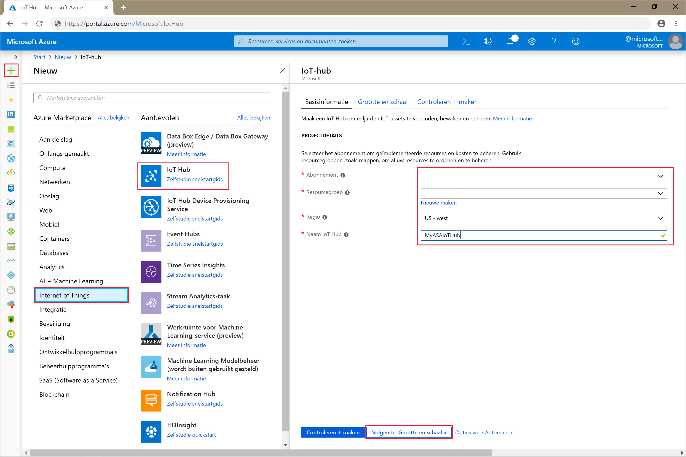

4. Selecteer **Volgende: grootte instellen en schaal aanpassen**.

5. Kies uw **prijs- en schaalcategorie**. Selecteer voor deze quickstart de categorie **F1 - Gratis** als deze nog beschikbaar is voor uw abonnement. Zie [Prijsinformatie IoT Hub](https://azure.microsoft.com/pricing/details/iot-hub/) voor meer informatie.

   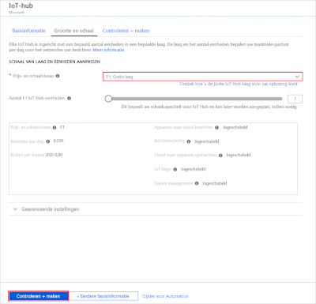

6. Selecteer **Controleren + maken**. Controleer de informatie van de IoT-hub en klik op **Maken**. Het kan enkele minuten duren voordat de IoT-hub is gemaakt. U kunt de voortgang bewaken via het deelvenster **Meldingen**.

7. Klik in het IoT Hub-navigatiemenu onder **IoT-apparaten** op **Toevoegen**. Voeg een **Apparaat-id** toe en klik op **Opslaan**.

   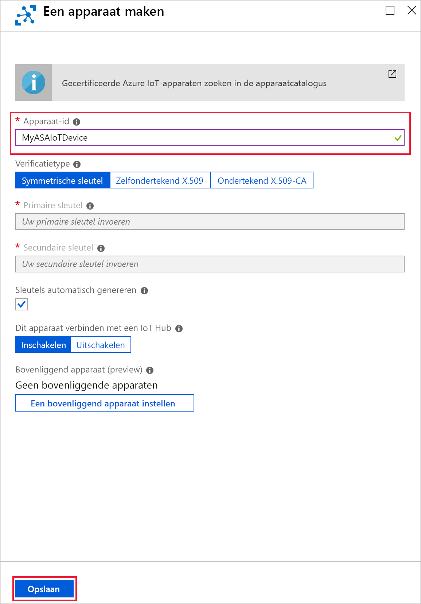

8. Zodra het apparaat is gemaakt, wordt het geopend vanuit de lijst **IoT-apparaten**. Kopieer de **Verbindingsreeks -- primaire sleutel** en sla deze in een kladblok op voor later gebruik.

   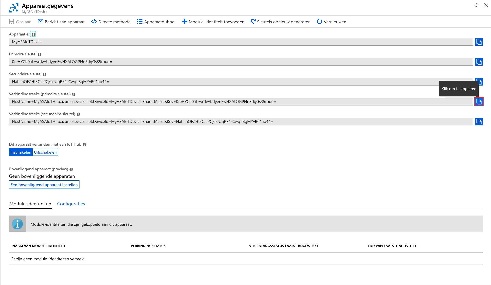

## <a name="create-blob-storage"></a>Blob-opslag maken

1. Selecteer in de linkerbovenhoek in Azure Portal **Een resource maken** > **Storage** > **Storage-account**.

2. Voer in het deelvenster **Opslagaccount maken** een opslagaccountnaam, locatie en resourcegroep in. Kies dezelfde locatie en resourcegroep als de IoT-hub die u hebt gemaakt. Klik vervolgens op **Controleren en maken** om het account te maken.

   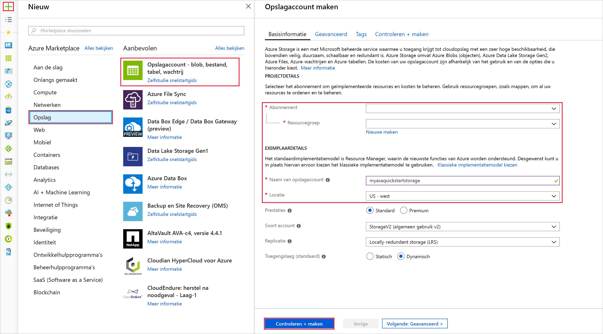

3. Zodra het opslagaccount is gemaakt, selecteert u in het deelvenster **Overzicht** de tegel **Blobs**.

   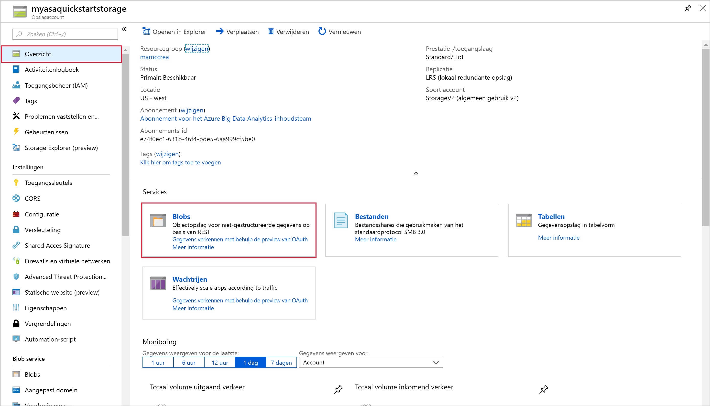

4. Selecteer op de pagina **Blob Service** de optie **Container** en geef een naam op voor de container, bijvoorbeeld *container1*. Laat **Niveau openbare toegang** staan op **Privé (geen anonieme toegang)** en selecteer **OK**.

   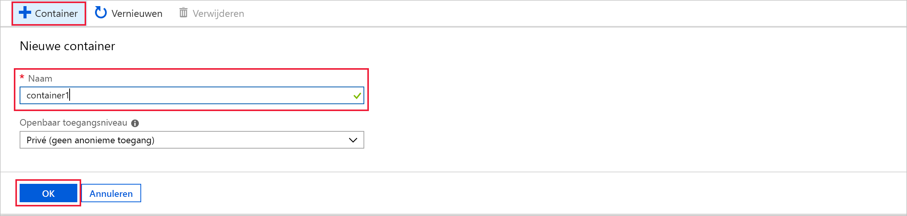

## <a name="create-a-stream-analytics-job"></a>Een Stream Analytics-taak maken

1. Meld u aan bij Azure Portal.

2. Selecteer in de linkerbovenhoek van Azure Portal **Een resource maken**.  

3. Selecteer **Data+Analytics** > **Stream Analytics job** in de lijst met resultaten.  

4. Vul de pagina voor de Storage-accounttaak in met de volgende gegevens:

   |**Instelling**  |**Voorgestelde waarde**  |**Beschrijving**  |
   |---------|---------|---------|
   |Taaknaam   |  MyASAJob   |   Voer een unieke naam in voor uw Stream Analytics-taak. De naam van een Stream Analytics-taak mag alleen alfanumerieke tekens, afbreekstreepjes en onderstrepingstekens bevatten en moet tussen de 3 en 63 tekens lang zijn. |
   |Abonnement  | \<Uw abonnement\> |  Selecteer het Azure-abonnement dat u wilt gebruiken voor deze taak. |
   |Resourcegroep   |   asaquickstart-resourcegroup  |   Selecteer dezelfde resourcegroep als de IoT-hub. |
   |Locatie  |  \<Selecteer de regio die het dichtst bij uw gebruikers is gelegen\> | Selecteer de geografische locatie waar u de Stream Analytics-taak kunt hosten. Gebruik de locatie die het dichtst bij uw gebruikers is gelegen voor betere prestaties en om de kosten van gegevensoverdracht te verminderen. |
   |Streaming-eenheden  | 1  |   Streaming-eenheden vertegenwoordigen de computerresources die nodig zijn om een taak uit te voeren. Deze waarde is standaard ingesteld op 1. Zie het artikel [Streaming-eenheden begrijpen en aanpassen](stream-analytics-streaming-unit-consumption.md) voor meer informatie over het schalen van streaming-eenheden.   |
   |Hostingomgeving  |  Cloud  |   Stream Analytics-taken kunnen worden geïmplementeerd in Cloud of in Edge. Met Cloud kunt u taken implementeren naar Azure Cloud en met Edge kunt u taken implementeren naar een IoT-randapparaat. |

   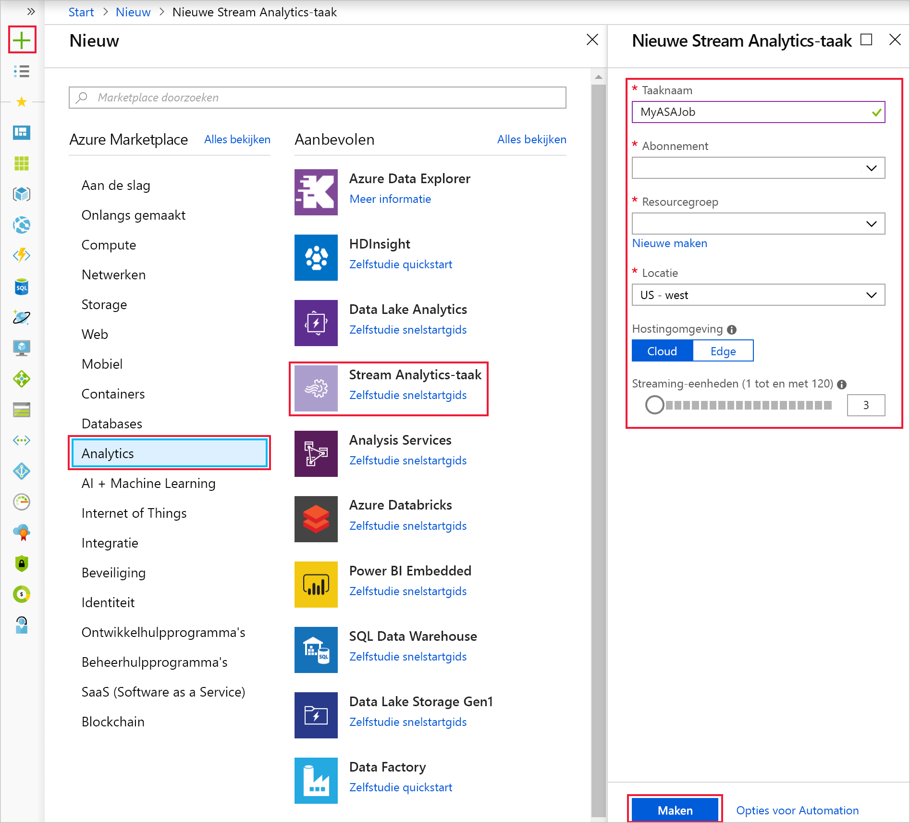

5. Schakel het selectievakje **Aan dashboard vastmaken** in om de taak op het dashboard te plaatsen en selecteer **Maken**.  

6. In de rechterbovenhoek van het browservenster ziet u de melding *Implementatie wordt uitgevoerd...*. 

## <a name="configure-job-input"></a>Taakinvoer configureren

In deze sectie configureert u IoT Hub-apparaatinvoer in de Stream Analytics-taak. Gebruik de IoT-hub die u hebt gemaakt in de vorige sectie van de quickstart.

1. Ga naar de Stream Analytics-taak.  

2. Selecteer **Invoer** > **Stream-invoer toevoegen** > **Blob-opslag**.  

3. Vul de volgende waarden in op de pagina **IoT Hub**:

   |**Instelling**  |**Voorgestelde waarde**  |**Beschrijving**  |
   |---------|---------|---------|
   |Invoeralias  |  IoTHubInput   |  Voer een unieke naam in voor de invoer van de taak.   |
   |Abonnement   |  \<Uw abonnement\> |  Selecteer het Azure-abonnement met het opslagaccount dat u hebt gemaakt. Het opslagaccount kan voor hetzelfde of een ander abonnement gelden. Voor dit voorbeeld wordt aangenomen dat u een opslagaccount voor hetzelfde abonnement hebt gemaakt. |
   |IoT Hub  |  MyASAIoTHub |  Voer de naam in van de IoT-hub die u hebt gemaakt in de vorige sectie. |

4. De andere opties kunnen de standaardwaarden behouden. Selecteer **Opslaan** om de instellingen op te slaan.  

   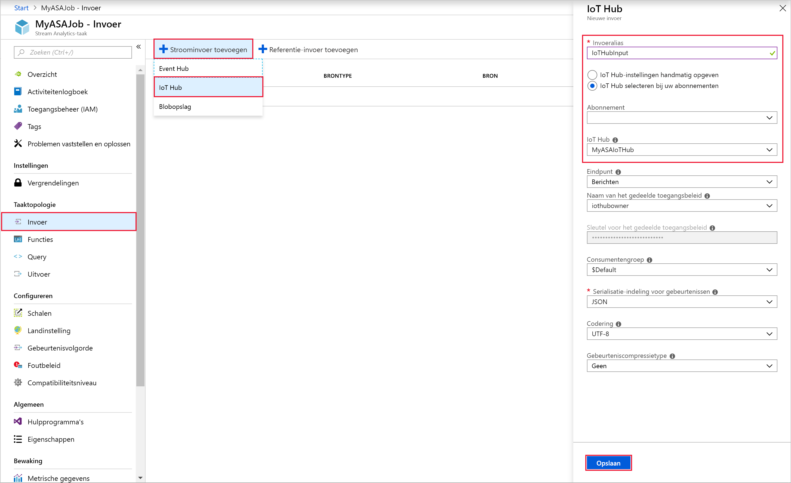
 
## <a name="configure-job-output"></a>Taakuitvoer configureren

1. Ga naar de Stream Analytics-taak die u eerder hebt gemaakt.  

2. Selecteer **Uitvoer** > **Toevoegen** > **Blob-opslag**.  

3. Vul de pagina **Blobopslag** in met de volgende waarden:

   |**Instelling**  |**Voorgestelde waarde**  |**Beschrijving**  |
   |---------|---------|---------|
   |Uitvoeralias |   BlobOutput   |   Voer een unieke naam in voor de uitvoer van de taak. |
   |Abonnement  |  \<Uw abonnement\>  |  Selecteer het Azure-abonnement met het opslagaccount dat u hebt gemaakt. Het opslagaccount kan voor hetzelfde of een ander abonnement gelden. Voor dit voorbeeld wordt aangenomen dat u een opslagaccount voor hetzelfde abonnement hebt gemaakt. |
   |Storage-account |  asaquickstartstorage |   Kies of typ de naam van het opslagaccount. Namen van opslagaccounts worden automatisch gedetecteerd als ze worden gemaakt in hetzelfde abonnement.       |
   |Container |   container1  |  Selecteer de bestaande container die u in uw opslagaccount hebt gemaakt.   |

4. De andere opties kunnen de standaardwaarden behouden. Selecteer **Opslaan** om de instellingen op te slaan.  

   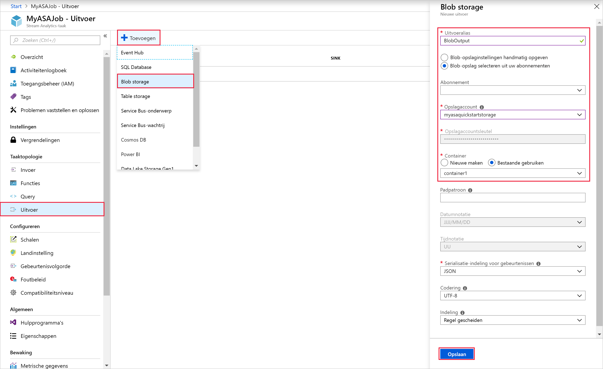
 
## <a name="define-the-transformation-query"></a>De transformatiequery definiëren

1. Ga naar de Stream Analytics-taak die u eerder hebt gemaakt.  

2. Selecteer **Query** en werk de query als volgt bij:  

   ```sql
   SELECT *
   INTO BlobOutput
   FROM IoTHubInput
   HAVING Temperature > 27
   ```

3. In dit voorbeeld worden via de query de gegevens uit IoT Hub gelezen en gekopieerd naar een nieuw bestand in de blob. Selecteer **Opslaan**.  

   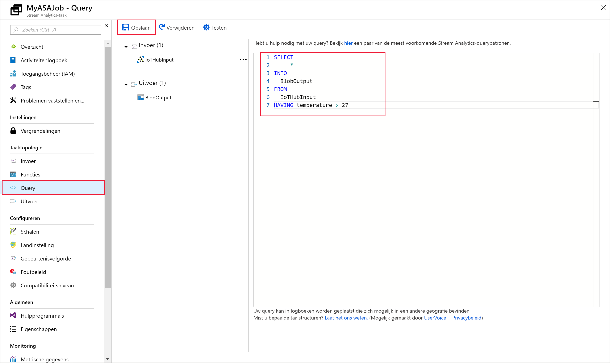

## <a name="run-the-iot-simulator"></a>De IoT-simulator uitvoeren

1. Open de [Raspberry Pi Azure IoT Online Simulator](https://azure-samples.github.io/raspberry-pi-web-simulator/).

2. Vervang de tijdelijke aanduiding in regel 15 door de verbindingsreeks van het Azure IoT Hub-apparaat die u hebt opgeslagen in de vorige sectie.

3. Klik op **Run**. De uitvoer geeft de sensorgegevens en berichten weer die worden verzonden naar de IoT-hub.

   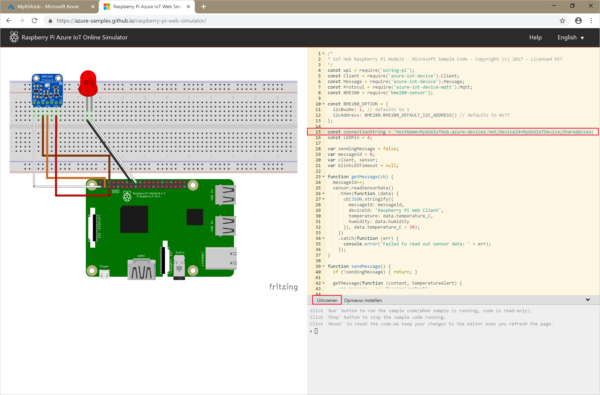

## <a name="start-the-stream-analytics-job-and-check-the-output"></a>De Stream Analytics-taak starten en uitvoer controleren

1. Ga terug naar de pagina met het taakoverzicht en selecteer **Starten**.

2. Selecteer onder **Taak starten** de optie **Nu** voor het veld **Starttijd voor taakuitvoer**. Selecteer vervolgens **Starten** om de taak te starten.

3. Na enkele minuten gaat u in de portal naar het opslagaccount en de container die u hebt geconfigureerd als uitvoer voor de taak. U ziet nu het uitvoerbestand in de container. Het duurt de eerste keer enkele minuten voordat de taak wordt gestart. Daarna wordt de taak voortgezet naarmate de gegevens binnenkomen.  

   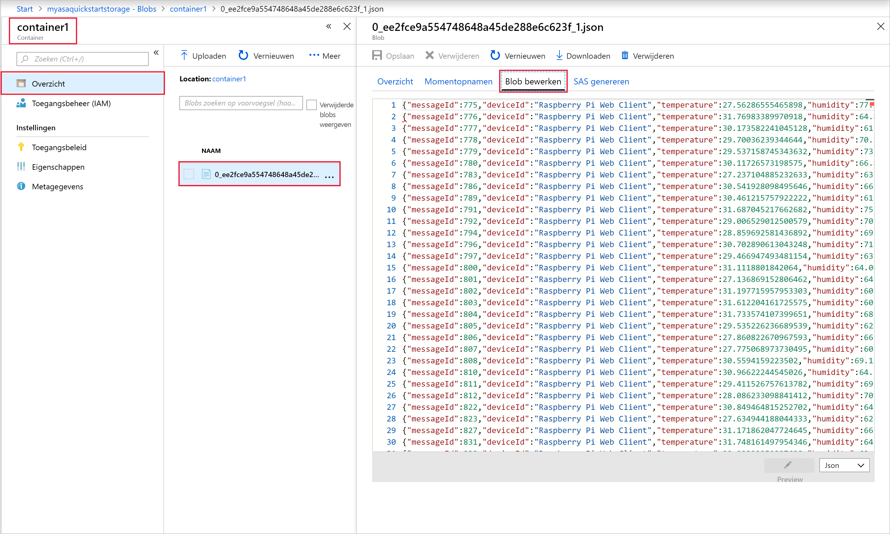

## <a name="clean-up-resources"></a>Resources opschonen

Wanneer u een resourcegroep niet meer nodig hebt, verwijdert u de resourcegroep, de streamingtaak en alle gerelateerde resources. Door de taak te verwijderen, voorkomt u dat de streaming-eenheden die door de taak worden verbruikt, in rekening worden gebracht. Als u denkt dat u de taak in de toekomst nog gaat gebruiken, kunt u deze stoppen en later opnieuw starten wanneer dat nodig is. Als u deze taak niet meer gaat gebruiken, verwijdert u alle resources die in deze snelstart zijn gemaakt. Daarvoor voert u de volgende stappen uit:

1. Selecteer in het menu aan de linkerkant in Azure Portal de optie **Resourcegroepen** en selecteer vervolgens de resource die u hebt gemaakt.  

2. Selecteer op de pagina van uw resourcegroep de optie **Verwijderen**, typ de naam van de resource die u wilt verwijderen in het tekstvak en selecteer vervolgens **Verwijderen**.

## <a name="next-steps"></a>Volgende stappen

In deze snelstart hebt u een eenvoudige Stream Analytics-taak met behulp van de Azure-portal geïmplementeerd. U kunt Stream Analytics-taken ook implementeren met behulp van [PowerShell](stream-analytics-quick-create-powershell.md) en [Visual Studio](stream-analytics-quick-create-vs.md).

Voor informatie over het configureren van andere invoerbronnen en het uitvoeren van detectie in realtime gaat u door naar het volgende artikel:

> [!div class="nextstepaction"]
> [Fraudedetectie in realtime met Azure Stream Analytics](stream-analytics-real-time-fraud-detection.md)

