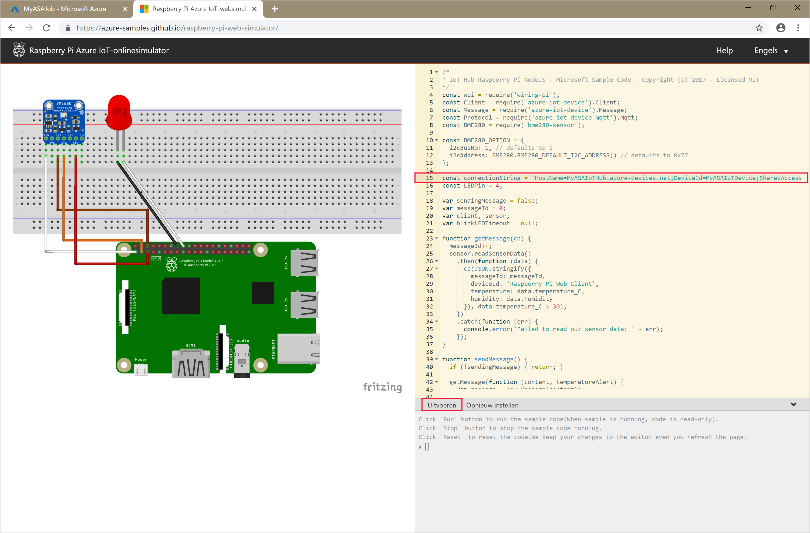

# <a name="quickstart-create-a-stream-analytics-job-using-azure-powershell"></a>Quickstart: Een Stream Analytics-taak maken met behulp van Azure PowerShell

De Azure PowerShell-module wordt gebruikt voor het maken en beheren van Azure-resources met behulp van PowerShell-cmdlets of -scripts. In deze snelstart vindt u informatie over het gebruik van de Azure PowerShell-module om een Azure Stream Analytics-taak te implementeren en uit te voeren. 

De voorbeeldtaak leest streaminggegevens vanaf een IoT Hub-apparaat. De invoergegevens worden gegenereerd door Raspberry Pi Online Simulator. De Stream Analytics-taak transformeert de gegevens vervolgens met behulp van de Stream Analytics-querytaal om te filteren op berichten met een temperatuur van meer dan 27°. Tot slot worden de resulterende uitvoergebeurtenissen naar een bestand in blobopslag geschreven. 

## <a name="before-you-begin"></a>Voordat u begint

* Als u nog geen Azure-abonnement hebt, maak dan een [gratis account](https://azure.microsoft.com/free/) aan.  

* Voor deze snelstartgids is moduleversie 3.6 of later van Azure PowerShell vereist. Voer `Get-Module -ListAvailable AzureRM` uit om de versie op te zoeken die op uw lokale computer is geïnstalleerd. Als u PowerShell wilt installeren of upgraden, raadpleegt u [De Azure PowerShell-module installeren](https://docs.microsoft.com/powershell/azure/azurerm/install-azurerm-ps).

* Sommige IoT Hub acties worden niet ondersteund door Azure PowerShell en moeten worden voltooid met behulp van Azure CLI-versie 2.0.24 of hoger en de IoT-extensie voor Azure CLI. [Installeer de Azure CLI](https://docs.microsoft.com/cli/azure/install-azure-cli?view=azure-cli-latest) en gebruik `az extension add --name azure-cli-iot-ext` voor het installeren van de IoT-extensie.


## <a name="sign-in-to-azure"></a>Aanmelden bij Azure

Meld u met de opdracht `Connect-AzureRmAccount` aan bij uw Azure-abonnement en voer uw Azure-referenties in de pop-upbrowser in:

```powershell
# Connect to your Azure account
Connect-AzureRmAccount
```

Als u meer dan één abonnement hebt, selecteert u het abonnement dat u wilt gebruiken voor deze quickstart door de volgende cmdlets uit te voeren. Vervang `<your subscription name>` door de naam van uw abonnement:  

```powershell
# List all available subscriptions.
Get-AzureRmSubscription

# Select the Azure subscription you want to use to create the resource group and resources.
Get-AzureRmSubscription -SubscriptionName "<your subscription name>" | Select-AzureRmSubscription
```

## <a name="create-a-resource-group"></a>Een resourcegroep maken

Maak een Azure-resourcegroep met de opdracht [New-AzureRmResourceGroup](https://docs.microsoft.com/powershell/module/azurerm.resources/new-azurermresourcegroup). Een resourcegroep is een logische container waarin Azure-resources worden geïmplementeerd en beheerd.

```powershell
$resourceGroup = "StreamAnalyticsRG"
$location = "WestUS2"
New-AzureRmResourceGroup `
   -Name $resourceGroup `
   -Location $location 
```

## <a name="prepare-the-input-data"></a>De invoergegevens voorbereiden

Voordat u de Stream Analytics-taak definieert, moet u de gegevens voorbereiden die als invoer voor de taak zijn geconfigureerd.

In het volgende codeblok van de Azure CLI worden meerdere opdrachten uitgevoerd om de invoergegevens voor te bereiden die nodig zijn voor de taak. Bekijk de secties om de code te begrijpen.

1. Voer in het PowerShell-venster de opdracht [az login](https://docs.microsoft.com/cli/azure/authenticate-azure-cli?view=azure-cli-latest) uit om u aan te melden bij uw Azure-account. 

   Wanneer u bent aangemeld, retourneert de Azure CLI een lijst met uw abonnementen. Kopieer het abonnement dat u gebruikt voor deze quickstart en voer de opdracht [az account set](https://docs.microsoft.com/cli/azure/manage-azure-subscriptions-azure-cli?view=azure-cli-latest#change-the-active-subscription) uit om dat abonnement te selecteren. Kies het abonnement dat u hebt geselecteerd in de vorige sectie met PowerShell. Vergeet niet om `<your subscription name>` te vervangen door de naam van uw abonnement.

   ```azurecli
   az login
   
   az account set --subscription "<your subscription>"
   ```

2. Maak een IoT Hub met de opdracht [az iot hub create](../iot-hub/iot-hub-create-using-cli.md#create-an-iot-hub). In dit voorbeeld wordt een IoT Hub met de naam **MyASAIoTHub** gemaakt. Omdat namen van IoT Hubs uniek moeten zijn, moet u zelf een naam bedenken voor uw IoT Hub. Stel de SKU in op F1 om de gratis laag te gebruiken als deze beschikbaar is met uw abonnement. Als dat niet het geval is, kiest u de eerstvolgende lagere categorie.

   ```azurecli
   az iot hub create --name "<your IoT Hub name>" --resource-group $resourceGroup --sku S1
   ```

   Zodra de IoT Hub is gemaakt, vraagt u de verbindingsreeks voor IoT Hub op met de opdracht [az iot hub show-connection-string](https://docs.microsoft.com/cli/azure/iot/hub?view=azure-cli-latest). Kopieer de volledige verbindingsreeks en bewaar deze totdat u de IoT Hub als invoer gaat toevoegen aan uw Stream Analytics-taak.
   
   ```azurecli
   az iot hub show-connection-string --hub-name "MyASAIoTHub"
   ```

3. Voeg een apparaat toe aan IoT Hub met behulp van de opdracht [az iothub-device identity create](../iot-hub/quickstart-send-telemetry-c.md#register-a-device). In dit voorbeeld maakt u een apparaat met de naam **MyASAIoTDevice**.

   ```azurecli
   az iot hub device-identity create --hub-name "MyASAIoTHub" --device-id "MyASAIoTDevice"
   ```

4. Vraag de verbindingsreeks van het apparaat op met de opdracht [az iot hub device-identity show-connection-string](/cli/azure/ext/azure-cli-iot-ext/iot/hub/device-identity#ext-azure-cli-iot-ext-az-iot-hub-device-identity-show-connection-string). Kopieer de volledige verbindingsreeks en bewaar deze totdat u de Raspberry Pi-simulator gaat maken.

   ```azurecli
   az iot hub device-identity show-connection-string --hub-name "MyASAIoTHub" --device-id "MyASAIoTDevice" --output table
   ```

   **Voorbeeld van uitvoer:**

   ```azurecli
   HostName=MyASAIoTHub.azure-devices.net;DeviceId=MyASAIoTDevice;SharedAccessKey=a2mnUsg52+NIgYudxYYUNXI67r0JmNubmfVafojG8=
   ```

## <a name="create-blob-storage"></a>Blob-opslag maken

Het volgende codeblok van Azure PowerShell bevat opdrachten voor het maken van blob-opslag die wordt gebruikt voor taakuitvoer. Bekijk de secties om de code te begrijpen.

1. Maak een standaardopslagaccount voor algemeen gebruik met de cmdlet [New-AzureRmStorageAccount](https://docs.microsoft.com/powershell/module/azurerm.storage/New-AzureRmStorageAccount).  In dit voorbeeld wordt een opslagaccount met de naam **myasaquickstartstorage** gemaakt met lokaal redundante opslag (LRS) en blob-codering (standaard ingeschakeld).  
   
2. Haal de opslagaccountcontext op waarin het te gebruiken opslagaccount `$storageAccount.Context` is gedefinieerd. Als u werkt met opslagaccounts, verwijst u naar de context in plaats van herhaaldelijk de referenties op te geven. 

3. Maak een nieuwe opslagcontainer met [New-AzureStorageContainer](https://docs.microsoft.com/powershell/module/azure.storage/new-azurestoragecontainer).

4. Kopieer de opslagsleutel die is uitgevoerd door de code en bewaar deze sleutel om later de uitvoer van de streamingtaak te maken.

   ```powershell
   $storageAccountName = "myasaquickstartstorage"
   $storageAccount = New-AzureRmStorageAccount `
     -ResourceGroupName $resourceGroup `
     -Name $storageAccountName `
     -Location $location `
     -SkuName Standard_LRS `
     -Kind Storage
   
   $ctx = $storageAccount.Context
   $containerName = "container1"
   
   New-AzureStorageContainer `
     -Name $containerName `
     -Context $ctx
   
   $storageAccountKey = (Get-AzureRmStorageAccountKey `
     -ResourceGroupName $resourceGroup `
     -Name $storageAccountName).Value[0]
   
   Write-Host "The <storage account key> placeholder needs to be replaced in your output json files with this key value:" 
   Write-Host $storageAccountKey -ForegroundColor Cyan
   ```

## <a name="create-a-stream-analytics-job"></a>Een Stream Analytics-taak maken

Maak een Stream Analytics-taak met behulp van de cmdlet [New-AzureRmStreamAnalyticsJob](https://docs.microsoft.com/powershell/module/azurerm.streamanalytics/new-azurermstreamanalyticsjob?view=azurermps-5.4.0). Deze cmdlet gebruikt de taaknaam, de naam van de resourcegroep en de taakdefinitie als parameters. De taaknaam kan elke gewenste beschrijvende naam zijn voor de taak. De naam mag alleen alfanumerieke tekens, afbreekstreepjes en onderstrepingstekens bevatten en moet tussen de 3 en 63 tekens lang zijn. De taakdefinitie is een JSON-bestand dat de eigenschappen bevat die zijn vereist voor het maken van een taak. Maak op uw lokale machine een bestand met de naam `JobDefinition.json` en voeg er de volgende JSON-gegevens aan toe:

```json
{    
   "location":"WestUS2",  
   "properties":{    
      "sku":{    
         "name":"standard"  
      },  
      "eventsOutOfOrderPolicy":"adjust",  
      "eventsOutOfOrderMaxDelayInSeconds":10,  
      "compatibilityLevel": 1.1
   }
}
```

Voer vervolgens de cmdlet `New-AzureRmStreamAnalyticsJob` uit. Vergeet niet om de waarde van de variabele `jobDefinitionFile` te vervangen door het pad waar u het JSON-bestand met de taakdefinitie hebt opgeslagen. 

```powershell
$jobName = "MyStreamingJob"
$jobDefinitionFile = "C:\JobDefinition.json"
New-AzureRmStreamAnalyticsJob `
  -ResourceGroupName $resourceGroup `
  -File $jobDefinitionFile `
  -Name $jobName `
  -Force 
```

## <a name="configure-input-to-the-job"></a>Invoer voor de taak configureren

Voeg invoer aan uw taak toe met behulp van de cmdlet [New-AzureRmStreamAnalyticsInput](https://docs.microsoft.com/powershell/module/azurerm.streamanalytics/new-azurermstreamanalyticsinput?view=azurermps-5.4.0). Deze cmdlet gebruikt de taaknaam, taakinvoernaam, resourcegroepnaam en de taakinvoerdefinitie als parameters. De taakinvoerdefinitie is een JSON-bestand dat de eigenschappen bevat die nodig zijn om de invoer van de taak te configureren. In dit voorbeeld maakt u een blobopslag als invoer. 

Maak op uw lokale machine een bestand met de naam `JobInputDefinition.json` en voeg er de volgende JSON-gegevens aan toe. Vervang de waarde voor `accesspolicykey` door het gedeelte `SharedAccessKey` uit de IoT Hub-verbindingsreeks die u in een eerdere sectie hebt opgeslagen.

```json
{
    "properties": {
        "type": "Stream",
        "datasource": {
            "type": "Microsoft.Devices/IotHubs",
            "properties": {
                "iotHubNamespace": "MyASAIoTHub",
                "sharedAccessPolicyName": "iothubowner",
                "sharedAccessPolicyKey": "accesspolicykey",
                "endpoint": "messages/events",
                "consumerGroupName": "$Default"
                }
        },
        "compression": {
            "type": "None"
        },
        "serialization": {
            "type": "Json",
            "properties": {
                "encoding": "UTF8"
            }
        }
    },
    "name": "IoTHubInput",
    "type": "Microsoft.StreamAnalytics/streamingjobs/inputs"
}
```

Voer daarna de cmdlet `New-AzureRmStreamAnalyticsInput` uit. Vergeet niet om de waarde van `jobDefinitionFile` te vervangen door het pad waar u het JSON-bestand met de invoerdefinitie voor de taak hebt opgeslagen. 

```powershell
$jobInputName = "IoTHubInput"
$jobInputDefinitionFile = "C:\JobInputDefinition.json"
New-AzureRmStreamAnalyticsInput `
  -ResourceGroupName $resourceGroup `
  -JobName $jobName `
  -File $jobInputDefinitionFile `
  -Name $jobInputName 
```

## <a name="configure-output-to-the-job"></a>Uitvoer voor de taak configureren

Voeg uitvoer aan uw taak toe met behulp van de cmdlet [New-AzureRmStreamAnalyticsOutput](https://docs.microsoft.com/powershell/module/azurerm.streamanalytics/new-azurermstreamanalyticsoutput?view=azurermps-5.4.0). Deze cmdlet gebruikt de taaknaam, taakuitvoernaam, resourcegroepnaam en de taakuitvoerdefinitie als parameters. De taakuitvoerdefinitie is een JSON-bestand dat de eigenschappen bevat die nodig zijn om de uitvoer van de taak te configureren. In dit voorbeeld wordt blobopslag als uitvoer gebruikt. 

Maak op uw lokale machine een bestand met de naam `JobOutputDefinition.json` en voeg er de volgende JSON-gegevens aan toe. Let erop dat u de waarde voor `accountKey` vervangt door de toegangssleutel van uw opslagaccount. Deze is opgeslagen in de waarde $storageAccountKey. 

```json
{
    "properties": {
        "datasource": {
            "type": "Microsoft.Storage/Blob",
            "properties": {
                "storageAccounts": [
                    {
                      "accountName": "asaquickstartstorage",
                      "accountKey": "<storage account key>"
                    }],
                "container": "container1",
                "pathPattern": "output/",
                "dateFormat": "yyyy/MM/dd",
                "timeFormat": "HH"
            }
        },
        "serialization": {
            "type": "Json",
            "properties": {
                "encoding": "UTF8",
                "format": "LineSeparated"
            }
        }
    },
    "name": "BlobOutput",
    "type": "Microsoft.StreamAnalytics/streamingjobs/outputs"
}
```

Voer vervolgens de cmdlet `New-AzureRmStreamAnalyticsOutput` uit. Let erop dat u de waarde van de variabele `jobOutputDefinitionFile` vervangt door het pad waar u het JSON-bestand met de taakuitvoerdefinitie hebt opgeslagen. 

```powershell
$jobOutputName = "BlobOutput"
$jobOutputDefinitionFile = "C:\JobOutputDefinition.json"
New-AzureRmStreamAnalyticsOutput `
  -ResourceGroupName $resourceGroup `
  -JobName $jobName `
  -File $jobOutputDefinitionFile `
  -Name $jobOutputName -Force 
```

## <a name="define-the-transformation-query"></a>De transformatiequery definiëren

Voeg een transformatie aan uw taak toe met behulp van de cmdlet [New-AzureRmStreamAnalyticsTransformation](https://docs.microsoft.com/powershell/module/azurerm.streamanalytics/new-azurermstreamanalyticstransformation?view=azurermps-5.4.0). Deze cmdlet gebruikt de taaknaam, taaktransformatienaam, resourcegroepnaam en de taaktransformatiedefinitie als parameters. Maak op uw lokale machine een bestand met de naam `JobTransformationDefinition.json` en voeg er de volgende JSON-gegevens aan toe. Het JSON-bestand bevat een queryparameter die de transformatiequery definieert:

```json
{     
   "name":"MyTransformation",  
   "type":"Microsoft.StreamAnalytics/streamingjobs/transformations",  
   "properties":{    
      "streamingUnits":1,  
      "script":null,  
      "query":" SELECT * INTO BlobOutput FROM IoTHubInput HAVING Temperature > 27"  
   }  
}
```

Voer vervolgens de cmdlet `New-AzureRmStreamAnalyticsTransformation` uit. Let erop dat u de waarde van de variabele `jobTransformationDefinitionFile` vervangt door het pad waar u het JSON-bestand met de definitie voor taaktransformatie hebt opgeslagen. 

```powershell
$jobTransformationName = "MyJobTransformation"
$jobTransformationDefinitionFile = "C:\JobTransformationDefinition.json"
New-AzureRmStreamAnalyticsTransformation `
  -ResourceGroupName $resourceGroup `
  -JobName $jobName `
  -File $jobTransformationDefinitionFile `
  -Name $jobTransformationName -Force
```
## <a name="run-the-iot-simulator"></a>De IoT-simulator uitvoeren

1. Open de [Raspberry Pi Azure IoT Online Simulator](https://azure-samples.github.io/raspberry-pi-web-simulator/).

2. Vervang de tijdelijke aanduiding op regel 15 door de verbindingsreeks van het Azure IoT Hub-apparaat die u hebt opgeslagen in een eerdere sectie.

3. Klik op **Run**. De uitvoer geeft de sensorgegevens en berichten weer die worden verzonden naar de IoT-hub.

   

## <a name="start-the-stream-analytics-job-and-check-the-output"></a>De Stream Analytics-taak starten en uitvoer controleren

Start de taak met de cmdlet [Start AzureRmStreamAnalyticsJob](https://docs.microsoft.com/powershell/module/azurerm.streamanalytics/start-azurermstreamanalyticsjob?view=azurermps-5.4.0). Deze cmdlet gebruikt de taaknaam, resourcegroepnaam, uitvoerstartmodus en begintijd als parameters. `OutputStartMode` accepteert waarden van `JobStartTime`, `CustomTime` of `LastOutputEventTime`. Zie de sectie [Parameters](https://docs.microsoft.com/powershell/module/azurerm.streamanalytics/start-azurermstreamanalyticsjob?view=azurermps-5.4.0) in de PowerShell-documentatie voor meer informatie over waar deze waarden naar verwijzen. 

Nadat u de volgende cmdlet hebt uitgevoerd, retourneert deze `True` als uitvoer als de taak wordt gestart. In de opslagcontainer wordt een uitvoermap met de getransformeerde gegevens gemaakt. 

```powershell
Start-AzureRmStreamAnalyticsJob `
  -ResourceGroupName $resourceGroup `
  -Name $jobName `
  -OutputStartMode 'JobStartTime'
```

## <a name="clean-up-resources"></a>Resources opschonen

Wanneer u een resourcegroep niet meer nodig hebt, verwijdert u de resourcegroep, de streamingtaak en alle gerelateerde resources. Door de taak te verwijderen, voorkomt u dat de streaming-eenheden die door de taak worden verbruikt, in rekening worden gebracht. Als u denkt dat u de taak in de toekomst nog gaat gebruiken, kunt u de verwijdering ervan overslaan en de taak nu stoppen. Als u deze taak niet meer gaat gebruiken, verwijdert u alle resources die in deze quickstart zijn gemaakt door de volgende cmdlet uit te voeren:

```powershell
Remove-AzureRmResourceGroup `
  -Name $resourceGroup 
```

## <a name="next-steps"></a>Volgende stappen

In deze snelstart hebt u een eenvoudige Stream Analytics-taak met behulp van PowerShell geïmplementeerd. U kunt Stream Analytics-taken ook implementeren met behulp van de [Azure-portal](stream-analytics-quick-create-portal.md) en [Visual Studio](stream-analytics-quick-create-vs.md).

Voor informatie over het configureren van andere invoerbronnen en het uitvoeren van detectie in realtime gaat u door naar het volgende artikel:

> [!div class="nextstepaction"]
> [Fraudedetectie in realtime met Azure Stream Analytics](stream-analytics-real-time-fraud-detection.md)
