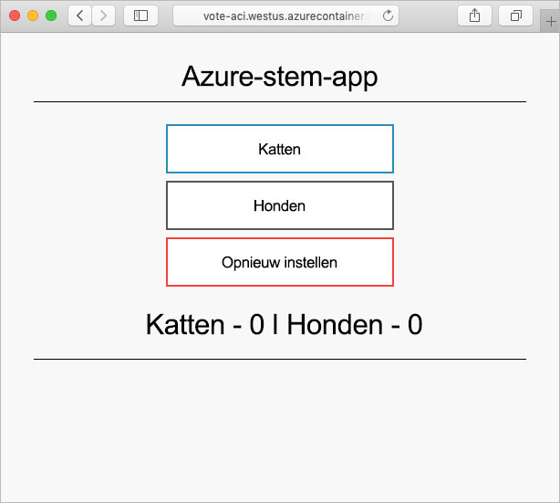

# <a name="create-a-terraform-configuration-for-azure"></a>Een Terraform-configuratie maken voor Azure

In dit voorbeeld gaat u een Terraform-configuratie maken en deze vervolgens implementeren in Azure. Als het voorbeeld is voltooid, hebt u een exemplaar van Azure Cosmos DB geïmplementeerd, een Azure Container-instantie en een toepassing die met deze twee resources werkt. In dit document wordt ervan uitgegaan dat alle werkzaamheden worden uitgevoerd in Azure Cloud Shell, waarin standaard tools van Terraform zijn geïnstalleerd. Als u het voorbeeld op uw eigen systeem wilt doornemen, kunt u Terraform installeren door [deze instructies](../virtual-machines/linux/terraform-install-configure.md) te volgen.

## <a name="create-first-configuration"></a>Eerste configuratie maken

In dit gedeelte maakt u de configuratie voor een Azure Cosmos DB-exemplaar.

Selecteer **Nu uitproberen** om Azure Cloud Shell te openen. Voer vervolgens `code .` uit om de code-editor van Cloud Shell te openen.

```azurecli-interactive
code .
```

Kopieer en plak de volgende Terraform-configuratie.

Deze configuratie modelleert een Azure-resourcegroep, een willekeurig geheel getal en een Azure Cosmos DB-exemplaar. Het willekeurige gehele getal wordt gebruikt in de naam van het Cosmos DB-exemplaar. Er worden ook verschillende Cosmos DB-instellingen geconfigureerd. Raadpleeg De [naslaginformatie over Cosmos DB en Terraform](https://www.terraform.io/docs/providers/azurerm/r/cosmosdb_account.html) voor een volledige lijst met Cosmos DB Terraform-configuraties.

Sla het bestand op als `main.tf` wanneer u klaar bent. Dit kunt u doen met behulp van het beletselteken in de rechterbovenhoek van de code-editor.

```azurecli-interactive
resource "azurerm_resource_group" "vote-resource-group" {
  name     = "vote-resource-group"
  location = "westus"
}

resource "random_integer" "ri" {
  min = 10000
  max = 99999
}

resource "azurerm_cosmosdb_account" "vote-cosmos-db" {
  name                = "tfex-cosmos-db-${random_integer.ri.result}"
  location            = "${azurerm_resource_group.vote-resource-group.location}"
  resource_group_name = "${azurerm_resource_group.vote-resource-group.name}"
  offer_type          = "Standard"
  kind                = "GlobalDocumentDB"

  consistency_policy {
    consistency_level       = "BoundedStaleness"
    max_interval_in_seconds = 10
    max_staleness_prefix    = 200
  }

  geo_location {
    location          = "westus"
    failover_priority = 0
  }
}
```

Met de opdracht [terraform init](https://www.terraform.io/docs/commands/init.html) wordt de werkmap geïnitialiseerd. Voer `terraform init` uit in de terminal van Cloud Shell om voorbereidingen te treffen voor de implementatie van de nieuwe configuratie.

```azurecli-interactive
terraform init
```

De opdracht [terraform plan](https://www.terraform.io/docs/commands/plan.html) kan worden gebruikt om te controleren of de configuratie de juiste indeling heeft en om te visualiseren welke resources er zullen worden gemaakt, bijgewerkt of vernietigd. De resultaten kunnen worden opgeslagen in een bestand en op een later tijdstip worden gebruikt voor het toepassen van de configuratie.

Voer `terraform plan` uit om de nieuwe Terraform-configuratie te testen.

```azurecli-interactive
terraform plan --out plan.out
```

Pas de configuratie toe met behulp van [terraform apply](https://www.terraform.io/docs/commands/apply.html) en geef hierbij de naam van het plan-bestand op. Met deze opdracht worden de resources geïmplementeerd in uw Azure-abonnement.

```azurecli-interactive
terraform apply plan.out
```

Als dat is gebeurd, kunt u zien dat de resourcegroep is gemaakt en dat er een Azure Cosmos DB-exemplaar in de resourcegroep is geplaatst.

## <a name="update-configuration"></a>Configuratie bijwerken

Werk de configuratie bij door een Azure Container Instance toe te voegen. In de container wordt een toepassing uitgevoerd die gegevens leest en schrijft naar de Cosmos DB.

Kopieer de volgende configuratie naar het einde van het bestand `main.tf`. Sla het bestand op wanneer u klaar bent.

Er worden twee omgevingsvariabelen ingesteld: `COSMOS_DB_ENDPOINT` en `COSMOS_DB_MASTERKEY`. Deze variabelen bevatten de locatie en de sleutel voor toegang tot de database. De waarden voor deze variabelen zijn afkomstig uit het database-exemplaar dat in de laatste stap is gemaakt. Dit proces wordt interpolatie genoemd. Meer informatie over Terraform-interpolatie vindt u in [Interpolation Syntax](https://www.terraform.io/docs/configuration/interpolation.html) (Interpolatiesyntaxis).


De configuratie omvat ook een uitvoerblok, dat de volledig gekwalificeerde domeinnaam (FQDN) van het containerexemplaar retourneert.

```azurecli-interactive
resource "azurerm_container_group" "vote-aci" {
  name                = "vote-aci"
  location            = "${azurerm_resource_group.vote-resource-group.location}"
  resource_group_name = "${azurerm_resource_group.vote-resource-group.name}"
  ip_address_type     = "public"
  dns_name_label      = "vote-aci"
  os_type             = "linux"

  container {
    name   = "vote-aci"
    image  = "microsoft/azure-vote-front:cosmosdb"
    cpu    = "0.5"
    memory = "1.5"
    ports  = {
      port     = 80
      protocol = "TCP"
    }

    secure_environment_variables {
      "COSMOS_DB_ENDPOINT"  = "${azurerm_cosmosdb_account.vote-cosmos-db.endpoint}"
      "COSMOS_DB_MASTERKEY" = "${azurerm_cosmosdb_account.vote-cosmos-db.primary_master_key}"
      "TITLE"               = "Azure Voting App"
      "VOTE1VALUE"          = "Cats"
      "VOTE2VALUE"          = "Dogs"
    }
  }
}

output "dns" {
  value = "${azurerm_container_group.vote-aci.fqdn}"
}
```

Voer `terraform plan` uit om het bijgewerkte plan te maken en de benodigde wijzigingen te visualiseren. Als het goed is, ziet u dat er een resource voor een Azure Container Instance is toegevoegd aan de configuratie.

```azurecli-interactive
terraform plan --out plan.out
```

Voer ten slotte `terraform apply` uit om de configuratie toe te passen.

```azurecli-interactive
terraform apply plan.out
```

Als die opdracht is voltooid, noteert u de FQDN van het containerexemplaar.

## <a name="test-application"></a>Toepassing testen

Navigeer naar de FQDN van het containerexemplaar. Als alles goed is geconfigureerd, ziet u de volgende toepassing.



## <a name="clean-up-resources"></a>Resources opschonen

Wanneer u klaar bent, kunt u de Azure-resources en de resourcegroep verwijderen met behulp van de opdracht [terraform destroy](https://www.terraform.io/docs/commands/destroy.html).

```azurecli-interactive
terraform destroy -auto-approve
```

## <a name="next-steps"></a>Volgende stappen

In dit voorbeeld hebt u een Terraform-configuratie gemaakt, geïmplementeerd en vernietigd. Zie de documentatie van Terraform over Azure Provider voor meer informatie over het gebruik van Terraform in Azure.

> [!div class="nextstepaction"]
> [Azure Provider in Terraform](https://www.terraform.io/docs/providers/azurerm/)
