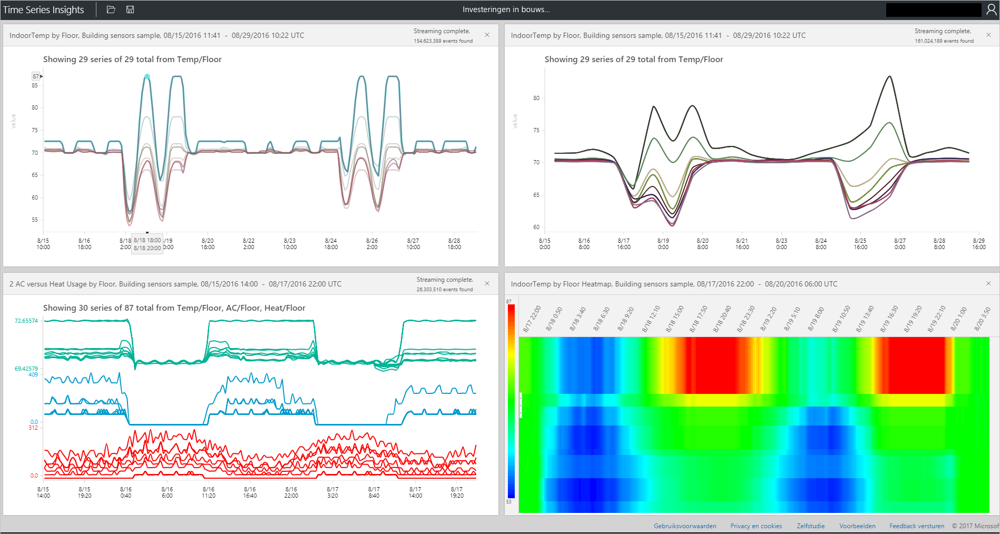

# Azure Time Series Insights explorer
Dit artikel bevat informatie over de verschillende functies en opties die beschikbaar zijn binnen de Time Series Insights explorer web-app. U kunt explorer Time Series inzicht in uw webbrowser maken visualisaties van uw gegevens.
 
Azure Time Series Insights is een volledig beheerde service voor analyse, opslag en visualisatie die het eenvoudig maakt om miljarden IoT-gebeurtenissen tegelijkertijd te verkennen en te analyseren. Dit biedt u een globale weergave van uw gegevens, waarmee u snel uw IoT-oplossing te valideren en dure uitvaltijd voor essentiële apparaten voorkomen. U kunt verborgen samenvat ter plaatse afwijkingen en analyses van de hoofdoorzaak in bijna realtime uitvoeren. De Time Series Insights explorer is momenteel in de openbare preview.

## Vereisten

Voordat u tijd reeks Insights explorer gebruiken kunt, moet u het volgende doen:
- Maakt een tijd reeks Insights-omgeving
- Toegang tot uw account in de omgeving
- Toevoegen van een gebeurtenisbron voor het opnemen van gegevens en op te slaan

## Verken en opvragen van gegevens
U kunt binnen enkele minuten verbinding te maken met uw gebeurtenisbron op uw omgeving Time Series Insights verkennen en uw tijd reeksgegevens opvragen.

1. Als u wilt starten, opent u de [Time Series Insights explorer](https://insights.timeseries.azure.com/) in uw webbrowser en selecteer een omgeving aan de linkerkant van het venster. Alle omgevingen die u toegang tot hebt worden vermeld in alfabetische volgorde.

2. Wanneer u een omgeving selecteert, gebruiken de **FROM** en **aan** configuraties aan de bovenkant of klik en sleep over de gewenste tijd in beslag neemt.  Klik op het Vergrootglas in de rechterbovenhoek of met de rechtermuisknop op via de geselecteerde timespan en selecteer **Search**.  

3. U kunt ook beschikbaarheid automatisch vernieuwen elke minuut door de **automatisch op** knop.

4. Let op het pictogram van de Azure-cloud, gaat u naar uw omgeving in de Azure-portal.

   

5. Vervolgens ziet u een grafiek weergegeven waarin wordt een telling van alle gebeurtenissen tijdens de geselecteerde timespan weergegeven.  U hebt hier een aantal besturingselementen:

    **Deelvenster Editor termen**: de ruimte term is waar u uw omgeving een query.  Aan de linkerkant van het scherm wordt gevonden 
      - **Meting**: dit alle numerieke kolommen (verdubbeld) vervolgkeuzelijst wordt weergegeven
      - **Gesplitste door**: deze vervolgkeuzelijst bevat categorische kolommen (tekenreeksen)
      - U kunt stap interpolatie inschakelen, minimale en maximale weergeven en aanpassen van de y-as van het Configuratiescherm volgende om door te meten.  Bovendien kunt u aanpassen of de weergegeven gegevens is een aantal, de gemiddelde of de som van de gegevens.
      - U kunt maximaal vijf voorwaarden om weer te geven op de dezelfde x-as toevoegen.  Gebruik de **up-down** knop toevoegen aan een extra term of klik op de **toevoegen** knop een nieuwe term toevoegen.
     
        

      - **Predikaat**: het predicaat kunt u snel uw om gebeurtenissen te filteren met behulp van de reeks operanden hieronder vermeld. Als u een zoekopdracht door selecteren/te klikken uitvoeren, het predikaat wordt automatisch bijwerken op basis van die zoekopdracht.      Ondersteunde operand-typen zijn onder andere:

         |Bewerking  |Ondersteunde typen  |Opmerkingen  |
         |---------|---------|---------|
         |<, >, <=, >=     |  Double, DateTime, TimeSpan       |         |
         |=, !=, <>     | String, Bool, Double, DateTime, TimeSpan, is NULL        |         |
         |IN     | String, Bool, Double, DateTime, TimeSpan, is NULL        |  Alle operanden moeten van hetzelfde type zijn of NULL-constante.        |
         |HEEFT     | Reeks        |  Alleen constante letterlijke tekenreeksen zijn toegestaan op de rechterkant. Lege tekenreeks en NULL zijn niet toegestaan.       |

      - **Voorbeelden van query 's**
      
         

6. De **intervalgrootte** schuifregelaar hulpprogramma waarmee u kunt inzoomen in en uit intervallen via de dezelfde timespan.  Dit biedt nauwkeuriger beheer van verkeer tussen grote stukken tijd die smooth trends naar beneden segmenten zo klein is als de milliseconde, zodat u kunt gedetailleerde, met een hoge resolutie delen van uw gegevens zien weergeven. De schuifregelaar standaard beginpunt is ingesteld als de optimale weergave van de gegevens van uw selectie. Netwerktaakverdeling resolutie, de snelheid van de query en granulatie.

7. De **tijd kwast** hulpprogramma kunt u gemakkelijk om te navigeren vanuit een tijdsspanne naar de andere intuïtieve UX vooraan en center voor naadloze verplaatsing tussen tijdsbereik in te stellen.

8. De **opslaan** opdracht kunt u uw huidige query opslaan en deze voor het delen met andere gebruikers van de omgeving inschakelen. Met behulp van **Open**, ziet u alle opgeslagen zoekopdrachten en eventuele gedeelde query's van andere gebruikers in een omgeving die u toegang tot hebt. 

   

9. De **perspectiefweergave** hulpprogramma biedt een gelijktijdige weergave van maximaal vier unieke query's. U vindt de knop perspectief weergave in de rechterbovenhoek van de grafiek.  

   

10. De **grafiek** kunt u uw gegevens visueel te verkennen. De volgende grafiek hulpprogramma:

   - Selecteer/Klik, waardoor een selectie van een specifieke TimeSpan-waarde of één gegevensreeks.  
   - Span selectie binnen een periode, kunt u inzoomen of gebeurtenissen verkennen.  
   - Binnen een gegevensreeks kunt u de reeks splitsing door een andere kolom, de reeks toevoegen als een nieuwe term, alleen de geselecteerde reeks weergeven, uitsluiten van de geselecteerde reeks, ping die reeks of verkennen van gebeurtenissen uit de geselecteerde reeks.
   - In het gebied van het filter aan de linkerkant van de grafiek, kunt u alle weergegeven gegevensreeksen Zie en de volgorde wijzigen door de naam of waarde, alle gegevensreeksen of specifiek vastgemaakt of vastgezette reeksen.  U kunt ook één gegevensreeks selecteren en splitsing van de reeks door een andere kolom, de reeks toevoegen als een nieuwe term, alleen de geselecteerde reeks weergeven, uitsluiten van de geselecteerde reeks, die reeks vastmaken of gebeurtenissen van de geselecteerde reeks verkennen.
   - Wanneer u meerdere voorwaarden tegelijkertijd bekijkt, kunt u stapelen, niet stapelen, aanvullende gegevens over een reeks zien en gebruiken de dezelfde y-as voor alle voorwaarden van de knoppen in de rechterbovenhoek van de grafiek.
 
    

11. De **heatmap** kan worden gebruikt om snel unieke of afwijkende gegevensreeks in een bepaalde query te herkennen. Als een heatmap kan slechts één zoekterm worden weergegeven.    

   

12. **Gebeurtenissen**: wanneer u kiest voor gebeurtenissen bij het selecteren van verkennen of rechtermuisknop boven het paneel gebeurtenissen beschikbaar wordt gesteld.  Hier ziet u alle van de onbewerkte gebeurtenissen en de gebeurtenissen exporteren als JSON- of CSV-bestanden. Houd er rekening mee dat de Time Series Insights alle onbewerkte gegevens opslaat.

   

13. Klik op de **statistieken** tabblad nadat u gebeurtenissen om patronen en statistieken van de kolom weer te geven.  

   - **Patronen**: deze functie geeft proactief weer voor de meest statistisch aanzienlijke patronen in een regio voor de geselecteerde gegevens. Dit u de hoge kosten van hebben om te kijken naar duizenden gebeurtenissen om te begrijpen welke patronen garandeert meest tijd en energie. Verder kan kunt tijd reeks Insights u rechtstreeks in deze statistisch aanzienlijke patronen om door te gaan met het uitvoeren van een analyse gaan. Deze functie is ook nuttig voor post-keuring onderzoeken historische gegevens. 

   - **Kolom statistieken**: kolom statistieken voor grafieken en tabellen die gegevens van elke kolom van de reeks geselecteerde gegevens via de geselecteerde tijdsspanne uitgesplitst bieden.  
 
       

U hebt nu gezien de verschillende functies en opties die beschikbaar zijn binnen de Time Series Insights explorer web-app. 

## Volgende stappen
> [!div class="nextstepaction"]
>[Diagnosticeren en oplossen van problemen in uw omgeving Time Series Insights](time-series-insights-diagnose-and-solve-problems.md)
