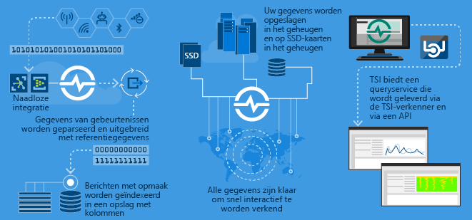

# Wat is Azure Time Series Insights?

Time Series Insights is gebouwd voor het opslaan, visualiseren en opvragen van grote hoeveelheden tijdreeksgegevens, zoals die bijvoorbeeld worden gegenereerd door IoT-apparaten.  Als u tijdreeksgegevens wilt opslaan, beheren, opvragen of visualiseren in de cloud, is Time Series Insights waarschijnlijk de juiste keuze voor u.  

Time Series Insights heeft vier belangrijke taken:

- Ten eerste is de service volledig geïntegreerd met cloudgateways zoals Azure IoT Hub en Azure Event Hubs. Hierdoor kan er eenvoudig verbinding worden maakt met deze gebeurtenisbronnen en kan er JSON worden geparseerd uit berichten en structuren met gegevens in overzichtelijke rijen en kolommen. Metagegevens worden samengevoegd met telemetriegegevens en de gegevens worden geïndexeerd in een columnar store.
- Op de tweede plaats beheert Time Series Insights de opslag van uw gegevens. Om ervoor te zorgen dat gegevens altijd eenvoudig toegankelijk zijn, worden uw gegevens gedurende maximaal 400 dagen opgeslagen in het geheugen en op SSD's. U kunt binnen enkele seconden interactief miljarden gebeurtenissen opvragen.
- Ten derde biedt Time Series Insights out-of-the-box-visualisatie via de TSI-verkenner.  
- Op de vierde en laatste plaats biedt Time Series Insights een queryservice, zowel in de verkenner van TSI als met behulp van API's die eenvoudig kunnen worden geïntegreerd voor het insluiten van tijdreeksgegevens in aangepaste toepassingen.  

Als u een toepassing bouwt, hetzij voor intern gebruik of voor gebruik door externe klanten, kan Time Series Insights worden gebruikt als een back-end voor het indexeren, opslaan en samenvoegen van tijdreeksgegevens. U kunt daarnaast een aangepaste visualisatie en gebruikerservaring samenstellen.  Time Series Insights stelt query-API's beschikbaar om dit scenario mogelijk te maken.  

Als u niet zeker weet of uw gegevens een tijdreeks vormen, kunt u aan de hand van de volgende beschrijving vaststellen of het wel of geen tijdreeksgegevens betreft.  Tijdreeksgegevens tonen aan hoe een asset of proces verandert in de loop der tijd.  De gegevens zijn uniek doordat ze een tijdstempel hebben en tijd wordt het meest zinvol uitgedrukt als een as.  Tijdreeksgegevens komen meestal binnen in volgorde van tijd en worden doorgaans behandeld als een invoeging in plaats van een update van de database.  Omdat Time Series Insights elke nieuwe gebeurtenis vastlegt en opslaat als een rij, worden wijzigingen gemeten in de loop van de tijd, zodat u terug kunt kijken en toekomstige wijzigingen kunt voorspellen.  In grote volumes kan het opslaan, indexeren, uitvoeren van query's, analyseren en visualiseren van tijdreeksgegevens lastig zijn.  

## Video

In deze video krijgt u een overzicht van Time Series Insights, een cloud-gebaseerd IoT analytics-platform.

> [!VIDEO https://www.youtube.com/embed/qNc9gQTLROs]

## Primaire scenario's

- Tijdreeksgegevens opslaan op een schaalbare manier.  
  - De basis van Time Series Insights is een database die speciaal is ontworpen voor het werken met tijdreeksgegevens.  Omdat de database schaalbaar en volledig beheerd is, verzorgt Time Series Insights het opslaan en beheren van gebeurtenissen.

- Gegevens kunnen bijna in realtime worden verkend.  
  - Time Series Insights biedt een verkenner die alle gegevens visualiseert die in een omgeving binnenkomen.  Kort nadat u verbinding hebt gemaakt met een gebeurtenisbron, kunt u gebeurtenisgegevens bekijken, verkennen en opvragen binnen Time Series Insights.  De gegevens zijn handig om te valideren of een apparaat op de verwachte manier gegevens uitzendt en om een IoT-asset te controleren op status, productiviteit en algehele effectiviteit.  

- Hoofdoorzaakanalyse en anomaliedetectie.
  - Time Series Insights bevat hulpprogramma's zoals patronen en perspectiefweergaven voor het uitvoeren en opslaan van een hoofdoorzaakanalyse (root-cause analysis) die uit meerdere stappen bestaat.  Bovendien werkt Time Series Insights samen met waarschuwingsservices zoals Azure Stream Analytics, zodat waarschuwingen en gedetecteerde afwijkingen in bijna realtime kunnen worden weergegeven in de verkenner van Time Series Insights.  

- Een globale weergave van tijdreeksgegevens die vanaf verschillende locaties binnenkomen voor vergelijking van meerdere assets/sites.
  - U kunt meerdere bronnen van gebeurtenissen verbinden met een Time Series Insights-omgeving.  Dit betekent dat gegevens die binnenkomen vanaf verschillende locaties in bijna realtime samen kunnen worden bekeken.  Gebruikers kunnen hun voordeel doen met deze zichtbaarheid door gegevens te delen met leidinggevenden en door beter samen te werken met domeinexperts die hun expertise kunnen toepassen om te helpen bij het oplossen van problemen, het inzetten van best practices en het delen van kennis.

- Klanttoepassing bouwen op basis van Time Series Insights. 
  - Time Series Insights beschikt over REST-query-API's, zodat u toepassingen kunt ontwikkelen die gebruikmaken van tijdreeksgegevens.

## Functionaliteit

- **Snel aan de slag:** Voor Azure Time Series Insights is geen gegevensvoorbereiding vooraf vereist. U maakt in slechts enkele minuten verbinding met miljarden gebeurtenissen in Azure IoT Hub of Event Hub. Na het tot stand brengen van de verbinding kunt u sensorgegevens visualiseren en bewerken om uw IoT-oplossingen snel te valideren. U kunt werken met uw gegevens zonder dat u code hoeft te schrijven.
Bovendien hoeft u geen nieuwe taal te leren, omdat Time Series een gedetailleerde queryruimte voor vrije tekst biedt voor ervaren gebruikers, evenals een wijs-en-klik-mogelijkheid.
- **Inzichten in bijna realtime:** Time Series Insights kan miljoenen sensorgebeurtenissen per dag opnemen, met slechts één minuut latentie. Time Series Insights biedt u meer inzicht in uw sensorgegevens, zodat u trends en afwijkingen kunt herkennen en efficiënt hoofdoorzaakanalyses kunt uitvoeren om zo dure uitvaltijd te voorkomen. Door kruiscorrelatie mogelijk te maken tussen realtime en historische gegevens, stelt Time Series Insights u in staat om verborgen trends in uw gegevens bloot te leggen.
- **Aangepaste oplossingen ontwikkelen:** Integreer Azure Time Series Insights-gegevens in uw bestaande toepassingen of maak nieuwe aangepaste oplossingen met de REST-API's van Time Series Insights. U kunt bovendien persoonlijke weergaven maken die u kunt delen met anderen om zo uw inzichten breder beschikbaar te maken.
- **Schaalbaarheid:** Time Series Insights kan zeer grote hoeveelheden IoT-gegevens opnemen. De service kan 1 miljoen tot 100 miljoen gebeurtenissen per dag worden opnemen, met een standaardbewaarperiode van 31 dagen. U hebt de mogelijkheid om live gegevensstromen bijna in realtime te visualiseren en te analyseren, naast historische gegevens. Op termijn zullen de opnamehoeveelheden en bewaarperioden toenemen om te voldoen aan de groeiende behoeften van grote bedrijven.

## Aan de slag
U kunt in minder dan vijf minuten aan de slag. 

1.  Maak een Time Series Insights-omgeving in Azure Portal. 
2.  Maak verbinding met een gebeurtenisbron zoals Azure-IoT Hub of Event Hub.  
3.  Upload referentiegegevens (dit is geen aanvullende service).
4.  Bekijk de gegevens na enkele minuten met de verkenner van Time Series Insights.

## Verkenner van Time Series Insights
Dit diagram toont een voorbeeld van gegevens van Time Series Insights die worden weergegeven via de verkenner: 

## Volgende stappen
 - [Verkenner van Time Series Insights nader bekeken in een demo-omgeving](./time-series-quickstart.md)
 - [Uw eigen Time Series Insights-omgeving plannen](time-series-insights-environment-planning.md)

