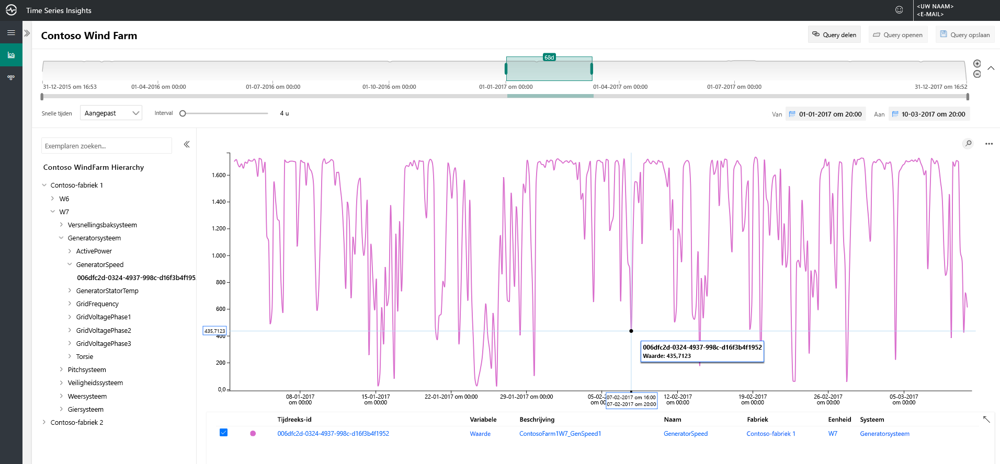
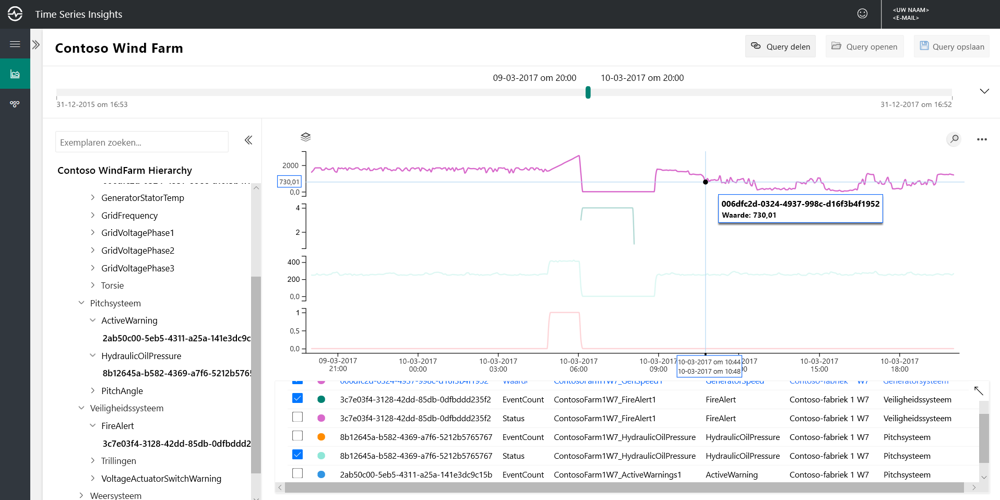
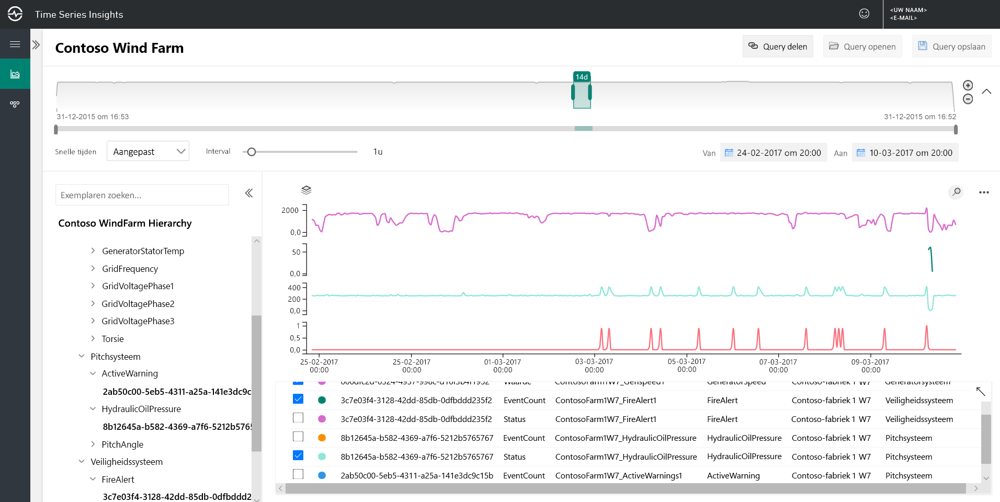
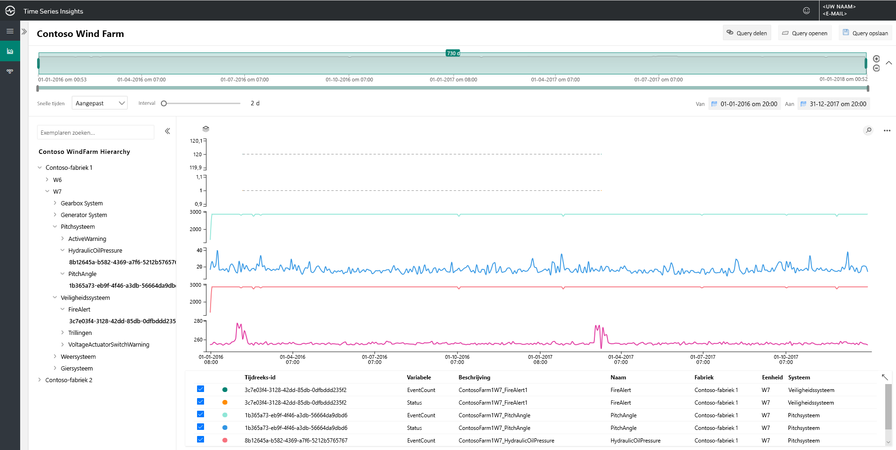
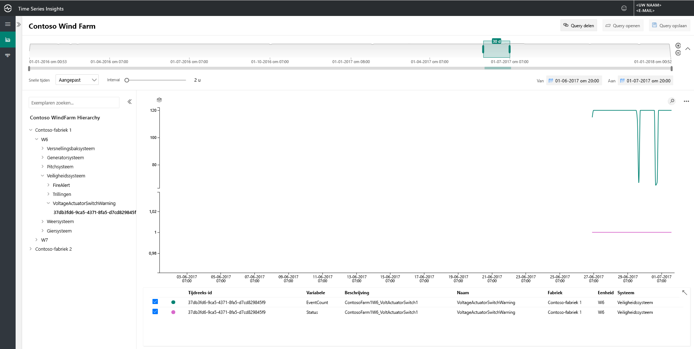
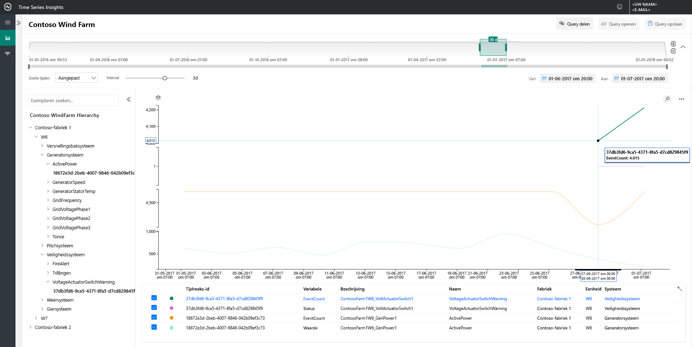
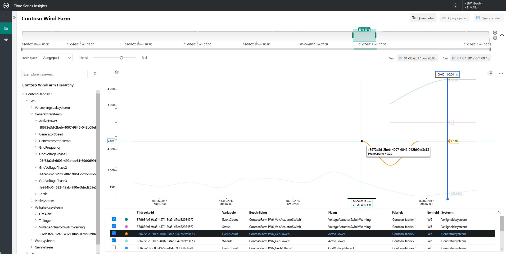

# Snelstart: De demo-omgeving van Azure Time Series Insights (preview) verkennen

In deze snelstartgids helpt u op weg met de Azure Time Series Insights Preview-omgeving. De gratis demo, maakt u een rondleiding door voor belangrijke functies die zijn toegevoegd aan de Time Series Insights Preview.

De Time Series Insights Preview demo-omgeving bevat een scenario-bedrijf, Contoso, die twee wind turbine farms werkt. Elke farm heeft 10 maar. Elke turbine beschikt over 20 sensoren die elke minuut gegevens rapporteren aan Azure IoT Hub. De sensoren informatie verzamelen over de weersomstandigheden, blade verkopen, en yaw positie. Informatie over de generator voor prestaties, uitgaande gedrag en de veiligheid monitors wordt ook opgenomen.

In deze snelstartgids leert u hoe u met Time Series Insights vind praktische inzichten in gegevens van Contoso. U ook voeren een korte hoofdoorzaakanalyses beter voorspellen kritieke fouten en onderhoud uit te.

## Verkenner van Time Series Insights nader bekeken in een demo-omgeving

De Verkenner van Time Series Insights Preview ziet u historische gegevens en analyse van hoofdoorzaken. Aan de slag gaan:

1. Maak een [gratis Azure-account](https://azure.microsoft.com/free/?ref=microsoft.com&utm_source=microsoft.com&utm_medium=docs&utm_campaign=visualstudio) als u dit niet hebt.

1. Ga naar de [Contoso Wind Farm demo](https://insights.timeseries.azure.com/preview/samples) omgeving.  

1. Als u wordt gevraagd, aanmelden bij de Verkenner van Time Series Insights met behulp van de referenties van uw Azure-account.

## Werken met historische gegevens

1. In **Contoso-fabriek 1**, kijken windturbine **W7**.  

   1. Het weergavebereik te wijzigen **1/1/17 20:00 tot en met 3/10/17 20:00 uur (UTC)** .
   1. Om te selecteren van een sensor **Contoso-fabriek 1** > **W7** > **Generator System** > **GeneratorSpeed** . Bekijk vervolgens de waarden die worden weergegeven.

      

1. Onlangs heeft Contoso brand geconstateerd in windturbine **W7**. Adviezen variëren over wat de brand heeft veroorzaakt. In Time Series Insights zien we dat de waarschuwing fire-sensor tijdens de brand is geactiveerd.

   1. Het weergavebereik te wijzigen **3/9/17 20:00 tot en met 3/10/17 20:00 uur (UTC)** .
   1. Selecteer **veiligheid System** > **FireAlert**.

      

1. Bekijk andere gebeurtenissen die rond dezelfde tijd van de brand om te begrijpen wat er is gebeurd. Olie druk te verlichten en actieve waarschuwingen verrijkt net vóór de brand.

   1. Selecteer **komen System** > **HydraulicOilPressure**.
   1. Selecteer **komen System** > **ActiveWarning**.

      

1. De olie druk te verlichten en actieve waarschuwing sensoren verrijkt precies vóór de brand. Vouw de weergegeven tijd serie als u wilt zien van andere tekens die duidelijk aanloop naar de brand zijn. Beide sensoren schommelde consistent na verloop van tijd. De fluctuaties duiden op een permanente en eng patroon.

    * Het weergavebereik te wijzigen **2/24/17 20:00 tot en met 3/10/17 20:00 uur (UTC)** .

      

1. Onderzoek van twee jaar van historische gegevens blijkt dat een andere fire-gebeurtenis die de dezelfde sensor fluctuaties had.

    * Het weergavebereik te wijzigen **1/1/16 tot en met 31-12/17** (alle gegevens).

      

Met behulp van Time Series Insights en onze telemetrie sensor, hebben we een problematische en lange termijn trend verborgen in de historische gegevens gedetecteerd. Met deze nieuwe inzichten kunt we het volgende doen:

> [!div class="checklist"]
> * Leg uit wat er in feite is opgetreden.
> * Los het probleem.
> * Superieure waarschuwingsmeldingen systemen in locatie plaatsen.

## Hoofdoorzaakanalyse

1. Sommige scenario's voor geavanceerde analyse om subtiele of er aanwijzingen in de gegevens bloot te nodig hebben. Selecteer de Zwart gat **W6** op datum **6/25**.

    1. Het weergavebereik te wijzigen **6/1/17 20:00 tot en met 7/1/17 20:00 uur (UTC)** .
    1. Selecteer **Contoso-fabriek 1** > **W6** > **veiligheid System** > **VoltageActuatorSwitchWarning**.

       

1. De waarschuwing geeft aan dat er een probleem is met de spanning die wordt geleverd door de generator. De algemene power-uitvoer van de generator wordt uitgevoerd binnen normale parameters in de huidig interval. Door onze interval, ontstaat een ander patroon. Er is een goede inleverbibliotheek duidelijk.

    1. Verwijder de **VoltageActuatorSwitchWarning** sensor.
    1. Selecteer **Generator System** > **ActivePower**.
    1. Het interval om te wijzigen **3d**.

       

1. Door het tijdsbereik vergroot, kunnen we bepalen of het probleem is gestopt of of blijft.

    * Breid de tijdsspanne tot 60 dagen.

      

1. Andere gegevenspunten sensor kunnen worden toegevoegd aan het leveren van meer context. Meer sensoren die we weergeven, de uitgebreidere ons een beeld vormen van het probleem is. We verwijderen een markering om de werkelijke waarden te bekijken. 

    1. Selecteer **Generator System**, en selecteer vervolgens drie sensoren: **GridVoltagePhase1**, **GridVoltagePhase2**, en **GridVoltagePhase3**.
    1. Verwijder een markering van het laatste gegevenspunt in het zichtbare gedeelte.

       

    Twee van de spanningssensors werkt neemt en binnen het normale parameters. Het ziet eruit als de **GridVoltagePhase3** sensor is het overmatig.

1. Met maximaal contextuele gegevens toegevoegd, verschijnt de fase 3-inleverbibliotheek nog meer te worden van het probleem. Nu hebben we een goede lead op de oorzaak van de waarschuwing. Kunt u het probleem raadpleegt u ons onderhoudsteam van.  

    * Wijzigen van de weergave voor alle overlay **Generator System** sensoren op dezelfde grafiek schaal.

      

## Volgende stappen

U bent klaar om uw eigen Time Series Insights Preview-omgeving te maken. Om te starten:

> [!div class="nextstepaction"]
> [Een Time Series Insights-omgeving (preview) plannen](time-series-insights-update-plan.md)

Meer informatie over de demo en de bijbehorende functies gaan:

> [!div class="nextstepaction"]
> [De Verkenner van Time Series Insights Preview](time-series-insights-update-explorer.md)
