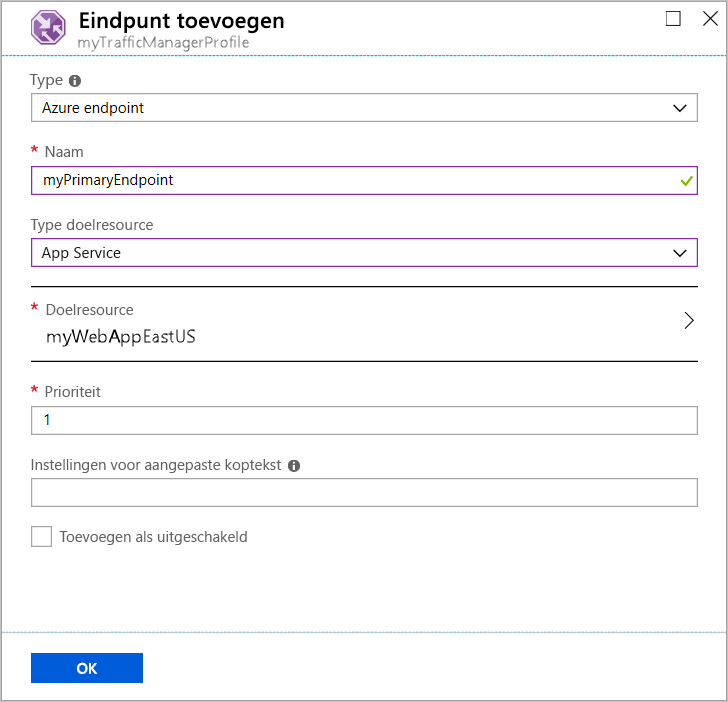

# Quickstart: Een Traffic Manager-profiel maken met de Azure-portal

In deze quickstart wordt beschreven hoe u een Traffic Manager-profiel maakt die hoge beschikbaarheid van uw webtoepassing biedt.

In deze quickstart leest u meer over twee exemplaren van een webtoepassing. Ze worden elk in een andere Azure-regio uitgevoerd. U maakt een Traffic Manager-profiel op basis van [eindpuntprioriteit](traffic-manager-routing-methods.md#priority). het profiel stuurt gebruikersverkeer door naar de primaire site waar de webtoepassing wordt uitgevoerd. Traffic Manager bewaakt de webtoepassing continu. Als de primaire site niet beschikbaar is, biedt Traffic Manager automatische failover voor de back-upsite.

Als u nog geen abonnement op Azure hebt, maak dan nu een [gratis account](https://azure.microsoft.com/free/?WT.mc_id=A261C142F).

## Aanmelden bij Azure

Meld u aan bij [Azure Portal](https://portal.azure.com).

## Vereisten

Voor deze quickstart moeten twee exemplaren van een webtoepassing worden geïmplementeerd in twee verschillende Azure-regio's (*US - oost* en *Europa - west*). Elk exemplaar dient als primair en failover-eindpunt voor Traffic Manager.

1. Selecteer **Een resource maken** > **Web** > **Web-app** linksboven in het scherm.
2. Voer de volgende instellingen in **Web-app** in (of selecteer ze):

    | Instelling | Value |
    | ------- | ----- |
    | Naam van app | Voer een unieke naam voor de web-app in.  |
    | Abonnement | Selecteer het abonnement waarop de web-app moet worden toegepast. |
    | Resourcegroep | Selecteer **Nieuwe maken** en voer *myResourceGroupTM1* in. |
    | OS | Selecteer **Windows** als uw besturingssysteem. |
    | Publiceren | Selecteer **Code** als de indeling waarnaar u wilt publiceren. |

3. Selecteer **App Service-plan/-locatie**.
4. Selecteer in **App Service-plan** de optie **Nieuwe maken**.
5. Voer in **Nieuw App Service-plan** de volgende instellingen in (of selecteer ze):

    | Instelling | Value |
    | ------- | ----- |
    | App Service-plan | Voer *myAppServicePlanEastUS* in. |
    | Locatie | US - oost |
    | Prijscategorie | S1 Standard |

6. Selecteer **OK**.

7. Selecteer in **Web-app** de optie **Maken**. Als de web-app wordt geïmplementeerd, wordt er een standaardwebsite gemaakt.

8. Herhaal stap 1 tot en met 7 met de volgende instellingen als u een tweede website wilt maken in een andere Azure-regio:

    | Instelling | Waarde |
    | --------| ----- |
    | Name | Voer een unieke naam voor de web-app in. |
    | Abonnement | Selecteer het abonnement waarop de web-app moet worden toegepast. |
    | Resourcegroep | Selecteer **Nieuwe maken** en voer *myResourceGroupTM2* in. |
    | OS | Selecteer **Windows** als uw besturingssysteem. |
    | Publiceren | Selecteer **Code** als de indeling waarnaar u wilt publiceren. |
    | App Service-plan/-locatie | Voer *myAppServicePlanWestEurope* in. |
    | Locatie | Europa -west |
    | Prijscategorie | S1 Standard |

## Een Traffic Manager-profiel maken

Maak een Traffic Manager-profiel waarmee gebruikersverkeer wordt doorgestuurd op basis van eindpuntprioriteit.

1. Selecteer links boven in het scherm de optie **Een resource maken** > **Netwerken** > **Traffic Manager-profiel**.
2. Voer in **Traffic Manager-profiel maken** de volgende instellingen in (of selecteer ze):

    | Instelling | Waarde |
    | --------| ----- |
    | Name | Voer een unieke naam in voor uw Traffic Manager-profiel.|
    | Routeringsmethode | Selecteer **Prioriteit**.|
    | Abonnement | Selecteer het abonnement waarop u het Traffic Manager-profiel wilt toepassen. |
    | Resourcegroep | Selecteer *myResourceGroupTM1*.|
    | Locatie |Deze instelling verwijst naar de locatie van de resourcegroep. De instelling heeft geen gevolgen voor het Traffic Manager-profiel dat globaal wordt geïmplementeerd.|

3. Selecteer **Maken**.

## Traffic Manager-eindpunten toevoegen

Voeg de website in *US - oost* toe als primair eindpunt om alle gebruikersverkeer te routeren. Voeg de website in *Europa - west* toe als failover-eindpunt. Als het primaire eindpunt niet beschikbaar is, wordt het verkeer automatisch naar het failover-eindpunt gerouteerd.

1. Voer in de zoekbalk van de portal de naam van het Traffic Manager-profiel in dat u in de vorige sectie hebt gemaakt.
2. Selecteer het profiel in de lijst met zoekresultaten.
3. Selecteer in **Traffic Manager-profiel**, in de sectie **Instellingen**, de optie **Eindpunten** en selecteer **Toevoegen**.
4. Voer de volgende instellingen in (of selecteer ze):

    | Instelling | Waarde |
    | ------- | ------|
    | Type | Selecteer **Azure-eindpunt**. |
    | Name | Voer *myPrimaryEndpoint* in. |
    | Doelbrontype | Selecteer **App Service**. |
    | Doelbron | Selecteer **Choose an app service** > **US - oost**. |
    | Prioriteit | Selecteer **1**. Alle verkeer gaat naar dit eindpunt indien het in orde is. |

    

5. Selecteer **OK**.
6. Herhaal stap 3 en 4 met de volgende instellingen als u een failover-eindpunt voor uw tweede Azure-regio wilt maken:

    | Instelling | Waarde |
    | ------- | ------|
    | Type | Selecteer **Azure-eindpunt**. |
    | Name | Voer*myFailoverEndpoint* in. |
    | Doelbrontype | Selecteer **App Service**. |
    | Doelbron | Selecteer **Choose an app service** > **Europa - west**. |
    | Prioriteit | Selecteer **2**. Alle verkeer gaat naar dit failover-eindpunt als het primaire eindpunt niet in orde is. |

7. Selecteer **OK**.

Als u de twee eindpunten hebt toegevoegd, worden ze weergegeven in **Traffic Manager-profiel**. De bewakingsstatus is nu **Online**.

## Traffic Manager-profiel testen

In deze sectie controleert u de domeinnaam van uw Traffic Manager-profiel. Tevens configureert u het primaire eindpunt zodanig dat het niet beschikbaar is. Ten slotte kunt u zien dat de web-app nog steeds beschikbaar is. Dat komt omdat Traffic Manager het verkeer naar het failover-eindpunt stuurt.

### DNS-naam controleren

1. Zoek in de zoekbalk van de portal de naam van het **Traffic Manager-profiel** dat u in de vorige sectie hebt gemaakt.
2. Selecteer het Traffic Manager-profiel. **Overzicht** wordt weergegeven.
3. Het **Traffic Manager-profiel** geeft de DNS-naam weer van het Traffic Manager-profiel dat u zojuist hebt gemaakt.
  
   

### Traffic Manager in werking zien

1. Voer in een webbrowser de DNS-naam van het Traffic Manager-profiel in om de standaardwebsite van uw web-app te bekijken.

    > [!NOTE]
    > In dit quickstartscenario worden alle aanvragen gerouteerd naar het primaire eindpunt. Het is ingesteld op **Priority 1**.

    

2. Als u de failover van Traffic Manager in werking wilt zien, schakelt u de primaire site uit:
    1. Selecteer op de pagina met het Traffic Manager-profiel, in de sectie **Overzicht**, **myPrimaryEndpoint**.
    2. Selecteer in *myPrimaryEndpoint* de optie **Uitgeschakeld** > **Opslaan**.
    3. Sluit **myPrimaryEndpoint**. Merk op dat de status nu **Uitgeschakeld** is.
3. Kopieer de DNS-naam van het Traffic Manager-profiel uit de vorige stap om de website in een nieuwe sessie van de webbrowser te kunnen bekijken.
4. Controleer of de web-app nog beschikbaar is.

Het primaire eindpunt is niet beschikbaar, dus bent u naar het failover-eindpunt doorgestuurd.

## Resources opschonen

Verwijder de resourcegroepen, de webtoepassingen en alle gerelateerde resources als u klaar bent. Selecteer hiertoe elk afzonderlijk item op uw dashboard en selecteer boven aan de pagina de optie **Verwijderen**.

## Volgende stappen

In deze quickstart hebt u een Traffic Manager-profiel gemaakt. Hiermee kunt u gebruikersverkeer doorsturen voor webtoepassingen van hoge beschikbaarheid. Voor meer informatie over het routeren van verkeer gaat u door naar de zelfstudies voor Traffic Manager.

> [!div class="nextstepaction"]
> [Traffic Manager tutorials](tutorial-traffic-manager-improve-website-response.md) (Traffic Manager-zelfstudies)
