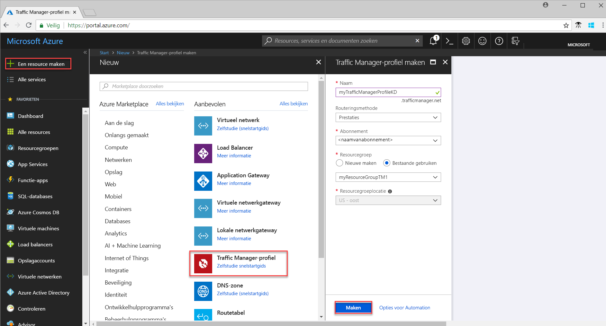
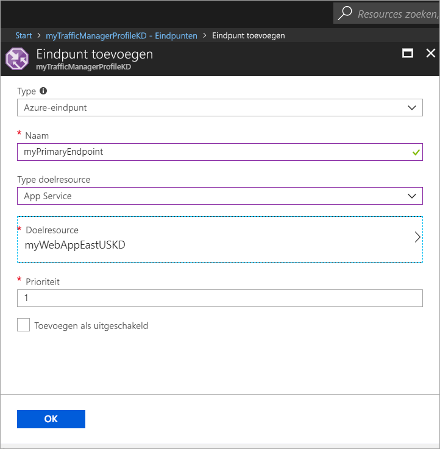
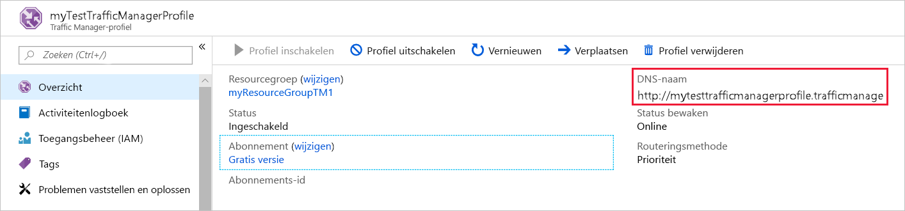
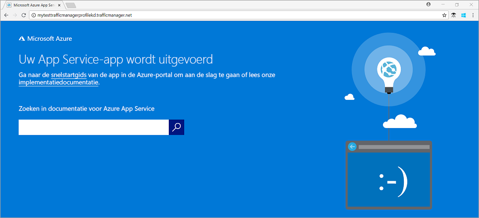

# Snelstart: een Traffic Manager-profiel maken voor webtoepassingen met hoge beschikbaarheid

In deze snelstart wordt beschreven hoe u een Traffic Manager-profiel maakt die hoge beschikbaarheid van uw webtoepassing biedt. 

Het scenario dat in deze snelstart wordt beschreven, beschrijft twee exemplaren van een webtoepassing die in verschillende Azure-regio's wordt uitgevoerd. Er wordt een Traffic Manager-profiel gemaakt op basis van [eindpuntprioriteit](traffic-manager-routing-methods.md#priority) waarmee gebruikersverkeer naar de primaire site wordt gestuurd waar de toepassing wordt uitgevoerd. Traffic Manager bewaakt continu de webtoepassing en biedt automatische failover naar de back-upsite als de primaire site niet beschikbaar is.

Als u nog geen abonnement op Azure hebt, maak dan een [gratis account](https://azure.microsoft.com/free/?WT.mc_id=A261C142F) aan voordat u begint.

## Aanmelden bij Azure 
Meld u aan bij Azure Portal op https://portal.azure.com.

## Vereisten
Voor deze snelstart dient u twee exemplaren van een webtoepassing te implementeren die in verschillende Azure-regio's wordt uitgevoerd, namelijk *US - oost* en *Europa - west*. De twee webtoepassingen dienen als primair en back-upeindpunt voor Traffic Manager.

1. Selecteer linksboven in het scherm de optie **Een resource maken** > **Web** > **Web-app** > **Maken**.
2. Voer in **Web-app** de volgende gegevens in (of selecteer ze) en voer standaardinstellingen in waar ze niet zijn opgegeven:

     | Instelling         | Waarde     |
     | ---              | ---  |
     | Naam           | Voer een unieke naam voor de web-app in  |
     | Resourcegroep          | Selecteer **Nieuw** en typ *myResourceGroupTM1* |
     | App Service-plan/-locatie         | Selecteer **Nieuw**.  Voer in het App Service-plan *myAppServicePlanEastUS* in en selecteer **OK**. 
     |      Locatie  |   US - oost        |
    |||

3. Selecteer **Maken**.
4. Er wordt een standaardwebsite gemaakt als de web-app is geïmplementeerd.
5. Herhaal stap 1 tot en met 3 om een tweede website te maken in een andere Azure-regio met de volgende instellingen:

     | Instelling         | Waarde     |
     | ---              | ---  |
     | Naam           | Voer een unieke naam voor de web-app in  |
     | Resourcegroep          | Selecteer **Nieuw** en typ *myResourceGroupTM2* |
     | App Service-plan/-locatie         | Selecteer **Nieuw**.  Voer in het App Service-plan *myAppServicePlanWestEurope* in en selecteer **OK**. 
     |      Locatie  |   Europa -west      |
    |||

## Een Traffic Manager-profiel maken
Maak een Traffic Manager-profiel waarmee gebruikersverkeer wordt doorgestuurd op basis van eindpuntprioriteit.

1. Selecteer linksboven in het scherm de optie **Een resource maken** > **Netwerken** > **Traffic Manager-profiel** > **Maken**.
2. Voer in  **Traffic Manager-profiel maken** de volgende gegevens in of selecteer deze, accepteer de standaardwaarden voor de overige instellingen en selecteer **Maken**:
    
    | Instelling                 | Waarde                                              |
    | ---                     | ---                                                |
    | Naam                   | Deze naam moet uniek zijn binnen de zone trafficmanager.net. De naam wordt gebruikt voor de DNS-naam **trafficmanager.net**, die wordt gebruikt voor het openen van uw Traffic Manager-profiel.|
    | Routeringsmethode          | Selecteer de routeringsmethode **Prioriteit**.|
    | Abonnement            | Selecteer uw abonnement.|
    | Resourcegroep          | Selecteer **Bestaande** en selecteer vervolgens *myResourceGroupTM1*.|
    |Locatie |Deze instelling verwijst naar de locatie van de resourcegroep en heeft geen invloed op het Traffic Manager-profiel dat wereldwijd wordt geïmplementeerd.|
    |||
    
    
   

## Traffic Manager-eindpunten toevoegen

Voeg de website in *US - oost* toe als primair eindpunt om alle gebruikersverkeer te routeren. Voeg de website in *Europa - west* toe als back-upeindpunt. Als het primaire eindpunt niet beschikbaar is, wordt het verkeer automatisch naar het secundaire eindpunt gerouteerd.

1. Zoek in de zoekbalk van de portal de naam van het Traffic Manager-profiel dat u in de vorige sectie hebt gemaakt en selecteer het profiel in de weergegeven resultaten.
2. Klik in **Traffic Manager-profiel**, in de sectie **Instellingen**, op **Eindpunten** en vervolgens op **Toevoegen**.
3. Voer de volgende informatie in of selecteer deze, accepteer de standaardwaarden voor de overige instellingen en selecteer **OK**:

    | Instelling                 | Waarde                                              |
    | ---                     | ---                                                |
    | Type                    | Azure-eindpunt                                   |
    | Naam           | myPrimaryEndpoint                                        |
    | Doelbrontype           | App Service                          |
    | Doelbron          | **Kies een app-service** om de lijst met web-apps onder hetzelfde abonnement weer te geven. Kies in **Resource** de app-service die u als eerste eindpunt wilt toevoegen. |
    | Prioriteit               | Selecteer **1**. Dit zorgt ervoor dat alle verkeer naar dit eindpunt wordt geleid, indien het eindpunt in orde is.    |
    
4. Herhaal stap 2 en 3 voor het volgende Web Apps-eindpunt. Zorg ervoor dat dit eindpunt wordt toegevoegd met de waarde **2** als bijbehorende **Prioriteit**.
5.  Als beide eindpunten zijn toegevoegd, worden ze weergegeven in **Traffic Manager-profiel**, samen met de controlestatus **Online**.

    

## Traffic Manager-profiel testen
In deze sectie bepaalt u eerst de domeinnaam van het Traffic Manager-profiel en bekijkt u vervolgens hoe Traffic Manager een failover uitvoert naar het secundaire eindpunt als het primaire eindpunt niet beschikbaar is.
### DNS-naam bepalen
1.  Zoek in de zoekbalk van de portal de naam van het **Traffic Manager-profiel** dat u in de vorige sectie hebt gemaakt. Klik op het Traffic Manager-profiel in de resultaten die worden weergegeven.
2. Klik op **Overzicht**.
3. Het **Traffic Manager-profiel** geeft de DNS-naam weer van het Traffic Manager-profiel dat u zojuist hebt gemaakt.
  
   

### Traffic Manager in werking zien

1. Typ in een webbrowser de DNS-naam van het Traffic Manager-profiel om de standaardwebsite van uw web-app te bekijken. In dit snelstartscenario worden alle aanvragen gerouteerd naar het primaire eindpunt dat is ingesteld op **Priority 1**.

2. Als u de failover van Traffic Manager in werking wilt zien, schakelt u de primaire site als volgt uit:
    1. Selecteer op de profielpagina van Traffic Manager **Instellingen**>**Eindpunten**>*MyPrimaryEndpoint*.
    2. Selecteer in *MyPrimaryEndpoint* de optie **Uitgeschakeld**. 
    3. De status van het primaire eindpunt *MyPrimaryEndpoint* wordt nu weergegeven als **Uitgeschakeld**.
3. Kopieer de DNS-naam van het Traffic Manager-profiel uit de vorige stap om de website in een webbrowser te kunnen bekijken. Als het primaire eindpunt is uitgeschakeld, wordt het gebruikersverkeer naar het secundaire eindpunt gerouteerd.

## Resources opschonen
Verwijder de resourcegroepen, de webtoepassingen en alle gerelateerde resources als u ze niet meer nodig hebt. Selecteer hiertoe de resourcegroepen (*myResourceGroupTM1* en *myResourceGroupTM2*) en klik op **Verwijderen**.

## Volgende stappen
In deze snelstart maakt u een Traffic Manager-profiel waarmee u gebruikersverkeer voor webtoepassingen van hoge beschikbaarheid kunt doorsturen. Voor meer informatie over het routeren van verkeer gaat u door naar de zelfstudies voor Traffic Manager.

> [!div class="nextstepaction"]
> [Traffic Manager tutorials](tutorial-traffic-manager-improve-website-response.md) (Traffic Manager-zelfstudies)

