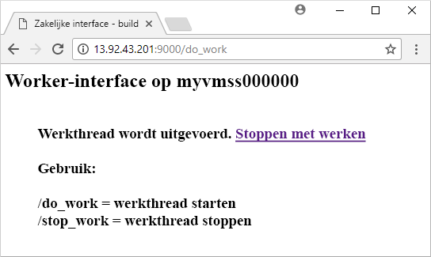
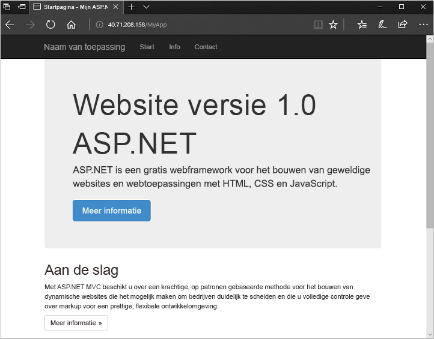

# <a name="create-a-virtual-machine-scale-set-with-the-azure-cli-20"></a>Een virtuele-machineschaalset maken met de Azure CLI 2.0
Met een virtuele-machineschaalsets kunt u een reeks identieke virtuele machines met automatisch schalen implementeren en beheren. U kunt het aantal VM’s in de schaalset handmatig schalen of regels voor automatisch schalen definiëren op basis van resourcegebruik zoals CPU, vraag naar geheugen, of netwerkverkeer. In dit Aan de slag-artikel maakt u een virtuele-machineschaalset in Windows met behulp van een Azure Resource Manager-sjabloon. U kunt ook een schaalset maken met [Azure CLI 2.0](virtual-machine-scale-sets-create-cli.md), [Azure PowerShell](virtual-machine-scale-sets-create-powershell.md) of [Azure Portal](virtual-machine-scale-sets-create-portal.md).


## <a name="overview-of-templates"></a>Overzicht van sjablonen
Met Azure Resource Manager-sjablonen kunt u groepen gerelateerde resources implementeren. Sjablonen zijn geschreven in JSON (JavaScript Object Notation). Deze definiëren de hele omgeving van de Azure-infrastructuur voor uw toepassing. In één sjabloon kunt u de virtuele-machineschaalset maken, toepassingen installeren en regels voor automatisch schalen configureren. Met behulp van variabelen en parameters kan deze sjabloon opnieuw worden gebruikt voor het bijwerken van bestaande schaalsets, of om extra schaalsets te maken. U kunt sjablonen implementeren via Azure Portal, Azure CLI 2.0 of Azure PowerShell, maar u kunt ze ook aanroepen via CI/CD-pipelines (Continuous Integration / Continuous Delivery).

Zie [Azure Resource Manager overview](https://docs.microsoft.com/azure/azure-resource-manager/resource-group-overview#template-deployment) (Overzicht van Azure Resource Manager) voor meer informatie over sjablonen.


## <a name="define-a-scale-set"></a>Een schaalset definiëren
Een sjabloon definieert de configuratie voor elk resourcetype. Een resourcetype voor een virtuele-machineschaalset is vergelijkbaar met een afzonderlijke VM. De basisonderdelen van het resourcetype voor de virtuele-machineschaalset zijn:

| Eigenschap                     | Beschrijving van eigenschap                                  | Voorbeeldwaarde van sjabloon                    |
|------------------------------|----------------------------------------------------------|-------------------------------------------|
| type                         | Azure-resourcetype dat moet worden gemaakt                            | Microsoft.Compute/virtualMachineScaleSets |
| naam                         | De naam van de schaalset                                       | myScaleSet                                |
| location                     | De locatie voor het maken van de schaalset                     | VS - oost                                   |
| sku.name                     | De VM-grootte voor elke instantie van de schaalset                  | Standard_A1                               |
| sku.capacity                 | Het aantal VM-instanties dat in het begin moet worden gemaakt           | 2                                         |
| upgradePolicy.mode           | Upgrademodus voor VM-instantie wanneer er wijzigingen optreden              | Automatisch                                 |
| imageReference               | Het platform of de aangepaste afbeelding die moet worden gebruikt voor de VM-instanties | Canonical Ubuntu-server 16.04-LTS         |
| osProfile.computerNamePrefix | Het naamvoorvoegsel voor elke VM-instantie                     | myvmss                                    |
| osProfile.adminUsername      | De gebruikersnaam voor elke VM-instantie                        | azureuser                                 |
| osProfile.adminPassword      | Het wachtwoord voor elke VM-instantie                        | P@ssw0rd!                                 |

 In het volgende codefragment ziet u de basisresourcedefinitie voor een schaalset in een sjabloon. De virtuele NIC-configuratie (Network Interface Card) wordt niet weergegeven om het voorbeeld kort te houden. Als u een schaalsetsjabloon wilt aanpassen, kunt u de VM-grootte of initiële capaciteit wijzigen, of een ander platform of aangepaste afbeelding gebruiken.

```json
{
  "type": "Microsoft.Compute/virtualMachineScaleSets",
  "name": "myScaleSet",
  "location": "East US",
  "apiVersion": "2016-04-30-preview",
  "sku": {
    "name": "Standard_A1",
    "capacity": "2"
  },
  "properties": {
    "upgradePolicy": {
      "mode": "Automatic"
    },
    "virtualMachineProfile": {
      "storageProfile": {
        "osDisk": {
          "caching": "ReadWrite",
          "createOption": "FromImage"
        },
        "imageReference":  {
          "publisher": "Canonical",
          "offer": "UbuntuServer",
          "sku": "16.04-LTS",
          "version": "latest"
        }
      },
      "osProfile": {
        "computerNamePrefix": "myvmss",
        "adminUsername": "azureuser",
        "adminPassword": "P@ssw0rd!"
      }
    }
  }
}
```


## <a name="install-an-application"></a>Een toepassing installeren
Wanneer u een schaalset implementeert, kunnen VM-extensies worden gebruikt voor configuratie na implementatie en voor automatiseringstaken, zoals het installeren van een app. Scripts kunnen worden gedownload van Azure Storage of GitHub, of worden geleverd in Azure Portal tijdens de uitvoering van extensies. Als u een extensie toepast op uw schaalset, voegt u de sectie *extensionProfile* toe aan het voorgaande resourcevoorbeeld. Het extensieprofiel definieert doorgaans de volgende eigenschappen:

- Type extensie
- Uitgever van de extensie
- Versie van de extensie
- Locatie van de configuratie of installatiescripts
- Opdrachten om uit te voeren op de VM-instanties

We gaan twee manieren bekijken om een toepassing met extensies te installeren: met de aangepaste scriptextensie om een Python-app in Linux te installeren of met de PowerShell DSC-extensie om een ASP.NET-app in Windows te installeren.

### <a name="python-http-server-on-linux"></a>Python HTTP-server op Linux
De sjabloon [Python HTTP-server op Linux](https://github.com/Azure/azure-quickstart-templates/tree/master/201-vmss-bottle-autoscale) maakt gebruik van de aangepaste scriptextensie om [Bottle](http://bottlepy.org/docs/dev/), een Python-webframework, en een eenvoudige HTTP-server te installeren. 

Er zijn twee scripts gedefinieerd in *fileUris* - *installserver.sh* en *workserver.py*. Deze bestanden worden gedownload van GitHub. Vervolgens definieert *commandToExecute* `bash installserver.sh` om de app te installeren en configureren:

```json
"extensionProfile": {
  "extensions": [
    {
      "name": "AppInstall",
      "properties": {
        "publisher": "Microsoft.Azure.Extensions",
        "type": "CustomScript",
        "typeHandlerVersion": "2.0",
        "autoUpgradeMinorVersion": true,
        "settings": {
          "fileUris": [
            "https://raw.githubusercontent.com/Azure/azure-quickstart-templates/master/201-vmss-bottle-autoscale/installserver.sh",
            "https://raw.githubusercontent.com/Azure/azure-quickstart-templates/master/201-vmss-bottle-autoscale/workserver.py"
          ],
          "commandToExecute": "bash installserver.sh"
        }
      }
    }
  ]
}
```

### <a name="aspnet-application-on-windows"></a>ASP.NET-toepassing in Windows
Het voorbeeldsjabloon [ASP.NET-toepassing in Windows](https://github.com/Azure/azure-quickstart-templates/tree/master/201-vmss-windows-webapp-dsc-autoscale) maakt gebruik van de PowerShell DSC-extensie om een ASP.NET MVC-app te installeren die wordt uitgevoerd in IIS. 

Er wordt een installatiescript gedownload van GitHub, zoals gedefinieerd in *URL*. Met de extensie wordt vervolgens *InstallIIS* uitgevoerd vanuit het script *IISInstall.ps1*, zoals gedefinieerd in *Functie* en *Script*. De ASP.NET-app zelf wordt geleverd als een Web Deploy-pakket, dat ook kan worden gedownload vanuit GitHub, zoals gedefinieerd in *WebDeployPackagePath*:

```json
"extensionProfile": {
  "extensions": [
    {
      "name": "Microsoft.Powershell.DSC",
      "properties": {
        "publisher": "Microsoft.Powershell",
        "type": "DSC",
        "typeHandlerVersion": "2.9",
        "autoUpgradeMinorVersion": true,
        "forceUpdateTag": "1.0",
        "settings": {
          "configuration": {
            "url": "https://raw.githubusercontent.com/Azure/azure-quickstart-templates/master/201-vmss-windows-webapp-dsc-autoscale/DSC/IISInstall.ps1.zip",
            "script": "IISInstall.ps1",
            "function": "InstallIIS"
          },
          "configurationArguments": {
            "nodeName": "localhost",
            "WebDeployPackagePath": "https://raw.githubusercontent.com/Azure/azure-quickstart-templates/master/201-vmss-windows-webapp-dsc-autoscale/WebDeploy/DefaultASPWebApp.v1.0.zip"
          }
        }
      }
    }
  ]
}
```

## <a name="deploy-the-template"></a>De sjabloon implementeren
U kunt de sjabloon [Python HTTP-server op Linux](https://github.com/Azure/azure-quickstart-templates/tree/master/201-vmss-bottle-autoscale) of [ASP.NET MVC-toepassing in Windows](https://github.com/Azure/azure-quickstart-templates/tree/master/201-vmss-windows-webapp-dsc-autoscale) het eenvoudigst implementeren met de knop **Implementeren in Azure** in de Leesmij-bestanden in GitHub.  U kunt ook PowerShell of Azure CLI gebruiken om de voorbeeldsjablonen te implementeren.

### <a name="azure-cli-20"></a>Azure CLI 2.0
Met Azure CLI 2.0 kunt u de Python-HTTP-server als volgt installeren in Linux:

```azurecli-interactive
# Create a resource group
az group create --name myResourceGroup --location EastUS

# Deploy template into resource group
az group deployment create \
    --resource-group myResourceGroup \
    --template-uri https://raw.githubusercontent.com/Azure/azure-quickstart-templates/master/201-vmss-bottle-autoscale/azuredeploy.json
```

Als u de app in actie wilt zien, achterhaalt u het openbare IP-adres van de load balancer met [az network public-ip list](/cli/azure/network/public-ip#show). Dit doet u als volgt:

```azurecli-interactive
az network public-ip list \
    --resource-group myResourceGroup \
    --query [*].ipAddress -o tsv
```

Voer het openbare IP-adres van de load balancer in een webbrowser in. Gebruik hiervoor de notatie *http://<publicIpAddress>:9000/do_work*. Via de load balancer wordt verkeer naar een van uw VM-instanties gedistribueerd, zoals wordt weergegeven in het volgende voorbeeld:




### <a name="azure-powershell"></a>Azure PowerShell
U kunt Azure PowerShell gebruiken om de ASP.NET-toepassing als volgt in Windows te installeren:

```azurepowershell-interactive
# Create a resource group
New-AzureRmResourceGroup -Name myResourceGroup -Location EastUS

# Deploy template into resource group
New-AzureRmResourceGroupDeployment `
    -ResourceGroupName myResourceGroup `
    -TemplateFile https://raw.githubusercontent.com/Azure/azure-quickstart-templates/master/201-vmss-windows-webapp-dsc-autoscale/azuredeploy.json
```

Als u de app in actie wilt zien, achterhaalt u het openbare IP-adres van de load balancer met [Get-AzureRmPublicIpAddress](/powershell/module/azurerm.network/get-azurermpublicipaddress). Dit doet u als volgt:

```azurepowershell-interactive
Get-AzureRmPublicIpAddress -ResourceGroupName myResourceGroup | Select IpAddress
```

Voer het openbare IP-adres van de load balancer in een webbrowser in. Gebruik hiervoor de notatie *http://<publicIpAddress>/MyApp*. Via de load balancer wordt verkeer naar een van uw VM-instanties gedistribueerd, zoals wordt weergegeven in het volgende voorbeeld:




## <a name="clean-up-resources"></a>Resources opschonen
U kunt [az group delete](/cli/azure/group#delete) gebruiken om de resourcegroep, schaalset en alle gerelateerde resources te verwijderen als u deze niet meer nodig hebt. Dit doet u als volgt:

```azurecli-interactive 
az group delete --name myResourceGroup
```


## <a name="next-steps"></a>Volgende stappen
