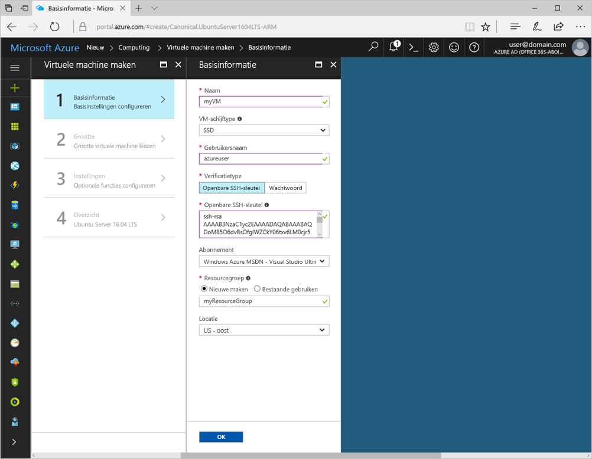
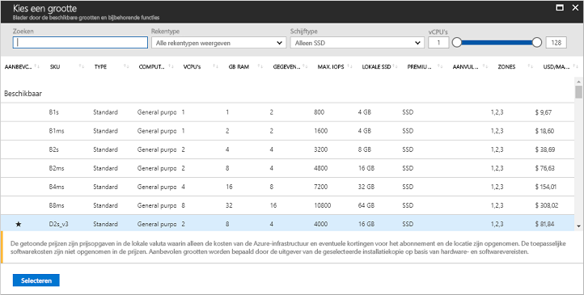

# <a name="create-a-linux-virtual-machine-with-the-azure-portal"></a>Een virtuele Linux-machine maken met Azure Portal

Virtuele Azure-machines kunnen worden gemaakt via Azure Portal. Deze methode biedt een gebruikersinterface op basis van een browser voor het maken en configureren van virtuele machines en alle verwante resources. In deze snelstartgids gaat u een virtuele machine maken en een webserver installeren op de VM.

Als u nog geen abonnement op Azure hebt, maak dan een [gratis account](https://azure.microsoft.com/free/?WT.mc_id=A261C142F) aan voordat u begint.

## <a name="create-ssh-key-pair"></a>Een SSH-sleutelpaar maken

U hebt een SSH-sleutelpaar nodig om deze Quick Start te volgen. Als u een bestaand SSH-sleutelpaar hebt, kunt u deze stap overslaan.

In een Bash-shell voert u deze opdracht uit en volgt u de aanwijzingen op het scherm. De uitvoer van de opdracht bevat de bestandsnaam van het bestand met de openbare sleutel. Kopieer de inhoud van het bestand met de openbare sleutel (`cat ~/.ssh/id_rsa.pub`) naar het klembord. Als u Windows-subsysteem voor Linux gebruikt, zorg er dan voor dat u geen regeleindetekens kopieert uit de uitvoer. Noteer de bestandsnaam van het bestand met de persoonlijke sleutel voor later gebruik.

```bash
ssh-keygen -t rsa -b 2048
```

[Hier](https://docs.microsoft.com/azure/virtual-machines/linux/mac-create-ssh-keys) vindt u meer gedetailleerde informatie over dit proces

## <a name="log-in-to-azure"></a>Meld u aan bij Azure. 

Meld u via http://portal.azure.com aan bij Azure Portal.

## <a name="create-virtual-machine"></a>Virtuele machine maken

1. Klik in de linkerbovenhoek van Azure Portal op **Een resource maken**.

2. Selecteer **Compute** en selecteer vervolgens **Ubuntu Server 16.04 LTS**. 

3. Geef de informatie van de virtuele machine op. Bij **Verificatietype** selecteert u **Openbare SSH-sleutel**. Wanneer u uw openbare SSH-sleutel plakt, verwijdert u alle voorloop- en volgspaties. Na het voltooien klikt u op **OK**.

    

4. Selecteer een grootte voor de VM. Kies om meer groottes weer te geven de optie **Alle weergeven** of wijzig het filter **Ondersteund schijftype**. 

      

5. Handhaaf de standaardwaarden in **Instellingen** en klik op **OK**.

6. Klik op de pagina Overzicht op **OK** om de implementatie van de virtuele machine te starten.

7. De VM wordt aan het dashboard van de Azure Portal vastgemaakt. Zodra de implementatie is voltooid, wordt de samenvatting van de VM automatisch geopend.


## <a name="connect-to-virtual-machine"></a>Verbinding maken met de virtuele machine

Maak een SSH-verbinding met de virtuele machine.

1. Klik op de knop **Verbinden** in de eigenschappen van de virtuele machine. Op de knop Verbinden wordt een SSH-verbindingsreeks weergegeven die u kunt gebruiken om verbinding te maken met de virtuele machine.

     

2. Voer de volgende opdracht uit om een SSH-sessie te starten. Vervang de verbindingsreeks door de reeks die u uit Azure Portal hebt gekopieerd.

```bash 
ssh azureuser@40.112.21.50
```

## <a name="install-nginx"></a>NGINX installeren

Gebruik het volgende bash-script om pakketbronnen bij te werken en het meest recente NGINX-pakket te installeren. 

```bash 
#!/bin/bash

# update package source
sudo apt-get -y update

# install NGINX
sudo apt-get -y install nginx
```

Wanneer u klaar bent, sluit u de SSH-sessie af en geeft u de VM-eigenschappen op in de Azure Portal.


## <a name="open-port-80-for-web-traffic"></a>Poort 80 openen voor webverkeer 

Een netwerkbeveiligingsgroep (NSG) beveiligt binnenkomend en uitgaand verkeer. Wanneer een VM wordt gemaakt in de Azure Portal, wordt een inkomende regel gemaakt op poort 22 voor SSH-verbindingen. Omdat deze VM fungeert als host voor een webserver, moet een NSG-regel worden gemaakt voor poort 80.

1. Klik op de virtuele machine op de naam van de **Resourcegroep**.
2. Selecteer de **netwerkbeveiligingsgroep**. De NSG kan worden geïdentificeerd met behulp van de kolom **Type**. 
3. Klik op het menu links bij instellingen op **Beveiligingsregels voor binnenkomend verkeer**.
4. Klik op **Toevoegen**.
5. Typ bij **Naam** **http**. Zorg ervoor dat **Bronpoortbereik** is ingesteld op `*`, **Doelpoortbereik** is ingesteld op *80* en **Actie** is ingesteld op *Toestaan*. 
6. Klik op **OK**.


## <a name="view-the-nginx-welcome-page"></a>De welkomstpagina van NGINX weergeven

Als NGINX is geïnstalleerd en poort 80 is geopend voor de VM, is de webserver nu toegankelijk vanaf het internet. Open een webbrowser en voer het openbare IP-adres van de VM in. U vindt het openbare IP-adres bij de VM-eigenschappen in Azure Portal.

 

## <a name="clean-up-resources"></a>Resources opschonen

Wanneer u de virtuele machine niet meer nodig hebt, verwijdert u de resourcegroep, de machine zelf én alle gerelateerde resources. Hiervoor selecteert u de resourcegroep voor de virtuele machine en klikt u op **Verwijderen**.

## <a name="next-steps"></a>Volgende stappen

In deze Snel starten hebt u een eenvoudige virtuele machine geïmplementeerd, een netwerkbeveiligingsgroepregel gemaakt en een webserver geïnstalleerd. Voor meer informatie over virtuele machines in Azure, gaat u verder met de zelfstudie voor virtuele Linux-machines.

> [!div class="nextstepaction"]
> [Zelfstudies over virtuele Linux-machines](./tutorial-manage-vm.md)
