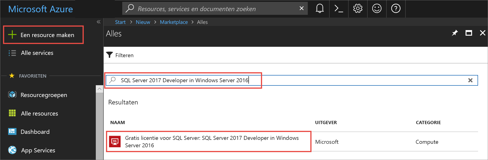
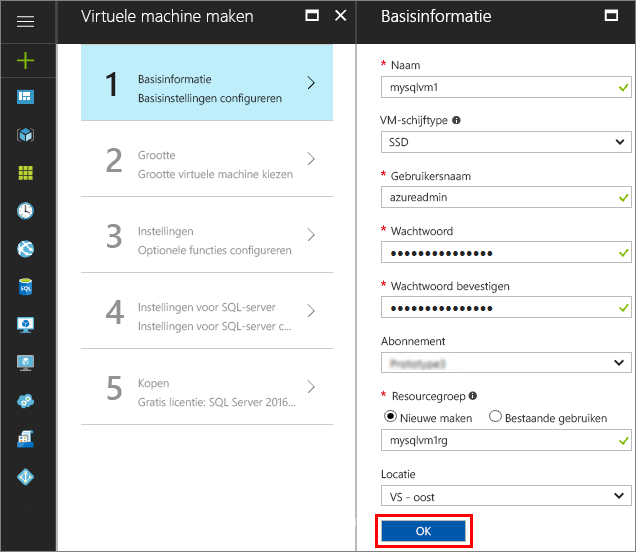
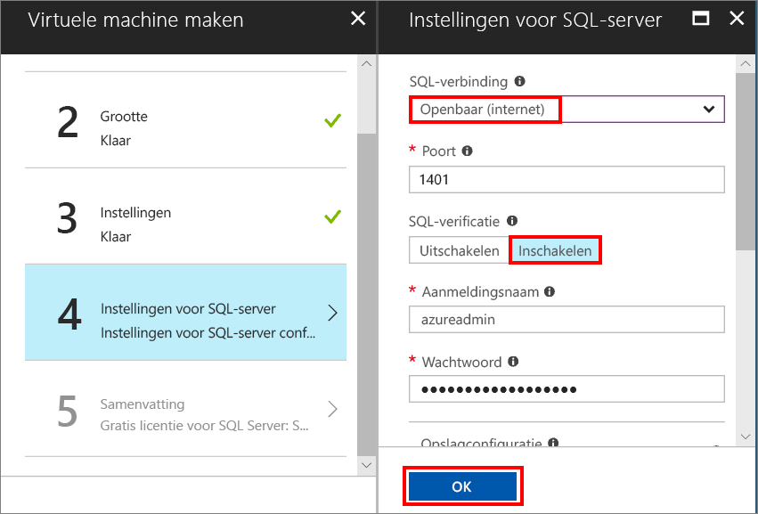
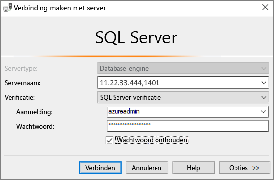

# Een virtuele SQL Server 2017-machine voor Windows maken in Azure Portal

> [!div class="op_single_selector"]
> * [Windows](quickstart-sql-vm-create-portal.md)
> * [Linux](../../linux/sql/provision-sql-server-linux-virtual-machine.md)

In deze quickstart gaat u een virtuele SQL Server-machine maken in Azure Portal.

Als u nog geen abonnement op Azure hebt, maakt u een [gratis account](https://azure.microsoft.com/free/?WT.mc_id=A261C142F) aan voordat u begint.

##  Een installatiekopie selecteren voor uw virtuele SQL Server-machine

1. Meld u met uw account aan bij [Azure Portal](https://portal.azure.com).

1. Klik in Azure Portal op **Nieuw**. In de portal wordt het venster **Nieuw** geopend.

1. Typ in het zoekveld **SQL Server 2017 Developer on Windows Server 2016** en druk op ENTER.

1. Selecteer de installatiekopie **Free SQL Server License: SQL Server 2017 Developer on Windows Server 2016**.

   

   > [!TIP]
   > In deze zelfstudie maken we gebruik van de Developer Edition omdat deze een complete versie van de SQL Server is die gratis kan worden gebruikt voor ontwikkelings-/testdoeleinden. U betaalt alleen voor de kosten van het uitvoeren van de virtuele machine. Raadpleeg [Pricing guidance for SQL Server Azure VMs](virtual-machines-windows-sql-server-pricing-guidance.md) (Prijsrichtlijnen voor virtuele SQL Server-machines in Azure) voor uitgebreide prijsinformatie.

1. Klik op **Maken**.

##  Algemene gegevens opgeven

Geef op de pagina **Basisbeginselen** de volgende gegevens op:

1. Geef in het veld **Naam** een unieke naam op voor de virtuele machine. 

1. Geef in het veld **Gebruikersnaam** een naam op voor het lokale beheerdersaccount op de virtuele machine.

1. Geef een sterk **wachtwoord** op.

1. Geef bij **Resourcegroep** een naam op voor uw nieuwe resourcegroep. Via deze groep kunt u alle resources die aan de virtuele machine zijn gekoppeld, gemakkelijk beheren.

1. Controleer de overige standaardinstellingen en klik op **OK** om door te gaan.

   

## De grootte van de virtuele machine kiezen

Kies in de stap **Grootte** de grootte van uw virtuele machine. Dit doet u in het venster **Een grootte kiezen**. Het venster bevat in eerste instantie aanbevolen grootten voor de machine op basis van de geselecteerde installatiekopie. 

1. Klik op **Alles weergeven** voor een overzicht van alle beschikbare machinegrootten.

1. Selecteer **D2S_V3** voor deze quickstart. In de portal worden de geschatte maandelijkse kosten voor continu gebruik van de machine weergegeven (dit is exclusief de kosten voor de SQL Server-licentie). Opmerking: voor gebruik van de Developer Edition zijn geen extra licentiekosten voor SQL Server verschuldigd. Raadpleeg de pagina met [prijzen](https://azure.microsoft.com/pricing/details/virtual-machines/windows/) voor uitgebreidere prijsinformatie.

   > [!TIP]
   > De machinegrootte **D2S_V3** bespaart u geld bij het testen. Voor de aanbevolen machinegrootten en -configuratie voor productieworkloads raadpleegt u [Performance best practices for SQL Server in Azure Virtual Machines](virtual-machines-windows-sql-performance.md) (Best practices voor optimale prestaties van SQL Server in Azure Virtual Machines).

1. Klik op **Selecteren** om door te gaan.

## Optionele kenmerken configureren

Klik in het venster **Instellingen** op **OK** om de standaardwaarden te accepteren.

## SQL Server-instellingen

Configureer in het venster **SQL Server-instellingen** de volgende opties:

1. Selecteer in de vervolgkeuzelijst **SQL-verbinding** de optie **Openbaar (internet)**. Hiermee staat u SQL Server-verbindingen via internet toe.

1. Wijzig de instelling voor **Poort** in **1401** om te voorkomen dat u in het openbare scenario een bekende poortnaam gebruikt.

1. Klik onder **SQL-verificatie** op **Inschakelen**. De SQL-aanmeldingsgegevens zijn ingesteld op dezelfde combinatie van gebruikersnaam en wachtwoord als u voor de virtuele machine hebt geconfigureerd.

1. Pas desgewenst de overige instellingen aan en klik vervolgens op **OK** om de configuratie van de virtuele SQL Server-machine te voltooien.

   

## De virtuele SQL Server-machine maken

Bekijk in het venster **Samenvatting** de samenvatting en klik op **Kopen** om de SQL Server, de resourcegroep en de resources te maken die zijn opgegeven voor deze virtuele machine.

U kunt de implementatie bewaken vanuit Azure Portal. Met de knop **Meldingen** bovenaan het scherm kunt u de algemene status van de implementatie weergeven.

> [!TIP]
> Het implementeren van een virtuele SQL Server-machine voor Windows kan enkele minuten duren.

## Verbinding maken met SQL Server

1. Zoek in de portal het **openbare IP-adres** van uw virtuele machine in het gedeelte **Overzicht** van de eigenschappen van de virtuele machine.

1. Open SQL Server Management Studio (SSMS) op een andere computer die is verbonden met internet.

   > [!TIP]
   > Als u niet beschikt over SQL Server Management Studio, kunt u dit programma [hier](https://docs.microsoft.com/sql/ssms/download-sql-server-management-studio-ssms) downloaden.

1. Bewerk in het dialoogvenster **Verbinding maken met server** of **Verbinding maken met Database-engine** de waarde voor **Servernaam**. Typ het openbare IP-adres van de virtuele machine. Typ nu een komma en vervolgens **1401**. Dit is het aangepaste poortnummer dat u hebt opgegeven tijdens de configuratie van de nieuwe virtuele machine. Bijvoorbeeld `11.22.33.444,1401`.

1. Kies in het vak **Verificatie** **SQL Server-verificatie**.

1. Typ in het vak **Aanmelden** een geldige SQL-aanmeldingsnaam.

1. Typ in het vak **Wachtwoord** het wachtwoord van de aanmelding.

1. Klik op **Verbinden**.

    

##  Vanaf een externe locatie aanmelden bij de virtuele machine

Doorloop de volgende stappen om via Extern bureaublad verbinding te maken met de virtuele SQL Server-machine:

[!INCLUDE [Connect to SQL Server VM with remote desktop](../../../../includes/virtual-machines-sql-server-remote-desktop-connect.md)]

Nadat u verbinding hebt gemaakt met de virtuele SQL Server-machine, kunt u SQL Server Management Studio starten en verbinding maken met Windows-verificatie met behulp van de lokale beheerdersreferenties. Als u SQL Server-verificatie inschakelt, kunt u ook verbinding maken met SQL-verificatie. Dit kan met behulp van de SQL-aanmeldingsnaam en het wachtwoord die u hebt geconfigureerd tijdens het inrichten.

Met toegang tot de machine kunt u rechtstreeks de instellingen voor de machine en de SQL-server wijzigen op basis van uw vereisten. U kunt bijvoorbeeld de firewallinstellingen configureren of de SQL Server-configuratie-instellingen wijzigen.

## Resources opschonen

Als het niet nodig is dat de virtuele SQL-machine continu wordt uitgevoerd, kunt u overbodige kosten voorkomen door de virtuele machine te stoppen wanneer deze niet in gebruik is. U kunt ook alle resources die aan de virtuele machine zijn gekoppeld, definitief verwijderen. Dit doet u door in de portal de gekoppelde resourcegroep te verwijderen. Hiermee verwijdert u ook de virtuele machine zelf definitief. Bedenk dus van tevoren goed of u dit wel wilt. Raadpleeg [Manage Azure resources through portal](../../../azure-resource-manager/resource-group-portal.md) (Azure-resources via de portal beheren) voor meer informatie.

## Volgende stappen

In deze quickstart hebt u een virtuele SQL Server 2017-machine gemaakt in Azure Portal. Raadpleeg het volgende artikel voor meer informatie over hoe u uw gegevens naar de nieuwe SQL-server migreert.

> [!div class="nextstepaction"]
> [Een database migreren naar een virtuele SQL-machine](virtual-machines-windows-migrate-sql.md)
