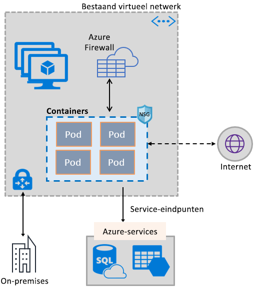
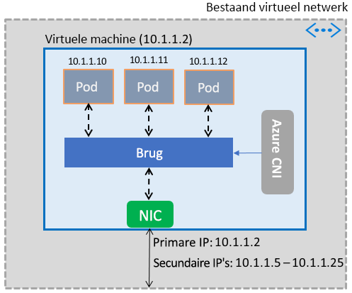

# Containers inschakelen voor gebruik van mogelijkheden van Azure Virtual Network

U kunt de grote verscheidenheid aan functies van een Azure-netwerk beschikbaar stellen aan containers door gebruik te maken van dezelfde via software gedefinieerde netwerkstack die wordt gebruikt voor virtuele machines. De Container Network Interface-invoegtoepassing (CNI) Azure Virtual Network wordt geïnstalleerd op een virtuele Azure-machine. De invoegtoepassing wijst IP-adressen uit een virtueel netwerk toe aan containers die worden gegenereerd op de virtuele machine, koppelt deze aan het virtuele netwerk en verbindt ze rechtstreeks met andere containers en virtuele-netwerkbronnen. De invoegtoepassing is niet afhankelijk van overlaynetwerken, of routes, voor verbinding, en biedt dezelfde prestaties als virtuele machines. Op algemeen niveau voorziet de invoegtoepassing in de volgende functionaliteit:

- Er wordt een IP-adres van een virtueel netwerk toegewezen aan elke Pod, die kan bestaan uit een of meer containers.
- Pods kunnen verbinding maken met virtuele netwerken met peering en met on-premises netwerken via ExpressRoute of een site-naar-site-VPN. Pods zijn ook bereikbaar vanuit netwerken met peering en on-premises netwerken.
- Pods hebben toegang tot services zoals Azure Storage en Azure SQL Database, die worden beveiligd door service-eindpunten van het virtuele netwerk.
- Het is mogelijk om netwerkbeveiligingsgroepen en routes rechtstreeks toe te passen op Pods.
- Pods kunnen direct achter een interne of openbaar load balancer van Azure worden geplaatst, net als virtuele machines
- Pods kunnen een openbaar IP-adres krijgen toegewezen, waardoor ze rechtstreeks toegankelijk zijn vanaf het internet. Pods hebben ook zelf toegang tot het internet.
- Werkt naadloos samen met Kubernetes-resources, zoals Services, Ingress-controllers Kube DNS. Een Kubernetes-service kan ook intern of extern beschikbaar worden gesteld via de Azure Load Balancer.

In de volgende afbeelding ziet u hoe de invoegtoepassing voorzieningen van Azure Virtual Network aanbiedt aan Pods:

De invoegtoepassing biedt ondersteuning voor Linux- en Windows-platforms.

## Pods verbinden met een virtueel netwerk

Pods worden gegenereerd op een virtuele machine die deel uitmaakt van een virtueel netwerk. Op de netwerkinterface van een virtuele machine wordt een groep IP-adressen voor de Pods geconfigureerd als secundaire adressen. Azure CNI stelt de basisnetwerkverbinding voor Pods in en beheert het gebruik van de IP-adressen in de groep. Wanneer er een Pod wordt gegenereerd op de virtuele machine, wijst Azure CNI een beschikbaar IP-adres uit de groep toe en verbindt de Pod met een softwarebrug op de virtuele machine. Wanneer de Pod wordt beëindigd, wordt het IP-adres weer toegevoegd aan de groep. In de volgende afbeelding ziet u hoe Pods verbinding maken met een virtueel netwerk:

## Toegang tot het internet

Om Pods toegang te geven tot het internet, configureert de invoegtoepassing *iptables*-regels om NAT (omzetting van netwerkadressen) toe te passen op het voor het internet bedoelde verkeer vanaf Pods. Het bron-IP-adres van het pakket wordt omgezet in het primaire IP-adres op de netwerkinterface van de virtuele machine. Virtuele Windows-machines passen automatisch 'source NAT' (SNAT) toe op verkeer dat is bestemd voor een IP-adres buiten het subnet van de virtuele machine. Normaal gesproken wordt al het verkeer dat is bestemd voor een IP-adres buiten het IP-adresbereik van het virtuele netwerk omgezet.

## Limieten

De invoegtoepassing ondersteunt maximaal 250 Pods per virtuele machine en maximaal 16.000 Pods in een virtueel netwerk. Voor de [Azure Kubernetes Service](../azure-subscription-service-limits.md?toc=%2fazure%2fvirtual-network%2ftoc.json#azure-kubernetes-service-limits) gelden andere limieten.

## De invoegtoepassing gebruiken

De invoegtoepassing kan op de volgende manieren worden gebruikt om een eenvoudige koppeling met een virtueel netwerk tot stand te brengen voor Pods of Docker-containers:

- **Azure Kubernetes Service**: De invoegtoepassing is geïntegreerd in de Azure Kubernetes Service (AKS), en kan worden gebruikt door het kiezen van de *geavanceerde netwerken* optie. Met deze optie kunt u een Kubernetes-cluster implementeren in een bestaand of een nieuw virtueel netwerk. Zie [Network configuration in Azure Kubernetes Service (AKS)](../aks/networking-overview.md?toc=%2fazure%2fvirtual-network%2ftoc.json) (Netwerkconfiguratie in AKS (Azure Kubernetes Service)) voor meer informatie over de optie Geavanceerd en de stappen om de optie in te stellen.
- **ACS-Engine**: ACS-Engine is een hulpprogramma dat genereert een Azure Resource Manager-sjabloon voor de implementatie van een Kubernetes-cluster in Azure. Zie [Deploy plug-in for ACS-Engine Kubernetes cluster](deploy-container-networking.md#deploy-plug-in-for-acs-engine-kubernetes-cluster) (De invoegtoepassing implementeren voor ACS-Engine Kubernetes-clusters) voor gedetailleerde instructies.
- **Het maken van uw eigen Kubernetes-cluster in Azure**: De invoegtoepassing kan worden gebruikt om het netwerkgebruik voor schillen in een Kubernetes-clusters bieden u zelf implementeren zonder AKS of hulpprogramma's, zoals de ACS-Engine. In dit geval wordt de invoegtoepassing geïnstalleerd en ingeschakeld op elke virtuele machine in een cluster. Zie [Deploy plug-in for a Kubernetes cluster](deploy-container-networking.md#deploy-plug-in-for-a-kubernetes-cluster) (Invoegtoepassing implementeren voor een Kubernetes-cluster) voor gedetailleerde instructies.
- **Virtueel netwerk koppelen voor Docker-containers in Azure**: De invoegtoepassing kan worden gebruikt in gevallen waar u niet wilt maken van een Kubernetes-cluster en wilt maken van Docker-containers met virtueel netwerk koppelen, op virtuele machines. Zie [Deploy plug-in for Docker containers](deploy-container-networking.md#deploy-plug-in-for-docker-containers) (Invoegtoepassing implementeren voor Docker-containers) voor gedetailleerde instructies.

## Volgende stappen

[De invoegtoepassing implementeren](deploy-container-networking.md) voor Kubernetes-clusters of Docker-containers