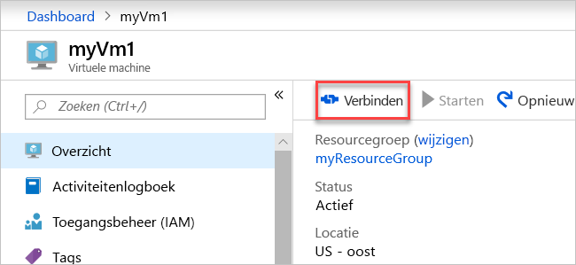

# <a name="quickstart-create-a-virtual-network-using-the-azure-portal"></a>Snelstart: een virtueel netwerk maken met Azure Portal

Met een virtueel netwerk kunnen Azure-resources, zoals virtuele machines (VM), privé communiceren met elkaar en met internet. In deze snelstart leert u hoe u een virtueel netwerk maakt. Nadat u een virtueel netwerk hebt gemaakt, implementeert u twee virtuele machines in het virtuele netwerk. Vervolgens maakt u verbinding met één virtuele machine via internet en is er privécommunicatie tussen de twee virtuele machines mogelijk.

Als u nog geen abonnement op Azure hebt, maak dan een [gratis account](https://azure.microsoft.com/free/?WT.mc_id=A261C142F) aan voordat u begint.

## <a name="log-in-to-azure"></a>Meld u aan bij Azure. 

Meld u aan bij Azure Portal op https://portal.azure.com.

## <a name="create-a-virtual-network"></a>Een virtueel netwerk maken

1. Selecteer **+ Een resource maken** in de linkerbovenhoek van Azure Portal.
2. Selecteer **Netwerken** en selecteer vervolgens **Virtueel netwerk**.
3. Voer de volgende informatie in of selecteer deze, accepteer de standaardwaarden voor de overige instellingen en selecteer **Maken**:

    |Instelling|Waarde|
    |---|---|
    |Naam|myVirtualNetwork|
    |Abonnement| Selecteer uw abonnement.|
    |Resourcegroep| Selecteer **Nieuwe maken** en voer *myResourceGroup* in.|
    |Locatie| Selecteer **VS Oost**.|

    

## <a name="create-virtual-machines"></a>Virtuele machines maken

Maak twee virtuele machines in het virtuele netwerk:

### <a name="create-the-first-vm"></a>De eerste VM maken

1. Selecteer **+ Een resource maken** in de linkerbovenhoek van Azure Portal.
2. Selecteer **Compute** en vervolgens **Windows Server 2016 Datacenter**.
3. Voer de volgende informatie in of selecteer deze, accepteer de standaardwaarden voor de overige instellingen en selecteer **OK**:

    |Instelling|Waarde|
    |---|---|
    |Naam|myVm1|
    |Gebruikersnaam| Voer een gebruikersnaam naar keuze in.|
    |Wachtwoord| Voer een wachtwoord naar keuze in. Het wachtwoord moet minstens 12 tekens lang zijn en moet voldoen aan de [gedefinieerde complexiteitsvereisten](../virtual-machines/windows/faq.md?toc=%2fazure%2fvirtual-network%2ftoc.json#what-are-the-password-requirements-when-creating-a-vm).|
    |Abonnement| Selecteer uw abonnement.|
    |Resourcegroep| Selecteer **Bestaande gebruiken** en selecteer **myResourceGroup**.|
    |Locatie| Selecteer **VS Oost**|

    

4. Selecteer een grootte voor de virtuele machine en selecteer **Selecteren**.
5. Accepteer onder **Instellingen** alle standaardwaarden en selecteer **OK**.

    

6. Selecteer onder **Maken** bij **Samenvatting** de optie **Maken** om de implementatie van de virtuele machine te starten. Het implementeren van de VM duurt een paar minuten. 

### <a name="create-the-second-vm"></a>De tweede VM maken

Voer de stappen 1-6 opnieuw uit, maar geef in stap 3 de virtuele machine de naam *myVm2*.

## <a name="connect-to-a-vm-from-the-internet"></a>Verbinding maken met een virtuele machine via internet

1. Maak verbinding met *myVm1* nadat deze is gemaakt. Voer boven aan Azure Portal *myVm1* in. Wanneer **myVm1** wordt weergegeven in de zoekresultaten, selecteert u deze. Selecteer de knop **Verbinding maken**.

    

2. Nadat u de knop **Verbinding maken** hebt geselecteerd, wordt er een RDP-bestand (Remote Desktop Protocol) gemaakt en gedownload op uw computer.  
3. Open het gedownloade RDP-bestand. Selecteer **Verbinding maken** wanneer hierom wordt gevraagd. Voer de gebruikersnaam en het wachtwoord in die u hebt opgegeven bij het maken van de virtuele machine. Mogelijk moet u **Meer opties** en vervolgens **Een ander account gebruiken** selecteren om de aanmeldingsgegevens op te geven die u hebt ingevoerd tijdens het maken van de VM. 
4. Selecteer **OK**.
5. Er wordt mogelijk een certificaatwaarschuwing weergegeven tijdens het aanmelden. Als u de waarschuwing ontvangt, selecteert u **Ja** of **Doorgaan** om door te gaan met de verbinding.

## <a name="communicate-between-vms"></a>Communicatie tussen virtuele machines

1. Voer `ping myvm2` in vanuit PowerShell. Pingen mislukt, omdat ping het ICMP (Internet Control Message Protocol) gebruikt en ICMP standaard niet is toegestaan via de Windows-firewall.
2. Om *myVm2* toe te staan *myVm1* in een latere stap te pingen, voert u de volgende opdracht uit vanuit PowerShell, waarmee inkomend ICMP wordt toegestaan via de Windows-firewall:

    ```powershell
    New-NetFirewallRule –DisplayName “Allow ICMPv4-In” –Protocol ICMPv4
    ```

3. Sluit de externe bureaubladverbinding met *myVm1*. 

4. Voer de stappen in [Verbinding maken met een virtuele machine via internet](#connect-to-a-vm-from-the-internet) opnieuw uit, maar maak nu verbinding met *myVm2*. Voer `ping myvm1` in vanaf een opdrachtprompt.

    U ontvangt antwoorden van *myVm1* omdat u ICMP hebt toegestaan via de Windows-firewall op de VM *myVm1* in de vorige stap.

5. Sluit de externe bureaubladverbinding met *myVm2*.

## <a name="clean-up-resources"></a>Resources opschonen

U kunt de resourcegroep en alle gerelateerde resources die deze bevat verwijderen wanneer u deze niet meer nodig hebt:

1. Voer *myResourceGroup* in het vak **Zoeken** bovenaan de portal in. Wanneer u **myResourceGroup** ziet in de zoekresultaten, selecteert u deze.
2. Selecteer **Resourcegroep verwijderen**.
3. Voer *myResourceGroup* in voor **TYP DE RESOURCEGROEPNAAM:** en selecteer **Verwijderen**.

## <a name="next-steps"></a>Volgende stappen

In deze snelstart hebt u een standaard virtueel netwerk en twee virtuele machines gemaakt. U hebt met één virtuele machine verbinding gemaakt via internet en is er privécommunicatie tussen de twee virtuele machines geweest. Zie [Virtueel netwerk beheren](manage-virtual-network.md) voor meer informatie over instellingen voor virtuele netwerken.

Standaard staat Azure onbeperkte privécommunicatie tussen virtuele machines toe, maar staat deze alleen inkomende externe bureaubladverbindingen met Windows VM's via internet toe. Voor informatie over het toestaan of beperken van verschillende soorten netwerkcommunicatie naar en van virtuele machines gaat u verder met de zelfstudie [Netwerkverkeer filteren](tutorial-filter-network-traffic.md).