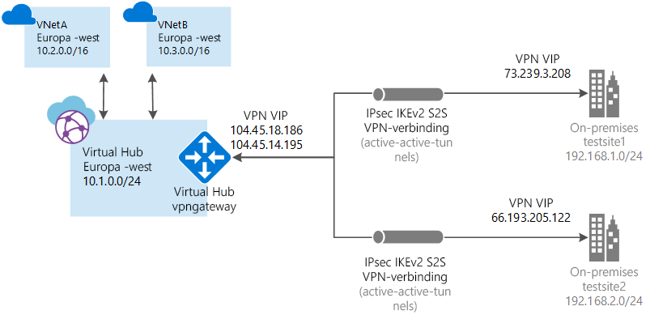

# <a name="tutorial-create-a-site-to-site-connection-using-azure-virtual-wan"></a>Zelfstudie: Een site-naar-site-verbinding maken met Azure Virtual WAN

In deze zelfstudie leert u hoe u Virtual WAN kunt gebruiken om verbinding te maken met uw resources in Azure via een VPN-verbinding met IPsec/IKE (IKEv1 en IKEv2). Voor dit type verbinding moet er on-premises een VPN-apparaat aanwezig zijn waaraan een extern openbaar IP-adres is toegewezen. Zie voor meer informatie over Virtual WAN het [Overzicht van Virtual WAN](virtual-wan-about.md)

> [!NOTE]
> Als u veel sites hebt, zou u normaal gesproken een [Virtual WAN-partner](https://aka.ms/virtualwan) gebruiken om deze configuratie te maken. U kunt deze configuratie echter ook zelf maken als bekend bent met netwerktechnologie en uw eigen VPN-apparaat kunt configureren.
>



In deze zelfstudie leert u het volgende:

> [!div class="checklist"]
> * Een WAN maken
> * Een site maken
> * Een hub maken
> * Een hub verbinden met een site
> * Een VNet verbinden met een hub
> * Een configuratie voor een VPN-apparaat downloaden en toepassen
> * Uw virtuele WAN weergeven
> * Resourcestatus weergeven
> * Een verbinding bewaken

## <a name="before-you-begin"></a>Voordat u begint

[!INCLUDE [Before you begin](../../includes/virtual-wan-tutorial-vwan-before-include.md)]

## <a name="vnet"></a>1. Een virtueel netwerk maken

[!INCLUDE [Create a virtual network](../../includes/virtual-wan-tutorial-vnet-include.md)]

## <a name="openvwan"></a>2. Een virtueel WAN maken

Open een browser, ga naar [Azure Portal](http://aka.ms/azurevirtualwanpreviewfeatures) en meld u aan met uw Azure-account.

[!INCLUDE [Create a virtual WAN](../../includes/virtual-wan-tutorial-vwan-include.md)]

## <a name="site"></a>3. Een site maken

Maak het aantal sites dat u nodig hebt voor uw fysieke locaties. Als u bijvoorbeeld een filiaal in NY, een filiaal in Londen en een filiaal in LA hebt, maakt u drie afzonderlijke sites. Deze sites bevatten de eindpunten voor uw on-premises VPN-apparaat. Op dit moment kunt u slechts één privé-adresruimte voor uw site opgeven.

1. Klik op het WAN dat u hebt gemaakt. Op de WAN-pagina bij **WAN-architectuur** klikt u op **VPN-sites** om de pagina met de VPN-sites te openen.
2. Op de pagina **VPN sites** klikt u op **+Site maken**.
3. Vul de volgende velden in op de pagina **Site maken**:

  * **Naam** - dit is de naam waarmee u naar uw on-premises site wilt verwijzen.
  * **Openbaar IP-adres** - dit is het openbare IP-adres van het VPN-apparaat van uw on-premises site.
  * **Privié-adresruimte** - dit is de IP-adresruimte op uw on-premises site. Verkeer dat bestemd is voor deze adresruimte wordt doorgestuurd naar uw lokale site.
  * **Abonnement** - controleer of het abonnement klopt.
  * **Resourcegroep** - selecteer de resourcegroep die u wilt gebruiken.
  * **Locatie**.
4. Klik op **Geavanceerd weergeven** om aanvullende instellingen weer te geven. U kunt **BGP** inschakelen, waarmee u deze functionaliteit inschakelt voor alle verbindingen die voor deze site in Azure worden gemaakt. U kunt ook **Apparaatgegevens** invoeren (optionele velden). Hierdoor krijgt het Azure-team meer inzicht in uw omgeving, zodat het makkelijker wordt om later aanvullende optimalisatiemogelijkheden toe te voegen of u te helpen bij het oplossen van problemen.
5. Klik op **Bevestigen**.
6. Nadat u op **Bevestigen** hebt geklikt, kunt u de status bekijken op de pagina met de VPN-sites. De site verandert van **Inrichten** in **Ingericht**.

## <a name="hub"></a>4. Een hub maken

[!INCLUDE [Create a virtual WAN](../../includes/virtual-wan-tutorial-hub-include.md)]

## <a name="associate"></a>5. De sites aan de hub koppelen

Hubs moeten in het algemeen worden gekoppeld aan sites die zich in dezelfde regio als het VNet bevinden.

1. Op de pagina **VPN-sites** selecteert u de site of sites die u wilt koppelen aan de hub en klikt u vervolgens op **+Nieuwe hubkoppeling**.
2. Op de pagina **Sites aan een of meer hubs koppelen** selecteert u een hub in de vervolgkeuzelijst. U kunt een site aan extra hubs koppelen door op **+Een koppeling toevoegen** te klikken.
3. U kunt hier ook een specifieke **PSK** (vooraf gedeelde sleutel) toevoegen of de standaardwaarde gebruiken.
4. Klik op **Bevestigen**.
5. U kunt de verbindingsstatus bekijken op de pagina met de **VPN-sites**.

## <a name="vnet"></a>6. Uw VNet verbinden met een hub

In deze stap brengt u de peering-verbinding tussen uw hub en een VNet tot stand. Herhaal deze stappen voor elk VNet dat u wilt verbinden.

1. Klik op de pagina voor uw virtuele WAN op **Virtuele netwerkverbinding**.
2. Klik op de pagina Virtuele netwerkverbinding op **+Verbinding toevoegen**.
3. Vul de volgende velden in op de pagina **Verbinding toevoegen**:

    * **Verbindingsnaam** - voer een naam in voor uw verbinding.
    * **Hubs** - selecteer de hub die u wilt koppelen aan deze verbinding.
    * **Abonnement** - controleer of het abonnement klopt.
    * **Virtueel netwerk** - selecteer het virtuele netwerk dat met deze hub wilt verbinden. Het virtuele netwerk mag geen bestaande virtuele netwerkgateway hebben.
4. Klik op **OK** om de peerverbinding te maken.

## <a name="device"></a>7. VPN-configuratie downloaden

Gebruik de VPN-apparaatconfiguratie om uw on-premises VPN-apparaat te configureren.

1. Klik op de pagina voor uw virtuele WAN op **Overzicht**.
2. Klik boven aan de pagina Overzicht op **VPN-configuratie downloaden**. Azure maakt een opslagaccount in de resourcegroep 'microsoft-network-[location]', waarbij 'location' wordt vervangen door de locatie van het WAN. Nadat u de configuratie hebt toegepast op uw VPN-apparaten, kunt u dit storage-account verwijderen.
3. Wanneer het bestand gereed is, klikt u op de koppeling om het te downloaden.
4. Pas de configuratie toe op uw VPN-apparaat.

### <a name="understanding-the-vpn-device-configuration-file"></a>Meer informatie over het configuratiebestand voor uw VPN-apparaat

Het apparaatconfiguratiebestand bevat de instellingen die u dient te gebruiken om uw on-premises VPN-apparaat te configureren. Wanneer u dit bestand bekijkt, ziet u de volgende informatie:

* **vpnSiteConfiguration -** in deze sectie vindt u de apparaatgegevens, ingesteld als een site die verbinding maakt met het virtuele WAN. Hier vindt u ook de naam en het openbare ip-adres van het branch-apparaat.
* **vpnSiteConnections -** deze sectie bevat informatie over het volgende:

    * **Adresruimte** van het VNet van de virtuele hub(s)<br>Voorbeeld:
 
        ```
        "AddressSpace":"10.1.0.0/24"
        ```
    * **Adresruimte** van de VNets die zijn verbonden met de hub<br>Voorbeeld:

         ```
        "ConnectedSubnets":["10.2.0.0/16","10.30.0.0/16"]
         ```
    * **IP-adressen** van de VPN-gateway van de virtuele hub. Omdat voor de VPN-gateway elke verbinding is opgebouwd uit 2 tunnels in een actief/actief-configuratie, worden beide IP-adressen in dit bestand vermeld. In dit voorbeeld ziet u voor elke site 'Instance0' en 'Instance1'.<br>Voorbeeld:

        ``` 
        "Instance0":"104.45.18.186"
        "Instance1":"104.45.13.195"
        ```
    * **Informatie over verbindingsconfiguratie van VPN-gateway**, zoals BGP, vooraf-gedeelde sleutels, enzovoort. De PSK is de vooraf gedeelde sleutel die automatisch voor u wordt gegenereerd. U kunt altijd de verbinding bewerken op de pagina Overzicht om een aangepaste PSK in te stellen.
  
### <a name="example-device-configuration-file"></a>Voorbeeld van een apparaatconfiguratiebestand

  ```
  { 
      "configurationVersion":{ 
         "LastUpdatedTime":"2018-07-03T18:29:49.8405161Z",
         "Version":"r403583d-9c82-4cb8-8570-1cbbcd9983b5"
      },
      "vpnSiteConfiguration":{ 
         "Name":"testsite1",
         "IPAddress":"73.239.3.208"
      },
      "vpnSiteConnections":[ 
         { 
            "hubConfiguration":{ 
               "AddressSpace":"10.1.0.0/24",
               "Region":"West Europe",
               "ConnectedSubnets":[ 
                  "10.2.0.0/16",
                  "10.30.0.0/16"
               ]
            },
            "gatewayConfiguration":{ 
               "IpAddresses":{ 
                  "Instance0":"104.45.18.186",
                  "Instance1":"104.45.13.195"
               }
            },
            "connectionConfiguration":{ 
               "IsBgpEnabled":false,
               "PSK":"bkOWe5dPPqkx0DfFE3tyuP7y3oYqAEbI",
               "IPsecParameters":{ 
                  "SADataSizeInKilobytes":102400000,
                  "SALifeTimeInSeconds":3600
               }
            }
         }
      ]
   },
   { 
      "configurationVersion":{ 
         "LastUpdatedTime":"2018-07-03T18:29:49.8405161Z",
         "Version":"1f33f891-e1ab-42b8-8d8c-c024d337bcac"
      },
      "vpnSiteConfiguration":{ 
         "Name":" testsite2",
         "IPAddress":"66.193.205.122"
      },
      "vpnSiteConnections":[ 
         { 
            "hubConfiguration":{ 
               "AddressSpace":"10.1.0.0/24",
               "Region":"West Europe"
            },
            "gatewayConfiguration":{ 
               "IpAddresses":{ 
                  "Instance0":"104.45.18.187",
                  "Instance1":"104.45.13.195"
               }
            },
            "connectionConfiguration":{ 
               "IsBgpEnabled":false,
               "PSK":"XzODPyAYQqFs4ai9WzrJour0qLzeg7Qg",
               "IPsecParameters":{ 
                  "SADataSizeInKilobytes":102400000,
                  "SALifeTimeInSeconds":3600
               }
            }
         }
      ]
   },
   { 
      "configurationVersion":{ 
         "LastUpdatedTime":"2018-07-03T18:29:49.8405161Z",
         "Version":"cd1e4a23-96bd-43a9-93b5-b51c2a945c7"
      },
      "vpnSiteConfiguration":{ 
         "Name":" testsite3",
         "IPAddress":"182.71.123.228"
      },
      "vpnSiteConnections":[ 
         { 
            "hubConfiguration":{ 
               "AddressSpace":"10.1.0.0/24",
               "Region":"West Europe"
            },
            "gatewayConfiguration":{ 
               "IpAddresses":{ 
                  "Instance0":"104.45.18.187",
                  "Instance1":"104.45.13.195"
               }
            },
            "connectionConfiguration":{ 
               "IsBgpEnabled":false,
               "PSK":"YLkSdSYd4wjjEThR3aIxaXaqNdxUwSo9",
               "IPsecParameters":{ 
                  "SADataSizeInKilobytes":102400000,
                  "SALifeTimeInSeconds":3600
               }
            }
         }
      ]
   }
  ```

### <a name="configuring-your-vpn-device"></a>Uw VPN-apparaat configureren

>[!NOTE]
> Als u met een Azure Virtual WAN-oplossing van een partner werkt, wordt het VPN-apparaat automatisch geconfigureerd. De apparaatcontroller haalt het configuratiebestand op uit Azure en past dit toe op het apparaat om zo de verbinding met Azure in te stellen. U hoeft in dat geval dus niet te weten hoe u uw VPN-apparaat handmatig configureert.
>

Als u instructies nodig hebt voor het configureren van uw apparaat, kunt u de instructies op de [pagina met configuratiescripts voor VPN-apparaten](~/articles/vpn-gateway/vpn-gateway-about-vpn-devices.md#configscripts) gebruiken. Houd in dat geval wel rekening met de volgende dingen:

* De instructies op de pagina voor VPN-apparaten zijn niet geschreven voor Virtual WAN, maar u kunt de waarden voor Virtual WAN in het configuratiebestand gebruiken om uw VPN-apparaat handmatig te configureren. 
* De downloadbare apparaatconfiguratiescripts voor VPN Gateway werken niet voor Virtual WAN, omdat de configuratie anders is.
* Een nieuwe Virtual WAN kan ondersteuning bieden voor zowel IKEv1 als IKEv2.
* Virtual WAN werkt alleen met op route gebaseerde VPN-apparaten en apparaatinstructies.

## <a name="viewwan"></a>8. Uw virtuele WAN weergeven

1. Navigeer naar uw virtuele WAN.
2. Op de pagina Overzicht vertegenwoordigt elk punt op de kaart een hub. Houd de muisaanwijzer boven een punt om de statussamenvatting voor de hub weer te geven.
3. In de sectie Hubs en verbindingen vindt u informatie over de hubstatus, site, regio, VPN-verbindingsstatus en verzonden en ontvangen bytes.

## <a name="viewhealth"></a>9. Resourcestatus bekijken

1. Navigeer naar uw WAN.
2. Klik op de pagina van uw WAN, in de sectie **Ondersteuning en probleemoplossing**, op **Status** en bekijk de status van uw resource.

## <a name="connectmon"></a>10. Een verbinding bewaken

Maak een verbinding om de communicatie tussen een Azure-VM en een externe site te bewaken. Zie voor meer informatie over het instellen van een verbindingscontrole de pagina [Netwerkcommunicatie bewaken](~/articles/network-watcher/connection-monitor.md). Het bronveld is het IP-adres van de VM in Azure en het doel-IP-adres is het IP-adres voor de site.

## <a name="cleanup"></a>11. Resources opschonen

U kunt de opdracht [Remove-AzureRmResourceGroup](/powershell/module/azurerm.resources/remove-azurermresourcegroup) gebruiken om de resourcegroep en alle resources die deze bevat te verwijderen, wanneer u deze niet meer nodig hebt. Vervangen 'myResourceGroup' door de naam van uw resourcegroep en voer de volgende PowerShell-opdracht uit:

```azurepowershell-interactive
Remove-AzureRmResourceGroup -Name myResourceGroup -Force
```

## <a name="next-steps"></a>Volgende stappen

In deze zelfstudie heeft u het volgende geleerd:

> [!div class="checklist"]
> * Een WAN maken
> * Een site maken
> * Een hub maken
> * Een hub verbinden met een site
> * Een VNet verbinden met een hub
> * Een configuratie voor een VPN-apparaat downloaden en toepassen
> * Uw virtuele WAN weergeven
> * Resourcestatus weergeven
> * Een verbinding bewaken

Zie voor meer informatie over Virtual WAN de pagina [Overzicht van Virtual WAN](virtual-wan-about.md).
