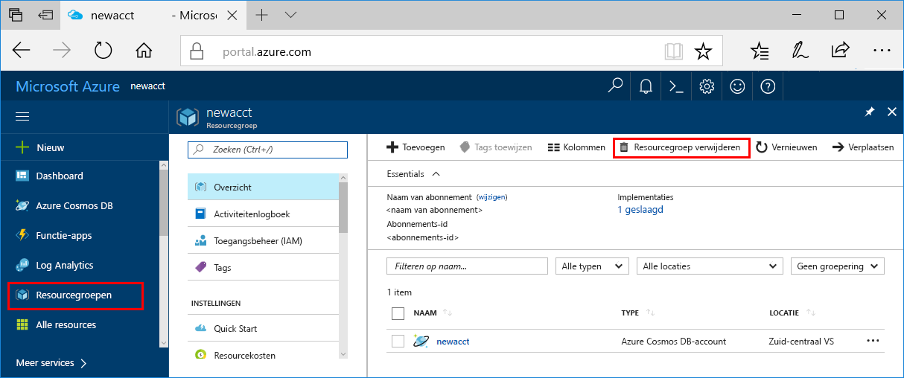

Als u deze app niet verder gaat gebruiken, kunt u alle resources verwijderen die door deze Quick Start zijn aangemaakt door de onderstaande stappen te volgen, zodat u geen kosten in rekening worden gebracht:

>[!NOTE]
>Deze resources zijn nuttig wanneer u de andere zelfstudies van Azure Machine Learning-services nu wilt gebruiken.

1. Selecteer **Resourcegroepen** links in Azure Portal.  
 
   

2. Selecteer de resourcegroep die u hebt gemaakt in de lijst met resourcegroepen en klik op **Resourcegroep verwijderen**.

3. Typ de naam van de resourcegroep die u wilt verwijderen en klik vervolgens op **Verwijderen**.

