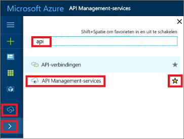

## Ga naar uw API Management-exemplaar

1. Meld u aan bij [Azure Portal](https://portal.azure.com). 
2. Selecteer **Alle services**.  
3. Typ **api** in het zoekvak.
4. Selecteer **API Management-services** in de zoekresultaten.

    

5. Selecteer uw service-exemplaar van API Management.

> [!TIP]
> Selecteer de ster om API Management toe te voegen aan uw favorieten in Azure Portal.
>
> Het pictogram voor API Management () wordt nu weergegeven in het menu aan de linkerkant van de portal.
 

