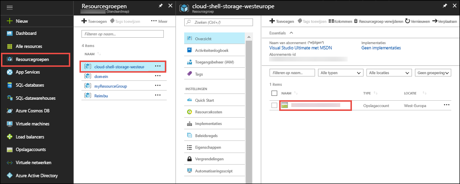
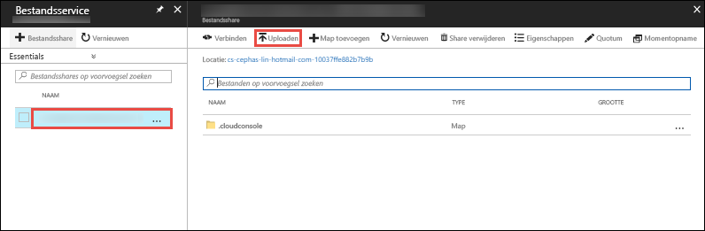

In de [Azure-portal](https://portal.azure.com), klikt u op **resourcegroepen** > **cloud-shell-storage -\<your_region >**  >   **\<naam_opslagaccount >**.



In de **overzicht** pagina van het opslagaccount, selecteer **bestanden**.

Selecteer de automatisch gegenereerde bestandsshare en selecteer **uploaden**. Deze bestandsshare is gekoppeld in de Cloud Shell als `clouddrive`.



Klik op de kiezer bestand en selecteer het ZIP-bestand en klik vervolgens op **uploaden**. 

In de Cloud Shell gebruiken `ls` om te controleren of u dat het geüploade ZIP-bestand in de standaard zien kunt `clouddrive` delen.

```azurecli-interactive
ls clouddrive
```
