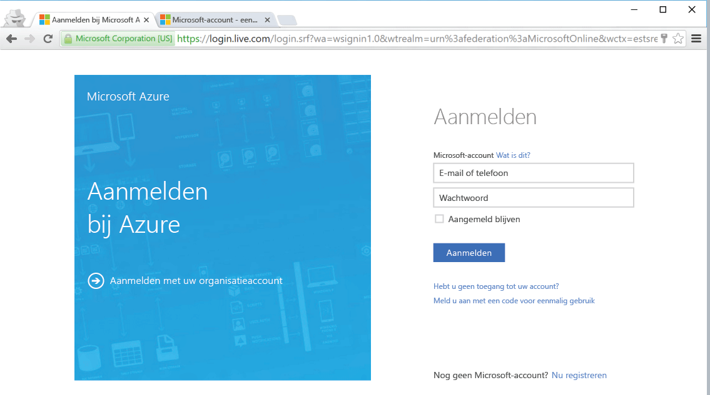

<!--
includes/azure-include-getting-started-v12portal-gettings-an-account.md

Latest Freshness check:  2016-04-11 , carlrab.

As of circa 2016-04-11, the following topics might include this include:
articles/sql-database/sql-database-get-started-tutorial.md

-->
## Met een abonnement verbinding maken met Azure Portal
Om verbinding te kunnen maken met Azure Portal hebt u een abonnement nodig.

### Een nieuw account maken
Kies als u nog geen Azure-account hebt een van de onderstaande opties om een account te krijgen:

* Een [gratis account](https://azure.microsoft.com/get-started/) maken.
* Een [MSDN-abonnement](https://azure.microsoft.com/pricing/member-offers/msdn-benefits/) gebruiken.

### Aanmelden met uw bestaande account
Gebruik uw [bestaande abonnement](https://account.windowsazure.com/Home/Index) en volg deze stappen om verbinding te maken met Azure Portal.

1. Open de browser van uw keuze en maak verbinding met [Azure Portal](https://portal.azure.com/).
2. Meld u aan bij de [Azure-portal](https://portal.azure.com/).
3. Zodra de **aanmeldingspagina** wordt weergegeven, typt u de referenties voor uw abonnement.
   
   

<!---HONumber=Sep16_HO3-->

