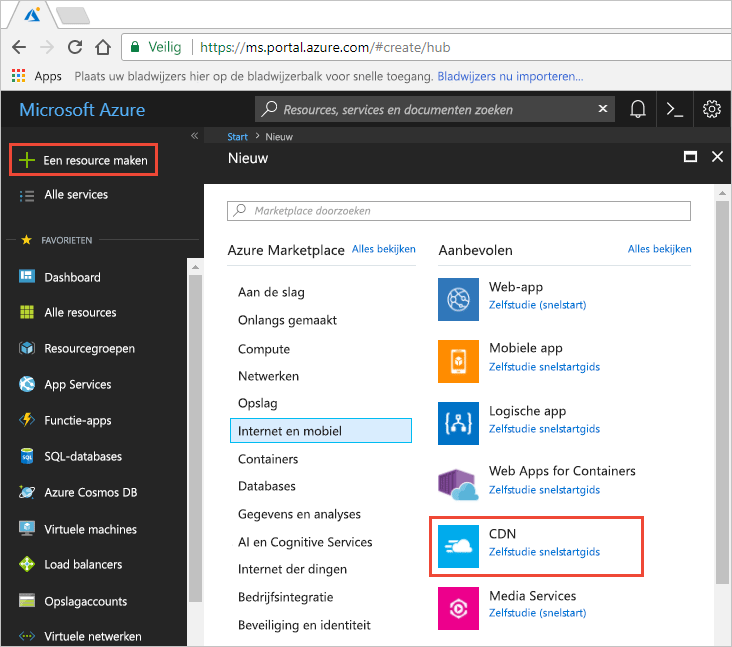
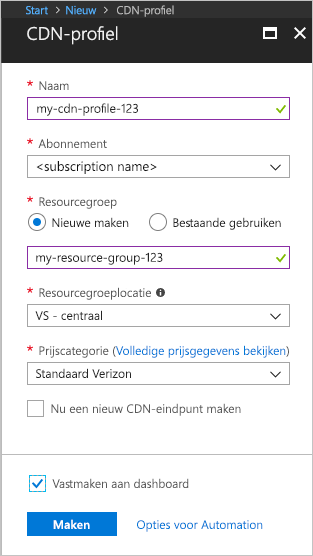

## Nieuwe CDN-profielen maken

Een CDN-profiel is een container voor CDN-eindpunten waarmee een prijscategorie wordt opgegeven.

1. Selecteer linksboven in Azure Portal **Een resource maken**.
    
    Het deelvenster **Nieuw** verschijnt.
   
2. Selecteer **Web en mobiel** en vervolgens **CDN**.
   
    

    Het deelvenster **CDN-profiel** verschijnt.

    Gebruik de instellingen zoals opgegeven in de tabel onder de afbeelding.
   
    

    | Instelling  | Waarde |
    | -------- | ----- |
    | **Naam** | Voer *my-cdn-profile-123* in als profielnaam. Deze naam moet globaal uniek zijn. Als deze al in gebruik is, kunt u een andere invoeren. |
    | **Abonnement** | Kies een Azure-abonnement in de vervolgkeuzelijst.|
    | **Resourcegroep** | Selecteer **Nieuwe maken** en voer *my-resource-group-123* in als naam voor de resourcegroep. Deze naam moet globaal uniek zijn. Als deze al in gebruik is, kunt u een andere invoeren. | 
    | **Resourcegroeplocatie** | Selecteer **VS Centraal** in de vervolgkeuzelijst. |
    | **Prijscategorie** | Selecteer **Standard - Verizon** in de vervolgkeuzelijst. |
    | **Nu een nieuw CDN-eindpunt maken** | Laat het selectievakje uitgeschakeld. |  
   
3. Selecteer **Aan dashboard vastmaken** om het profiel in het dashboard op te slaan nadat het is gemaakt.
    
4. Selecteer **Maken** om het profiel te maken. 

