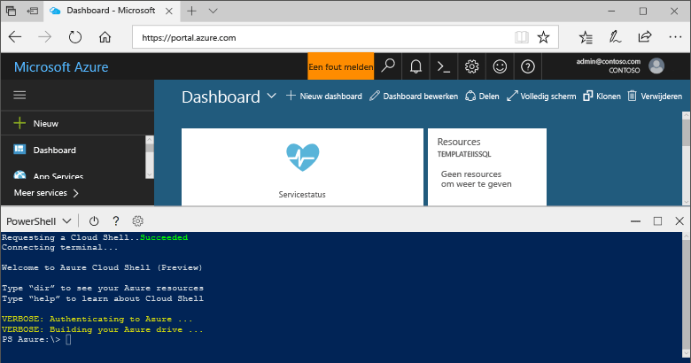

## Azure Cloud Shell starten

De Azure Cloud Shell is een gratis shell die u rechtstreeks vanuit Azure Portal kunt uitvoeren. In deze shell zijn algemene Azure-hulpprogramma's vooraf geïnstalleerd en geconfigureerd voor gebruik met uw account. Klik op de knop **Cloud Shell** in het menu in de rechterbovenhoek van [Azure Portal](https://portal.azure.com).

De knop start een interactieve shell die u kunt gebruiken om alle stappen in dit onderwerp uit te voeren:

