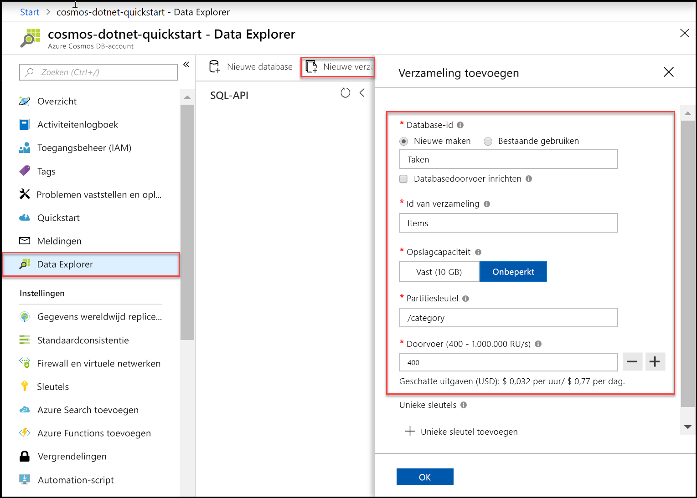
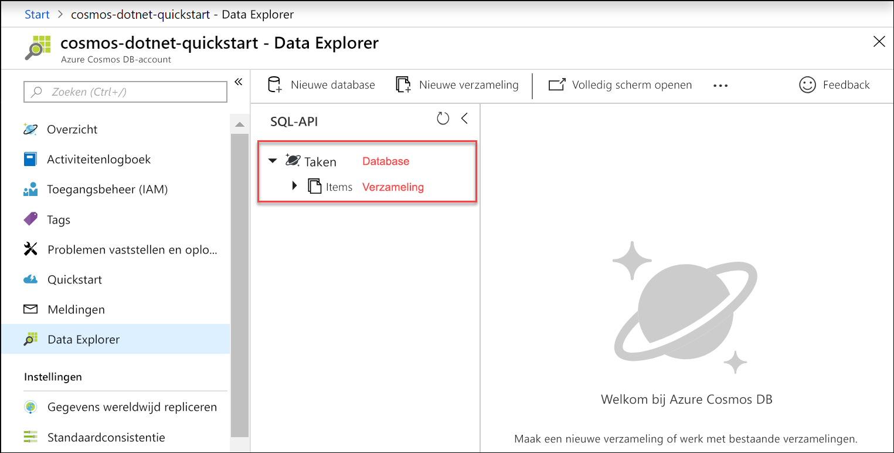

U kunt nu het hulpprogramma Data Explorer in Azure Portal gebruiken om een database en een verzameling te maken. 

1. Klik op **Data Explorer** > **Nieuwe verzameling**. 
    
    Uiterst rechts wordt het gebied **Verzameling toevoegen** weergegeven. Mogelijk moet u naar rechts scrollen om het te bekijken.

    

2. Geef op de pagina **Verzameling toevoegen** de instellingen voor de nieuwe verzameling op.

    Instelling|Voorgestelde waarde|Beschrijving
    ---|---|---
    Database-id|*Taken*|Voer *Taken* in als de naam voor de nieuwe database. Databasenamen moeten tussen de 1 en 255 tekens zijn en mogen geen /, \\, # of ? bevatten en mogen niet eindigen met een spatie.
    Verzamelings-id|*Items*|Voer *Items* in als de naam voor de nieuwe verzameling. Voor id’s van verzamelingen gelden dezelfde tekenvereisten als voor databasenamen.
    Doorvoer voor databases inrichten|Leeg laten|Met Azure Cosmos DB kan doorvoer worden ingericht op het niveau van de database (alle verzamelingen in een database delen de dezelfde doorvoer) of op het niveau van de verzameling. Laat leeg als u voor deze specifieke verzameling doorvoer wilt inrichten op het niveau van de verzameling.
    Opslagcapaciteit|*Onbeperkt*|Kies de opslagcapaciteit **Onbeperkt**. 
    Partitiesleutel|*/category*|Voer '/category' in als de partitiesleutel. Door een partitiesleutel in te stellen, kan met Azure Cosmos DB de verzameling worden geschaald, zodat deze voldoet aan de behoeften van uw toepassing met betrekking tot opslag en doorvoer. In het algemeen heeft een goede partitiesleutel een breed bereik aan afzonderlijke waarden, wat resulteert in een gelijkmatige verdeling van opslag- en aanvraagvolume voor uw gehele workload. [Meer informatie over partitioneren.](../articles/cosmos-db/partitioning-overview.md)
    Doorvoer|*400 RU/s*|Wijzig de doorvoer in 400 aanvraageenheden per seconde (RU/s). U kunt de doorvoer later opschalen als u de latentie wilt beperken. 
    
    Naast de voornoemde instellingen kunt u indien gewenst **unieke sleutels** voor de verzameling toevoegen. In dit voorbeeld laten we het veld leeg. Unieke sleutels bieden ontwikkelaars de mogelijkheid om een gegevensintegriteitslaag aan de database toe te voegen. Door een beleid met unieke sleutels te maken als u een verzameling maakt, zorgt u ervoor dat een of meer waarden per partitiesleutel uniek zijn. Raadpleeg het artikel [Unique keys in Azure Cosmos DB](../articles/cosmos-db/unique-keys.md) (Unieke sleutels in Azure Cosmos DB) voor meer informatie.
    
    Klik op **OK**.

    In Data Explorer worden de nieuwe database en verzameling weergegeven.

    