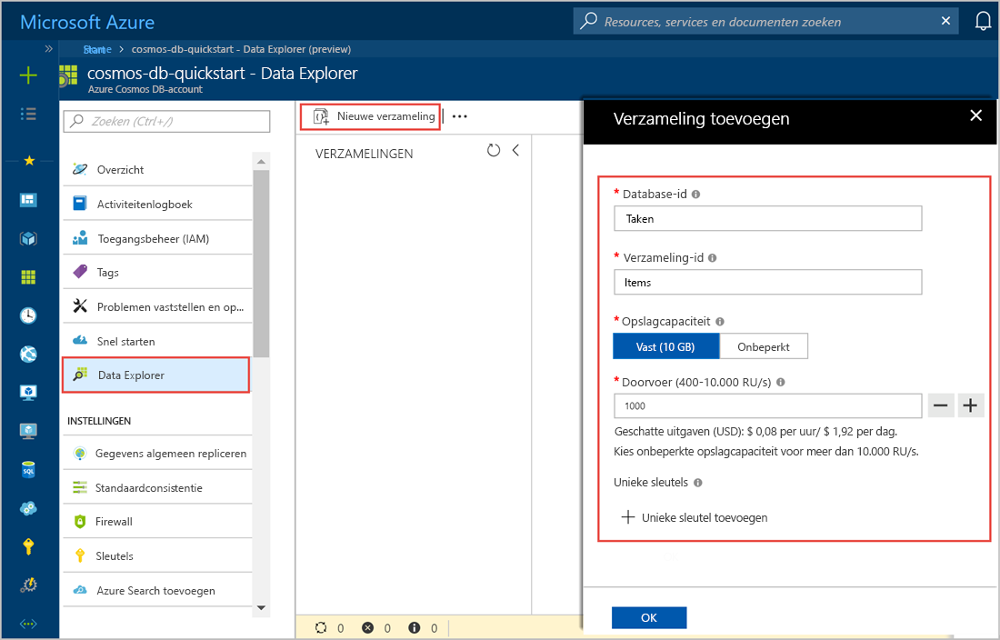
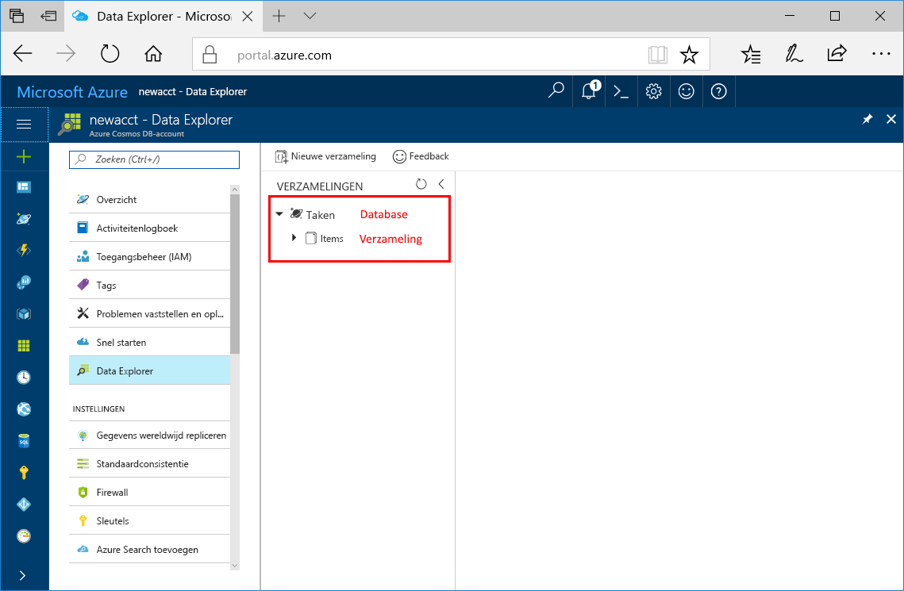

U kunt nu het hulpprogramma Data Explorer in Azure Portal gebruiken om een database en een verzameling te maken. 

1. Klik op **Data Explorer** > **Nieuwe verzameling**. 
    
    Uiterst rechts wordt het gebied **Verzameling toevoegen** weergegeven. Mogelijk moet u naar rechts scrollen om het te bekijken.

    

2. Geef op de pagina **Verzameling toevoegen** de instellingen voor de nieuwe verzameling op.

    Instelling|Voorgestelde waarde|Beschrijving
    ---|---|---
    Database-id|Taken|Voer *Taken* in als de naam voor de nieuwe database. Databasenamen moeten tussen de 1 en 255 tekens zijn en mogen geen /, \\, # of ? bevatten en mogen niet eindigen met een spatie.
    Verzamelings-id|Items|Voer *Items* in als de naam voor de nieuwe verzameling. Voor id’s van verzamelingen gelden dezelfde tekenvereisten als voor databasenamen.
    Opslagcapaciteit| Vast (10 GB)|Wijzig de waarde in **Vast (10 GB)**. Deze waarde is de opslagcapaciteit van de database.
    Doorvoer|400 RU|Wijzig de doorvoer in 400 aanvraageenheden per seconde (RU/s). Capaciteit moet worden ingesteld op **Vast (10 GB)** om de doorvoer in te stellen op 400 RU/s. U kunt de doorvoer later opschalen als u de latentie wilt beperken. 
    
    Klik op **OK**.

    In Data Explorer worden de nieuwe database en verzameling weergegeven.

    