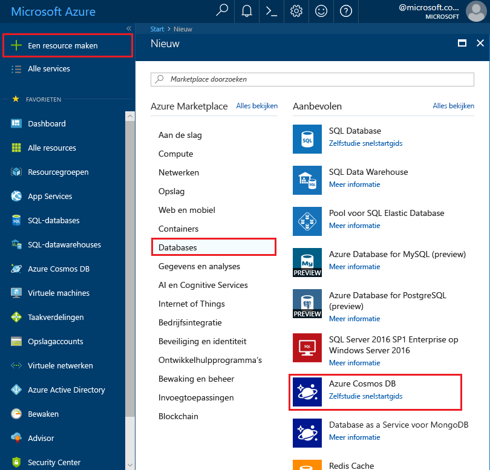
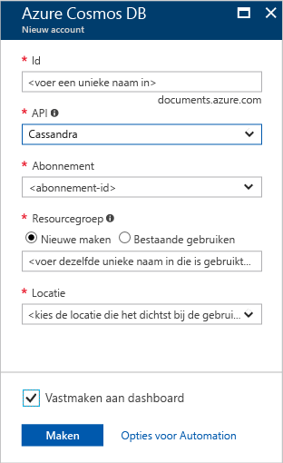

1. In een nieuw browservenster, moet u zich aanmelden bij de [Azure-portal](https://portal.azure.com/).
2. Klik op **nieuwe** > **Databases** > **Azure Cosmos DB**.
   
   

3. In de **nieuwe account** pagina, voert u de instellingen voor de nieuwe Azure DB die Cosmos-account. 
 
    Instelling|Voorgestelde waarde|Beschrijving
    ---|---|---
    Id|*Voer een unieke naam*|Voer een unieke naam voor dit account Azure Cosmos DB. Omdat *documents.azure.com* wordt toegevoegd aan de ID die u opgeeft voor het maken van uw contactpunt, gebruikmaken van een id uniek zijn maar persoonsgegevens.  De id mag alleen kleine letters, cijfers en het koppelteken (-) bevatten en moet 3 tot 50 tekens lang zijn.
    API|Cassandra|De API bepaalt het type account te maken. Azure Cosmos-DB bevat vijf API's voor tegemoetkomt aan de behoeften van uw toepassing: SQL (documentdatabase), Gremlin (grafiek database), MongoDB (documentdatabase), Azure Table en Cassandra, elke die momenteel een afzonderlijk account vereisen.   Selecteer **Cassandra** omdat deze snelstartgids u maakt in een wide kolom-database die is waarop met CQL syntaxis.  Als Cassandra (wide-kolom) niet in de lijst weergegeven wordt, moet u [toepassen om lid te](../articles/cosmos-db/cassandra-introduction.md#sign-up-now) de Cassandra API preview-programma.   [Meer informatie over de API Cassandra](../articles/cosmos-db/cassandra-introduction.md)|
    Abonnement|*Uw abonnement*|Selecteer de Azure-abonnement dat u wilt gebruiken voor dit account Azure Cosmos DB. 
    Resourcegroep|*Voer de dezelfde unieke naam zoals hierboven omschreven in-ID*|Voer een nieuwe naam resourcegroep voor uw account. Gebruik dezelfde naam als uw id om het uzelf gemakkelijk te maken. 
    Locatie|*Selecteer de regio die het dichtst bij uw gebruikers*|Selecteer de geografische locatie op waar voor het hosten van uw Azure DB die Cosmos-account. De locatie die zich het dichtst bij hen de snelste toegang geven tot de gegevens van uw gebruikers gebruiken.
    Vastmaken aan dashboard | Selecteer | Selecteer dit selectievakje in zodat uw nieuwe databaseaccount wordt toegevoegd aan uw portaldashboard voor eenvoudige toegang.

    Klik vervolgens op **Maken**.

    

4. Het maken van een account duurt enkele minuten duren. Tijdens het maken van account het portal dashboard toont de **implementeren Azure Cosmos DB** tegel.

    

    Zodra het account is gemaakt, de **Gefeliciteerd! Uw Azure DB die Cosmos-account is gemaakt** pagina wordt weergegeven. 

